# Advanced Node.js — In-depth Notes

## Overview

This document expands the workspace summary into practical, in-depth notes for each advanced Node.js topic represented in this repository. Each section includes: conceptual explanation, key APIs, example snippets, best practices, common pitfalls, and links to example files in this workspace.

> **📊 Diagram Rendering Note:** This document includes Mermaid diagrams which render best in:
>
> - **GitHub** (fully supported)
> - **VS Code** with Markdown Preview (Ctrl+Shift+V)
> - **GitLab**, **Notion**, and other markdown viewers with Mermaid support
> - Online renderers: [mermaid.live](https://mermaid.live)
>
> If diagrams appear as code blocks, open this file in a markdown viewer with Mermaid support.

## Table of Contents

**Node.js Fundamentals & Internals**

- [Module System](#module-system) (CommonJS vs ESM, require resolution, circular deps)
- [Event Loop](#event-loop) (phases, timers, microtasks, senior Q&A)
- [libuv Thread Pool](#libuv-thread-pool) (UV_THREADPOOL_SIZE, which APIs use it, tuning)
- [Buffer & Binary Data](#buffer--binary-data) (encoding, allocation, TypedArrays, performance)

**Core Async & Data Flow**

- [Async Patterns](#async-patterns) (callbacks, promises, async/await, error handling)
- [Error Handling Patterns](#error-handling-patterns) (operational vs programmer errors, custom errors, domains)
- [Event Emitters](#event-emitters) (patterns, memory leaks, listener management)
- [Streams & Pipelines](#streams--pipelines) (backpressure, transform streams, memory optimization)

**I/O & System APIs**

- [File System (fs)](#file-system-fs) (streams, watchers, concurrent writes, performance)
- [HTTP Server & NodeServer](#http-server--nodeserver) (streaming responses, range requests, backpressure)
- [Child Processes (exec / spawn / fork)](#child-processes-exec--spawn--fork) (exec, spawn, IPC, process management)

**Concurrency & Scaling**

- [Worker Threads & Atomics](#worker-threads--atomics) (shared memory, synchronization, race conditions)
- [Cluster & Fork](#cluster--fork) (master/worker, load distribution, sticky sessions)
- [Inter-thread / IPC Patterns](#inter-thread--ipc-patterns) (message passing, postMessage, Atomics)
- [Concurrency Models Comparison](#concurrency-models-comparison) (decision matrix, tradeoffs)

**Architecture & Production**

- [System Design & Architecture](#system-design--architecture) (scalability, request flow, scenarios)
- [Database & Caching Patterns](#database--caching-patterns) (pooling, Redis, queues, consistency)
- [Debugging, Memory Profiling & Observability](#debugging-memory-profiling--observability) (leak detection, profiling, monitoring)
- [Production Practices & Security](#production-practices--security) (error handling, graceful shutdown, security)
- [Interview Scenarios & System Design Problems](#interview-scenarios--system-design-problems) (real-world challenges)

---

## Module System

### Concepts

When you write a Node.js application, you don't put all your code in a single file. You split it into **modules** — small, reusable pieces of code. Think of modules like LEGO blocks: each one does one thing, and you snap them together to build something bigger.

Node.js has two module systems:

- **CommonJS (CJS):** The original system, using `require()` to load and `module.exports` to share code. It works **synchronously** — when Node hits a `require()`, it stops everything, loads the file, runs it, and returns the result. This is fine at startup but can block the event loop if done carelessly at runtime.

- **ES Modules (ESM):** The modern JavaScript standard, using `import` / `export`. It loads **asynchronously** — the engine can analyze all imports before executing, enabling optimizations like **tree shaking** (removing unused code). ESM is the future, but CJS is still everywhere in existing packages.

**How does Node find a module?** When you call `require('express')`, Node follows a **resolution algorithm**: first it checks built-in modules (like `fs`, `http`), then looks for a `node_modules` folder in the current directory, then the parent directory, and so on up to the root. For relative paths like `require('./utils')`, it tries adding `.js`, `.json`, `.node`, and `/index.js` extensions.

**Module caching** is a key concept: once a module is loaded, Node stores it in memory. Every subsequent `require()` for the same module returns the **exact same object** — not a fresh copy. This means if module A modifies something on the exported object, module B will see those changes. This is how singletons work naturally in Node.

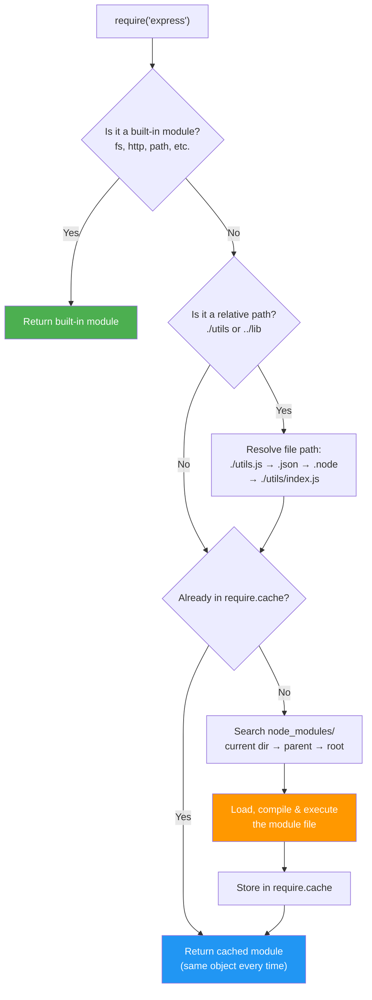

### CommonJS vs ES Modules

| Feature              | CommonJS (`require`)                     | ES Modules (`import`)                        |
| -------------------- | ---------------------------------------- | -------------------------------------------- |
| **Loading**          | Synchronous                              | Asynchronous                                 |
| **Syntax**           | `require()` / `module.exports`           | `import` / `export`                          |
| **Top-level await**  | ❌ Not supported                         | ✅ Supported                                 |
| **Tree shaking**     | ❌ No (dynamic)                          | ✅ Yes (static analysis)                     |
| **File extension**   | `.js` (default)                          | `.mjs` or `"type": "module"` in package.json |
| **`this` in module** | `module.exports`                         | `undefined`                                  |
| **Dynamic import**   | `require(path)` anywhere                 | `await import(path)`                         |
| **Circular deps**    | Partial exports (what's been set so far) | Live bindings (always up-to-date)            |

### Module Resolution Algorithm

```js
// When you call require('my-module'), Node searches:
// 1. Built-in modules (fs, http, path, etc.)
// 2. node_modules in current directory
// 3. node_modules in parent directory (repeats up to root)
// 4. Global install paths

// Exact resolution order for require('./utils'):
// ./utils.js → ./utils.json → ./utils.node → ./utils/index.js → ./utils/index.json

// Check resolved path:
console.log(require.resolve("express")); // Full absolute path to entry point
```

### Module Caching & Singletons

```js
// Modules are cached: require() returns SAME object every time
// counter.js
let count = 0;
module.exports = {
    increment: () => ++count,
    getCount: () => count,
};

// app.js
const counter1 = require("./counter");
const counter2 = require("./counter");
counter1.increment();
console.log(counter2.getCount()); // 1 — Same instance!

// Verify caching:
console.log(counter1 === counter2); // true

// ⚠️ Force re-load (NOT recommended in production):
delete require.cache[require.resolve("./counter")];
const counter3 = require("./counter");
console.log(counter3.getCount()); // 0 — Fresh instance
```

### Circular Dependencies

```js
// ❌ PROBLEM: Circular require
// a.js
const b = require("./b");
console.log("In A, b.value =", b.value); // undefined (b hasn't finished!)
module.exports = { value: "A" };

// b.js
const a = require("./a");
console.log("In B, a.value =", a.value); // 'A' or undefined depending on load order
module.exports = { value: "B" };

// ✅ Fix 1: Lazy require (defer to function call)
// a.js
module.exports = {
    value: "A",
    getB: () => require("./b"), // Loaded only when called
};

// ✅ Fix 2: Restructure — extract shared code into a third module
// shared.js (no circular deps)
module.exports = { sharedValue: "shared" };

// ✅ Fix 3: Use ESM (live bindings handle circular deps better)
// a.mjs
import { value } from "./b.mjs";
export const aValue = "A";
// ESM provides live binding — value updates when b.mjs sets it
```

### Senior-Level Q&A

**Q1: What's the difference between `require()` and `import`? Can you mix them?**

A: `require()` is synchronous (CJS), `import` is asynchronous (ESM). You can:

- Use `import()` (dynamic) inside CJS files
- Use `createRequire()` to use `require()` inside ESM files
- Cannot use static `import` in CJS files

```js
// CJS file using dynamic import
const loadESM = async () => {
    const { default: esModule } = await import("./es-module.mjs");
    return esModule;
};

// ESM file using require
import { createRequire } from "module";
const require = createRequire(import.meta.url);
const cjsModule = require("./cjs-module.js");
```

**Q2: How does `require.cache` work? When would you clear it?**

A: `require.cache` is an object mapping resolved filenames to loaded modules. Clearing it forces re-evaluation.

```js
// Inspect the cache
console.log(Object.keys(require.cache)); // All loaded module paths

// Use case: Hot-reload config in development
function reloadConfig() {
    const configPath = require.resolve("./config");
    delete require.cache[configPath];
    return require("./config");
}
```

**Q3: Your app has a circular dependency bug. How do you detect and fix it?**

A:

- **Detect:** Use `madge` tool: `npx madge --circular src/`
- **Symptoms:** `undefined` values from imported modules, initialization order bugs
- **Fix:** Extract shared logic into a separate module, use lazy requires, or restructure

---

## Event Loop

### Concepts

The event loop is the **heart of Node.js**. It's what allows Node to handle thousands of concurrent operations using just a single thread. Understanding it deeply is the difference between writing fast Node code and writing code that mysteriously hangs.

**The simple analogy:** Imagine you're a chef (the single thread) in a busy kitchen. You don't stand and watch each pot boil — you start cooking rice, then while it boils, you chop vegetables, then while they sauté, you prepare the sauce. The event loop is your system for checking back on each task at the right time.

**How it works technically:**
Node runs your JavaScript on **one main thread**. When your code calls something asynchronous (like reading a file or making an HTTP request), Node doesn't block — it hands the work to the operating system or a background thread pool (libuv), and continues running your next line of code. When the async work finishes, a callback is placed in a queue. The event loop's job is to continuously check these queues and execute callbacks when the main thread is free.

**The phases:** Each "tick" of the event loop goes through these phases in order:

1. **Timers** — Execute callbacks from `setTimeout()` and `setInterval()` whose time has expired
2. **Pending callbacks** — Execute I/O callbacks deferred from the previous loop (e.g., TCP errors)
3. **Idle/Prepare** — Internal housekeeping (you never interact with this directly)
4. **Poll** — The most important phase. Retrieves new I/O events and executes I/O callbacks (file reads, network responses, etc.). If there's nothing to do, it **waits here** for new events
5. **Check** — Execute `setImmediate()` callbacks
6. **Close callbacks** — Execute close event callbacks (e.g., `socket.on('close', ...)`)

**Between every phase**, Node drains the **microtask queues**: first all `process.nextTick()` callbacks, then all Promise `.then()` callbacks. This is why `process.nextTick` has the highest priority — it runs before the event loop can move to the next phase. But be careful: if you recursively call `process.nextTick`, you'll **starve** the event loop (I/O callbacks never run).

**Key rules to remember:**

- Synchronous code always runs first and blocks everything
- `process.nextTick` > Promises > `setTimeout(0)` > `setImmediate` (in priority order)
- `setTimeout(fn, 0)` and `setImmediate(fn)` ordering is **non-deterministic** in the main module, but inside an I/O callback, `setImmediate` always runs first
- Any blocking operation (heavy loop, sync file read) **freezes the entire server** — no requests can be handled

### Key APIs / Patterns

- `setTimeout(cb, delay)` — runs in **timers phase** (minimum ~1-4ms delay depending on system load).
- `setImmediate(cb)` — runs in **check phase** (after I/O polling).
- `process.nextTick(cb)` — runs _before_ next phase (microtask, highest priority).
- `Promise.resolve().then(cb)` — runs as microtask (after `process.nextTick` queue empties).

### Event Loop Phases Diagram

This diagram shows exactly what happens during one complete "tick" of the event loop. Notice how microtask queues (pink) are drained between **every** phase — this is why `process.nextTick` and Promises have such high priority.

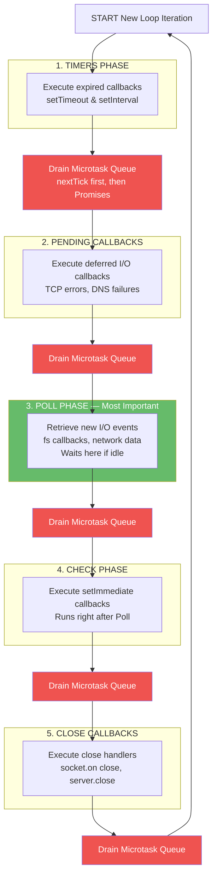

**Key insight:** Microtask queues (pink) are drained between **every** phase. The Poll phase (green) is where Node spends most of its time — waiting for I/O to complete.

### Simple Example

```js
setTimeout(() => console.log("timer"), 0);
setImmediate(() => console.log("immediate"));
Promise.resolve().then(() => console.log("microtask"));
process.nextTick(() => console.log("nextTick"));
console.log("sync");

// Output order:
// sync
// nextTick
// microtask
// timer (usually before immediate, but depends on prior I/O)
// immediate
```

### Senior-Level Q&A

**Q1: Why does `setTimeout(..., 0)` not execute immediately? What's the actual minimum delay?**

A: `setTimeout` is scheduled in the **timers phase**. If the event loop is already past the timers phase in the current iteration, your callback must wait for the next full cycle. Additionally:

- OS timer granularity: typically 1-4ms (not 0ms).
- If your system is busy, the timer fires but execution waits for JS execution to be free.
- Even `setTimeout(cb, 0)` in a tight loop won't block; it queues all callbacks for the _next_ timers phase.

```js
// Example: Timer delay varies based on event loop phase
const start = performance.now();
setTimeout(() => {
    console.log("Actual delay:", performance.now() - start); // Often 1-4ms, not 0
}, 0);
```

**Q2: Can you explain event loop starvation and how to avoid it?**

A: **Starvation** occurs when one phase prevents the event loop from progressing to I/O handling (poll phase). Common causes:

- **`process.nextTick` abuse:** Infinite `process.nextTick` loops starve I/O.

    ```js
    // BAD: Starves I/O
    function recurse() {
        process.nextTick(recurse);
    }
    recurse(); // I/O callbacks (HTTP requests, fs operations) never run
    ```

- **Tight sync loops:** Block the entire event loop.

    ```js
    // BAD: CPU blocking
    while (true) {
        /* compute */
    } // Poll phase never executes
    ```

- **Solution:** Use `setImmediate` to yield to I/O between batches.
    ```js
    // GOOD: Yields to I/O
    function batchProcess(items) {
        let i = 0;
        function process() {
            const end = Math.min(i + 100, items.length);
            for (; i < end; i++) {
                /* process item */
            }
            if (i < items.length) setImmediate(process);
        }
        process();
    }
    ```

**Q3: What's the relationship between the microtask queue and macrotask queue? Give an example of starvation.**

A:

- **Microtask queue:** `process.nextTick`, Promises (highest priority, run _between_ phases).
- **Macrotask queue:** Timers, I/O callbacks, `setImmediate` (run _during_ phases).
- Microtasks execute _before_ any macrotask in the next phase.

**Starving macrotasks with microtasks:**

```js
function recursivePromise() {
    return Promise.resolve().then(() => {
        console.log("Promise");
        return recursivePromise(); // Create infinite microtask chain
    });
}
recursivePromise();

setTimeout(() => {
    console.log("This timer may starve — never executes!"); // Waits for Promise chain
}, 0);
```

**Fix:** Yield to the event loop with a macrotask.

```js
function recursivePromise() {
    return Promise.resolve().then(() => {
        console.log("Promise");
        return new Promise((resolve) => setImmediate(() => resolve())).then(
            () => recursivePromise(),
        );
    });
}
```

**Q4: In which phase does `fs.readFile` callback execute? Why?**

A: In the **poll phase** (or pending callbacks phase if delayed). The actual file I/O is offloaded to libuv's thread pool; once complete, the callback is queued and executed when the event loop reaches the poll phase.

```js
fs.readFile("file.txt", (err, data) => {
    console.log("Runs in poll phase");
});
setImmediate(() => console.log("Check phase"));
// Output: Poll phase callback first, then check phase
```

**Q5: What happens if you call `setTimeout` with a negative or very large delay?**

A:

- **Negative:** Treated as 0 (minimum delay).
- **Large (> 24.8 days = 2^31-1 ms):** Overflows system timer, may wrap or be capped.

```js
setTimeout(() => console.log("runs"), -100); // Same as 0
setTimeout(() => console.log("large"), 2 ** 31); // May wrap on some systems; use smaller delays
```

### Best Practices

- Use `process.nextTick` only for critical post-execution callbacks; prefer `setImmediate` for scheduling work after I/O.
- Organize code: sync → `process.nextTick` (microtask) → I/O (poll) → `setImmediate` (check).
- For CPU-bound work, use `setImmediate` to yield to I/O instead of blocking the entire loop.
- Monitor event loop lag with tools like [node-clinicjs](https://clinicjs.org/) to detect blocking code.

### Common Pitfalls

- **Blocking CPU-bound work on the main thread** stalls the event loop — use worker threads or child processes for heavy computation.
- **Misunderstanding ordering** of `setTimeout(..., 0)` vs `setImmediate` leads to race surprises across different OS/Node versions.
- **Infinite microtask loops** starve macrotasks (timers, I/O); always yield with `setImmediate` in loops.
- **Assuming timer precision:** `setTimeout(cb, 100)` may execute at 101-110ms due to system load and OS granularity.

### Example file: [eventloop.js](eventloop.js)

### Execution Order Visualization

This shows how different async operations execute in a real program. Follow the arrows to understand the exact order.

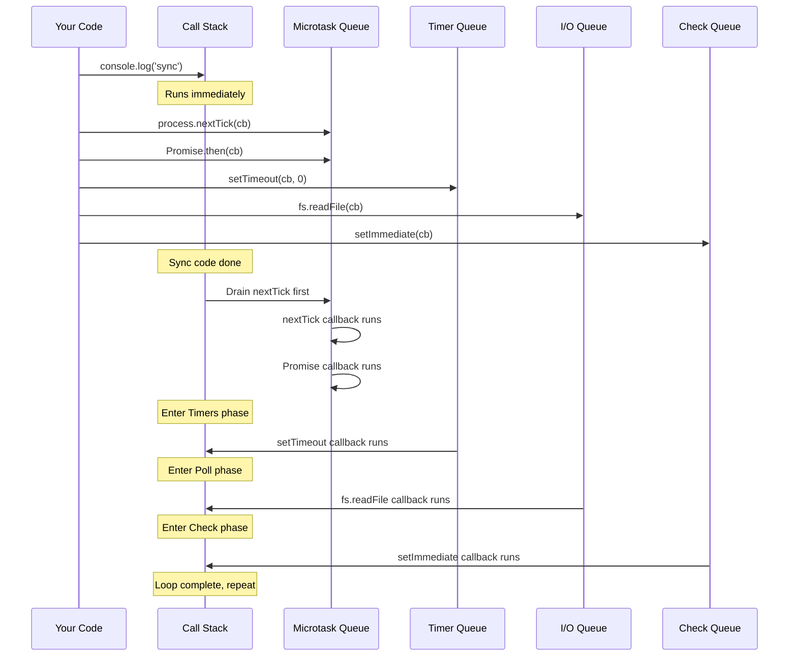

---

## libuv Thread Pool

### Concepts

Node.js is famous for being "single-threaded," but that's only half the story. Under the hood, Node uses a C library called **libuv** that manages a **thread pool** — a group of background worker threads that handle operations the OS can't do asynchronously.

**Why does Node need a thread pool?** Some system operations are inherently blocking at the OS level. For example, reading a file on most operating systems requires a blocking system call (`read()`). If Node tried to do this on its main thread, the entire server would freeze. So libuv offloads these blocking operations to background threads — your JavaScript keeps running while the file read happens in the background.

**The default pool has only 4 threads.** This is the most important thing to understand. Those 4 threads are **shared** across ALL operations that use the pool — file system operations, DNS lookups (`dns.lookup`), crypto operations, and compression (zlib). If you have 4 heavy `crypto.pbkdf2()` calls running, all 4 threads are busy, and your `fs.readFile()` must **wait in line** until a thread frees up.

**What DOESN'T use the thread pool?** Network I/O (TCP, HTTP, WebSocket) uses the operating system's own async mechanisms — `epoll` on Linux, `kqueue` on macOS, `IOCP` on Windows. These are truly non-blocking at the OS level, so they don't need pool threads. This is why Node handles thousands of network connections efficiently on a single thread.

**Think of it this way:** The event loop is like a receptionist who can handle many phone calls simultaneously (network I/O). But when someone asks for a file from the back room, the receptionist must send one of only 4 assistants (thread pool) to fetch it. If all 4 assistants are busy, the next file request waits.

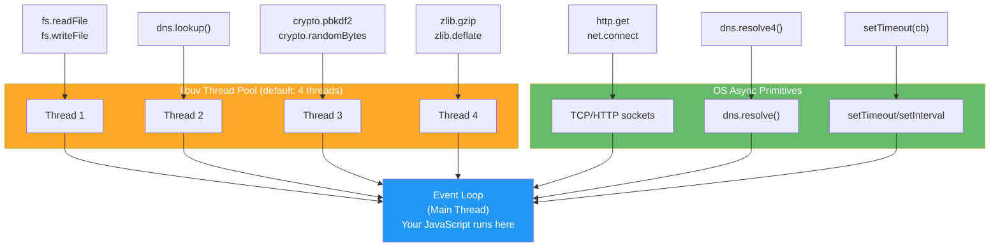

### Which APIs Use the Thread Pool?

| Uses Thread Pool             | Uses OS Async (no pool) |
| ---------------------------- | ----------------------- |
| `fs.*` (all file operations) | `net.*` (TCP sockets)   |
| `dns.lookup()`               | `dns.resolve()`         |
| `crypto.pbkdf2()`            | `http.*` (network I/O)  |
| `crypto.randomBytes()`       | Timers (`setTimeout`)   |
| `zlib.*` (compression)       | `child_process.*`       |
| Pipes (some platforms)       | `process.nextTick()`    |

### Thread Pool Saturation Problem

```js
// ❌ PROBLEM: 4 concurrent crypto operations saturate the pool
// All other fs/dns operations must wait!

const crypto = require("crypto");
const fs = require("fs");

// These 4 crypto ops occupy ALL 4 threads
for (let i = 0; i < 4; i++) {
    crypto.pbkdf2("password", "salt", 100000, 64, "sha512", () => {
        console.log(`Crypto ${i} done`);
    });
}

// This fs operation must WAIT until a thread frees up
fs.readFile("config.json", (err, data) => {
    console.log("File read done"); // Delayed by crypto operations!
});

// ✅ FIX: Increase thread pool size
// Set BEFORE any async operations (at very top of entry file)
process.env.UV_THREADPOOL_SIZE = 16; // Max recommended: 128

// Or set via command line:
// UV_THREADPOOL_SIZE=16 node app.js
```

### Senior-Level Q&A

**Q1: Your DNS lookups are slow in production. What could be wrong?**

A: `dns.lookup()` uses the libuv thread pool (not OS async). If pool is saturated (e.g., heavy `fs` or `crypto` ops), DNS lookups queue behind them.

```js
// ❌ Slow: dns.lookup uses thread pool
const http = require("http");
// http.get uses dns.lookup by default

// ✅ Fix 1: Increase pool size
process.env.UV_THREADPOOL_SIZE = 16;

// ✅ Fix 2: Use dns.resolve (bypasses thread pool, uses OS async)
const dns = require("dns");
const { Resolver } = dns;
const resolver = new Resolver();
resolver.resolve4("example.com", (err, addresses) => {
    // Uses OS async — not affected by thread pool saturation
});

// ✅ Fix 3: Cache DNS results
const dnscache = require("dnscache")({ enable: true, ttl: 300 });
```

**Q2: How do you determine the right `UV_THREADPOOL_SIZE` for your app?**

A: Profile your app to see how many concurrent thread-pool operations occur:

```js
// Monitor thread pool usage
const { performance, PerformanceObserver } = require("perf_hooks");

// Rule of thumb:
// UV_THREADPOOL_SIZE = max concurrent (fs + dns.lookup + crypto + zlib) operations
// Default: 4 | Heavy I/O apps: 16-64 | Max: 128

// ⚠️ Too many threads = context switching overhead + memory waste
// Each thread: ~8KB stack + OS overhead
```

**Q3: Why does `dns.lookup()` use the thread pool but `dns.resolve()` doesn't?**

A: `dns.lookup()` calls the OS's `getaddrinfo()` which is a blocking C library call — must be offloaded to a thread. `dns.resolve()` uses c-ares (async DNS library) that uses non-blocking I/O — no thread needed.

---

## Buffer & Binary Data

### Concepts

JavaScript was designed for web pages — it's great with text (strings), but traditionally weak with raw binary data. **Buffer** fills this gap in Node.js. It represents a chunk of raw memory (like an array of bytes) that Node uses to handle binary data: file contents, network packets, images, encrypted data, etc.

**Why not just use strings?** Strings in JavaScript are encoded as UTF-16 internally, which means every character takes 2 bytes minimum. Binary data (like a PNG image or a TCP packet) isn't text — it's just raw bytes. If you tried to read a PNG file as a string, you'd get garbled data. Buffer lets you work with the raw bytes directly.

**Where Buffers live in memory:** Unlike regular JavaScript objects that live on V8's heap (managed by the garbage collector), Buffers allocate memory **outside** the V8 heap using C++ bindings. This is important because V8's heap has a size limit (~1.5GB), but Buffer memory doesn't count against it. You can allocate much larger Buffers — though you should use streams for truly large data.

**Encoding** is how you convert between Buffers (raw bytes) and strings (human-readable text). Common encodings:

- `utf8` — Standard text encoding (default). Each character is 1-4 bytes
- `base64` — Encodes binary as ASCII text (used in APIs, email attachments)
- `hex` — Each byte represented as 2 hex characters (used in hashes, debugging)
- `ascii` — 7-bit encoding, only English characters

**The dangerous gotcha:** `Buffer.slice()` does NOT copy data — it creates a **view** into the same memory. If you modify the slice, the original changes too. And if you keep a tiny slice reference, the entire original buffer stays in memory. Always use `Buffer.from()` to make an independent copy.

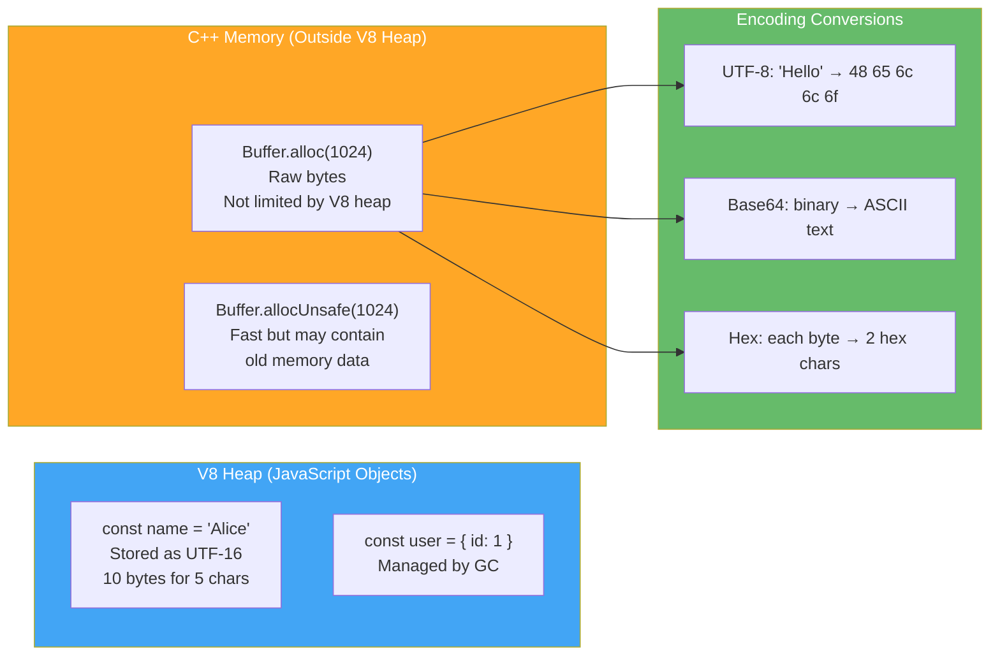

### Key APIs

| Method                     | Description                                        | Returns  |
| -------------------------- | -------------------------------------------------- | -------- |
| `Buffer.alloc(size)`       | Allocate zero-filled buffer (safe)                 | Buffer   |
| `Buffer.allocUnsafe(size)` | Allocate without zeroing (fast, may leak old data) | Buffer   |
| `Buffer.from(string, enc)` | Create from string with encoding                   | Buffer   |
| `Buffer.from(array)`       | Create from byte array                             | Buffer   |
| `buf.toString(enc)`        | Convert to string                                  | String   |
| `buf.slice(start, end)`    | Reference same memory (no copy!)                   | Buffer   |
| `Buffer.concat(buffers)`   | Merge multiple buffers                             | Buffer   |
| `buf.compare(other)`       | Compare for sorting                                | -1, 0, 1 |

### Buffer Safety

```js
// ✅ SAFE: Zero-filled (no old data leakage)
const safeBuf = Buffer.alloc(256);

// ⚠️ UNSAFE: May contain old memory data (faster)
const unsafeBuf = Buffer.allocUnsafe(256);
// Only use when you will immediately overwrite all bytes

// ✅ From string
const greeting = Buffer.from("Hello, World!", "utf8");
console.log(greeting.toString()); // 'Hello, World!'
console.log(greeting.toString("base64")); // 'SGVsbG8sIFdvcmxkIQ=='
console.log(greeting.toString("hex")); // '48656c6c6f2c20576f726c6421'

// ⚠️ Slice shares memory (mutation affects original!)
const original = Buffer.from("Hello");
const slice = original.slice(0, 3);
slice[0] = 74; // ASCII 'J'
console.log(original.toString()); // 'Jello' — Original mutated!

// ✅ Safe copy
const copy = Buffer.from(original); // Independent copy
```

### Encoding Conversions

```js
// Base64 encode/decode (common for API tokens, file uploads)
const text = "user:password";
const base64 = Buffer.from(text).toString("base64"); // 'dXNlcjpwYXNzd29yZA=='
const decoded = Buffer.from(base64, "base64").toString(); // 'user:password'

// Hex for hashes
const crypto = require("crypto");
const hash = crypto.createHash("sha256").update("data").digest("hex");
// '3a6eb0790f39ac87c94f3856b2dd2c5d110e6811602261a9a923d3bb23adc8b7'

// Binary file handling
const fs = require("fs");
const fileBuffer = fs.readFileSync("image.png"); // Returns Buffer
console.log(fileBuffer.length); // File size in bytes
console.log(fileBuffer[0], fileBuffer[1]); // First 2 bytes (PNG magic: 137, 80)
```

### Senior-Level Q&A

**Q1: What's the difference between `Buffer.alloc()` and `Buffer.allocUnsafe()`? When use unsafe?**

A: `alloc()` zero-fills memory (safe but slower). `allocUnsafe()` skips zeroing (faster but may expose old data from memory).

Use `allocUnsafe()` only when you will **immediately fill** the entire buffer (e.g., receiving network data, reading file into buffer). Never send uninitialized buffer content to users.

**Q2: How do Buffers relate to streams?**

A: Streams internally use Buffers as chunks. Each `data` event emits a Buffer (unless in object mode). `highWaterMark` controls the Buffer size threshold for backpressure.

```js
const readable = fs.createReadStream("file.txt");
readable.on("data", (chunk) => {
    console.log(chunk instanceof Buffer); // true
    console.log(chunk.length); // Bytes in this chunk (≤ highWaterMark)
});
```

**Q3: Can Buffer operations cause memory leaks?**

A: Yes — `Buffer.slice()` shares memory with the original. If you keep a small slice reference, the entire original buffer stays in memory (can't be GC'd).

```js
// ❌ Memory leak: Keeping small slice prevents GC of large buffer
function leak() {
    const bigBuffer = Buffer.alloc(10 * 1024 * 1024); // 10MB
    return bigBuffer.slice(0, 10); // 10 bytes, but 10MB stays in memory!
}

// ✅ Fix: Copy the needed bytes
function noLeak() {
    const bigBuffer = Buffer.alloc(10 * 1024 * 1024);
    return Buffer.from(bigBuffer.slice(0, 10)); // Independent 10-byte copy
}
```

---

## Async Patterns

### Concepts

Asynchronous programming is the **core skill** of Node.js development. In traditional languages like Java or Python, when your code reads a file or calls an API, the thread **blocks** — it sits and waits for the result, doing nothing. Multiply that by thousands of users, and you need thousands of threads (expensive memory-wise).

Node.js flips this model: instead of waiting, your code says "go read that file, and here's a function to call when you're done" — then it immediately moves on to handle the next request. This is **non-blocking I/O**, and it's why a single Node process can handle thousands of concurrent connections.

**The evolution of async in JavaScript:**

1. **Callbacks (2009):** The original pattern. You pass a function that runs when the async work completes. The convention is `callback(error, result)` — error first. The problem? When you chain multiple operations, the code nests deeper and deeper, forming the infamous **"callback hell"** — unreadable, unmaintainable pyramids of code.

2. **Promises (2015, ES6):** A Promise is an object that represents a future value. Instead of nesting, you **chain** `.then()` calls. Errors propagate through `.catch()`. Much cleaner, but long chains still drift horizontally.

3. **Async/Await (2017, ES8):** Syntactic sugar over Promises. You write code that **looks** synchronous but behaves asynchronously. `await` pauses execution of the current function (not the thread!) until the Promise resolves. Combined with `try/catch`, it's the cleanest way to handle async operations.

**Key principle:** All three patterns do the same thing — they schedule work to run later. The difference is only in readability and error handling. Under the hood, `async/await` compiles to Promises, and Promises use the microtask queue.

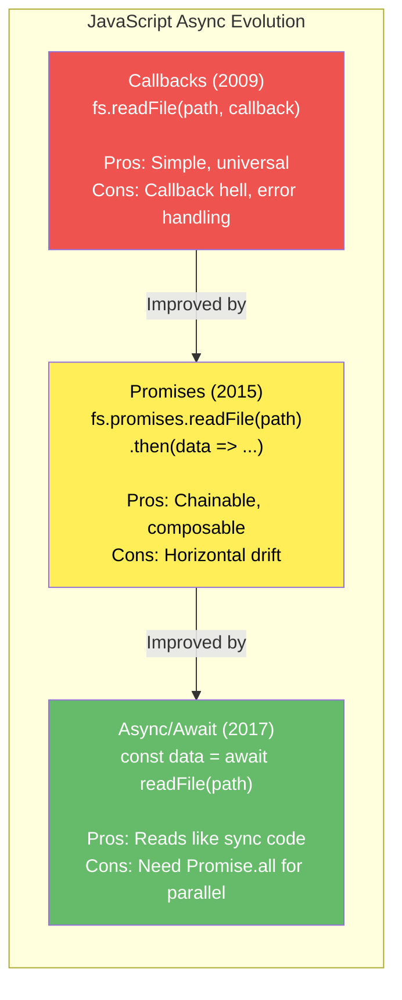

### Key APIs

- `fs.readFile(path, cb)` (callback style) vs `fs.promises.readFile(path)` (promise style).
- `Promise.all(promises)` — wait for all; reject if any fails.
- `Promise.allSettled(promises)` — wait for all; resolve with results and reasons (no early rejection).
- `Promise.race(promises)` — return first settled promise.
- `Promise.any(promises)` — return first fulfilled promise (rejects only if all fail).

### Comparison Table

| Pattern         | Error Handling        | Composability  | Readability    | Common Issues                             |
| --------------- | --------------------- | -------------- | -------------- | ----------------------------------------- |
| **Callback**    | Passed as error param | Poor (nesting) | Hard to follow | Callback hell, forgotten error checks     |
| **Promise**     | `.catch()` chaining   | Good           | Better         | Unhandled rejections, need explicit catch |
| **Async/Await** | `try/catch` blocks    | Excellent      | Excellent      | Harder to parallelize without `.all()`    |

### Promise State Machine & Execution Flow

A Promise is always in one of three states. Once it moves to Fulfilled or Rejected, it **never** changes again — the value/error is locked in forever. This immutability is what makes Promises safe to share across multiple `.then()` handlers.

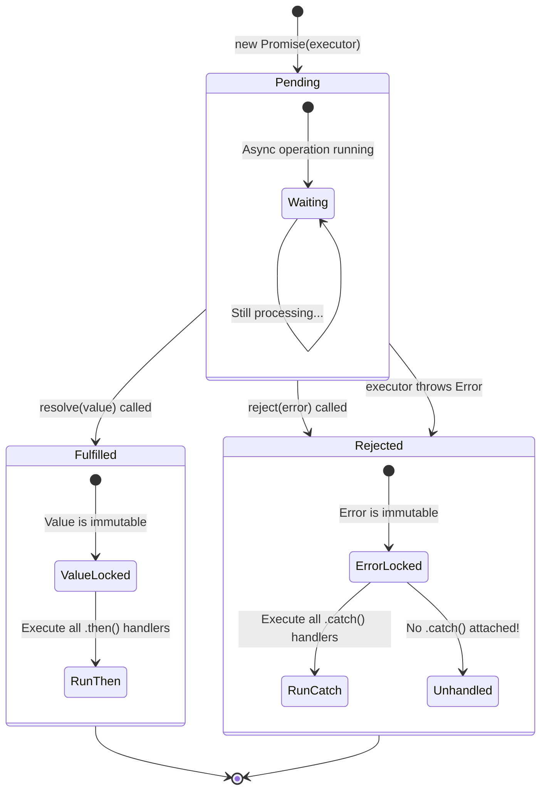

### Async Execution Order (Priority - Highest to Lowest)

This diagram shows the **exact execution order** when you mix different async patterns. This is the most common interview question about the event loop.

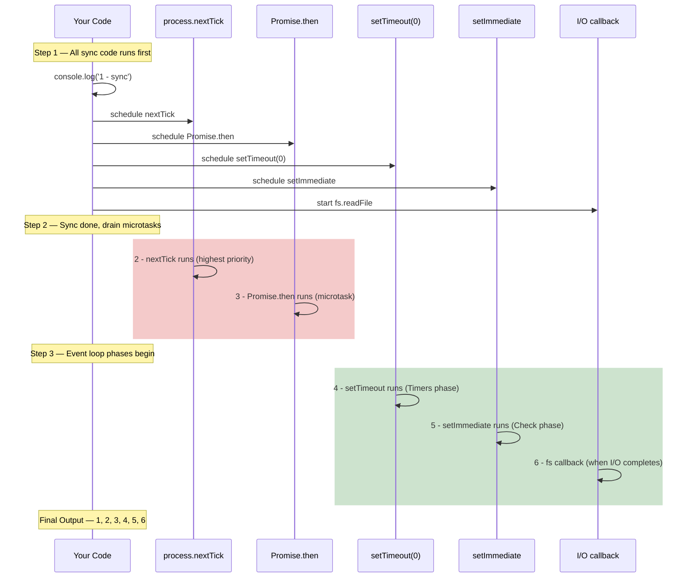

### Detailed Examples

#### Callback Hell & Alternatives

```js
// Callback hell (hard to read and maintain)
fs.readFile("file1.txt", (err, data1) => {
    if (err) return console.error(err);
    fs.readFile("file2.txt", (err, data2) => {
        if (err) return console.error(err);
        fs.readFile("file3.txt", (err, data3) => {
            if (err) return console.error(err);
            console.log(data1, data2, data3);
        });
    });
});

// Promise chaining (clearer)
fs.promises
    .readFile("file1.txt", "utf8")
    .then((data1) =>
        fs.promises
            .readFile("file2.txt", "utf8")
            .then((data2) => [data1, data2]),
    )
    .then(([data1, data2]) =>
        fs.promises
            .readFile("file3.txt", "utf8")
            .then((data3) => [data1, data2, data3]),
    )
    .then(([data1, data2, data3]) => console.log(data1, data2, data3))
    .catch((err) => console.error(err));

// Async/await (most readable)
async function loadFiles() {
    try {
        const data1 = await fs.promises.readFile("file1.txt", "utf8");
        const data2 = await fs.promises.readFile("file2.txt", "utf8");
        const data3 = await fs.promises.readFile("file3.txt", "utf8");
        console.log(data1, data2, data3);
    } catch (err) {
        console.error(err);
    }
}
```

#### Error Handling Patterns

```js
// Pattern 1: Promise.catch()
fetchUser(id)
    .then((user) => fetchPosts(user.id))
    .then((posts) => console.log(posts))
    .catch((err) => console.error("Error:", err.message));

// Pattern 2: Async/await with try/catch
async function loadUserPosts(id) {
    try {
        const user = await fetchUser(id);
        const posts = await fetchPosts(user.id);
        console.log(posts);
    } catch (err) {
        console.error("Error:", err.message);
    }
}

// Pattern 3: Catching specific errors
async function robustFetch(id) {
    try {
        return await fetchUser(id);
    } catch (err) {
        if (err.code === "ENOENT") {
            console.log("Not found, using default");
            return { id, name: "Default" };
        }
        throw err; // Re-throw unexpected errors
    }
}
```

### Senior-Level Q&A

**Q1: What's the difference between `Promise.all()` and `Promise.allSettled()`? When would you use each?**

A:

- **`Promise.all()`:** Rejects immediately if ANY promise rejects. You get all results only if ALL succeed.
- **`Promise.allSettled()`:** Always resolves (never rejects). Returns `[{status, value} | {status, reason}]` for each promise.

**Use `Promise.all()` when:**

- You need all results to proceed (e.g., loading critical resources).
- One failure should cancel everything (fail-fast).

**Use `Promise.allSettled()` when:**

- You need results from all even if some fail (e.g., batch user updates, metrics collection).
- You want to process successes and failures separately.

```js
// Example: Batch API calls with mixed success/failure
const results = await Promise.allSettled([
    fetchUser(1),
    fetchUser(2),
    fetchUser(3), // One might fail
]);

results.forEach((result, idx) => {
    if (result.status === "fulfilled") {
        console.log(`User ${idx}:`, result.value);
    } else {
        console.log(`User ${idx} failed:`, result.reason.message);
    }
});
```

**Q2: Explain how promise chaining can cause "horizontal drift" and how to avoid it.**

A: **Horizontal drift:** Each `.then()` adds nesting indentation, reducing readability of long chains.

```js
// Horizontal drift (hard to read)
user()
    .then((u) =>
        posts(u.id).then((p) =>
            likes(p[0].id).then((l) =>
                comments(l[0].id).then((c) => console.log(c)),
            ),
        ),
    )
    .catch(console.error);

// Fix: Flatten the chain by returning values
user()
    .then((u) => posts(u.id))
    .then((p) => likes(p[0].id))
    .then((l) => comments(l[0].id))
    .then((c) => console.log(c))
    .catch(console.error);

// Best: Use async/await
async function getComments() {
    try {
        const u = await user();
        const p = await posts(u.id);
        const l = await likes(p[0].id);
        const c = await comments(l[0].id);
        console.log(c);
    } catch (err) {
        console.error(err);
    }
}
```

**Q3: What's an unhandled promise rejection? How do you debug it?**

A: **Unhandled rejection:** A promise rejects but has no `.catch()` or `try/catch` handler.

```js
// Unhandled rejection (will crash or warn)
async function badCode() {
    throw new Error("Oops");
}
badCode(); // ⚠️ Unhandled rejection! Not caught!

// Catch it properly
badCode().catch(console.error); // ✅ Handled
```

**Debug with:**

```js
// Global handler for unhandled rejections
process.on("unhandledRejection", (reason, promise) => {
    console.error("Unhandled Rejection:", reason);
    // Log for debugging, then exit or recover
});

// Or use --unhandled-rejections flag
// node --unhandled-rejections=strict app.js
```

**Q4: Explain the difference between these two patterns:**

```js
// Pattern A
async function fetchData() {
    const a = await fetch1();
    const b = await fetch2();
    return [a, b];
}

// Pattern B
async function fetchDataFast() {
    const [a, b] = await Promise.all([fetch1(), fetch2()]);
    return [a, b];
}
```

A: **Time complexity:**

- **Pattern A:** Sequential. Total time = `fetch1()` + `fetch2()` (if fetch2 depends on a, this is correct).
- **Pattern B:** Parallel. Total time = max(`fetch1()`, `fetch2()`) (both run concurrently).

**Pattern B is faster if fetch1 and fetch2 are independent.** Use Pattern A only if the second operation depends on the first result.

```js
// Pattern A: Sequential (fetch2 needs data from fetch1)
async function getUser(id) {
    const user = await fetchUser(id); // Must come first
    const posts = await fetchPosts(user.id); // Depends on user.id
    return { user, posts };
}

// Pattern B: Parallel (independent operations)
async function getMetrics() {
    const [users, posts, comments] = await Promise.all([
        fetchAllUsers(), // Independent
        fetchAllPosts(), // Independent
        fetchAllComments(), // Independent
    ]);
    return { users, posts, comments };
}
```

**Q5: What's Promise.any() and when is it useful?**

A: **`Promise.any()`** — returns the first _fulfilled_ promise (2021 addition). Rejects only if ALL promises fail.

```js
// Use case: Race multiple CDNs, use first successful response
const image = await Promise.any([
    fetch('cdn1.example.com/image.jpg'),
    fetch('cdn2.example.com/image.jpg'),
    fetch('cdn3.example.com/image.jpg'),
]); // Returns first successful fetch

// vs Promise.race: Returns first *settled* (even if rejected)
const fastest = await Promise.race([...]); // Could return an error
```

### Best Practices

- **Always handle rejections:** Use `.catch()` or `try/catch` for every async operation.
- **Use async/await for readability** over promise chains in new code.
- **Parallelize when possible:** Use `Promise.all()` for independent async operations.
- **Fail fast on critical errors:** Use `Promise.all()` for critical paths; use `Promise.allSettled()` for optional/batch operations.
- **Monitor unhandled rejections:** Install a global handler in production apps.

### Common Pitfalls

- **Forgetting to await or `.catch()`** results in unhandled rejections.
- **Serial instead of parallel:** Using sequential `await` in loops when operations are independent (performance regression).

    ```js
    // ❌ BAD: Serial (slow)
    for (const id of ids) {
        await fetchData(id); // Wait for each one
    }

    // ✅ GOOD: Parallel (fast)
    await Promise.all(ids.map((id) => fetchData(id)));
    ```

- **Mixing callbacks and promises:** Error in callbacks don't automatically reject the promise.

    ```js
    // ❌ BAD: Callback error not caught by promise
    new Promise((resolve) => {
        fs.readFile("file", "utf8", (err, data) => {
            if (err) throw err; // Error escapes!
        });
    });

    // ✅ GOOD
    new Promise((resolve, reject) => {
        fs.readFile("file", "utf8", (err, data) => {
            if (err) return reject(err);
            resolve(data);
        });
    });
    ```

### References: [async.js](async.js), [async.txt](async.txt)

---

## Error Handling Patterns

### Concepts

Error handling in Node.js is not just about catching exceptions — it's about **building resilient systems** that fail gracefully, protect user data, and recover automatically.

**Why Node.js errors are special:** When an error isn't caught in a browser, the page might glitch but the user refreshes. When an error isn't caught in Node.js, **the entire server process crashes** — every connected user is disconnected, every pending request is lost. This is why error handling is a first-class concern.

**Two fundamentally different types of errors:**

1. **Operational errors** (expected things that go wrong): A database is down, a file doesn't exist, a user sends invalid input, a network request times out. These are **normal** — you should handle them gracefully (retry, show a message, use a fallback). Your code is correct; the external world is just unpredictable.

2. **Programmer errors** (bugs): Accessing a property on `undefined`, passing a string where a number is expected, forgetting to `await` a promise. These are **your fault** — the correct response is to **crash the process and fix the bug**. Trying to "handle" a bug often makes things worse by letting the process continue in a corrupted state.

**The Error-First Callback convention:** Node's original APIs all follow the pattern `callback(error, result)`. You **always** check `err` before using `result`. This convention predates Promises and is still used in many libraries. If you see `if (err) return callback(err)`, that's the error-first pattern.

**Unhandled rejections = silent bugs:** Before Node 15, an unhandled Promise rejection just printed a warning. Starting with Node 15, it **crashes the process** (like an uncaught exception). This was a deliberate change because unhandled rejections hide bugs that cause mysterious failures hours later.

### Error Classification

| Type            | Example                               | Action                        |
| --------------- | ------------------------------------- | ----------------------------- |
| **Operational** | ECONNREFUSED, ENOENT, 404, timeout    | Handle, retry, or inform user |
| **Programmer**  | TypeError, ReferenceError, null deref | Fix the bug, crash + restart  |
| **System**      | ENOMEM, EMFILE (too many open files)  | Alert, scale, or reduce load  |

### Custom Error Classes

```js
// Base application error
class AppError extends Error {
    constructor(message, statusCode, isOperational = true) {
        super(message);
        this.statusCode = statusCode;
        this.isOperational = isOperational;
        this.name = this.constructor.name;
        Error.captureStackTrace(this, this.constructor);
    }
}

class NotFoundError extends AppError {
    constructor(resource = "Resource") {
        super(`${resource} not found`, 404);
    }
}

class ValidationError extends AppError {
    constructor(message) {
        super(message, 400);
    }
}

class DatabaseError extends AppError {
    constructor(message) {
        super(message, 500, false); // Not operational — bug
    }
}

// Usage
async function getUser(id) {
    const user = await db.findById(id);
    if (!user) throw new NotFoundError("User");
    return user;
}
```

### Express Error Handling Middleware

```js
// Centralized error handler (MUST have 4 params)
function errorHandler(err, req, res, next) {
    // Log all errors
    console.error({
        message: err.message,
        stack: err.stack,
        statusCode: err.statusCode,
        path: req.path,
    });

    // Operational errors: send meaningful response
    if (err.isOperational) {
        return res.status(err.statusCode).json({
            error: err.message,
        });
    }

    // Programmer errors: generic response, alert team
    res.status(500).json({ error: "Internal server error" });
}

// Usage
app.get("/users/:id", async (req, res, next) => {
    try {
        const user = await getUser(req.params.id);
        res.json(user);
    } catch (err) {
        next(err); // Pass to error middleware
    }
});

app.use(errorHandler); // Must be last middleware
```

### Global Error Handlers

```js
// Catch unhandled promise rejections
process.on("unhandledRejection", (reason, promise) => {
    console.error("Unhandled Rejection:", reason);
    // In production: log, alert, then shutdown gracefully
    // process.exit(1); // Node 15+ crashes by default
});

// Catch uncaught exceptions
process.on("uncaughtException", (err) => {
    console.error("Uncaught Exception:", err);
    // MUST exit — process state is unreliable after uncaught exception
    process.exit(1);
});

// Catch warnings (e.g., MaxListenersExceeded)
process.on("warning", (warning) => {
    console.warn("Warning:", warning.name, warning.message);
});
```

### Senior-Level Q&A

**Q1: Should you catch all errors and keep the process alive? Why not?**

A: **No.** After an uncaught exception, Node's state is unreliable (corrupted memory, leaked resources). You should:

1. Log the error with full context
2. Attempt graceful shutdown (close connections, finish requests)
3. Exit and let a process manager (PM2, systemd) restart

```js
process.on("uncaughtException", (err) => {
    logger.fatal(err, "Uncaught exception — shutting down");
    server.close(() => process.exit(1));
    // Force kill if graceful shutdown hangs
    setTimeout(() => process.exit(1), 10000);
});
```

**Q2: How do you handle errors in `Promise.all()` without failing the entire batch?**

A: Use `Promise.allSettled()` or wrap individual promises:

```js
// Option 1: allSettled
const results = await Promise.allSettled(urls.map(fetch));
const successes = results.filter((r) => r.status === "fulfilled");
const failures = results.filter((r) => r.status === "rejected");

// Option 2: Wrap with error catch
const safeResults = await Promise.all(
    urls.map((url) => fetch(url).catch((err) => ({ error: err.message, url }))),
);
```

**Q3: What's the difference between `throw` in async vs sync functions?**

A:

- **Sync `throw`:** Creates a synchronous exception — caught by `try/catch`
- **Async `throw`:** Rejects the returned promise — caught by `.catch()` or `try/catch` with `await`

```js
// Sync: Caught by try/catch
function syncFn() {
    throw new Error("sync");
}
try {
    syncFn();
} catch (e) {
    /* caught */
}

// Async: Returns rejected promise
async function asyncFn() {
    throw new Error("async");
}
asyncFn().catch((e) => {
    /* caught */
});

// ⚠️ GOTCHA: throw inside callback is NOT caught by async try/catch
async function gotcha() {
    try {
        setTimeout(() => {
            throw new Error("oops");
        }, 0); // NOT caught!
    } catch (e) {
        // Never reaches here
    }
}
```

---

## Event Emitters

### Concepts

Event Emitters implement the **Observer pattern** (also called pub/sub) in Node.js. Think of it like a radio station: the station **emits** (broadcasts) signals, and anyone with a radio **listens** for those signals. The station doesn't know how many radios are tuned in, and each radio doesn't know about the others.

**Why are they important?** EventEmitter is the **foundation of most Node.js APIs**. When you write `server.on('request', handler)`, `stream.on('data', chunk => ...)`, or `process.on('exit', ...)`, you're using EventEmitter. HTTP servers, streams, child processes, file watchers — they all inherit from EventEmitter.

**How it works:** An EventEmitter object maintains a list of listener functions for each event name. When you call `emitter.emit('data', payload)`, it calls every function registered for the `'data'` event, in the order they were added. It's **synchronous** — each listener runs one after another, not in parallel.

**The memory leak trap:** The #1 issue with EventEmitters is **forgetting to remove listeners**. Every time you call `.on()`, a new function reference is stored. If you attach listeners in a loop or request handler without removing them, the list grows forever. Node warns you at 10 listeners per event — this isn't a limit, it's a **leak detector**. If you legitimately need more, use `setMaxListeners()`, but first confirm you're not leaking.

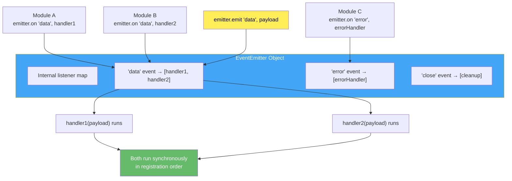

### Key APIs

- `emitter.on(event, listener)` — attach listener (runs every time event fires).
- `emitter.once(event, listener)` — attach listener for single execution.
- `emitter.removeListener(event, listener)` — remove specific listener.
- `emitter.removeAllListeners(event)` — remove all listeners for an event.
- `emitter.listeners(event)` — get array of listeners.
- `emitter.setMaxListeners(n)` — increase default limit (10).

### Senior-Level Q&A

**Q1: Why does Node warn at 10+ listeners and how do you debug this warning?**

A: The warning prevents **memory leaks** from forgotten listener references. A single event with 100+ listeners indicates:

- Listeners not removed in cleanup/destructors
- Repeated attachment without deduplication
- (Rarely) legitimately high listener count

```js
// ❌ Memory leak: Listeners pile up
const { EventEmitter } = require("events");
const emitter = new EventEmitter();

function attachListeners() {
    emitter.on("data", () => {
        console.log("Processing data");
    });
}

// Called repeatedly, listeners accumulate
setInterval(attachListeners, 100);
// After 1 second: 10 listeners, warning appears

// ✅ Fix: Remove listeners on cleanup
class DataProcessor {
    constructor(emitter) {
        this.emitter = emitter;
        this.handler = () => console.log("Processing");
    }

    attach() {
        this.emitter.on("data", this.handler);
    }

    detach() {
        this.emitter.removeListener("data", this.handler);
    }
}

// Debug: Check listener count
console.log(emitter.listenerCount("data")); // Get count for specific event
console.log(emitter.listeners("data")); // Get actual functions
```

**Q2: Your Express app creates a new EventEmitter inside each request handler. Is this a memory leak?**

A: Not if the emitter is garbage-collected after the request. But if you attach persistent listeners, they leak:

```js
// ❌ LEAK: Listener survives request
const express = require("express");
const app = express();
const { EventEmitter } = require("events");
const globalEmitter = new EventEmitter();

app.get("/api/data", (req, res) => {
    globalEmitter.on("update", () => {
        // Attached once per request, never removed
        res.json({ data: "updated" });
    });
});

// After 1000 requests: 1000 listeners on globalEmitter

// ✅ FIX: Cleanup on request end
app.get("/api/data", (req, res) => {
    const handler = () => res.json({ data: "updated" });
    globalEmitter.on("update", handler);

    res.on("finish", () => {
        globalEmitter.removeListener("update", handler);
    });
});

// ✅ BETTER: Use once()
app.get("/api/data", (req, res) => {
    globalEmitter.once("update", () => {
        res.json({ data: "updated" });
    });
});
```

**Q3: What's the difference between `on()` and `once()`? When do you use each?**

A:

- **`on()`:** Listener runs every time event fires (persistent).
- **`once()`:** Listener runs exactly once, then auto-removes.

```js
const { EventEmitter } = require("events");
const emitter = new EventEmitter();

// on(): Persistent
emitter.on("click", () => console.log("Clicked"));
emitter.emit("click"); // "Clicked"
emitter.emit("click"); // "Clicked" (still listening)

// once(): One-time
emitter.once("first-connect", () => console.log("Connected"));
emitter.emit("first-connect"); // "Connected"
emitter.emit("first-connect"); // (no output, listener removed)
```

**Use `once()` for:**

- Initialization events ("started", "connected", "loaded")
- Promise-like patterns (first result, error)
- One-off async operations

**Use `on()` for:**

- Continuous monitoring ("data", "update", "error")
- Pub/sub within app lifetime

**Q4: Design a pub/sub system with proper cleanup. How do you avoid memory leaks?**

A:

```js
class PubSub {
    constructor() {
        this.emitter = new EventEmitter();
        this.emitter.setMaxListeners(100); // Increase if legitimately needed
    }

    subscribe(topic, handler) {
        this.emitter.on(topic, handler);

        // Return unsubscribe function (cleanup interface)
        return () => {
            this.emitter.removeListener(topic, handler);
        };
    }

    subscribeOnce(topic, handler) {
        this.emitter.once(topic, handler);
        return () => {
            this.emitter.removeListener(topic, handler);
        };
    }

    publish(topic, data) {
        this.emitter.emit(topic, data);
    }

    // Debug: Get listener count
    getListenerCount(topic) {
        return this.emitter.listenerCount(topic);
    }
}

// Usage with cleanup
const pubsub = new PubSub();

const unsubscribe = pubsub.subscribe("user:login", (user) => {
    console.log(`${user.name} logged in`);
});

// Cleanup when done
unsubscribe();

// Verify cleanup
console.log(pubsub.getListenerCount("user:login")); // 0
```

**Q5: You have 50+ EventEmitters in your app. How do you track listener leaks?**

A: Use monitoring tools and patterns:

```js
// Pattern 1: Wrap EventEmitter to track leaks
const originalOn = EventEmitter.prototype.on;
let maxListenersWarnings = [];

EventEmitter.prototype.on = function (event, listener) {
    if (this.listenerCount(event) >= 10) {
        maxListenersWarnings.push({
            emitter: this.constructor.name,
            event,
            count: this.listenerCount(event),
            stack: new Error().stack,
        });
    }
    return originalOn.call(this, event, listener);
};

// Pattern 2: Global unhandledWarning listener
process.on("warning", (warning) => {
    if (warning.name === "MaxListenersExceededWarning") {
        console.warn("Listener leak detected:", warning.message);
        // Log for analysis
    }
});

// Pattern 3: Periodic audit
setInterval(() => {
    maxListenersWarnings.forEach((w) => {
        console.warn(`${w.emitter}.on('${w.event}'): ${w.count} listeners`);
    });
}, 60000);
```

### Best Practices

- **Always remove listeners:** Use `.removeListener()` or `.off()` when object is destroyed.
- **Prefer named handlers for removal:** Arrow functions in `.on()` can't be removed (no reference).

    ```js
    // ❌ Can't remove (anonymous)
    emitter.on("event", () => {
        /* do something */
    });

    // ✅ Can be removed (named)
    const handler = () => {
        /* do something */
    };
    emitter.on("event", handler);
    emitter.removeListener("event", handler);
    ```

- **Use `.once()` for one-off events:** Auto-cleanup prevents leaks.
- **Monitor listener counts in production:** Alert on `MaxListenersExceededWarning`.
- **Increase `.setMaxListeners()` only if intentional:** Don't suppress warnings.

### Common Pitfalls

- **Forgetting to remove listeners:** Grows memory with each instance.
- **Anonymous handler functions:** Can't be removed later.

    ```js
    // ❌ BAD
    emitter.on("data", () => console.log("data"));
    // Later: Can't remove this!

    // ✅ GOOD
    const handler = () => console.log("data");
    emitter.on("data", handler);
    emitter.removeListener("data", handler);
    ```

- **Attaching listeners in loops without cleanup:** Rapidly accumulates listeners.
- **Not cleaning up on object destruction:** Listeners reference destroyed objects, preventing GC.

### References: [EventEmitters/basics.js](EventEmitters/basics.js), [EventEmitters/listeners.js](EventEmitters/listeners.js)

---

## Streams & Pipelines

### Concepts

Streams are Node's way of handling data **piece by piece** instead of all at once. Imagine filling a swimming pool: you could dump the entire water supply at once (loading a 2GB file into memory), or you could run a garden hose (streaming chunks of data, using only a small buffer).

**Why do streams matter?** Without streams, processing a 2GB file means loading 2GB into RAM. With 100 concurrent users doing this, that's 200GB of RAM — impossible. Streams solve this by processing data in small **chunks** (typically 16KB-64KB). Your memory usage stays constant regardless of file size.

**The four stream types:**

1. **Readable** — A source of data you read from. Examples: reading a file (`fs.createReadStream`), receiving an HTTP request body, stdin input
2. **Writable** — A destination you write to. Examples: writing to a file (`fs.createWriteStream`), sending an HTTP response, stdout output
3. **Duplex** — Both readable and writable, but the two sides are **independent**. Example: a TCP socket (you read data from the client AND write data back, but what you write isn't related to what you read)
4. **Transform** — A duplex stream where the output IS related to the input — data goes in, gets modified, and comes out. Examples: compression (gzip), encryption, parsing CSV lines

**Backpressure — the most important concept:** When you pipe a fast readable into a slow writable, data piles up in memory. Backpressure is the mechanism where the slow consumer **tells** the fast producer to pause. Think of it like a conveyor belt: if boxes pile up at the end, the belt stops until the worker catches up. Without backpressure handling, your Node process will run out of memory.

**`.pipe()` vs `pipeline()`:** The old `.pipe()` method handles backpressure but NOT error cleanup — if a stream errors, the others aren't destroyed, causing resource leaks. `stream.pipeline()` (added in Node 10) properly destroys all streams on error and calls a final callback. **Always prefer `pipeline()` in production code.**

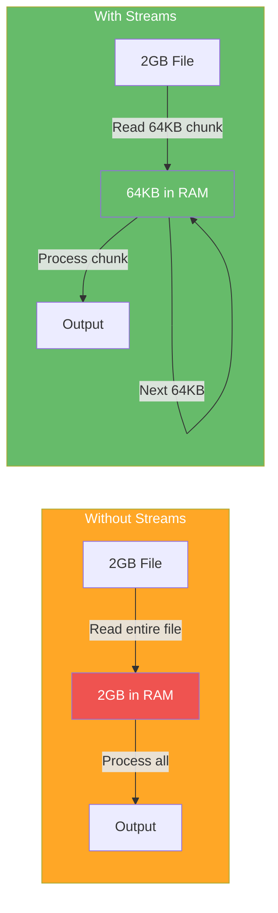

### Stream Types

1. **Readable:** Can read from (e.g., `fs.createReadStream`, HTTP request body).
2. **Writable:** Can write to (e.g., `fs.createWriteStream`, HTTP response).
3. **Duplex:** Both readable and writable (e.g., TCP socket).
4. **Transform:** Readable → Transform → Writable (e.g., compression, encryption).

### Key APIs

- `fs.createReadStream(path, options)` — stream file data.
- `fs.createWriteStream(path, options)` — write data to file.
- `stream.Transform` — custom transformation logic.
- `stream.pipeline(streams..., cb)` — compose streams with proper cleanup.
- `readable.pipe(writable)` — automatic backpressure handling.

### Backpressure Deep Dive

**What is backpressure?**

When a slow consumer can't keep up with a fast producer, the producer should reduce output (or buffer in memory, risking OOM).

```js
// ❌ NO BACKPRESSURE: Memory leak!
const fs = require("fs");
const readStream = fs.createReadStream("huge-file.txt");
const writeStream = fs.createWriteStream("output.txt");

readStream.on("data", (chunk) => {
    writeStream.write(chunk); // Ignores write() return value
    // If write() returns false, we're buffering too much!
});

// ✅ WITH BACKPRESSURE: Intelligent pumping
readStream.on("data", (chunk) => {
    const canContinue = writeStream.write(chunk);
    if (!canContinue) {
        readStream.pause(); // Stop reading until drain event
    }
});

writeStream.on("drain", () => {
    readStream.resume(); // Resume reading
});

// ✅ BEST: Use .pipe() (handles backpressure automatically)
readStream.pipe(writeStream);
```

**Performance example: Without vs with backpressure**

```js
// Measure memory without backpressure handling
const fs = require("fs");

// BAD: Leaks memory for large files
function badStream() {
    const read = fs.createReadStream("1gb-file.txt");
    const write = fs.createWriteStream("output.txt");

    read.on("data", (chunk) => {
        write.write(chunk);
        // No pause() = buffer grows → OOM
    });
}

// GOOD: Manages memory efficiently
function goodStream() {
    const read = fs.createReadStream("1gb-file.txt");
    const write = fs.createWriteStream("output.txt");
    read.pipe(write);
    // Backpressure managed automatically
}
```

### Stream Architecture & Backpressure Flow

This shows what happens step-by-step when a fast reader sends data to a slow writer. The key moment is when the buffer fills up and the system **automatically pauses** the reader.

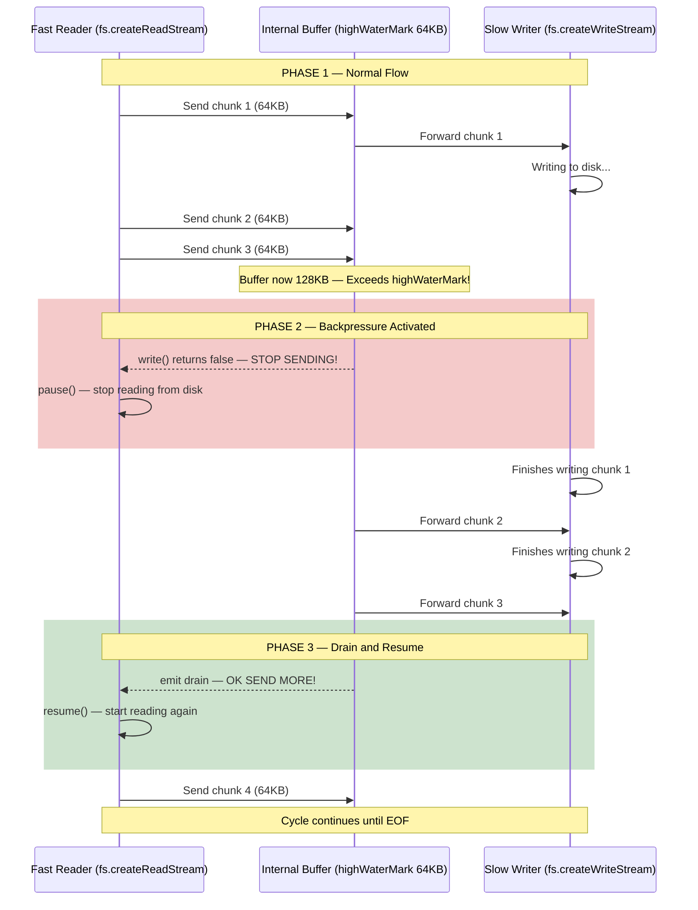

### Memory Usage: Streams vs readFile


### Transform Streams Examples

```js
const { Transform } = require("stream");
const fs = require("fs");

// Example 1: Uppercase transform
const upperTransform = new Transform({
    transform(chunk, encoding, callback) {
        this.push(chunk.toString().toUpperCase());
        callback(); // Signal completion
    },
});

fs.createReadStream("input.txt")
    .pipe(upperTransform)
    .pipe(fs.createWriteStream("output.txt"));

// Example 2: CSV to JSON transform
const csvToJson = new Transform({
    readableObjectMode: true,
    transform(chunk, encoding, callback) {
        const lines = chunk.toString().split("<br/>");
        const [headers, ...rows] = lines;
        const keys = headers.split(",");

        rows.forEach((row) => {
            const values = row.split(",");
            const obj = Object.fromEntries(
                keys.map((key, i) => [key.trim(), values[i]]),
            );
            this.push(obj);
        });
        callback();
    },
});

// Example 3: Compression transform (using zlib)
const zlib = require("zlib");
const gzip = zlib.createGzip();

fs.createReadStream("input.txt")
    .pipe(gzip)
    .pipe(fs.createWriteStream("input.txt.gz"));
```

### Pipeline Composition

```js
const { pipeline } = require("stream");
const fs = require("fs");
const zlib = require("zlib");

// Chain multiple streams safely
pipeline(
    fs.createReadStream("input.txt"),
    zlib.createGzip(),
    fs.createWriteStream("input.txt.gz"),
    (err) => {
        if (err) {
            console.error("Pipeline failed:", err.message);
            // Cleanup happens automatically
        } else {
            console.log("Pipeline succeeded");
        }
    },
);
```

### Senior-Level Q&A

**Q1: Explain backpressure. What happens if you ignore it on a 1GB file?**

A: **Backpressure** signals that the consumer is slower than the producer. Ignoring it floods memory:

```js
// Without backpressure: Memory usage ~500MB+ for 1GB file
const read = fs.createReadStream("1gb.txt", { highWaterMark: 64 * 1024 }); // 64KB chunks
const write = fs.createWriteStream("out.txt");

read.on("data", (chunk) => {
    write.write(chunk); // Ignores return value
});

// With backpressure: Memory usage stays ~64KB (one chunk)
read.on("data", (chunk) => {
    if (!write.write(chunk)) {
        read.pause();
    }
});

write.on("drain", () => read.resume());
```

**Q2: When would you use a Transform vs Duplex stream?**

A:

- **Transform:** One-way transformation (read → transform → write). Example: compression, parsing.
- **Duplex:** Two-way communication (can read AND write, independently). Example: TCP socket, WebSocket.

```js
// Transform example: Text transform (one-way)
const upperTransform = new Transform({
    transform(chunk, enc, cb) {
        cb(null, chunk.toString().toUpperCase());
    },
});

// Duplex example: Simple echo server (two-way)
const { Duplex } = require("stream");
const echoServer = new Duplex({
    read() {},
    write(chunk, enc, cb) {
        this.push(chunk); // Echo back
        cb();
    },
});
```

**Q3: Your transform stream is buffering data before calling callback. When is this a problem?**

A: If the transform is slow but you don't signal backpressure in the upstream, input will buffer:

```js
// ❌ SLOW TRANSFORM: Callback delayed, buffers input
const slowTransform = new Transform({
    transform(chunk, enc, cb) {
        setTimeout(() => {
            cb(null, chunk); // Delayed 1 second
        }, 1000); // Slow operation!
    },
});

// Effects:
// - Input stream buffers data → memory grows
// - Output stream can't process fast enough
// - Eventually hits highWaterMark and throws backpressure

// Solution: Accept backpressure from output
const slowTransform2 = new Transform({
    transform(chunk, enc, cb) {
        setTimeout(() => {
            const canContinue = this.push(chunk);
            cb(); // Always call callback, but result signals backpressure
        }, 1000);
    },
});
```

**Q4: What's the difference between `stream.pipe()` and `stream.pipeline()`?**

A:

- **`.pipe()`:** Direct piping; error in one stream doesn't clean up others.
- **`.pipeline()`:** Proper cleanup; destroys all streams on error; handles backpressure across all streams.

```js
// ❌ pipe() - manual cleanup needed
read.pipe(transform).pipe(write);
read.on("error", () => {
    /* cleanup? */
});
transform.on("error", () => {
    /* cleanup? */
});
write.on("error", () => {
    /* cleanup? */
});

// ✅ pipeline() - automatic cleanup
pipeline(read, transform, write, (err) => {
    if (err) console.error(err);
    // Streams auto-destroyed
});
```

**Q5: How does `highWaterMark` affect memory and performance?**

A: **`highWaterMark`** is the threshold for buffering. When internal buffer ≥ `highWaterMark`, backpressure signals "pause."

```js
// Small highWaterMark: More frequent pause/resume (CPU overhead, slower throughput)
const read = fs.createReadStream("file.txt", { highWaterMark: 16 * 1024 }); // 16KB

// Large highWaterMark: Less pause/resume (higher memory, better throughput)
const read2 = fs.createReadStream("file.txt", { highWaterMark: 256 * 1024 }); // 256KB

// Trade-off: Balance throughput vs memory
// Default: 16KB (readable), 16KB (writable)
// Typical tuning: 64KB-256KB
```

### Best Practices

- **Always use `.pipe()` or `.pipeline()`** for stream composition; never manually buffer without backpressure handling.
- **Handle `error` events** on all streams; errors can silently fail without explicit handlers.
- **Respect backpressure:** Check `.write()` return value or use `.pause()/.resume()`.
- **Choose appropriate `highWaterMark`:** Test with your typical data sizes and throughput.
- **Use Transform streams** for data transformation; avoid buffering entire file in memory.

### Common Pitfalls

- **Not handling errors:** Silent stream failures leave resources open.

    ```js
    // ❌ Error silently ignored
    read.pipe(write); // No error listener

    // ✅ Handle errors
    read.on("error", console.error);
    write.on("error", console.error);
    ```

- **Ignoring backpressure:** Floods memory for large files.
- **Converting streams to buffers:** `stream.pipe(new PassThrough().on("data", chunk => buffer += chunk))` defeats streaming benefits.
- **Not destroying streams on error:** Left-over file handles, sockets, etc.

### Advanced Stream Patterns

#### Object Mode Streams

```js
// Parse JSONL (JSON Lines: one JSON per line)
const { Transform } = require("stream");

const jsonlParser = new Transform({
    readableObjectMode: true, // Output objects, not buffers
    transform(chunk, enc, cb) {
        this.buffer = (this.buffer || "") + chunk.toString();
        const lines = this.buffer.split("<br/>");

        // Keep last incomplete line in buffer
        this.buffer = lines.pop();

        // Push complete lines as objects
        lines.forEach((line) => {
            if (line.trim()) {
                try {
                    this.push(JSON.parse(line));
                } catch (err) {
                    cb(err);
                }
            }
        });

        cb();
    },

    flush(cb) {
        if (this.buffer && this.buffer.trim()) {
            try {
                this.push(JSON.parse(this.buffer));
            } catch (err) {
                cb(err);
                return;
            }
        }
        cb();
    },
});

// Usage: Stream JSONL file without loading entire file
fs.createReadStream("data.jsonl")
    .pipe(jsonlParser)
    .on("data", (obj) => {
        console.log("Parsed object:", obj);
    });
```

#### Stream Composition & Error Handling

```js
const { pipeline } = require("stream");
const fs = require("fs");
const zlib = require("zlib");
const crypto = require("crypto");

// Chain: read → encrypt → compress → write
// Error in ANY stream properly cleans up all

pipeline(
    fs.createReadStream("secret.txt"),
    crypto.createCipheriv(
        "aes-256-cbc",
        crypto.randomBytes(32),
        crypto.randomBytes(16),
    ),
    zlib.createGzip(),
    fs.createWriteStream("secret.txt.gz.enc"),
    (err) => {
        if (err) {
            console.error("Pipeline failed", err);
            // All streams automatically destroyed
        } else {
            console.log("Pipeline succeeded");
        }
    },
);
```

#### Buffering vs Streaming: Performance Impact

```js
// Benchmark: Read 100MB file
const fs = require("fs");
const { performance } = require("perf_hooks");

// Method 1: Buffer entire file (SLOW for large files)
async function bufferedRead() {
    const start = performance.now();
    const data = await fs.promises.readFile("100mb.bin");
    console.log(
        `Buffered: ${(performance.now() - start).toFixed(0)}ms, Memory: ${process.memoryUsage().heapUsed / 1024 / 1024}MB`,
    );
}

// Method 2: Stream & process chunks (FAST)
async function streamRead() {
    const start = performance.now();
    let count = 0;

    for await (const chunk of fs.createReadStream("100mb.bin")) {
        count += chunk.length;
    }

    console.log(
        `Streamed: ${(performance.now() - start).toFixed(0)}ms, Count: ${count}, Memory: ${process.memoryUsage().heapUsed / 1024 / 1024}MB`,
    );
}

// Buffered: ~500ms, Memory: 100MB+
// Streamed: ~150ms, Memory: ~10MB
```

### Stream Processing Patterns

#### Fan-out Pattern (One source → Multiple destinations)

One readable stream sends the same data to multiple processors simultaneously. Each consumer gets every chunk independently.

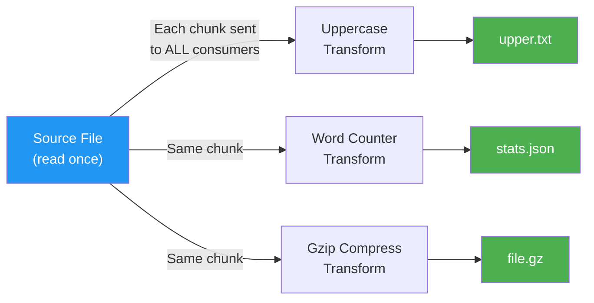

#### Backpressure Propagation Through Pipeline

When the slowest stage hits its limit, the pause signal travels **backwards** through the entire pipeline, all the way to the source. This keeps memory usage constant.


### Additional Stream Q&A

**Q6: Design a CSV file processor that handles 1GB files without loading into memory.**

A:

```js
const fs = require("fs");
const { Transform } = require("stream");
const csv = require("csv-parser"); // or custom parser

function processCSV(filepath, onRow, onError) {
    fs.createReadStream(filepath)
        .pipe(csv())
        .on("data", (row) => {
            // Process row-by-row
            onRow(row);
        })
        .on("error", onError)
        .on("end", () => {
            console.log("Processing complete");
        });
}

// Usage
let rowCount = 0;
processCSV("large-data.csv", (row) => {
    // Maybe validate, aggregate, transform
    rowCount++;
    if (rowCount % 10000 === 0) {
        console.log(`Processed ${rowCount} rows`);
    }
});
```

**Q7: Your transform stream sometimes needs to emit multiple output chunks per input chunk. How do you handle this?**

A: Use `this.push()` multiple times in `transform()`:

```js
const { Transform } = require("stream");

// Example: Explode arrays into individual items
const arrayExploder = new Transform({
    readableObjectMode: true,
    writableObjectMode: true,
    transform(chunk, enc, cb) {
        if (Array.isArray(chunk)) {
            chunk.forEach((item) => this.push(item));
        } else {
            this.push(chunk);
        }
        cb();
    },
});

// Input: [1, 2, 3], [4, 5]
// Output: 1, 2, 3, 4, 5
```

**Q8: How do you implement a `retry` stream that replays failed chunks?**

A:

```js
const { Transform } = require("stream");

class RetryTransform extends Transform {
    constructor(fn, maxRetries = 3) {
        super({ objectMode: true });
        this.fn = fn;
        this.maxRetries = maxRetries;
        this.failedChunks = [];
    }

    async transform(chunk, enc, cb) {
        for (let attempt = 0; attempt <= this.maxRetries; attempt++) {
            try {
                const result = await this.fn(chunk);
                this.push(result);
                return cb();
            } catch (err) {
                if (attempt === this.maxRetries) {
                    this.failedChunks.push({ chunk, error: err });
                    return cb(err);
                }
                // Exponential backoff
                await new Promise((resolve) =>
                    setTimeout(resolve, Math.pow(2, attempt) * 100),
                );
            }
        }
    }

    getFailedChunks() {
        return this.failedChunks;
    }
}

// Usage
const retryStream = new RetryTransform(async (item) => {
    // Might fail (network, etc)
    return await processItem(item);
});

fs.createReadStream("data.jsonl")
    .pipe(jsonlParser)
    .pipe(retryStream)
    .on("end", () => {
        console.log("Failed items:", retryStream.getFailedChunks());
    });
```

### References: [NodeServer/\_\_streams.js](NodeServer/__streams.js), [\_Stream_Buffer.js](_Stream_Buffer.js)

---

## File System (fs)

### Concepts

The `fs` module lets Node.js interact with the file system — reading files, writing data, watching for changes, and managing directories. It's one of the most used modules, but also one of the easiest to misuse.

**Three API styles:** Node offers the same operations in three flavors:

- **Synchronous** (`fs.readFileSync`) — Blocks the event loop until done. Only use at startup (loading config) or in CLI tools. **Never** use in a server handling requests.
- **Callback** (`fs.readFile(path, callback)`) — The original async style. Non-blocking, but nests badly.
- **Promise** (`fs.promises.readFile(path)`) — Modern, clean, works with async/await. **Use this for all new code.**

**File descriptors:** Every time you open a file, the OS assigns a **file descriptor** (an integer). There's a system-wide limit (typically 1024-65535). If you open files without closing them, you'll hit `EMFILE: too many open files`. Streams handle this automatically; manual `fs.open()` requires manual `fs.close()`.

**The readFile vs createReadStream decision:** For small files (< 10MB), `readFile` is simpler. For large files, **always use streams** — `readFile` loads the entire file into memory. With 100 concurrent requests each reading a 50MB file, that's 5GB of RAM.

**File watching:** `fs.watch()` listens for file changes using OS-level mechanisms (inotify on Linux, FSEvents on macOS, ReadDirectoryChangesW on Windows). But it fires **multiple events** per save (editors write-rename-delete), so you need debouncing. The `chokidar` library wraps this with cross-platform reliability.

**Concurrent writes:** Node.js doesn't have built-in file locking. If two processes write to the same file simultaneously, data can be corrupted. Solutions include: lock files, append-only patterns, or using a database instead.

### Key APIs

- `fs.promises` — promise-based FS operations (preferred for new code).
- `fs.createReadStream` / `fs.createWriteStream` — streaming large files.
- `fs.watch(path, (eventType, filename) => {...})` — file change notifications (inotify on Linux, FSEvents on macOS).
- `fs.appendFile()` / `fs.appendFileSync()` — append data without reading entire file.
- `fs.access()` — check file permissions before operations.
- `fs.truncate()` — resize file.
- `fs.stat()` — get file metadata (size, timestamps, permissions).

### File Operations Decision Matrix

This diagram helps you choose the right `fs` API based on your situation. Follow the arrows from your operation type to the recommended approach.

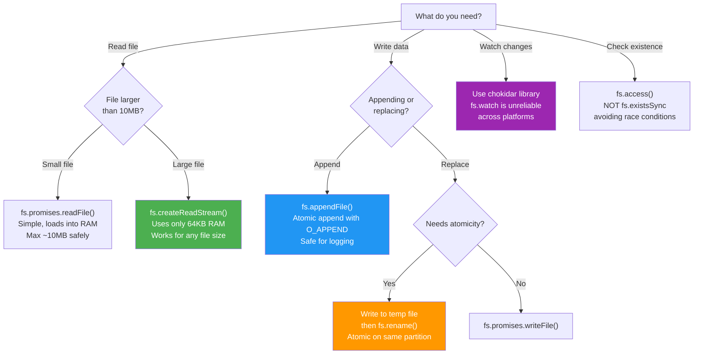

### Memory: readFile vs Streams

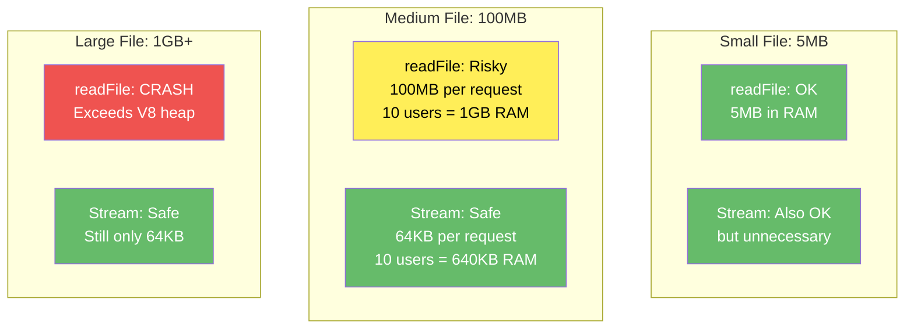

### Performance Considerations

**Memory usage: Read entire file vs streaming**

```js
// ❌ BAD: Loads 1GB into memory
const fs = require("fs");
const data = fs.readFileSync("1gb-file.txt"); // Blocks, uses 1GB RAM
console.log(data.toString());

// ❌ ALSO BAD: Async callback, still loads 1GB
fs.readFile("1gb-file.txt", (err, data) => {
    console.log(data.toString()); // Uses 1GB RAM
});

// ✅ GOOD: Streams use ~64KB (one chunk)
fs.createReadStream("1gb-file.txt").on("data", (chunk) => {
    console.log(chunk.toString()); // Process chunk-by-chunk
});

// ✅ PIPE: Automatic backpressure
fs.createReadStream("1gb-file.txt").pipe(process.stdout); // Streaming with backpressure

// ✅ FOR-AWAIT: Modern, readable
for await (const chunk of fs.createReadStream("1gb-file.txt")) {
    console.log(chunk.toString());
}
```

### File Watching Patterns

#### File Change Detection with Debounce

Text editors fire **multiple** file system events per save (write temp file, rename, delete old). Without debouncing, your code runs 3-5 times per save.

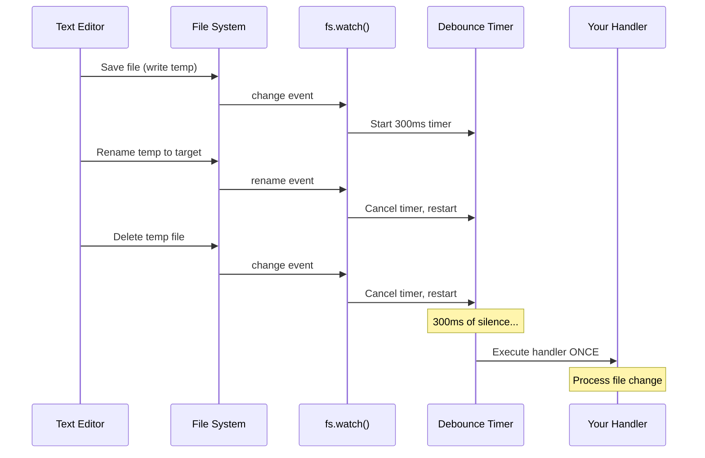

```js
// Platform differences: fs.watch is unreliable on some systems
// Use fs.watchFile as fallback or external library (chokidar)

const fs = require("fs");

// fs.watch: Inotify on Linux, FSEvents on macOS (faster)
fs.watch("file.txt", (eventType, filename) => {
    console.log(`Event: ${eventType} on ${filename}`);
});

// fs.watchFile: Polling (works everywhere, slower)
fs.watchFile("file.txt", (curr, prev) => {
    if (curr.mtime !== prev.mtime) {
        console.log("File modified");
    }
});

// Best practice: Use chokidar (cross-platform)
const chokidar = require("chokidar");
chokidar.watch("file.txt").on("change", () => console.log("Changed"));
```

### Concurrent File Writing Strategies

#### Strategy 1: Append-Only Files

```js
// Multiple processes can safely append (atomic at OS level)
const fs = require("fs");

// All writers append independently
function safeAppend(filename, data) {
    return fs.promises.appendFile(filename, data + "<br/>");
}

// Process 1
safeAppend("log.txt", "Message from process 1");

// Process 2
safeAppend("log.txt", "Message from process 2");

// Result: Both messages safely in file, no corruption
```

#### Strategy 2: File Locking with Lock File

```js
const fs = require("fs");
const path = require("path");

class FileLock {
    constructor(filepath, lockTimeout = 5000) {
        this.filepath = filepath;
        this.lockPath = filepath + ".lock";
        this.lockTimeout = lockTimeout;
    }

    async acquire() {
        const maxRetries = 50; // 5 seconds with 100ms backoff
        for (let i = 0; i < maxRetries; i++) {
            try {
                // Fail if lock file exists (O_EXCL = atomic)
                const fd = fs.openSync(this.lockPath, "wx");
                fs.closeSync(fd);
                return true;
            } catch (err) {
                if (err.code !== "EEXIST") throw err;

                // Check for stale lock (older than lockTimeout)
                const lockStat = await fs.promises
                    .stat(this.lockPath)
                    .catch(() => null);
                if (
                    lockStat &&
                    Date.now() - lockStat.mtimeMs > this.lockTimeout
                ) {
                    await fs.promises.unlink(this.lockPath);
                    continue;
                }

                // Backoff and retry
                await new Promise((resolve) => setTimeout(resolve, 100));
            }
        }
        throw new Error("Could not acquire lock");
    }

    async release() {
        try {
            await fs.promises.unlink(this.lockPath);
        } catch (err) {
            if (err.code !== "ENOENT") throw err;
        }
    }
}

// Usage
async function criticalWrite(data) {
    const lock = new FileLock("shared.txt");
    await lock.acquire();
    try {
        await fs.promises.appendFile("shared.txt", data + "<br/>");
    } finally {
        await lock.release();
    }
}
```

#### Strategy 3: Write-to-Temp-then-Rename (Atomic)

```js
const fs = require("fs");
const path = require("path");

async function atomicWrite(filepath, data) {
    const tempPath = filepath + ".tmp." + Date.now();

    try {
        // Write to temporary file
        await fs.promises.writeFile(tempPath, data, "utf8");

        // Atomic rename (POSIX guarantees atomicity)
        await fs.promises.rename(tempPath, filepath);
    } catch (err) {
        // Cleanup temp file on error
        await fs.promises.unlink(tempPath).catch(() => {});
        throw err;
    }
}

// Usage: Safe simultaneous writes (last one wins)
Promise.all([
    atomicWrite("config.json", JSON.stringify({ version: 1 })),
    atomicWrite("config.json", JSON.stringify({ version: 2 })),
    atomicWrite("config.json", JSON.stringify({ version: 3 })),
]);
```

### Directory Traversal with Streaming

```js
const fs = require("fs");
const path = require("path");

// Recursive directory walk (memory-efficient)
async function* walk(dir) {
    const entries = await fs.promises.readdir(dir, { withFileTypes: true });

    for (const entry of entries) {
        const fullPath = path.join(dir, entry.name);

        yield {
            path: fullPath,
            isDirectory: entry.isDirectory(),
            name: entry.name,
        };

        if (entry.isDirectory()) {
            yield* walk(fullPath); // Recursive generator
        }
    }
}

// Usage: Stream through all files (no memory buildup)
async function findLargeFiles(startDir, minSize) {
    for await (const file of walk(startDir)) {
        if (!file.isDirectory) {
            const stat = await fs.promises.stat(file.path);
            if (stat.size > minSize) {
                console.log(`${file.path}: ${stat.size} bytes`);
            }
        }
    }
}

findLargeFiles(".", 1024 * 1024); // Find all files > 1MB
```

### Senior-Level Q&A

**Q1: When would you use `fs.readFileSync` in a server? What are the consequences?**

A: **Never in production HTTP servers.** Blocks the entire event loop, freezing all other requests.

```js
// ❌ CATASTROPHIC: Blocks all requests
const express = require("express");
const app = express();

app.get("/config", (req, res) => {
    const config = fs.readFileSync("config.json"); // BLOCKS event loop for everyone!
    res.json(JSON.parse(config));
});

// Effects:
// - All pending HTTP requests hang
// - ~100ms block = 100ms lag for all concurrent users

// ✅ CORRECT: Use promise or callback
app.get("/config", async (req, res) => {
    const config = await fs.promises.readFile("config.json", "utf8");
    res.json(JSON.parse(config));
});
```

**Valid use cases for sync:**

- CLI tools (no concurrent requests)
- Single-run scripts
- Initialization (application startup, before server starts)

**Q2: Compare different ways to read a file. What's the memory footprint and when to use each?**

A:
| Method | Memory | Latency | Use Case |
|--------|--------|---------|----------|
| `readFileSync` | Entire file | Locks event loop | CLI, startup |
| `readFile` callback | Entire file | Non-blocking | Legacy code |
| `fs.promises.readFile` | Entire file | Non-blocking | Small files, JSON |
| `createReadStream` | ~64KB (highWaterMark) | Streaming | Large files, pipes |
| `for await` + stream | ~64KB | Streaming | Modern, readable |

```js
// Example: 100MB file
// readFile: Loads 100MB into memory
// createReadStream: Uses ~64KB, streams data in chunks

const fs = require("fs");

async function loadLargeFile() {
    // If file < 10MB: readFile is fine
    if (fileSize < 10 * 1024 * 1024) {
        return await fs.promises.readFile("file.json", "utf8");
    }

    // If file > 10MB: Use streams
    const chunks = [];
    for await (const chunk of fs.createReadStream("file.json")) {
        chunks.push(chunk);
    }
    return Buffer.concat(chunks).toString("utf8");
}
```

**Q3: You're building a file upload service. How would you handle a 5GB video file without running out of memory?**

A: **Use streams with backpressure:**

```js
const express = require("express");
const fs = require("fs");
const app = express();

app.post("/upload", (req, res) => {
    // req is a Readable stream (body)
    // res is a Writable stream

    const uploadPath = `./uploads/${Date.now()}.mp4`;
    const writeStream = fs.createWriteStream(uploadPath);

    // Pipe with error handling
    req.pipe(writeStream)
        .on("close", () => {
            res.json({ success: true, file: uploadPath });
        })
        .on("error", (err) => {
            fs.unlink(uploadPath, () => {}); // Clean up
            res.status(500).json({ error: err.message });
        });

    // Optional: limit file size
    let uploadedSize = 0;
    const MAX_SIZE = 5 * 1024 * 1024 * 1024; // 5GB

    req.on("data", (chunk) => {
        uploadedSize += chunk.length;
        if (uploadedSize > MAX_SIZE) {
            req.pause();
            writeStream.destroy();
            res.status(413).json({ error: "File too large" });
        }
    });
});
```

**Q4: fs.watch fires multiple events for a single file change. How do you debounce it?**

A: File watchers can fire multiple events (e.g., one change triggers 2-3 events). Debounce to avoid duplicate processing:

```js
const fs = require("fs");

function watchFileDebounced(filepath, callback, delay = 500) {
    let timeout;

    fs.watch(filepath, (eventType, filename) => {
        clearTimeout(timeout);
        timeout = setTimeout(() => {
            callback(eventType, filename);
        }, delay);
    });
}

watchFileDebounced("config.json", (eventType, filename) => {
    console.log(`File changed: ${filename}`);
    // Reload config once per 500ms
});
```

**Q5: You need to write to a shared file from multiple processes safely. What are your options?**

A: Three strategies:

1. **Append-only:** Each process appends independently (safest, no locking)
2. **File lock:** Exclusive lock before write (can deadlock, performance hit)
3. **Atomic rename:** Write to temp, then rename (no intermediate corruption)

```js
// Best: Atomic write + append-only log
async function logEvent(event) {
    // Safe even with 100 concurrent writers
    await fs.promises.appendFile("events.log", JSON.stringify(event) + "<br/>");
}

// For structured data (JSON): Atomic write
async function saveState(data) {
    const tempFile = "state.json.tmp";
    await fs.promises.writeFile(tempFile, JSON.stringify(data));
    await fs.promises.rename(tempFile, "state.json"); // Atomic
}
```

**Q6: How do you handle very large directory trees (100k+ files) efficiently?**

A: Use async generators and streaming to avoid loading entire tree into memory:

```js
// ❌ BAD: Loads entire tree (recursive promise array)
async function badWalk(dir) {
    const entries = await fs.promises.readdir(dir);
    let files = [];
    for (const entry of entries) {
        const fullPath = path.join(dir, entry);
        const stat = await fs.promises.stat(fullPath);
        if (stat.isDirectory()) {
            files = files.concat(await badWalk(fullPath)); // Recursively concat
        } else {
            files.push(fullPath);
        }
    }
    return files; // Returns array of 100k items
}

// ✅ GOOD: Uses async generators (memory-efficient)
async function* walk(dir) {
    const entries = await fs.promises.readdir(dir, { withFileTypes: true });
    for (const entry of entries) {
        const fullPath = path.join(dir, entry.name);
        yield fullPath;
        if (entry.isDirectory()) {
            yield* walk(fullPath);
        }
    }
}

// Usage: Process files one at a time
for await (const file of walk(".")) {
    console.log(file); // Processes as it discovers
}
```

**Q7: What's the performance difference between fs.watch and fs.watchFile?**

A:

| Method                | Mechanism              | Latency   | CPU  | Reliability        | Best For                 |
| --------------------- | ---------------------- | --------- | ---- | ------------------ | ------------------------ |
| `fs.watch`            | inotify/FSEvents       | ~1-10ms   | Low  | Platform-dependent | Development, Linux/macOS |
| `fs.watchFile`        | Polling (stat() calls) | ~5000ms+  | High | Works everywhere   | Fallback                 |
| `chokidar` (external) | Hybrid + fallback      | ~10-100ms | Low  | High               | Production               |

```js
// Benchmark: Watch file for changes
const fs = require("fs");
const { performance } = require("perf_hooks");

let watchCount = 0;
let pollCount = 0;

// fs.watch (fast)
fs.watch("test.txt", () => {
    watchCount++;
});

// fs.watchFile (slow, polls every 5s default)
fs.watchFile("test.txt", { interval: 1000 }, () => {
    pollCount++;
});

// Modify file 10 times
for (let i = 0; i < 10; i++) {
    fs.appendFileSync("test.txt", "data<br/>");
}

// Result:
// fs.watch: 10-20 callbacks (multiple per change)
// fs.watchFile: 1-2 callbacks (misses changes if too fast)
```

**Q8: How would you implement a safe config file reload pattern?**

A:

```js
const fs = require("fs");
const path = require("path");

class ConfigManager {
    constructor(configPath) {
        this.configPath = configPath;
        this.config = null;
        this.loading = false;
        this.watchers = [];
    }

    async load() {
        if (this.loading) return; // Prevent concurrent reloads
        this.loading = true;

        try {
            const raw = await fs.promises.readFile(this.configPath, "utf8");
            const newConfig = JSON.parse(raw);

            // Validate before replacing
            this.validate(newConfig);

            this.config = newConfig;
            this.emit("loaded", newConfig);
        } catch (err) {
            console.error("Config load failed:", err);
            this.emit("error", err);
        } finally {
            this.loading = false;
        }
    }

    watch() {
        let timeout;
        fs.watch(this.configPath, (eventType) => {
            clearTimeout(timeout);
            timeout = setTimeout(() => this.load(), 500); // Debounce
        });
    }

    validate(config) {
        // Check required fields, types, etc
        if (!config || typeof config !== "object") {
            throw new Error("Invalid config format");
        }
    }

    get() {
        if (!this.config) {
            throw new Error("Config not loaded");
        }
        return this.config;
    }

    subscribe(callback) {
        this.watchers.push(callback);
    }

    emit(event, data) {
        this.watchers.forEach((cb) => cb(event, data));
    }
}

// Usage
const config = new ConfigManager("config.json");
await config.load();
config.watch();

config.subscribe((event, data) => {
    if (event === "loaded") {
        console.log("Config reloaded:", data);
    }
});
```

### Best Practices

- **Use streaming for files > 10MB:** Avoid loading entire file into memory.
- **Always use `fs.promises` or callbacks** in async code; never sync in servers.
- **Handle watch errors:** fs.watch can be unreliable; use chokidar for production.
- **Test file operations cross-platform:** fs.watch behavior differs (Linux vs macOS vs Windows).
- **Use append-only for logs:** Safest for concurrent writes (atomic at OS level).
- **Atomic writes for structured data:** Write to temp, then rename to guarantee atomicity.
- **Debounce watchers:** Prevent duplicate processing from multiple file change events.
- **Check permissions before operations:** Use `fs.access()` for fail-fast design.

### Common Pitfalls

- **Using `readFileSync` in servers:** Blocks all requests.
- **Forgetting to handle stream errors:** Silent failures, left-over file handles.
- **Assuming fs.watch is reliable:** May miss events or fire duplicates; use chokidar in production.
- **Not handling concurrent writes:** Multiple processes can corrupt shared files (use locking/appending strategies).
- **Loading entire files into memory:** Causes OOM for large files (use streams instead).
- **Race conditions with file operations:** TOCTOU (time-of-check, time-of-use) between stat() and subsequent operations.
- **Ignoring stale locks:** Fill disk with abandoned lock files; implement timeout-based cleanup.

### References: [fs/basics.js](fs/basics.js)

---

## HTTP Server & NodeServer

### Concepts

Node.js was **designed for building network servers**. The built-in `http` module gives you the raw primitives to handle HTTP requests and responses without any framework.

**How a Node HTTP server works:** When you call `http.createServer(handler)`, Node creates a TCP server that:

1. Listens for incoming TCP connections on a port
2. Parses the raw bytes into an HTTP request (method, path, headers, body)
3. Calls your handler function with two objects: `req` (the incoming request as a Readable stream) and `res` (the outgoing response as a Writable stream)
4. Your handler reads the request, does work, and writes the response

**Why `req` and `res` are streams:** The request body might be huge (a file upload), and the response might be huge (a file download). By making them streams, Node never needs to buffer the entire payload in memory. You can stream a 10GB file to the client using only ~64KB of RAM.

**The connection lifecycle:** Each HTTP request goes through: TCP handshake → HTTP parsing → your handler → response sent → keep-alive or close. With `keep-alive` (default in HTTP/1.1), the TCP connection stays open for multiple requests, saving the overhead of repeated handshakes.

**Frameworks vs raw `http`:** Express, Fastify, Koa, and Hapi all build on top of `http.createServer()`. They add routing, middleware, request parsing, and error handling. For interviews, you should know the raw `http` module to understand what frameworks abstract away.

### Examples

#### Basic Streaming Response

```js
const http = require("http");
const fs = require("fs");

http.createServer((req, res) => {
    if (req.url === "/large-file") {
        // Stream file without loading into memory
        const stream = fs.createReadStream("large.txt");
        stream.pipe(res);

        stream.on("error", (err) => {
            res.writeHead(500);
            res.end("Stream error");
        });
    } else {
        res.writeHead(200);
        res.end("OK");
    }
}).listen(3000);
```

#### Request Body Streaming (File Upload)

```js
const http = require("http");
const fs = require("fs");

http.createServer((req, res) => {
    if (req.method === "POST" && req.url === "/upload") {
        const writeStream = fs.createWriteStream("uploaded.dat");

        req.pipe(writeStream)
            .on("close", () => {
                res.writeHead(200);
                res.end("Upload complete");
            })
            .on("error", (err) => {
                res.writeHead(500);
                res.end("Upload failed");
            });
    }
}).listen(3000);
```

### Senior-Level Q&A

**Q1: You're building a file download endpoint for large files (500MB+). Compare three approaches.**

A:

**Approach 1: Buffer entire file (❌ BAD)**

```js
// Loads 500MB into memory — will crash on 10 concurrent downloads!
http.createServer((req, res) => {
    const data = fs.readFileSync("large-file.bin");
    res.end(data);
}).listen(3000);
```

**Approach 2: Async read (❌ STILL BAD)**

```js
// Slightly better, but still loads entire file
fs.readFile("large-file.bin", (err, data) => {
    res.end(data);
});
```

**Approach 3: Stream (✅ GOOD)**

```js
// Uses ~64KB memory regardless of file size
http.createServer((req, res) => {
    res.setHeader("Content-Type", "application/octet-stream");
    res.setHeader(
        "Content-Disposition",
        'attachment; filename="large-file.bin"',
    );

    fs.createReadStream("large-file.bin").pipe(res);
}).listen(3000);
```

**Memory comparison:**

- Buffer: 500MB (constant)
- Stream: ~64KB (constant, regardless of file size)

**Q2: How do you implement range requests (HTTP 206) for video streaming?**

A: Range requests allow clients to resume downloads and seek in videos:

```js
const http = require("http");
const fs = require("fs");

http.createServer((req, res) => {
    if (req.url === "/video.mp4") {
        const stat = fs.statSync("video.mp4");
        const fileSize = stat.size;
        const range = req.headers.range;

        if (range) {
            // Parse Range header: "bytes=0-1023"
            const parts = range.replace(/bytes=/, "").split("-");
            const start = parseInt(parts[0], 10);
            const end = parts[1] ? parseInt(parts[1], 10) : fileSize - 1;

            if (start >= fileSize || end >= fileSize) {
                res.writeHead(416);
                res.end("Requested range out of bounds");
                return;
            }

            // Send 206 Partial Content
            res.writeHead(206, {
                "Content-Range": `bytes ${start}-${end}/${fileSize}`,
                "Content-Length": end - start + 1,
                "Content-Type": "video/mp4",
            });

            fs.createReadStream("video.mp4", { start, end }).pipe(res);
        } else {
            // Send full file
            res.writeHead(200, {
                "Content-Length": fileSize,
                "Content-Type": "video/mp4",
            });
            fs.createReadStream("video.mp4").pipe(res);
        }
    }
}).listen(3000);
```

**Q3: How does backpressure work with HTTP responses? Why does it matter?**

A: If client is slow, response stream buffers in memory. Without backpressure handling, memory grows:

```js
// ❌ Ignores backpressure (memory leak!)
http.createServer((req, res) => {
    const data = Buffer.alloc(1024 * 1024); // 1MB chunk
    for (let i = 0; i < 10000; i++) {
        res.write(data); // Never checks return value
    }
    res.end();
}).listen(3000);

// ✅ Respects backpressure
http.createServer((req, res) => {
    const data = Buffer.alloc(1024 * 1024);
    let i = 0;

    function write() {
        let canContinue = true;
        while (i < 10000 && canContinue) {
            canContinue = res.write(data);
            if (!canContinue) break;
            i++;
        }

        if (i < 10000 && !canContinue) {
            res.once("drain", write); // Resume when client ready
        }
    }

    write();
}).listen(3000);

// ✅ SIMPLE: Use pipe() (handles backpressure automatically)
// See streaming examples above
```

**Q4: How would you implement a health check endpoint that's fast and non-blocking?**

A:

```js
const http = require("http");

// Simple in-memory health state
let isHealthy = true;
let startTime = Date.now();

http.createServer((req, res) => {
    // Health check (fast, non-blocking)
    if (req.url === "/health") {
        const uptime = Date.now() - startTime;

        if (isHealthy) {
            res.writeHead(200, { "Content-Type": "application/json" });
            res.end(JSON.stringify({ status: "ok", uptime }));
        } else {
            res.writeHead(503);
            res.end(JSON.stringify({ status: "unhealthy" }));
        }
        return;
    }

    // Regular request handling
    res.writeHead(200);
    res.end("OK");
}).listen(3000);

// Set health status based on app state
app.on("error", () => {
    isHealthy = false;
    setTimeout(() => {
        isHealthy = true; // Recover after timeout
    }, 5000);
});
```

### Best Practices

- **Always stream large responses:** Avoid buffering entire payloads.
- **Handle stream errors:** Both `req` and `res` can error.
- **Set appropriate headers:** `Content-Type`, `Content-Length`, `Content-Range`.
- **Implement timeouts:** Slow clients shouldn't block forever.
- **Use compression:** `gzip` reduces bandwidth for text responses.

### Common Pitfalls

- **Buffering large responses:** Causes memory to grow with file size.
- **Not handling slow clients:** Memory leak if slow client doesn't consume.
- **Ignoring error events:** Unhandled stream errors leave sockets open.
- **Mixing callback and stream APIs:** Hard to manage error propagation.

### References: [NodeServer/server.js](NodeServer/server.js), [NodeServer/http_server.js](NodeServer/http_server.js), [NodeServer/\_\_streams.js](NodeServer/__streams.js)

---

## Child Processes (exec / spawn / fork)

### Concepts

Node.js runs your code on a single thread, which is great for I/O but terrible for CPU-heavy work. If you compute a Fibonacci number for 30 seconds, **every user on your server waits** 30 seconds. Child processes are the escape hatch.

**What is a child process?** It's a completely separate OS process — with its own memory, its own V8 engine (if it's Node), and its own event loop. The parent and child communicate by sending messages through a pipe (IPC channel). Think of it as hiring an assistant: you give them a task, they work on it in their own workspace, and bring back the result.

**The three APIs:**

1. **`exec(command)`** — Runs a **shell command** (like typing in a terminal). Buffers the entire output in memory, then gives it to you. Great for quick commands like `git status` or `ls`. **Security warning:** because it runs through a shell (`/bin/sh` or `cmd.exe`), user input can be injected as shell commands.

2. **`spawn(command, args)`** — Like `exec` but **streams** output instead of buffering. Use for long-running processes or large output. NO shell involved, so it's safer. Arguments are passed as an array, not a string.

3. **`fork(scriptPath)`** — Spawns a **new Node.js process** with a built-in IPC (Inter-Process Communication) channel. Parent and child can send messages with `process.send()` and `.on('message')`. This is how you run CPU-heavy JavaScript in the background without blocking your server.

**Important:** Each child process is a full OS process with its own memory (~30MB minimum for Node). Don't fork hundreds of processes — use a pool of 4-8 workers and queue tasks.

### Key APIs

- **`exec(command, cb)`** — Run shell command, buffer entire stdout/stderr.
- **`spawn(cmd, args, opts)`** — Stream-based child process (no buffering).
- **`fork(modulePath, args, opts)`** — Spawn Node process with IPC channel.
- **Message passing:** `process.send()` (child), `child.send()` (parent), `.on('message', ...)`

### Comparison Table

| API        | Buffer              | Streams | Shell | IPC | Use Case                             |
| ---------- | ------------------- | ------- | ----- | --- | ------------------------------------ |
| `exec`     | Yes (entire output) | No      | Yes   | No  | Short commands, need full output     |
| `execFile` | Yes                 | No      | No    | No  | Safer than exec (no shell injection) |
| `spawn`    | No                  | Yes     | No    | No  | Long-running, high output            |
| `fork`     | No                  | No      | N/A   | Yes | Node worker processes                |

### exec vs spawn Examples

```js
const { exec, spawn } = require("child_process");

// ❌ exec: Buffers entire output (bad for large outputs)
exec("ls -la /large-directory", (err, stdout, stderr) => {
    // Entire output in memory!
    console.log(stdout);
});

// ✅ spawn: Streams output (good for large outputs)
const ls = spawn("ls", ["-la", "/large-directory"]);
ls.stdout.on("data", (chunk) => {
    console.log("Output chunk:", chunk.toString());
});
ls.stderr.on("data", (chunk) => {
    console.error("Error chunk:", chunk.toString());
});
ls.on("close", (code) => {
    console.log("Exited with code", code);
});

// Handle output limits
let outputSize = 0;
ls.stdout.on("data", (chunk) => {
    outputSize += chunk.length;
    if (outputSize > 100 * 1024 * 1024) {
        // 100MB limit
        ls.kill(); // Terminate if too much output
    }
});
```

### IPC Patterns (fork)

```js
// parent.js
const { fork } = require("child_process");
const worker = fork("worker.js");

// Send message to child
worker.send({ type: "compute", n: 1e8 });

// Receive message from child
worker.on("message", (result) => {
    console.log("Result from worker:", result);
});

// Handle worker exit
worker.on("close", (code) => {
    console.log("Worker exited with code", code);
});

// -----

// worker.js
process.on("message", (msg) => {
    if (msg.type === "compute") {
        let sum = 0;
        for (let i = 0; i < msg.n; i++) sum += i;
        process.send({ result: sum });
    }
});
```

### Senior-Level Q&A

**Q1: When would you use `exec` vs `spawn` vs `fork`? Give specific examples.**

A:

**`exec`:** Short commands, small output

```js
const { exec } = require("child_process");

// Example: Check if service is running
exec("systemctl is-active nginx", (err, stdout) => {
    if (stdout.includes("active")) {
        console.log("Nginx is running");
    }
});
```

**`spawn`:** Long-running, high output, streaming

```js
const { spawn } = require("child_process");

// Example: Process log file (large)
const tail = spawn("tail", ["-f", "/var/log/app.log"]);
tail.stdout.on("data", (chunk) => {
    // Stream log lines
    console.log(chunk.toString());
});
```

**`fork`:** CPU-bound work, need communication

```js
const { fork } = require("child_process");

// Example: Batch processing
const worker = fork("image-processor.js");
worker.send({ images: [...], operation: "resize" });
worker.on("message", (processed) => {
    console.log("Processed batch:", processed.count);
});
```

**Q2: Your app uses `exec` to run a system command. What's the security risk?**

A: **Shell injection.** User input in `exec` command can execute arbitrary code:

```js
// ❌ VULNERABLE: User input in command
const { exec } = require("child_process");
const userId = req.query.id; // User-controlled

exec(`cat /tmp/user_${userId}.txt`, (err, stdout) => {
    console.log(stdout);
});

// Attack: Malicious input
// /tmp/user_; rm -rf / .txt
// Full command: cat /tmp/user_; rm -rf / .txt (DISASTER!)

// ✅ SAFE: Use execFile (no shell)
const { execFile } = require("child_process");
execFile("cat", [`/tmp/user_${userId}.txt`], (err, stdout) => {
    // Arguments passed as array, no shell interpretation
    console.log(stdout);
});

// ✅ ALSO SAFE: Input validation + escaping
const shell = require("shellwords");
const escaped = shell.escape(userId);
exec(`cat /tmp/user_${escaped}.txt`, ...);
```

**Q3: You spawn a child process for a long task. How do you handle cleanup if the parent crashes?**

A: Orphaned child processes continue running. Proper cleanup:

```js
const { spawn } = require("child_process");

class ChildProcessManager {
    constructor() {
        this.children = new Set();
    }

    spawn(cmd, args) {
        const child = spawn(cmd, args);
        this.children.add(child);

        child.on("close", () => {
            this.children.delete(child);
        });

        // If parent exits, kill all children
        process.on("exit", () => this.killAll());
        process.on("SIGTERM", () => this.killAll());
        process.on("SIGINT", () => this.killAll());

        return child;
    }

    killAll() {
        this.children.forEach((child) => {
            if (!child.killed) {
                child.kill("SIGTERM");
                // Force kill after timeout
                setTimeout(() => {
                    if (!child.killed) child.kill("SIGKILL");
                }, 5000);
            }
        });
    }
}
```

**Q4: How do you handle errors and timeouts in child processes?**

A:

```js
const { spawn } = require("child_process");

function spawnWithTimeout(cmd, args, timeoutMs = 30000) {
    const child = spawn(cmd, args);
    let timedOut = false;

    const timeout = setTimeout(() => {
        timedOut = true;
        child.kill("SIGTERM");
    }, timeoutMs);

    return new Promise((resolve, reject) => {
        let stdout = "";
        let stderr = "";

        child.stdout.on("data", (chunk) => {
            stdout += chunk;
        });

        child.stderr.on("data", (chunk) => {
            stderr += chunk;
        });

        child.on("close", (code) => {
            clearTimeout(timeout);

            if (timedOut) {
                reject(new Error(`Process timed out after ${timeoutMs}ms`));
            } else if (code !== 0) {
                reject(
                    new Error(`Process exited with code ${code}: ${stderr}`),
                );
            } else {
                resolve(stdout);
            }
        });

        child.on("error", (err) => {
            clearTimeout(timeout);
            reject(new Error(`Failed to spawn process: ${err.message}`));
        });
    });
}

// Usage
spawnWithTimeout("node", ["compute.js"], 10000)
    .then((result) => console.log(result))
    .catch((err) => console.error("Failed:", err));
```

**Q5: Design an IPC-based task queue (parent distributes work to workers).**

A:

```js
// task-queue.js
const { fork } = require("child_process");
const os = require("os");

class TaskQueue {
    constructor(workerScript, numWorkers = os.cpus().length) {
        this.workers = [];
        this.taskQueue = [];
        this.activeWorkers = new Map();

        for (let i = 0; i < numWorkers; i++) {
            const worker = fork(workerScript);
            worker.on("message", (result) => {
                this.handleWorkerResult(result);
            });
            this.workers.push(worker);
        }
    }

    enqueue(task, id) {
        this.taskQueue.push({ task, id });
        this.distributeWork();
    }

    distributeWork() {
        while (this.taskQueue.length > 0) {
            const availableWorker = this.workers.find(
                (w) => !this.activeWorkers.has(w.pid),
            );

            if (!availableWorker) break; // All workers busy

            const { task, id } = this.taskQueue.shift();
            this.activeWorkers.set(availableWorker.pid, id);
            availableWorker.send({ id, task });
        }
    }

    handleWorkerResult(result) {
        const { id, output, error } = result;
        this.activeWorkers.delete(result.workerPid);
        // Handle result...
        this.distributeWork(); // Process next queued task
    }

    shutdown() {
        this.workers.forEach((w) => w.kill());
    }
}

module.exports = TaskQueue;
```

### Best Practices

- **Use `spawn` for long-running processes;** `exec` for short commands.
- **Use `execFile` instead of `exec`** to avoid shell injection.
- **Always handle child process errors** and exits.
- **Implement timeouts** for long-running tasks.
- **Clean up children on parent exit:** `process.on('exit', killChildren)`.
- **Monitor child process resource usage:** CPU, memory; restart if exceeded.

### Common Pitfalls

- **Shell injection with `exec`:** Always use `execFile` or escape input.
- **Memory leaks from buffered output:** Use `spawn` with streams for large output.
- **Orphaned child processes:** Always kill on parent exit.
- **Not handling timeouts:** Endless waiting for slow children.
- **Ignoring stdio:** Uncaught child errors (not logged) make debugging hard.

### References: [EventEmitters/\_exec.js](EventEmitters/_exec.js), [EventEmitters/\_spawn.js](EventEmitters/_spawn.js), [ClusterAndFork/index.js](ClusterAndFork/index.js), [ClusterAndFork/child.js](ClusterAndFork/child.js)

---

## Worker Threads & Atomics

### Concepts

Worker threads give Node.js **true multithreading** — multiple JavaScript execution contexts running in parallel on separate CPU cores. This is fundamentally different from child processes.

**The problem worker threads solve:** Node's main thread is great for I/O, but terrible for CPU-heavy work. If you need to hash passwords, resize images, parse large JSON, or compute analytics, blocking the main thread means **zero requests are served** until the computation finishes. Worker threads let you run this heavy work on a separate thread.

**How are they different from child processes?** A child process (`fork`) creates an entirely new Node.js process with its own memory space (~100-200MB). Worker threads run inside the **same process** but with their own V8 isolate (JavaScript engine instance), their own event loop, and their own stack. Memory overhead is much lower (~30-50MB per thread) and you can **share memory** between threads using `SharedArrayBuffer`.

**V8 Isolate:** Each worker thread gets its own V8 isolate — a completely independent JavaScript execution environment. Variables, functions, and closures in one thread are invisible to another thread. Communication happens through **message passing** (`postMessage`) or **shared memory** (`SharedArrayBuffer`).

**Shared memory and Atomics:** `SharedArrayBuffer` lets multiple threads access the same block of raw memory. But this introduces **race conditions** — two threads reading and writing the same memory location simultaneously can corrupt data. `Atomics` provides thread-safe operations: `Atomics.add()` for atomic increment, `Atomics.compareExchange()` for compare-and-swap, and `Atomics.wait()`/`Atomics.notify()` for thread signaling.

**When NOT to use worker threads:** If your work is I/O-bound (database queries, HTTP calls, file reads), worker threads won't help because Node already handles I/O asynchronously. Worker threads shine only for **CPU-bound** work.

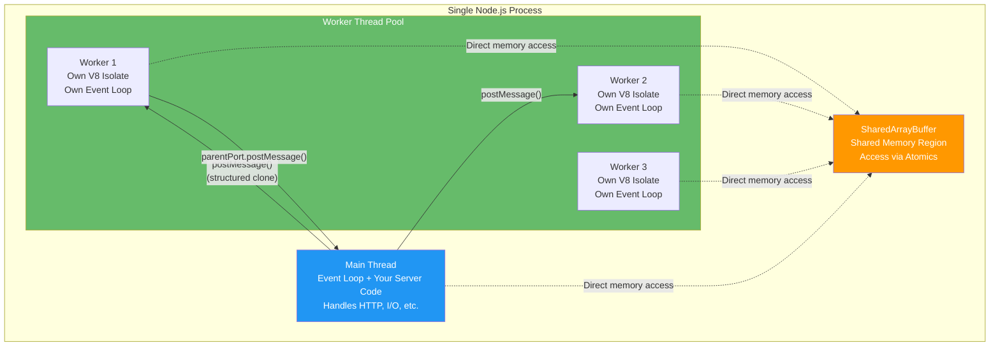

### Key APIs

- `new Worker(path, { workerData })` — create worker thread.
- `parentPort.postMessage(data)` — send message from worker.
- `parentPort.on('message', cb)` — receive message in worker.
- `worker.on('message', cb)` — receive message in parent.
- `Atomics.wait(typedArray, index)` — block thread until notify.
- `Atomics.notify(typedArray, index)` — wake waiting threads.

### Worker Basics

```js
// main.js
const { Worker } = require("worker_threads");

const worker = new Worker("./worker.js", {
    workerData: { n: 1e8 }, // Pass initial data
});

worker.on("message", (result) => {
    console.log("Worker result:", result);
});

worker.on("error", (err) => {
    console.error("Worker error:", err);
});

worker.on("exit", (code) => {
    console.log("Worker exited with code", code);
});

// -----

// worker.js
const { parentPort, workerData } = require("worker_threads");

let sum = 0;
for (let i = 0; i < workerData.n; i++) {
    sum += i;
}

parentPort.postMessage({ sum });
```

### Shared Memory & Atomics

```js
// main.js: Shared buffer communication
const { Worker } = require("worker_threads");

const sharedBuffer = new SharedArrayBuffer(4); // 4 bytes
const sharedArray = new Int32Array(sharedBuffer);
sharedArray[0] = 0; // Initial value

const worker = new Worker("./worker.js", {
    workerData: { sharedBuffer },
});

// Wait for worker to signal (blocking)
console.log("Waiting for worker...");
Atomics.wait(sharedArray, 0, 0); // Block until value changes from 0
console.log("Worker signaled! Value:", sharedArray[0]);

// -----

// worker.js: Modify shared buffer and signal
const { workerData } = require("worker_threads");
const sharedArray = new Int32Array(workerData.sharedBuffer);

// Do computation
const result = 42;

// Store result and signal parent
sharedArray[0] = result;
Atomics.notify(sharedArray, 0); // Wake parent thread
```

### Senior-Level Q&A

**Q1: When should you use worker_threads vs cluster? Performance comparison?**

A:

| Aspect          | Worker Threads       | Cluster                   |
| --------------- | -------------------- | ------------------------- |
| Processes       | 1 (shared libuv)     | Multiple (each has libuv) |
| Memory overhead | ~30-50MB per thread  | ~100-200MB per process    |
| IPC cost        | Shared memory (fast) | OS pipes (slower)         |
| Shared state    | SharedArrayBuffer    | External store (Redis)    |
| Best for        | CPU-bound            | HTTP servers, I/O-bound   |
| GC pause impact | Affects all threads  | Isolated per process      |

```js
// CPU-bound: Worker threads win
const { Worker } = require("worker_threads");
const os = require("os");

function computeHeavy(data) {
    return new Promise((resolve) => {
        const worker = new Worker("./compute.js", {
            workerData: { data },
        });
        worker.on("message", resolve);
    });
}

// Parallel heavy compute (faster with threads)
const results = await Promise.all([
    computeHeavy(data1),
    computeHeavy(data2),
    computeHeavy(data3),
]);

// I/O-bound: Cluster wins (built-in load balancing for HTTP)
const cluster = require("cluster");
const http = require("http");

if (cluster.isMaster) {
    for (let i = 0; i < os.cpus().length; i++) {
        cluster.fork();
    }
} else {
    http.createServer((req, res) => {
        res.end("OK");
    }).listen(3000);
}
```

**Q2: Explain race conditions with shared memory. Give an example and solution.**

A: **Race condition:** Multiple threads modify shared state simultaneously, causing data corruption.

```js
// ❌ RACE CONDITION: Many threads increment shared counter
// Expected: 10,000,000 (10 threads × 1,000,000 each)
// Actual: ~5,000,000 (random, due to race condition)

// main.js
const { Worker } = require("worker_threads");

const shared = new SharedArrayBuffer(4);
const sharedInt = new Int32Array(shared);
sharedInt[0] = 0;

// Create 10 workers, each increments 1,000,000 times
const workers = [];
for (let i = 0; i < 10; i++) {
    const w = new Worker("./worker.js", { workerData: { shared } });
    workers.push(w);
}

Promise.all(workers.map((w) => new Promise((r) => w.on("exit", r)))).then(
    () => {
        console.log("Final count:", sharedInt[0]);
        console.log("Expected: 10,000,000");
    },
);

// -----

// worker.js (❌ UNSAFE)
const { workerData } = require("worker_threads");
const sharedInt = new Int32Array(workerData.shared);

for (let i = 0; i < 1000000; i++) {
    sharedInt[0]++; // RACE CONDITION: Read-modify-write is not atomic!
}
```

**Fix: Use Atomics for atomic operations**

```js
// worker.js (✅ SAFE with Atomics)
const { workerData } = require("worker_threads");
const sharedInt = new Int32Array(workerData.shared);

for (let i = 0; i < 1000000; i++) {
    Atomics.add(sharedInt, 0, 1); // Atomic increment
}
```

**Result:**

- Without Atomics: ~5,000,000 (WRONG)
- With Atomics: 10,000,000 (CORRECT)

**Q3: Design a task pool that distributes CPU-bound work across worker threads.**

A:

```js
class WorkerPool {
    constructor(workerScript, poolSize = 4) {
        this.workers = [];
        this.taskQueue = [];
        this.activeWorkers = new Map();

        for (let i = 0; i < poolSize; i++) {
            const worker = new Worker(workerScript);
            worker.on("message", (result) => {
                this.handleWorkerResult(worker, result);
            });
            this.workers.push(worker);
        }
    }

    execute(task) {
        return new Promise((resolve, reject) => {
            const taskId = Math.random();

            const availableWorker = this.workers.find(
                (w) => !this.activeWorkers.has(w),
            );

            if (availableWorker) {
                this.assignTask(availableWorker, task, taskId, resolve, reject);
            } else {
                // Queue task if all workers busy
                this.taskQueue.push({ task, taskId, resolve, reject });
            }
        });
    }

    assignTask(worker, task, taskId, resolve, reject) {
        this.activeWorkers.set(worker, { taskId, resolve, reject });
        worker.send({ task, taskId });
    }

    handleWorkerResult(worker, { taskId, error, result }) {
        const pending = this.activeWorkers.get(worker);
        this.activeWorkers.delete(worker);

        if (error) {
            pending.reject(new Error(error));
        } else {
            pending.resolve(result);
        }

        // Process next queued task
        if (this.taskQueue.length > 0) {
            const { task, taskId, resolve, reject } = this.taskQueue.shift();
            this.assignTask(worker, task, taskId, resolve, reject);
        }
    }

    terminate() {
        this.workers.forEach((w) => w.terminate());
    }
}

// Usage
const pool = new WorkerPool("./cpu-worker.js", 4);

const results = await Promise.all([
    pool.execute({ n: 1e8 }),
    pool.execute({ n: 1e8 }),
    pool.execute({ n: 1e8 }),
]);

pool.terminate();
```

**Q4: When would you use `Atomics.wait()` and `Atomics.notify()`? What are the pitfalls?**

A: **Use case:** Thread synchronization and signaling (low-latency inter-thread coordination).

```js
// Example: Producer-consumer with shared buffer
// main.js (producer)
const sharedBuffer = new SharedArrayBuffer(4);
const sharedArray = new Int32Array(sharedBuffer);

const worker = new Worker("./consumer.js", { workerData: { sharedBuffer } });

// Produce data
for (let i = 0; i < 10; i++) {
    setTimeout(() => {
        sharedArray[0] = i;
        Atomics.notify(sharedArray, 0); // Wake consumer
    }, 100 * i);
}

// -----

// consumer.js (consumer)
const { workerData } = require("worker_threads");
const sharedArray = new Int32Array(workerData.sharedBuffer);

for (let i = 0; i < 10; i++) {
    Atomics.wait(sharedArray, 0, i - 1); // Block until value changes
    console.log("Received:", sharedArray[0]);
}
```

**Pitfalls:**

- **Only works with Int32Array/BigInt64Array:** Other types throw.
- **Blocks the entire worker thread:** No event loop processing while waiting.
- **Complex to reason about:** Easy to deadlock or miss signals.
- **Performance overhead:** Spinning/polling in `Atomics.wait` is expensive.

**Best practice:** Use `Atomics.wait` only for ultra-low-latency coordination (< 1ms); prefer message passing for most cases.

### Best Practices

- **Use workers for pure CPU-bound tasks:** Heavy computation, bulk data processing.
- **Avoid workers for I/O-bound work:** Cluster or async better for HTTP/network.
- **Prefer message passing over shared memory:** Safer, simpler reasoning about correctness.
- **Use `Atomics` only for fine-grained synchronization:** The complexity cost is high.
- **Pool workers to avoid creation overhead:** Creating workers is expensive (~30MB each).

### Common Pitfalls

- **Serializing large data between threads:** Expensive; consider shared buffers for huge arrays.
- **Race conditions with Atomics:** Must use atomic operations (add, compareExchange, etc.).
- **Blocking on `Atomics.wait`:** Prevents event loop; entire worker freezes.
- **Resource leaks:** Forgetting to `terminate()` workers leaves threads running.

### References: [workerthreads/server.js](workerthreads/server.js), [workerthreads/worker.js](workerthreads/worker.js), [\_atomics/atomics.js](_atomics/atomics.js), [\_atomics/parent.js](_atomics/parent.js)

---

## Cluster & Fork

### Concepts

The cluster module lets you run **multiple copies of your Node.js server** on the same machine, each on its own CPU core. It's the easiest way to utilize a multi-core machine for handling more HTTP requests.

**Why clustering matters:** A single Node.js process uses only **one CPU core**. On an 8-core server, you're using only 12.5% of the CPU. Clustering runs 8 instances of your server, each handling requests independently, multiplying your throughput by up to 8x.

**How it works at the OS level:** The master process creates a TCP server socket and listens on a port. When it forks worker processes, the workers **inherit** the same socket. The OS kernel distributes incoming connections across workers using **round-robin** scheduling (on Linux/macOS). No reverse proxy needed — the OS handles load balancing.

**Master vs Worker roles:**

- **Master:** Never handles requests. Only manages workers: forking, monitoring health, restarting crashed workers, coordinating graceful shutdown. Think of it as a factory supervisor.
- **Workers:** Handle requests. Each worker is a full Node.js process with its own V8 engine, event loop, and memory. Workers don't share state — they're like separate servers that happen to listen on the same port.

**The stateless requirement:** Because workers don't share memory, you can't store sessions or caches in JavaScript variables (each worker has its own). Use **external stores** (Redis, database) for shared state. This is actually a benefit — it forces a stateless architecture that scales horizontally.

**Cluster vs PM2:** PM2 essentially wraps the cluster module with extras: zero-downtime deployment, log management, process monitoring, and auto-restart. For production, PM2 is the practical choice. For interviews, know how cluster works internally.

### Key APIs

- `cluster.fork()` — create worker process.
- `cluster.on('online', 'exit', 'message')` — master-side events.
- `cluster.isMaster` / `cluster.isWorker` — process type check.
- `process.send()` / `process.on('message')` — IPC between master and worker.

### Basic Cluster Example

```js
const cluster = require("cluster");
const http = require("http");
const os = require("os");

if (cluster.isMaster) {
    // Master process
    const numWorkers = os.cpus().length;

    for (let i = 0; i < numWorkers; i++) {
        cluster.fork();
    }

    cluster.on("exit", (worker, code, signal) => {
        console.log(`Worker ${worker.process.pid} died`);
        cluster.fork(); // Restart on crash
    });
} else {
    // Worker process
    http.createServer((req, res) => {
        res.writeHead(200);
        res.end(`Hello from worker ${process.pid}`);
    }).listen(3000);
}
```

### Senior-Level Q&A

**Q1: Compare cluster vs worker_threads vs child_process.fork. When to use each?**

A:

| Aspect           | Cluster                     | Worker Threads    | Fork (child_process) |
| ---------------- | --------------------------- | ----------------- | -------------------- |
| Process/Thread   | Process                     | Thread            | Process              |
| Memory per       | ~100-200MB                  | ~30-50MB          | ~100-200MB           |
| Use case         | HTTP servers                | CPU-bound work    | External commands    |
| Shared state     | External store              | SharedArrayBuffer | IPC messages         |
| Load balancing   | Built-in (round-robin)      | Manual (pool)     | Manual               |
| Restart on crash | Easy (`cluster.on('exit')`) | Manual            | Manual               |

```js
// Cluster: Best for HTTP servers (built-in load balancing)
const cluster = require("cluster");
const http = require("http");

if (cluster.isMaster) {
    const cpuCount = require("os").cpus().length;
    for (let i = 0; i < cpuCount; i++) cluster.fork();
} else {
    http.createServer((req, res) => {
        // Automatically load-balanced by OS
        res.end("OK");
    }).listen(3000);
}

// Worker threads: Best for CPU-bound (shared memory, lower overhead)
const { Worker } = require("worker_threads");
const pool = new WorkerPool("compute.js", 4);
const results = await Promise.all([pool.execute(task1), pool.execute(task2)]);

// Fork: Best for external tools or one-off heavy tasks
const { fork } = require("child_process");
const worker = fork("heavy-script.js");
worker.send({ data: largeFile });
worker.on("message", (result) => console.log(result));
```

**Q2: How does cluster load balancing work? Is it truly fair?**

A: **Cluster uses OS-level round-robin** (on most systems). The master accepts connections and distributes to idle workers.

```js
// Simplified cluster behavior:
// Master: accept() → distribute to worker[i]
// Workers: listen on inherited socket, accept connections

// Fair distribution? Generally yes, BUT:
// - Slow workers might lag (no automatic rebalancing)
// - Sticky sessions need special handling
// - Hash-based routing more fair for long connections

// Example: Sticky load balancing (session affinity)
const net = require("net");
const { v4: uuid } = require("uuid");
const cluster = require("cluster");

if (cluster.isMaster) {
    // Hash-based routing for sticky sessions
    const workers = [];
    for (let i = 0; i < 4; i++) {
        workers.push(cluster.fork());
    }

    const server = net.createServer((socket) => {
        // Hash client IP to consistent worker
        const clientIp = socket.remoteAddress;
        const hash = clientIp.split(".").reduce((a, b) => a + parseInt(b), 0);
        const workerIndex = hash % workers.length;

        // Send socket handle to selected worker
        workers[workerIndex].send("sticky-session:connection", socket);
    });

    server.listen(3000);
} else {
    // Worker handles sticky connections
    process.on("message", (msg) => {
        // Handle connection...
    });
}
```

**Q3: Explain graceful shutdown in cluster mode. How do you avoid dropping requests?**

A: Graceful shutdown: finish in-flight requests, reject new connections, then exit.

```js
const cluster = require("cluster");
const http = require("http");

if (cluster.isMaster) {
    const workers = [];

    for (let i = 0; i < 4; i++) {
        workers.push(cluster.fork());
    }

    // Gracefully shutdown on SIGTERM
    process.on("SIGTERM", () => {
        console.log("Master received SIGTERM, shutting down gracefully");

        // Tell workers to stop accepting new connections
        workers.forEach((w) => w.send({ cmd: "shutdown" }));

        // Give workers 30 seconds to finish in-flight requests
        const timeout = setTimeout(() => {
            workers.forEach((w) => w.kill());
            process.exit(1);
        }, 30000);

        cluster.on("exit", () => {
            if (workers.length === 0) {
                clearTimeout(timeout);
                process.exit(0);
            }
        });
    });
} else {
    // Worker process
    const server = http.createServer((req, res) => {
        res.end("Hello");
    });

    let isShuttingDown = false;

    process.on("message", (msg) => {
        if (msg.cmd === "shutdown") {
            isShuttingDown = true;
            server.close(() => {
                process.exit(0);
            });

            // Force exit after timeout
            setTimeout(() => {
                process.exit(1);
            }, 30000);
        }
    });

    // Reject new connections during shutdown
    server.on("connection", (socket) => {
        if (isShuttingDown) {
            socket.destroy();
        }
    });

    server.listen(3000);
}
```

**Q4: Your app uses sticky sessions but workers crash. How do you handle session affinity on worker restart?**

A: Store sessions externally (Redis); restarted worker can resume client sessions:

```js
const redis = require("redis");
const client = redis.createClient();

class SessionStore {
    async getSession(sessionId) {
        return JSON.parse(await client.get(`session:${sessionId}`));
    }

    async setSession(sessionId, data) {
        await client.setEx(`session:${sessionId}`, 3600, JSON.stringify(data));
    }
}

// Use in worker
http.createServer(async (req, res) => {
    const sessionId = req.headers.cookie?.match(/sid=([^;]+)/)?.[1];
    let session = await sessionStore.getSession(sessionId);

    if (!session) {
        session = { id: uuid(), data: {} };
        await sessionStore.setSession(session.id, session.data);
    }

    // Use session...
    res.end(JSON.stringify(session.data));
}).listen(3000);
```

**Q5: Your cluster app grows to 100+ workers. What scaling issues emerge?**

A:

1. **Master is bottleneck** (single process managing all workers).
    - Solution: Reverse proxy (nginx) in front, each cluster instance handles subset.

2. **Memory explosion** (100 workers × 150MB = 15GB).
    - Solution: Vertical scaling (distributed cluster across machines) or worker pool.

3. **Thundering herd** (all workers wake on single connection).
    - Solution: Custom load balancer (uvuson, node-cluster-service) with intelligent routing.

4. **Long-lived connections** (WebSockets) cause load imbalance.
    - Solution: Sticky routing + monitoring connection count per worker, rebalance if needed.

### Best Practices

- **Use cluster for HTTP servers** with stateless workers.
- **Implement graceful shutdown:** Finish in-flight requests, then exit.
- **Monitor worker crashes:** Log and alert; auto-restart via supervisor (PM2, systemd).
- **Externalize session state:** Redis for session affinity across worker restarts.
- **Use reverse proxy for horizontal scaling:** nginx in front of cluster instances.

### Common Pitfalls

- **Forgetting graceful shutdown:** Clients lose connections on deployment.
- **No monitor for worker crashes:** Silent worker deaths reduce capacity.
- **Sticky sessions without external store:** Session lost on worker crash.
- **Master process doing work:** Master should only manage; let workers do real work.
- **Too many workers:** Memory bloat; diminishing returns after CPU count.

### References: [ClusterAndFork/index.js](ClusterAndFork/index.js), [ClusterAndFork/child.js](ClusterAndFork/child.js)

---

## Inter-thread / IPC Patterns

### Concepts

IPC (Inter-Process Communication) is how separate processes or threads talk to each other. Since each process/thread has its own memory, they can't just share variables — they need a communication channel.

**Two fundamental approaches:**

1. **Message Passing** (safe, higher latency): Processes send serialized messages through a pipe. The sender's data is **copied** to the receiver. No shared state means no race conditions. This is what `process.send()` and `worker.postMessage()` use. Think of it like sending letters — the sender writes a copy, and the receiver reads their own copy.

2. **Shared Memory** (fast, dangerous): Multiple threads access the **same** block of memory simultaneously. No copying means near-zero latency. But you must use `Atomics` to prevent data corruption. Think of it like a shared whiteboard — if two people write at the same time, the result is garbled.

**When to choose which:**

- **Message passing** for most cases: API calls, task distribution, status updates. Simpler to reason about, no race conditions.
- **Shared memory** for high-frequency data exchange (>10,000 ops/sec): Real-time analytics, gaming, audio processing. Worth the complexity only when message passing is too slow.

### Patterns

**Message passing (safe, decoupled):**

- `parentPort.postMessage()` / `worker.on('message')` (worker threads).
- `process.send()` / `process.on('message')` (forked processes).
- No shared state; each process/thread owns its data.

**Shared memory (low-latency, complex):**

- `SharedArrayBuffer` + `Atomics` for fine-grained synchronization.
- Direct memory access; must design for data races.

### Message Passing Patterns

```js
// Pattern 1: Request-Reply (simple RPC)
// parent.js
const { fork } = require("child_process");
const worker = fork("worker.js");

worker.send({ method: "compute", args: [10, 20] });
worker.on("message", (result) => {
    console.log("Result:", result);
});

// -----

// worker.js
process.on("message", (msg) => {
    if (msg.method === "compute") {
        const [a, b] = msg.args;
        process.send({ result: a + b });
    }
});

// Pattern 2: Publish-Subscribe (async notifications)
// parent.js
const workers = [fork("worker.js"), fork("worker.js")];

// Broadcast message to all workers
workers.forEach(w => w.send({ type: "config-update", data: {...} }));

// Receive updates from any worker
workers.forEach(w => {
    w.on("message", (msg) => {
        if (msg.type === "status-update") {
            console.log("Worker status:", msg.data);
        }
    });
});

// -----

// worker.js
process.on("message", (msg) => {
    if (msg.type === "config-update") {
        // Update local config
    }

    // Notify parent asynchronously
    setInterval(() => {
        process.send({ type: "status-update", data: { cpu: 25, mem: 512 } });
    }, 5000);
});
```

### Shared Memory Patterns

```js
// Pattern: Lock-free counter with Atomics
const shared = new SharedArrayBuffer(8);
const counter = new BigInt64Array(shared);

// Worker: Atomic increment
const { workerData } = require("worker_threads");
const sharedCounter = new BigInt64Array(workerData.shared);

for (let i = 0; i < 1000000; i++) {
    Atomics.add(sharedCounter, 0, 1n); // Atomic increment
}

// Pattern: Signaling (worker waits for parent signal)
const signal = new Int32Array(new SharedArrayBuffer(4));

// Worker: Block until signal
Atomics.wait(signal, 0, 0); // Wait for value to change

// Parent: Send signal
signal[0] = 1;
Atomics.notify(signal, 0); // Wake worker
```

### Senior-Level Q&A

**Q1: You have high-frequency communication between parent and worker (1000 msgs/sec). Message passing or shared memory?**

A:

**Message passing overhead:** ~100-500µs per message (serialization, OS IPC).
**Shared memory overhead:** ~1-10µs per operation (in-memory, atomic ops).

For 1000 msgs/sec: Message passing loses ~100-500ms/sec latency. Use shared memory for high-frequency.

```js
// Message-passing solution (slower)
worker.on("message", (data) => {
    total += data.value;
});

setInterval(() => {
    worker.send({ type: "fetch-data" });
}, 1); // Send 1000 msgs/sec

// Shared memory solution (faster)
const shared = new SharedArrayBuffer(8);
const sharedInt = new BigInt64Array(shared);

// Worker continuously updates sharedInt[0]
// Parent reads without triggering messages

// Every second, read atomically
const total = Atomics.load(sharedInt, 0);
```

**Q2: Design a message queue between multiple workers that respects order and handles backpressure.**

A:

```js
// Ring buffer with atomic indices
class MessageQueue {
    constructor(bufferSize = 1000) {
        this.sharedBuffer = new SharedArrayBuffer(3 * 4 + bufferSize * 8);
        this.indices = new Int32Array(this.sharedBuffer, 0, 3);
        this.data = new BigInt64Array(this.sharedBuffer, 12, bufferSize);
        this.bufferSize = bufferSize;
        // indices[0] = writeIndex, indices[1] = readIndex, indices[2] = count
    }

    enqueue(value) {
        const count = Atomics.load(this.indices, 2);
        if (count >= this.bufferSize) {
            return false; // Queue full
        }

        const writeIdx = Atomics.load(this.indices, 0);
        this.data[writeIdx] = BigInt(value);

        Atomics.store(this.indices, 0, (writeIdx + 1) % this.bufferSize);
        Atomics.add(this.indices, 2, 1);
        Atomics.notify(this.indices, 2); // Signal reader

        return true;
    }

    dequeue() {
        const count = Atomics.load(this.indices, 2);
        if (count === 0) {
            Atomics.wait(this.indices, 2, 0); // Block until data available
            return this.dequeue(); // Retry
        }

        const readIdx = Atomics.load(this.indices, 1);
        const value = this.data[readIdx];

        Atomics.store(this.indices, 1, (readIdx + 1) % this.bufferSize);
        Atomics.sub(this.indices, 2, 1);

        return Number(value);
    }

    isFull() {
        return Atomics.load(this.indices, 2) >= this.bufferSize;
    }
}
```

**Q3: How do you handle errors across process boundaries without losing the error context?**

A:

```js
// Serialize error with stack trace
function serializeError(err) {
    return {
        message: err.message,
        stack: err.stack,
        code: err.code,
        name: err.name,
    };
}

function deserializeError(obj) {
    const err = new Error(obj.message);
    err.stack = obj.stack;
    err.code = obj.code;
    return err;
}

// Parent
worker.on("message", (msg) => {
    if (msg.error) {
        const err = deserializeError(msg.error);
        // Handle error with original stack
    }
});

// Worker
try {
    const result = await heavyCompute();
    process.send({ result });
} catch (err) {
    process.send({ error: serializeError(err) });
}
```

### Best Practices

- **Prefer message passing for safety:** Easier to reason about correctness.
- **Use shared memory only for high-frequency coordination:** The complexity cost is high.
- **Always handle both success and error messages:** Timeouts + error handling.
- **Design for idempotency:** Network/process failures can duplicate messages.
- **Order matters:** Maintain message order if ordering is critical (use sequence numbers).

### Common Pitfalls

- **Fire-and-forget without confirmation:** Message loss on crash.
- **Unbounded message backlog:** Memory leak if producer faster than consumer.
- **Not handling message order:** Concurrent processing might reorder messages.
- **Synchronous wait on Atomics.wait:** Can deadlock if both threads wait.

### References: [threads.js](threads.js), [\_atomics/parent.js](_atomics/parent.js)

---

## Concurrency Models Comparison

Node.js gives you three main ways to run code in parallel. Understanding **when to use which** is the most common architecture interview question. Here's a simple mental model:

- **Cluster** = Multiple waiters in a restaurant, each serving their own tables. Great for handling many customers (HTTP requests). Each waiter works independently.
- **Worker Threads** = One waiter who asks the kitchen staff to help with heavy tasks (math, image processing). They share the same kitchen (process memory).
- **Child Process (Fork)** = Calling a separate catering company for a special order. Completely independent, more overhead, but totally isolated.

### Decision Matrix: Cluster vs Worker Threads vs Child Process

| Requirement                 | Cluster         | Worker Threads       | Fork (Child Process) |
| --------------------------- | --------------- | -------------------- | -------------------- |
| **HTTP server**             | ✅ Best         | ⚠️ Possible          | ❌ Overkill          |
| **CPU-bound tasks**         | ⚠️ Good         | ✅ Best              | ✅ Good              |
| **Shared state**            | ❌ Redis needed | ✅ SharedArrayBuffer | ❌ IPC messages      |
| **Memory overhead**         | ~150MB/process  | ~40MB/thread         | ~150MB/process       |
| **Startup time**            | ~100-300ms      | ~50ms                | ~100-300ms           |
| **Built-in load balancing** | ✅ Yes          | ❌ Manual            | ❌ No                |
| **Graceful restart**        | ✅ Easy         | ⚠️ Manual            | ⚠️ Manual            |
| **Code locality**           | ✅ Same code    | ✅ Same code         | ✅ Same code         |
| **Horizontal scaling**      | ✅ Easy         | ⚠️ Hard              | ✅ Easy              |

### Concurrency Models Architecture Diagram

This diagram shows the **fundamental difference** in how memory and resources are organized. Notice how Cluster creates separate processes (isolated) while Worker Threads share a single process.

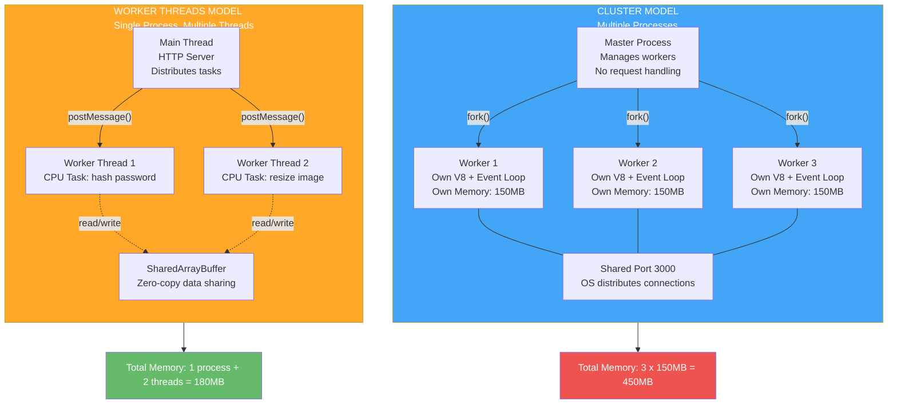

### Detailed Scenarios

**Scenario 1: HTTP API Server (1000 req/sec)**

```
→ Use: Cluster (4-8 workers)
  - Built-in load balancing
  - Each worker handles ~125-250 req/sec
  - Supervisor (PM2) restarts crashed workers
  - Redis for session/cache

→ Why not worker threads?
  - HTTP I/O-bound; workers better at CPU
  - Load balancing overhead not worth it
  - Cluster is battle-tested for HTTP
```

**Scenario 2: Real-time Analytics (high-frequency data processing)**

```
→ Use: Worker Threads + Shared Memory
  - Low-latency inter-thread communication
  - ~1-10µs vs ~100-500µs (message passing)
  - Shared buffers for 1000+ updates/sec
  - single process, coordinated V8 GC

→ Why not cluster?
  - Message passing too slow for 1000+/sec
  - IPC overhead (OS pipes, serialization)
  - Need tight synchronization
```

**Scenario 3: Batch Image Processing (10GB of images)**

```
→ Use: Child Process (fork) + Work Queue
  - Each worker processes subset of images
  - Master distributes via IPC message queue
  - Can be horizontal (multiple machines)
  - External database tracks progress (fault tolerance)

→ Why not workers or cluster?
  - Each worker might need different memory profiles
  - Independent failure/restart simplicity
  - Easier to distribute across machines
```

---

## System Design & Architecture

### Concepts

System design in Node.js is about building applications that handle **real-world scale** — thousands of concurrent users, gigabytes of data, and 99.9% uptime. The key principles:

**Stateless servers:** Store NO state in your Node process (no in-memory sessions, no local caches that aren't replicated). This lets you scale horizontally — add more servers behind a load balancer. Use Redis for sessions, a database for data.

**Connection pooling:** Don't create a new database connection per request. Maintain a **pool** of reusable connections (typically 10-20 per server). Each request borrows a connection, uses it, and returns it. This avoids the overhead of TCP handshake + auth per query.

**Caching layers:** Cache-aside pattern (check cache first, then DB) can reduce database load by 90%+. But cache invalidation is one of the hardest problems in computer science — stale data means users see outdated information.

**Queue-based architecture:** For long-running tasks (image processing, email sending, report generation), don't make the user wait. Accept the request, put a job in a queue (Redis, RabbitMQ), return immediately with a job ID, and process asynchronously. The user polls for the result.

### Scalability Patterns

#### Pattern 1: Horizontal Scaling with Reverse Proxy

```
Client → nginx (load balancer) → Cluster 1 (4 workers)
                              → Cluster 2 (4 workers)
                              → Cluster 3 (4 workers)

Shared:  Redis (sessions, cache)
         PostgreSQL (database)
```

#### Horizontal Scaling Architecture Diagram

This shows a production-ready architecture where multiple servers share the load. The load balancer distributes requests, and all servers share the same Redis (sessions/cache) and PostgreSQL (data).

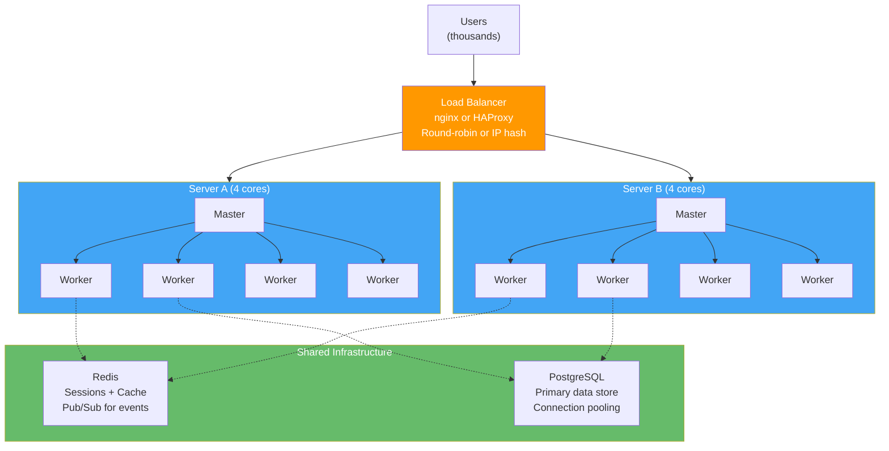

```js
// Cluster with graceful shutdown
const cluster = require("cluster");
const http = require("http");
const os = require("os");

const numWorkers = os.cpus().length;

if (cluster.isMaster) {
    for (let i = 0; i < numWorkers; i++) cluster.fork();

    process.on("SIGTERM", gracefulShutdown);

    function gracefulShutdown() {
        console.log("Shutting down...");
        Object.values(cluster.workers).forEach((w) => w.send({ cmd: "close" }));
        setTimeout(() => process.exit(0), 30000);
    }
} else {
    http.createServer(async (req, res) => {
        // Handle request...
    }).listen(3000);

    process.on("message", (msg) => {
        if (msg.cmd === "close") {
            process.exit(0);
        }
    });
}
```

#### Pattern 2: Task Queue for Long-Running Jobs

```
Client → API Server (returns job_id)
         ↓
         Redis Queue (Bull, RabbitMQ)
         ↓
    Worker Pool (processes jobs)
         ↓
    Database (stores results)
         ↓
Client polls for results
```

#### Task Queue Architecture

This pattern separates the API (fast response) from heavy processing (background). The user doesn't wait for the job to complete — they get a job ID immediately and can check back later.

```mermaid
sequenceDiagram
    participant Client
    participant API as API Server
    participant Queue as Redis Queue (Bull)
    participant Worker as Background Worker
    participant DB as Database

    Note over Client,DB: Step 1: Submit Job
    Client->>API: POST /resize-image
    API->>Queue: Add job to queue
    API-->>Client: 202 Accepted, jobId: abc123
    Note over Client: User continues browsing

    Note over Queue,DB: Step 2: Process in Background
    Queue->>Worker: Dequeue next job
    Worker->>Worker: Resize image (60 seconds)
    Worker->>DB: Save result
    Worker->>Queue: Mark job complete

    Note over Client,DB: Step 3: Check Result
    Client->>API: GET /jobs/abc123
    API->>DB: Lookup result
    DB-->>API: { status: done, url: 'resized.jpg' }
    API-->>Client: { status: done, url: 'resized.jpg' }
```

```js
// Using Bull queue
const Queue = require("bull");
const imageQueue = new Queue("image-processing");

// Producer (API server)
app.post("/resize-image", async (req, res) => {
    const job = await imageQueue.add(
        { imageUrl: req.body.url, width: 300 },
        { attempts: 3, backoff: "exponential" },
    );
    res.json({ jobId: job.id });
});

// Consumer (worker)
imageQueue.process(async (job) => {
    const { imageUrl, width } = job.data;
    const resized = await resizeImage(imageUrl, width);
    return { url: resized };
});

// Client polls for result
app.get("/job/:id", async (req, res) => {
    const job = await imageQueue.getJob(req.params.id);
    if (job.isCompleted()) {
        res.json({ result: job.returnvalue });
    } else {
        res.status(202).json({ progress: job.progress() });
    }
});
```

#### Pattern 3: Request Flow in High-Concurrency System

```
1. Client sends request
2. Load balancer routes to worker A (nginx/HAProxy)
3. Worker A checks session cache (Redis)
4. Worker A queries database (connection pool)
5. Worker responds TO client

Concurrency:
- Multiple workers process different clients simultaneously
- Connection pooling reuses DB connections
- Cache hits avoid DB queries
- Backpressure: slow DB doesn't block other workers
```

### Senior-Level Scenarios

**Scenario: Design a Real-Time Chat Application (1000 concurrent WebSocket connections)**

#### Chat Application Architecture

This shows how a real-time chat system handles users distributed across multiple servers. Redis Pub/Sub ensures messages reach users on ANY server, not just the one the sender is connected to.

```mermaid
graph TB
    Users["1000 WebSocket Clients"]
    LB["Load Balancer<br/>Sticky sessions by user ID"]

    subgraph Servers["Chat Servers"]
        S1["Server 1<br/>~333 connections"]
        S2["Server 2<br/>~333 connections"]
        S3["Server 3<br/>~334 connections"]
    end

    subgraph Backend ["Backend Services"]
        PubSub["Redis Pub/Sub<br/>Broadcast messages<br/>across servers"]
        Cache["Redis Cache<br/>Online status<br/>Room members"]
        DB["PostgreSQL<br/>Message history<br/>User accounts"]
    end

    Users --> LB
    LB --> S1
    LB --> S2
    LB --> S3

    S1 <-->|"subscribe + publish"| PubSub
    S2 <-->|"subscribe + publish"| PubSub
    S3 <-->|"subscribe + publish"| PubSub

    S1 -.-> Cache
    S1 -.-> DB

    style LB fill:#ff9800,color:#fff
    style PubSub fill:#f44336,color:#fff
    style Cache fill:#4caf50,color:#fff
    style DB fill:#2196f3,color:#fff
```

#### Chat Message Flow Sequence Diagram

This shows the step-by-step flow when User 1 (on Server 1) sends a message to User 2 (on Server 2). Redis Pub/Sub is the bridge between servers.

```mermaid
sequenceDiagram
    participant U1 as User 1 (Server 1)
    participant S1 as Server 1
    participant Redis as Redis Pub/Sub
    participant S2 as Server 2
    participant U2 as User 2 (Server 2)
    participant DB as PostgreSQL

    U1->>S1: WebSocket: send message
    Note over S1: Validate message

    par Save and broadcast
        S1->>DB: INSERT INTO messages
        S1->>Redis: PUBLISH chat:room123
    end

    Redis->>S1: Message event (own server)
    Note over S1: User 1 already has it, skip

    Redis->>S2: Message event
    S2->>S2: Find local users in room123
    S2->>U2: WebSocket: new message

    U2-->>S2: ACK received
    Note over U1,U2: Message delivered cross-server
```

**Architecture:**

```
Architecture:
┌─────────────────────────────────────────────────────────────┐
│                    Load Balancer (nginx)                    │
├─────────────────────────────────────────────────────────────┤
│ Chat Server 1   Chat Server 2   Chat Server 3 (cluster)    │
│ (4 workers)     (4 workers)     (4 workers)                │
└─────────────────────────────────────────────────────────────┘
         ↓              ↓              ↓
    ┌───────────────────────────────────────┐
    │    Redis (pub/sub for cross-server)  │
    │    Redis (store rooms/messages)      │
    │    PostgreSQL (data persistence)     │
    └───────────────────────────────────────┘

Challenges & Solutions:
1. Sticky sessions (user stays on same server)
   → nginx hash routing based on user_id

2. Message broadcast across servers
   → Redis pub/sub (server 1 sends → all servers receive)

3. Presence tracking (who's online)
   → Redis sorted set: user_id, last_heartbeat
   → Cleanup stale users via TTL

4. Room scalability
   → Each server subscribes to rooms it has users in
   → Leave room → unsubscribe if no local users
```

**Code:**

```js
const http = require("http");
const WebSocket = require("ws");
const redis = require("redis");

const sub = redis.createClient();
const pub = redis.createClient();
const db = redis.createClient({ db: 1 }); // Separate DB for data

const wss = new WebSocket.Server({ port: 8080 });
const clients = new Map(); // userId → WebSocket

// Subscribe to broadcasts
sub.subscribe("chat:broadcast", (err, count) => {
    if (err) console.error("Redis subscription error", err);
});

sub.on("message", (channel, message) => {
    const { roomId, msg, senderId } = JSON.parse(message);

    // Broadcast to local clients in this room
    for (const [userId, ws] of clients) {
        const userRooms = db.smembers(`user:${userId}:rooms`);
        if (userRooms.includes(roomId) && userId !== senderId) {
            ws.send(JSON.stringify({ type: "message", msg }));
        }
    }
});

// WebSocket connection
wss.on("connection", (ws) => {
    const userId = extractUserIdFromWS(ws);
    clients.set(userId, ws);

    // Update presence
    db.setEx(`presence:${userId}`, 300, Date.now()); // 5 min TTL
    pub.publish(
        "chat:broadcast",
        JSON.stringify({
            type: "user_joined",
            userId,
            timestamp: Date.now(),
        }),
    );

    // Handle messages
    ws.on("message", async (data) => {
        const { roomId, text } = JSON.parse(data);

        // Store in database
        const msgId = uuid();
        await db.zadd(
            `room:${roomId}:messages`,
            Date.now(),
            `${msgId}:${text}`,
        );

        // Broadcast to all servers
        pub.publish(
            "chat:broadcast",
            JSON.stringify({
                roomId,
                msg: text,
                senderId: userId,
                timestamp: Date.now(),
            }),
        );
    });

    // Handle disconnect
    ws.on("close", () => {
        clients.delete(userId);
        db.del(`presence:${userId}`);
        pub.publish(
            "chat:broadcast",
            JSON.stringify({
                type: "user_left",
                userId,
            }),
        );
    });
});
```

---

## Database & Caching Patterns

### Concepts

Every Node.js application eventually talks to a database. How you manage database connections and caching determines whether your app handles 100 users or 100,000.

**Connection pooling:** Opening a database connection is expensive — TCP handshake, TLS negotiation, authentication. This takes ~50-100ms per connection. If you create a new connection per request, that's 50ms of wasted time **every request**. A connection pool creates a fixed number of connections at startup (say 20) and reuses them. Each request borrows a connection, runs a query, and returns it. Think of it like a car rental service — you don't buy a car for each trip.

**Caching with Redis:** Databases are slow (10-100ms per query). Redis is fast (~1ms). The **cache-aside** pattern is simple: before querying the DB, check Redis. If the data is there (cache hit), return immediately. If not (cache miss), query the DB, store the result in Redis with a TTL, and return it. Cache hit rates of 90%+ dramatically reduce DB load.

**Cache invalidation — the hard problem:** When data changes in the DB, the cache becomes **stale**. Three strategies:

- **TTL expiry:** Let cached data expire naturally. Simple but users see stale data until TTL.
- **Explicit deletion:** When you update the DB, also delete the cache key. Consistent but requires code discipline.
- **Write-through:** Update DB and cache simultaneously. Consistent but slower writes.

**Distributed locking:** When multiple Node servers process the same data (e.g., two servers try to charge the same order), you need a **distributed lock** — a shared "flag" in Redis that ensures only one process operates at a time. Redis `SETNX` (set if not exists) with TTL is the standard pattern.

### Connection Pooling

#### Connection Pool Architecture

This shows how a pool of reusable connections serves many concurrent requests without creating new connections each time. When all connections are busy, new requests wait in a queue.

```mermaid
graph TB
    App["Your Application<br/>20 concurrent requests"]

    subgraph Pool ["Connection Pool (max: 20)"]
        Active["Active Connections<br/>Currently running queries"]
        Idle["Idle Connections<br/>Ready for new queries"]
    end

    Queue["Waiting Queue<br/>Requests wait here when<br/>all connections busy<br/>Timeout: 2 seconds"]

    DB["PostgreSQL<br/>Max 200 total connections<br/>across all servers"]

    App -->|"Borrow connection"| Pool
    Pool -->|"All busy?"| Queue
    Queue -->|"Connection freed"| Pool
    Active -->|"Run query"| DB
    Active -->|"Query done, return"| Idle
    Idle -->|"30s idle? Close"| DB

    style Pool fill:#42a5f5,color:#fff
    style Queue fill:#ffa726,color:#fff
    style DB fill:#66bb6a,color:#fff
```

```js
const pg = require("pg");

// Create pool
const pool = new pg.Pool({
    max: 20, // Max connections
    idleTimeoutMillis: 30000, // Close idle after 30s
    connectionTimeoutMillis: 2000, // Timeout waiting for connection
    host: "localhost",
    port: 5432,
    database: "myapp",
    user: "user",
    password: "password",
});

// Use connection from pool
pool.query("SELECT * FROM users WHERE id = $1", [userId])
    .then((result) => console.log(result))
    .catch((err) => console.error(err));

// Handle pool errors
pool.on("error", (err) => {
    console.error("Unexpected error on idle client", err);
    // Alert monitoring
});

// Graceful shutdown
server.on("close", async () => {
    await pool.end();
});
```

### Redis Patterns

#### Cache-Aside Pattern (Lazy Loading)

The most common caching pattern. Check the cache first — if the data is there, return it instantly. If not, get it from the database and store it in the cache for next time.

```mermaid
sequenceDiagram
    participant Client
    participant App as Node.js App
    participant Cache as Redis (~1ms)
    participant DB as PostgreSQL (~50ms)

    Client->>App: GET /user/123
    App->>Cache: GET user:123

    alt Cache HIT (90% of requests)
        Cache-->>App: User data found!
        Note over App: Response time: ~2ms
        App-->>Client: 200 OK (from cache)
    else Cache MISS (10% of requests)
        Cache-->>App: null (not cached)
        App->>DB: SELECT * FROM users WHERE id=123
        DB-->>App: User data (took 50ms)
        App->>Cache: SETEX user:123 3600 data
        Note over Cache: Cached for 1 hour
        Note over App: Response time: ~55ms
        App-->>Client: 200 OK (from DB)
    end

    Note over Client,DB: Next request for same user: ~2ms (cached)
```

#### Write-Through Pattern (Synchronous)

When data is updated, write to BOTH the database AND cache at the same time. This keeps the cache always consistent, but writes are slightly slower.

```mermaid
sequenceDiagram
    participant Client
    participant App as Node.js App
    participant DB as PostgreSQL
    participant Cache as Redis

    Client->>App: PUT /user/123 (update name)

    Note over App: Update both stores
    App->>DB: UPDATE users SET name='Bob'
    DB-->>App: OK (50ms)

    App->>Cache: SETEX user:123 3600 newData
    Cache-->>App: OK (1ms)

    App-->>Client: 200 Updated

    Note over Cache,DB: Cache is ALWAYS consistent
    Note over Cache,DB: Trade-off: Every write is ~51ms
    Note over Cache,DB: (vs ~1ms for cache-aside on reads)
```

#### Cache Invalidation Strategies

Choosing the right invalidation strategy depends on your consistency requirements. Most apps use a combination.

```mermaid
flowchart TD
    Change["Data Changed in DB"]

    Change --> Strategy{"Which strategy?"}

    Strategy -->|"Explicit Delete<br/>(Recommended)"| Del["DEL user:123<br/>Remove specific key"]
    Strategy -->|"TTL Expiry<br/>(Simplest)"| TTL["Key auto-expires<br/>after 3600 seconds"]
    Strategy -->|"Pattern Delete<br/>(Bulk)"| Pattern["DEL user:*<br/>Remove all user keys"]

    Del --> Consistent["Immediately consistent<br/>Next read fetches fresh data"]
    TTL --> Stale["Stale for up to TTL<br/>Eventually consistent"]
    Pattern --> Consistent

    style Del fill:#4caf50,color:#fff
    style TTL fill:#ff9800,color:#fff
    style Pattern fill:#2196f3,color:#fff
    style Consistent fill:#66bb6a,color:#fff
    style Stale fill:#ffee58,color:#000
```

```js
const redis = require("redis");
const client = redis.createClient();

// Pattern 1: Cache-Aside (Lazy Loading)
async function getUserWithCache(id) {
    const cached = await client.get(`user:${id}`);
    if (cached) return JSON.parse(cached);

    const user = await db.getUserById(id);
    await client.setEx(`user:${id}`, 3600, JSON.stringify(user)); // 1 hour TTL
    return user;
}

// Pattern 2: Write-Through (Update DB, then cache)
async function updateUser(id, data) {
    await db.updateUser(id, data);
    await client.setEx(`user:${id}`, 3600, JSON.stringify(data));
}

// Pattern 3: Cache Invalidation
async function deleteUser(id) {
    await db.deleteUser(id);
    await client.del(`user:${id}`); // Explicit invalidation
}

// Pattern 4: Publish-Subscribe (Cross-server messaging)
app.post("/notify", (req, res) => {
    client.publish(
        "notifications",
        JSON.stringify({
            userId: req.body.userId,
            message: req.body.message,
        }),
    );
    res.json({ sent: true });
});

client.subscribe("notifications");
client.on("message", (channel, message) => {
    const { userId, message: msg } = JSON.parse(message);
    // Notify user via WebSocket, email, etc.
});
```

### Distributed Locking (Redis)

#### Lock Acquisition & Release Timeline

Distributed locks prevent two servers from processing the same resource simultaneously. This shows Process 1 acquiring the lock while Process 2 must wait and retry.

```mermaid
sequenceDiagram
    participant P1 as Process 1 (Server A)
    participant Redis as Redis Lock
    participant P2 as Process 2 (Server B)

    Note over P1,P2: Both try to update Order #123

    par Race for lock
        P1->>Redis: SETNX lock:order:123 (TTL 30s)
        P2->>Redis: SETNX lock:order:123 (TTL 30s)
    end

    Redis-->>P1: OK — lock acquired!
    Redis-->>P2: FAIL — lock exists

    rect rgba(56, 142, 60, 0.25)
        Note over P1: Has the lock — safe to proceed
        P1->>P1: Read order from DB
        P1->>P1: Update order total
        P1->>P1: Save to DB
        P1->>Redis: DEL lock:order:123
        Note over P1: Lock released
    end

    rect rgba(230, 81, 0, 0.25)
        Note over P2: Waiting with exponential backoff
        P2->>P2: Wait 100ms
        P2->>Redis: SETNX lock:order:123
        Redis-->>P2: FAIL — still locked
        P2->>P2: Wait 200ms
        P2->>Redis: SETNX lock:order:123
        Redis-->>P2: OK — lock acquired!
        P2->>P2: Process order safely
        P2->>Redis: DEL lock:order:123
    end
```

#### Lock Lifecycle

```mermaid
stateDiagram-v2
    [*] --> Available: Redis key doesn't exist

    Available --> Locked: SETNX returns OK
    Note right of Locked: Owner holds UUID<br/>TTL = 30 seconds

    Locked --> Available: Owner calls DEL (normal release)
    Locked --> Available: TTL expires (owner crashed)

    Locked --> Rejected: Another process tries SETNX
    Rejected --> Retry: Wait with exponential backoff
    Retry --> Available: Try again
```

```js
const uuid = require("uuid");

// Pattern: Distributed lock with TTL and release
async function acquireLock(key, ttlSeconds) {
    const lockId = uuid.v4();
    const script = `
        if redis.call("get", KEYS[1]) == false then
            return redis.call("setex", KEYS[1], ARGV[1], ARGV[2])
        else
            return false
        end
    `;

    const result = await client.eval(script, 1, key, ttlSeconds, lockId);
    return result ? lockId : null;
}

async function releaseLock(key, lockId) {
    const script = `
        if redis.call("get", KEYS[1]) == ARGV[1] then
            return redis.call("del", KEYS[1])
        else
            return 0
        end
    `;

    return await client.eval(script, 1, key, lockId);
}

// Usage: Prevent concurrent updates with exponential backoff retry
async function updateOrderWithLock(orderId, newData) {
    let lockId = null;
    let retries = 0;
    const maxRetries = 5;

    while (retries < maxRetries) {
        lockId = await acquireLock(`order:${orderId}`, 30);
        if (lockId) break;

        // Exponential backoff: 100ms, 200ms, 400ms, 800ms, 1600ms
        const backoffMs = Math.pow(2, retries) * 100;
        await new Promise((resolve) => setTimeout(resolve, backoffMs));
        retries++;
    }

    if (!lockId) {
        throw new Error("Could not acquire lock after retries");
    }

    try {
        await updateOrder(orderId, newData);
    } finally {
        await releaseLock(`order:${orderId}`, lockId);
    }
}
```

---

## Debugging, Memory Profiling & Observability

### Concepts

Debugging a Node.js application in production is fundamentally different from debugging locally. You can't attach a debugger to a live server serving 10,000 users. Instead, you need **observability** — the ability to understand what's happening inside your application from the outside.

**The three pillars of observability:**

1. **Logs** — Timestamped records of what happened. Use structured logging (JSON) with libraries like Pino or Winston. Include request IDs so you can trace a single request across multiple services. Don't use `console.log` in production — it's synchronous and blocks the event loop.

2. **Metrics** — Numbers that tell you how the system is performing: request rate, error rate, response time (p50, p95, p99), memory usage, event loop lag. Export to Prometheus/Grafana for dashboards and alerts.

3. **Traces** — Follow a single request as it flows through multiple services. Tools like OpenTelemetry, Jaeger, or Datadog show you exactly where time is spent.

**Memory leaks — the silent killer:** In Node.js, memory leaks don't crash immediately. Heap usage slowly grows over hours or days until the process runs out of memory and crashes or the GC spends so much time that the app becomes unresponsive. The most common causes:

- Forgotten event listeners (`.on()` without `.removeListener()`)
- Unbounded caches (objects stored in Maps/Objects without eviction)
- Closures retaining references to large objects
- Global variables accumulating data

**How to detect leaks:** Take heap snapshots at intervals using `v8.writeHeapSnapshot()`, compare them in Chrome DevTools, and look for objects that grow between snapshots. The `clinic.js` tool automates this.

### Memory Leak Detection

#### Memory Patterns Over Time

This chart shows three patterns you'll see when monitoring heap memory. A healthy app stays flat. A slow leak grows gradually. An unbounded leak grows exponentially.

```mermaid
graph LR
    subgraph Healthy ["Healthy App — Stable Memory"]
        H1["50MB"] --> H2["52MB"] --> H3["48MB"] --> H4["51MB"]
    end

    subgraph Slow ["Slow Leak — Cache Growth"]
        S1["50MB"] --> S2["70MB"] --> S3["100MB"] --> S4["140MB"]
    end

    subgraph Fast ["Unbounded Leak — Listeners"]
        F1["50MB"] --> F2["150MB"] --> F3["400MB"] --> F4["CRASH!"]
    end

    style Healthy fill:#1b5e20,color:#fff
    style H1 fill:#43a047,color:#fff
    style H2 fill:#388e3c,color:#fff
    style H3 fill:#43a047,color:#fff
    style H4 fill:#388e3c,color:#fff
    style Slow fill:#e65100,color:#fff
    style S1 fill:#ef6c00,color:#fff
    style S2 fill:#e65100,color:#fff
    style S3 fill:#d84315,color:#fff
    style S4 fill:#bf360c,color:#fff
    style Fast fill:#b71c1c,color:#fff
    style F1 fill:#e53935,color:#fff
    style F2 fill:#d32f2f,color:#fff
    style F3 fill:#c62828,color:#fff
    style F4 fill:#b71c1c,color:#fff
```

#### Memory Leak Detection Workflow

This shows the three phases of detecting and fixing a memory leak: normal operation, leak detection, and debugging.

```mermaid
sequenceDiagram
    participant App as Node.js App
    participant Monitor as Heap Monitor
    participant Alert as Alert System
    participant Dev as Developer

    rect rgba(56, 142, 60, 0.25)
        Note over App,Monitor: PHASE 1 — Normal (heap stable)
        App->>Monitor: Heap: 50MB
        App->>Monitor: Heap: 52MB (after GC: 50MB)
        App->>Monitor: Heap: 51MB
        Note over Monitor: GC keeps heap stable
    end

    rect rgba(211, 47, 47, 0.25)
        Note over App,Alert: PHASE 2 — Leak Detected!
        App->>Monitor: Heap: 100MB (growing!)
        App->>Monitor: Heap: 150MB
        App->>Monitor: Heap: 200MB
        Monitor->>Alert: Heap growing 50MB/hour!
        Alert->>Dev: ALERT — Memory leak detected
        Dev->>App: Take heap snapshot #1
    end

    rect rgba(30, 136, 229, 0.25)
        Note over App,Dev: PHASE 3 — Root Cause Analysis
        App->>Monitor: Heap: 300MB
        Dev->>App: Take heap snapshot #2
        Dev->>Dev: Compare snapshots in Chrome DevTools
        Dev->>Dev: Found 10,000 EventListener objects
        Dev->>Dev: Source: .on('data') never removed
        Dev->>App: Deploy fix with .removeListener()
        App->>Monitor: Heap: 55MB (fixed!)
    end
```

**Detect leaks: Watch heap size over time**

```js
const v8 = require("v8");

setInterval(() => {
    const heapStats = v8.getHeapStatistics();
    console.log({
        heapUsed: Math.round(heapStats.total_heap_size / 1024 / 1024) + "MB",
        heapLimit: Math.round(heapStats.heap_size_limit / 1024 / 1024) + "MB",
    });
}, 10000);

// If heapUsed grows unbounded → leak!
```

**Common memory leaks:**

```js
// ❌ Leak 1: Forgotten listener
setInterval(() => {
    const listener = () => {
        /* ... */
    };
    emitter.on("data", listener); // Never removed!
}, 100);

// Fix: Store and remove
let listener;
setInterval(() => {
    if (listener) emitter.removeListener("data", listener);
    listener = () => {
        /* ... */
    };
    emitter.on("data", listener);
}, 100);

// ❌ Leak 2: Global variable growth
global.cache = {}; // Unbounded growth
app.get("/api/data", (req, res) => {
    global.cache[req.query.key] = heavyData(); // Keep growing
});

// Fix: Use LRU cache with size limit
const LRU = require("lru-cache");
const cache = new LRU({ max: 1000 });
```

### Profiling CPU Bottlenecks

```js
// Flag: --prof
// node --prof app.js
// Creates isolate-*.log file

// Analyze:
// node --prof-process isolate-*.log > profile.txt
// Identify hot functions

// Or use clinic.js (automatic)
// npm install -g clinic
// clinic doctor -- node app.js
// clinic flame -- node app.js
// clinic flame-report-*.html (show flamegraph)
```

### Monitoring in Production

```js
// Structured logging
const pino = require("pino");
const logger = pino({
    level: process.env.LOG_LEVEL || "info",
    transport: {
        target: "pino-pretty",
        options: { colorize: true },
    },
});

// Application metrics
const promClient = require("prom-client");
const httpDuration = new promClient.Histogram({
    name: "http_request_duration_seconds",
    help: "Duration of HTTP request in seconds",
    labelNames: ["method", "route", "status"],
});

app.use((req, res, next) => {
    const start = Date.now();

    res.on("finish", () => {
        const duration = (Date.now() - start) / 1000;
        httpDuration.observe(
            {
                method: req.method,
                route: req.route?.path || "unknown",
                status: res.statusCode,
            },
            duration,
        );

        logger.info({
            method: req.method,
            path: req.path,
            status: res.statusCode,
            duration,
        });
    });

    next();
});

// Error tracking
process.on("unhandledRejection", (reason, promise) => {
    logger.error({ reason, promise }, "Unhandled rejection");
});

process.on("uncaughtException", (err) => {
    logger.error(err, "Uncaught exception");
    process.exit(1); // Restart (via supervisor like PM2)
});
```

---

## Production Practices & Security

### Concepts

Going from a working Node.js app to a **production-ready** app requires handling scenarios that never happen in development: server crashes, deployments without downtime, security attacks, and resource exhaustion.

**Graceful shutdown — why it matters:** When you deploy new code, the old process must stop. If you just `kill -9` the process, all in-flight requests are dropped — users see errors. A graceful shutdown: (1) stops accepting new connections, (2) waits for in-flight requests to finish (up to 30s), (3) closes database/cache connections, (4) exits cleanly. Process managers like PM2 send `SIGTERM` first and `SIGKILL` only after a timeout.

**Zero-downtime deployment:** Start the new version, wait until it's healthy (health check passes), then shut down the old version. With clustering, you can restart workers one at a time — at least 3 workers are always serving requests.

**Security in Node.js:** The most common vulnerabilities are:

- **Prototype pollution:** Malicious JSON input modifying `Object.prototype`, affecting all objects globally
- **ReDoS:** Regex patterns with nested quantifiers causing catastrophic backtracking (CPU 100%)
- **Command injection:** User input in `exec()` allowing arbitrary shell commands
- **SQL injection:** String concatenation in queries allowing data exfiltration

All of these are **preventable** with proper coding practices.

### Graceful Shutdown

#### Graceful Shutdown Timeline

This timeline shows the exact sequence of events during a graceful deployment. Notice how existing requests complete while new connections are rejected.

```mermaid
sequenceDiagram
    participant PM2 as Process Manager
    participant Server as Node.js Server
    participant Req as In-Flight Requests
    participant DB as Database Pool

    Note over PM2,DB: Normal Operation
    Req->>Server: Request A (processing)
    Req->>Server: Request B (processing)

    PM2->>Server: SIGTERM (deploy new version)
    Note over Server: isShuttingDown = true

    Server-->>Server: Stop accepting new connections
    Server--xReq: New Request C: 503 Service Unavailable

    Note over Req: Finish in-flight requests
    Req->>Server: Request A completes (200 OK)
    Req->>Server: Request B completes (200 OK)

    Note over Server: All requests done
    Server->>DB: Close all pool connections
    DB-->>Server: Connections closed
    Server->>PM2: process.exit(0)

    PM2->>PM2: Start new version
    Note over PM2: Zero downtime achieved
```

#### Shutdown State Machine

```mermaid
stateDiagram-v2
    [*] --> Running: Server listening on port 3000

    Running --> ShuttingDown: SIGTERM received

    state ShuttingDown {
        [*] --> RejectNew: Stop accepting connections
        RejectNew --> WaitInFlight: Wait for active requests
    }

    ShuttingDown --> Cleanup: All requests completed
    ShuttingDown --> ForceKill: 30s timeout reached

    state Cleanup {
        [*] --> CloseDB: Close database pool
        CloseDB --> CloseRedis: Close Redis connections
        CloseRedis --> CloseServer: Close server socket
    }

    Cleanup --> [*]: process.exit(0)
    ForceKill --> [*]: process.exit(1)
```

```js
const http = require("http");

let isShuttingDown = false;
const activeConnections = new Set();

const server = http.createServer(async (req, res) => {
    if (isShuttingDown) {
        res.writeHead(503);
        res.end("Server shutting down");
        return;
    }

    activeConnections.add(req.socket);

    try {
        // Handle request
        res.end("OK");
    } finally {
        activeConnections.delete(req.socket);
    }
});

// Graceful shutdown on SIGTERM
process.on("SIGTERM", async () => {
    console.log("SIGTERM received, starting graceful shutdown");
    isShuttingDown = true;

    server.close(async () => {
        console.log("Server closed");
        // Cleanup: close DB connections, etc.
        process.exit(0);
    });

    // Force kill after 30 seconds
    setTimeout(() => {
        console.error("Graceful shutdown timeout, force killing");
        activeConnections.forEach((socket) => socket.destroy());
        process.exit(1);
    }, 30000);
});

server.listen(3000);
```

### Security: Common Vulnerabilities

#### Security Vulnerabilities Quick Reference

This diagram maps each vulnerability type to its attack vector and the fix. Colors indicate severity: red = critical, orange = high.

```mermaid
graph TB
    Input["Untrusted Input<br/>(query params, body, headers)"]

    Input --> Proto
    Input --> Regex
    Input --> Cmd
    Input --> SQL
    Input --> CORS

    subgraph Proto ["Prototype Pollution"]
        direction LR
        P1["Attack: JSON with __proto__"] --> P2["Fix: Object.create(null)<br/>or JSON schema validation"]
    end

    subgraph Regex ["ReDoS"]
        direction LR
        R1["Attack: Long string +<br/>nested quantifiers"] --> R2["Fix: Avoid (a+)+b patterns<br/>Use re2 library"]
    end

    subgraph Cmd ["Command Injection"]
        direction LR
        C1["Attack: exec with<br/>user input"] --> C2["Fix: Use execFile<br/>with args array"]
    end

    subgraph SQL ["SQL Injection"]
        direction LR
        S1["Attack: String concat<br/>in queries"] --> S2["Fix: Parameterized<br/>queries ($1, $2)"]
    end

    subgraph CORS ["CORS Misconfiguration"]
        direction LR
        CO1["Attack: origin: *<br/>with credentials"] --> CO2["Fix: Whitelist<br/>specific origins"]
    end

    style Proto fill:#ef5350,color:#fff
    style Regex fill:#ef5350,color:#fff
    style Cmd fill:#f44336,color:#fff
    style SQL fill:#f44336,color:#fff
    style CORS fill:#ffa726,color:#fff
```

#### Vulnerability Comparison Table

| Vulnerability           | Vector                          | Impact                              | Detection                    | Fix Effort |
| ----------------------- | ------------------------------- | ----------------------------------- | ---------------------------- | ---------- |
| **Prototype Pollution** | JSON.parse + Object.assign      | Global scope pollution, bypass auth | Code review, static analysis | Low        |
| **ReDoS**               | Nested regex quantifiers        | CPU spike, DoS                      | Performance testing, timeout | Low-Medium |
| **Command Injection**   | exec with user input            | Remote Code Execution               | Static analysis, shellcheck  | Medium     |
| **SQL Injection**       | String concatenation in queries | Data breach, deletion               | Code review, SQLi testing    | Low-Medium |
| **CORS Bypass**         | Wildcard origin + credentials   | Session hijacking, CSRF             | Browser security audit       | Low        |

```js
// 1. ❌ Prototype Pollution
const obj = {};
const maliciousInput = JSON.parse(`{"__proto__": {"isAdmin": true}}`);
Object.assign(obj, maliciousInput);
console.log({}.isAdmin); // true — VULNERABILITY!

// Fix: Use null prototype or validator
const safeObj = Object.create(null);
Object.assign(safeObj, maliciousInput); // No prototype chain

// 2. ❌ Regular Expression DoS (ReDoS)
const regex = /(a+)+b/;
regex.test("aaaaaaaaaaaaaaaaaaaaaaaac"); // Catastrophic backtracking!

// Fix: Avoid nested quantifiers, use stricter patterns
const safeRegex = /a+b/;

// 3. ❌ Command Injection
const { exec } = require("child_process");
const userId = req.query.id; // User input
exec(`echo "User: ${userId}"`, (err, stdout) => {
    // Injection: userId = "; rm -rf /"
});

// Fix: Use execFile or escape
const { execFile } = require("child_process");
execFile("echo", [`User: ${userId}`], (err, stdout) => {
    // Safe: userId passed as argument, not shell command
});

// 4. ❌ SQL Injection
const query = `SELECT * FROM users WHERE id = ${userId}`;
db.query(query); // SQL injection!

// Fix: Parameterized queries
const query = "SELECT * FROM users WHERE id = ?";
db.query(query, [userId]);

// 5. ❌ CORS Misconfiguration
app.use(cors({ origin: "*" })); // Accept all origins!

// Fix: Whitelist approved origins
app.use(
    cors({
        origin: ["https://trusted.com", "https://app.com"],
        credentials: true,
    }),
);
```

---

## Interview Scenarios & System Design Problems

### Concepts

**System design interviews** test your ability to architect solutions that handle real-world scale. For Node.js positions, interviewers expect you to know:

1. **When Node.js is a good fit:** High-concurrency I/O-bound services (APIs, real-time apps, microservices, streaming). NOT for CPU-heavy computation (use Go, Rust, or offload to worker threads).

2. **The standard architecture:** Load Balancer → Cluster of Node servers → Redis (cache/sessions) → Database (PostgreSQL/MongoDB) → Message Queue (for async jobs).

3. **How to reason about scale:** Start with one server, identify bottlenecks, then scale horizontally. Calculate: if each request takes 10ms, one Node process handles ~100 req/sec. With 4 cluster workers, ~400 req/sec. Need 4000 req/sec? Add 10 servers behind a load balancer.

4. **Trade-offs:** Every design decision has trade-offs. Cache improves speed but introduces staleness. Replication improves availability but complicates consistency. Know the trade-offs and be ready to discuss them.

### Scenario 1: Design a URL Shortener (urls → short codes)

**Requirements:**

- Generate unique short codes (7-char)
- Redirect short code → long URL (fast)
- Track analytics (clicks, referrers)
- Handle 10k URLs/sec, 1M requests/sec

#### URL Shortener System Architecture

This shows the complete architecture for handling 1M requests/sec. The key insight is separating the **fast path** (redirects via cache) from the **slow path** (creating new URLs via DB).

```mermaid
graph TB
    Users["Users<br/>1M requests/sec"]
    LB["Load Balancer<br/>nginx"]

    subgraph API ["API Cluster (8 workers)"]
        W1["Worker 1"] & W2["Worker 2"] & W3["Worker 3"] & W4["Worker 4"]
    end

    Cache["Redis Cache<br/>code to URL mapping<br/>Hit rate: ~95%<br/>Response: ~1ms"]
    DB["PostgreSQL Primary<br/>Stores all URLs<br/>Response: ~50ms"]
    Replica["PostgreSQL Replica<br/>Read-only<br/>Analytics queries"]
    Queue["Message Queue<br/>Click tracking<br/>Async processing"]
    Analytics["Elasticsearch<br/>Click analytics<br/>Trends & reports"]

    Users --> LB --> API

    W1 -->|"GET /abc123 (95%)"| Cache
    W2 -->|"Cache miss (5%)"| DB
    W3 -->|"POST /shorten"| DB
    W4 -->|"Fire-and-forget"| Queue

    Queue --> Analytics
    DB --> Replica

    style Cache fill:#4caf50,color:#fff
    style DB fill:#2196f3,color:#fff
    style Analytics fill:#ff9800,color:#fff
```

#### Request Flow: Three Paths

This shows the three possible paths for a request: cache hit (fastest), cache miss (slower), and creating a new URL.

```mermaid
sequenceDiagram
    participant User
    participant API as API Server
    participant Cache as Redis Cache
    participant DB as PostgreSQL

    rect rgba(56, 142, 60, 0.25)
        Note over User,DB: PATH 1 — Cache Hit (fast ~2ms)
        User->>API: GET /abc123
        API->>Cache: GET url:abc123
        Cache-->>API: https://example.com/page
        API-->>User: 301 Redirect
    end

    rect rgba(230, 81, 0, 0.25)
        Note over User,DB: PATH 2 — Cache Miss (slower ~55ms)
        User->>API: GET /def456
        API->>Cache: GET url:def456
        Cache-->>API: null (miss)
        API->>DB: SELECT long_url WHERE code=def456
        DB-->>API: https://example.com/other
        API->>Cache: SET url:def456 (cache for next time)
        API-->>User: 301 Redirect
    end

    rect rgba(30, 136, 229, 0.25)
        Note over User,DB: PATH 3 — Create Short URL (~55ms)
        User->>API: POST /shorten with long URL
        API->>API: Generate 7-char code
        API->>DB: INSERT (code, long_url)
        API->>Cache: SET url:code
        API-->>User: shortUrl: https://s.io/xyz789
    end
```

**Architecture:**

```
Client → Load Balancer → API Servers (cluster: 8 workers)
                              ↓
                    Redis (cache shorts)
                              ↓
                    PostgreSQL + replica (URL store)
                              ↓
                    Elasticsearch (analytics)

Key-value store for codes: short_code → long_url
```

**Code:**

```js
const express = require("express");
const redis = require("redis");
const pg = require("pg");

const app = express();
const redisClient = redis.createClient();
const dbPool = new pg.Pool();

// Shorten URL
app.post("/api/shorten", async (req, res) => {
    const { longUrl } = req.body;
    const shortCode = generateShortCode(); // Random 7-char code

    try {
        // Store in DB
        await dbPool.query(
            "INSERT INTO urls (short_code, long_url, created_at) VALUES ($1, $2, NOW())",
            [shortCode, longUrl],
        );

        // Cache in Redis
        await redisClient.setEx(`url:${shortCode}`, 24 * 3600, longUrl);

        res.json({ shortUrl: `https://short.io/${shortCode}` });
    } catch (err) {
        res.status(500).json({ error: err.message });
    }
});

// Redirect (hot path)
app.get("/:code", async (req, res) => {
    const { code } = req.params;

    // Try cache first (fast path: ~1ms)
    let longUrl = await redisClient.get(`url:${code}`);

    if (!longUrl) {
        // Cache miss, hit DB (slow path: ~50ms)
        const result = await dbPool.query(
            "SELECT long_url FROM urls WHERE short_code = $1",
            [code],
        );

        if (result.rows.length === 0) {
            return res.status(404).json({ error: "URL not found" });
        }

        longUrl = result.rows[0].long_url;
        // Re-cache
        await redisClient.setEx(`url:${code}`, 24 * 3600, longUrl);
    }

    // Track click (async, non-blocking)
    trackClick(code, req); // Fire-and-forget

    res.redirect(longUrl);
});

function trackClick(code, req) {
    // Async tracking to external queue/analytics
    redisClient.lpush(
        `analytics:${code}`,
        JSON.stringify({
            timestamp: Date.now(),
            referrer: req.headers.referer,
            userAgent: req.headers["user-agent"],
        }),
    );
}
```

---

### Quick Reference: Example Files

**Event Loop & Timing:**

- [eventloop.js](eventloop.js) — phases, microtasks, scheduling

**Async Patterns:**

- [async.js](async.js) — Promises, callbacks, async/await
- [async.txt](async.txt) — Async reference notes

**Streams & Data Handling:**

- [NodeServer/\_\_streams.js](NodeServer/__streams.js) — piping, transforms
- [\_Stream_Buffer.js](_Stream_Buffer.js) — backpressure examples
- [fs/basics.js](fs/basics.js) — file operations, streaming

**Process Management:**

- [EventEmitters/\_exec.js](EventEmitters/_exec.js) — exec examples
- [EventEmitters/\_spawn.js](EventEmitters/_spawn.js) — spawn with I/O
- [EventEmitters/basics.js](EventEmitters/basics.js), [listeners.js](EventEmitters/listeners.js) — Event emitter patterns
- [ClusterAndFork/index.js](ClusterAndFork/index.js) — cluster master setup
- [ClusterAndFork/child.js](ClusterAndFork/child.js) — worker process

**Concurrency:**

- [workerthreads/server.js](workerthreads/server.js) — worker creation
- [workerthreads/worker.js](workerthreads/worker.js) — worker implementation
- [\_atomics/atomics.js](_atomics/atomics.js) — Atomics synchronization
- [\_atomics/parent.js](_atomics/parent.js) — shared memory coordination

**HTTP & Networking:**

- [NodeServer/server.js](NodeServer/server.js) — basic HTTP server
- [NodeServer/http_server.js](NodeServer/http_server.js) — advanced patterns

**Interview & Reference:**

- [nodejs_interview_reference.md](nodejs_interview_reference.md) — Promise implementations, debounce/throttle, company-specific prep
- [Coding/questions.md](Coding/questions.md) — coding interview problems

---

## Next Steps for Interview Prep

1. **Master Event Loop & Async:** These are foundational; all systems design builds on them.
2. **Deep dive Concurrency Models:** Understand tradeoffs; be ready to design under constraints.
3. **Study scenarios:** Practice real interview scenarios (chat app, URL shortener, task queue).
4. **Code proficiency:** Implement examples in this guide; run them locally to understand behavior.
5. **Production awareness:** Discuss monitoring, error handling, and graceful shutdown in interviews.
6. **Tools knowledge:** Be comfortable with `--inspect`, `clinic.js`, Redis, PostgreSQL basics.

---

## Summary

This guide covers **senior-level Node.js interview prep** with:

✅ **Core fundamentals** (event loop, async patterns, streams) with edge cases and traps  
✅ **Node.js internals** (module system, libuv thread pool, Buffer API, error handling)  
✅ **Concurrency deep dives** (cluster vs workers vs fork, with decision matrices)  
✅ **System design** (scalability, architecture patterns, real-world scenarios)  
✅ **Production readiness** (debugging, profiling, monitoring, security, graceful shutdown)  
✅ **Real interview questions** from Indian IT + fintech companies  
✅ **Runnable example code** linked to your workspace files

**Focus on understanding not memorization.** Be ready to:

- Explain tradeoffs (why cluster over workers for HTTP servers)
- Design systems under constraints (1000 concurrent WebSocket users)
- Reason about bottlenecks (memory, CPU, I/O)
- Discuss production considerations (monitoring, error handling, deployment)

Good luck with your interview! 🚀
