# Advanced Node.js — In-depth Notes

## Overview

This document expands the workspace summary into practical, in-depth notes for each advanced Node.js topic represented in this repository. Each section includes: conceptual explanation, key APIs, example snippets, best practices, common pitfalls, and links to example files in this workspace.

## Table of Contents

**Phase 1 — Node.js Fundamentals & Internals**

- 1.1 [Module System](#11-module-system) — CommonJS vs ESM, require resolution, circular deps
- 1.2 [Event Loop](#12-event-loop) — phases, timers, microtasks, senior Q&A
- 1.3 [libuv Thread Pool](#13-libuv-thread-pool) — UV_THREADPOOL_SIZE, which APIs use it, tuning
- 1.4 [Buffer & Binary Data](#14-buffer--binary-data) — encoding, allocation, TypedArrays, performance

**Phase 2 — Core Async & Data Flow**

- 2.1 [Async Patterns](#21-async-patterns) — callbacks, promises, async/await, error handling
- 2.2 [Error Handling Patterns](#22-error-handling-patterns) — operational vs programmer errors, custom errors, domains
- 2.3 [Event Emitters](#23-event-emitters) — patterns, memory leaks, listener management
- 2.4 [Streams & Pipelines](#24-streams--pipelines) — backpressure, transform streams, memory optimization

**Phase 3 — I/O & System APIs**

- 3.1 [File System (fs)](#31-file-system-fs) — streams, watchers, concurrent writes, performance
- 3.2 [HTTP Server & NodeServer](#32-http-server--nodeserver) — streaming responses, range requests, backpressure
- 3.3 [Child Processes (exec / spawn / fork)](#33-child-processes-exec--spawn--fork) — exec, spawn, IPC, process management

**Phase 4 — Concurrency & Scaling**

- 4.1 [Worker Threads & Atomics](#41-worker-threads--atomics) — shared memory, synchronization, race conditions
- 4.2 [Cluster & Fork](#42-cluster--fork) — master/worker, load distribution, sticky sessions
- 4.3 [Inter-thread / IPC Patterns](#43-inter-thread--ipc-patterns) — message passing, postMessage, Atomics
- 4.4 [Concurrency Models Comparison](#44-concurrency-models-comparison) — decision matrix, tradeoffs

**Phase 5 — Architecture & Production**

- 5.1 [System Design & Architecture](#51-system-design--architecture) — scalability, request flow, scenarios
- 5.2 [Database & Caching Patterns](#52-database--caching-patterns) — pooling, Redis, queues, consistency
- 5.3 [Debugging, Memory Profiling & Observability](#53-debugging-memory-profiling--observability) — leak detection, profiling, monitoring
- 5.4 [Production Practices & Security](#54-production-practices--security) — error handling, graceful shutdown, security
- 5.5 [Interview Scenarios & System Design Problems](#55-interview-scenarios--system-design-problems) — real-world challenges

**Phase 6 — Networking & Real-time**

- 6.1 [HTTP/2, TLS & Transport Security](#61-http2-tls--transport-security) — certs, HSTS, CORS, helmet, HTTP/2 multiplexing
- 6.2 [WebSockets & Real-time Communication](#62-websockets--real-time-communication) — ws vs socket.io, scaling, heartbeat, backpressure
- 6.3 [Message Queues & Background Jobs](#63-message-queues--background-jobs) — RabbitMQ, Kafka, BullMQ, retry, dead-letter queues

**Phase 7 — Testing, Performance & API Design**

- 7.1 [Testing & CI/CD](#71-testing--cicd) — unit, integration, e2e, mocking, coverage, CI pipelines
- 7.2 [Performance & Benchmarking](#72-performance--benchmarking) — load testing, event-loop latency, clinic, autocannon
- 7.3 [API Design & Versioning](#73-api-design--versioning) — REST vs GraphQL, pagination, idempotency, rate limiting

**Phase 8 — Deployment, Security & Operations**

- 8.1 [Deployment & Operations](#81-deployment--operations) — Docker, Kubernetes basics, health checks, PM2, rolling updates
- 8.2 [Security Checklist & Hardening](#82-security-checklist--hardening) — OWASP, dependency scanning, CSP, input validation, secrets management
- 8.3 [Observability: Tracing & APM](#83-observability-tracing--apm) — OpenTelemetry, distributed traces, correlation IDs, dashboards

**Phase 9 — Scenario-Based Interview Questions**

- S1 [Slow API — p99 latency 4s](#scenario-1-your-api-is-slow--p99-latency-is-4-seconds) — diagnose layer by layer, parallel calls, Redis cache
- S2 [Slow Queue Consumer](#scenario-2-your-message-queue-consumer-is-slow--queue-backlog-is-growing) — concurrency, batch writes, horizontal scale
- S3 [Memory Leak / OOM](#scenario-3-memory-usage-keeps-growing--suspected-memory-leak) — heapUsed monitoring, clinic.js, LRU cache, listener cleanup
- S4 [Optimize for 50k req/s](#scenario-4-optimize-a-nodejs-api-handling-50000-requestssecond) — cluster, streaming, pooling, Worker Threads, queue offload
- S5 [Circuit Breaker](#scenario-5-implement-a-circuit-breaker-for-an-external-api) — CLOSED → OPEN → HALF-OPEN state machine, implementation
- S6 [WebSocket Drops](#scenario-6-your-websocket-server-drops-connections-under-load) — heartbeat ping/pong, LB timeout, Redis pub/sub cross-server
- S7 [Duplicate Orders — Idempotency](#scenario-7-prevent-duplicate-order-processing--idempotency) — Idempotency-Key header, Redis SETEX, sequence diagram
- S8 [OOM Killed](#scenario-8-your-nodejs-server-crashes-every-few-hours--oom-killed) — stream vs buffer, --max-old-space-size, PM2 max_memory_restart
- S9 [Rate Limiter from Scratch](#scenario-9-design-an-api-rate-limiter-from-scratch) — sliding window, Redis sorted set, ZREMRANGEBYSCORE pipeline
- S10 [Graceful Shutdown](#scenario-10-graceful-shutdown--zero-downtime-deploys) — SIGTERM, server.close, drain, forced timeout
- S11 [Scale a Slow Endpoint](#scenario-11-a-slow-api-endpoint-is-bottlenecking-all-concurrent-requests--how-do-you-scale-it) — LB + cluster + p-limit + cache + async queue decision matrix
- S12 [N+1 Query Problem](#scenario-12-your-graphql--rest-api-has-an-n1-query-problem) — batch fetch, DataLoader, WHERE IN, JOIN
- S13 [JWT Auth + Token Refresh](#scenario-13-design-a-secure-jwt-authentication-flow-with-token-refresh) — access/refresh tokens, httpOnly cookie, Redis revocation
- S14 [Cache Invalidation](#scenario-14-your-cache-is-serving-stale-data--cache-invalidation-strategy) — cache-aside, write-through, stampede protection, stale-while-revalidate
- S15 [Large File Upload to S3](#scenario-15-stream-a-large-file-upload-directly-to-s3-without-buffering-in-memory) — pipe stream, multipart upload, never buffer
- S16 [Correlation IDs / Request Tracing](#scenario-16-debug-a-request-that-fails-in-production-but-not-locally--correlation-ids) — AsyncLocalStorage, X-Request-ID, structured logs
- S17 [Race Conditions in Node.js](#scenario-17-race-condition-in-nodejs--two-requests-read-then-write-the-same-record) — atomic SQL, SELECT FOR UPDATE, optimistic locking

**Appendix**

- A.1 [Quick Reference: Example Files](#a1-quick-reference-example-files) — workspace file index by topic
- A.2 [Glossary & Cheat Sheet](#a2-glossary--cheat-sheet) — quick-reference commands, API table, interview prompts

---

## Phase 1 — Node.js Fundamentals & Internals

### 1.1 Module System

### Concepts

When you write a Node.js application, you don't put all your code in a single file. You split it into **modules** — small, reusable pieces of code. Think of modules like LEGO blocks: each one does one thing, and you snap them together to build something bigger.

Node.js has two module systems:

- **CommonJS (CJS):** The original system, using `require()` to load and `module.exports` to share code. It works **synchronously** — when Node hits a `require()`, it stops everything, loads the file, runs it, and returns the result. This is fine at startup but can block the event loop if done carelessly at runtime.

- **ES Modules (ESM):** The modern JavaScript standard, using `import` / `export`. It loads **asynchronously** — the engine can analyze all imports before executing, enabling optimizations like **tree shaking** (removing unused code). ESM is the future, but CJS is still everywhere in existing packages.

**How does Node find a module?** When you call `require('express')`, Node follows a **resolution algorithm**: first it checks built-in modules (like `fs`, `http`), then looks for a `node_modules` folder in the current directory, then the parent directory, and so on up to the root. For relative paths like `require('./utils')`, it tries adding `.js`, `.json`, `.node`, and `/index.js` extensions.

**Module caching** is a key concept: once a module is loaded, Node stores it in memory. Every subsequent `require()` for the same module returns the **exact same object** — not a fresh copy. This means if module A modifies something on the exported object, module B will see those changes. This is how singletons work naturally in Node.

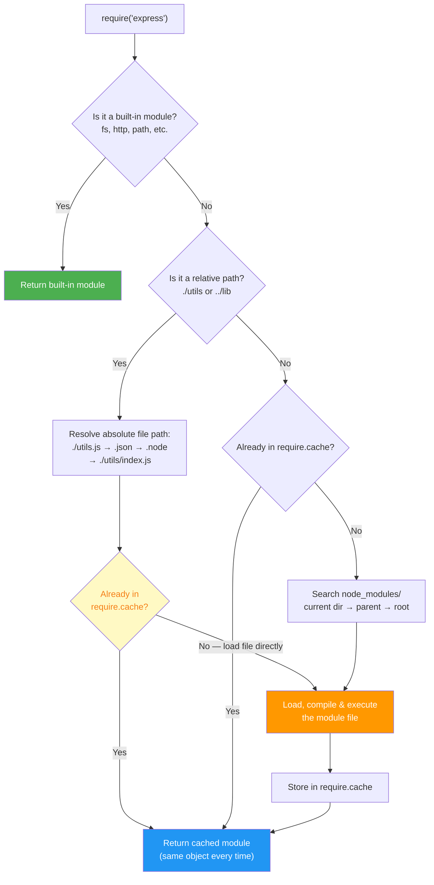

### CommonJS vs ES Modules

| Feature              | CommonJS (`require`)                     | ES Modules (`import`)                        |
| -------------------- | ---------------------------------------- | -------------------------------------------- |
| **Loading**          | Synchronous                              | Asynchronous                                 |
| **Syntax**           | `require()` / `module.exports`           | `import` / `export`                          |
| **Top-level await**  | ❌ Not supported                         | ✅ Supported                                 |
| **Tree shaking**     | ❌ No (dynamic)                          | ✅ Yes (static analysis)                     |
| **File extension**   | `.js` (default)                          | `.mjs` or `"type": "module"` in package.json |
| **`this` in module** | `module.exports`                         | `undefined`                                  |
| **Dynamic import**   | `require(path)` anywhere                 | `await import(path)`                         |
| **Circular deps**    | Partial exports (what's been set so far) | Live bindings (always up-to-date)            |

### Module Resolution Algorithm

> 📖 **What this example demonstrates:** When you type `require('something')`, Node doesn't magically find it — it follows a **strict search order**. Understanding this order helps you debug "Cannot find module" errors and understand why the same package can have multiple versions on disk.
>
> 🔑 **Key terms:**
>
> - **`require.resolve(name)`** — Tells you the **full file path** Node would load for that module, without actually loading it. Useful for debugging.
> - **`node_modules/`** — The folder where npm installs packages. Node searches this folder starting from your file's directory, then checks every parent directory up to `/`.

```js
// When you call require('my-module'), Node searches in this EXACT order:
// 1. Built-in modules first — things like 'fs', 'http', 'path' that ship with Node itself
// 2. node_modules/ in the SAME directory as the current file
// 3. node_modules/ in the PARENT directory (goes all the way up to the root /)
// 4. Global install paths (like /usr/local/lib/node_modules)
// If nothing found → throws "Error: Cannot find module"

// For a RELATIVE path like require('./utils'), Node tries extensions in this order:
// Step 1: ./utils.js       ← Is there a file named utils.js?
// Step 2: ./utils.json     ← Is there a JSON file?
// Step 3: ./utils.node     ← Is there a compiled native addon?
// Step 4: ./utils/index.js ← Is 'utils' a folder with an index.js inside?
// Step 5: ./utils/index.json

// 🛠️ Debugging tip: See exactly which file gets loaded:
console.log(require.resolve("express"));
// Might print: C:\Users\you\project<br/>ode_modules\express\index.js
// This is the ACTUAL file Node will load when you write require('express')
```

### Module Caching & Singletons

> 📖 **What this example demonstrates:** Node loads each module **once** and caches the result. Every `require()` call for the same module returns the **exact same JavaScript object** from memory. This is not a copy — it's the same reference. This behaviour makes it easy to create **singletons** (objects that only exist once in your whole app, like a database connection).
>
> 🔑 **Key terms:**
>
> - **Singleton** — A design pattern where only ONE instance of something exists. Example: you want only one database connection pool, not a new one every time you call `require('./db')`.
> - **`require.cache`** — An internal object Node uses to store all loaded modules. The key is the file path, the value is the module object.

```js
// ── FILE: counter.js ────────────────────────────────────────
let count = 0; // This variable lives for the lifetime of the process

module.exports = {
    increment: () => ++count, // ++count: increments THEN returns, so first call gives 1
    getCount: () => count, // Returns current value without changing it
};

// ── FILE: app.js ─────────────────────────────────────────────
const counter1 = require("./counter"); // First load: executes counter.js, caches it
const counter2 = require("./counter"); // Second load: RETURNS THE CACHE — does NOT re-run counter.js

counter1.increment(); // count is now 1 inside counter.js
console.log(counter2.getCount()); // Prints: 1 — ← Both counter1 and counter2 point to the SAME object!

// Proof they are literally the same object in memory:
console.log(counter1 === counter2); // true — same reference, not a copy

// ⚠️ Force a module to reload (ONLY use in development hot-reload scenarios)
// 'require.resolve' gives us the full file path (the cache key)
delete require.cache[require.resolve("./counter")]; // Remove from cache
const counter3 = require("./counter"); // Now re-executes counter.js → fresh count = 0
console.log(counter3.getCount()); // Prints: 0 — fresh start
// NOTE: counter1 and counter2 still point to the OLD object. Only counter3 is fresh.
```

### Circular Dependencies

> 📖 **What this example demonstrates:** A **circular dependency** happens when Module A loads Module B, and Module B also loads Module A. Node doesn't crash — instead it returns a **partially-filled exports object** for the module still being loaded. This leads to mysterious `undefined` values that are hard to debug.
>
> 🔑 **Key terms:**
>
> - **Circular dependency** — A → B → A loop. Like employee A needing employee B's phone number, but B's directory card says "see employee A" for contact info.
> - **Partial exports** — When Node detects a cycle, it gives the requesting module whatever has been exported **so far** — which may be empty `{}` if the module hasn't finished running yet.
> - **Lazy require** — Delaying a `require()` call until it's inside a function, so it runs **after** all modules have finished setting up.
> - **Live bindings (ESM)** — ES Modules don't give you a snapshot of exports at load time. Instead they give you a **live reference** — like a pointer. When the exporting module later updates its value, all importers see the new value automatically.

```js
// ── ❌ PROBLEM: Circular require creates a chicken-and-egg problem ────────────

// FILE: a.js — runs first
const b = require("./b"); // Node starts loading b.js...
// But b.js needs a.js! Node gives b.js the CURRENT (empty) exports of a.js
console.log("In A, b.value =", b.value); // undefined — b.js hasn't finished yet!
module.exports = { value: "A" }; // Too late — b.js already got the empty version

// FILE: b.js — loaded while a.js is mid-execution
const a = require("./a"); // a.js is currently being loaded — Node returns what a.js has exported SO FAR
console.log("In B, a.value =", a.value); // Could print: undefined (if a.js hasn't set exports yet)
module.exports = { value: "B" };

// ── ✅ Fix 1: Lazy require — wrap require() inside a function ─────────────────
// By the time getB() is CALLED, both modules have fully loaded
// a.js
module.exports = {
    value: "A",
    getB: () => require("./b"), // require() runs here (at call time), not at file load time
};
// Now: const a = require('./a'); a.getB() works correctly because b.js is fully loaded by then

// ── ✅ Fix 2: Extract shared code into a third module ─────────────────────────
// If A and B both need the same thing, put it in shared.js
// shared.js has no dependencies on A or B — no cycle possible
module.exports = { sharedValue: "shared" };
// Now A requires shared.js and B requires shared.js — no cycle

// ── ✅ Fix 3: ES Modules handle cycles gracefully with live bindings ──────────
// In ESM, even if there's a cycle, the binding is always up-to-date
// a.mjs
import { value } from "./b.mjs"; // ESM: a.mjs gets a LIVE REFERENCE to b.mjs's 'value' export
export const aValue = "A";
// When b.mjs finally sets value = "B", this import automatically reflects that — no undefined!
```

### Senior-Level Q&A

**Q1: What's the difference between `require()` and `import`? Can you mix them?**

A: `require()` is synchronous (CJS), `import` is asynchronous (ESM). You can:

- Use `import()` (dynamic) inside CJS files
- Use `createRequire()` to use `require()` inside ESM files
- Cannot use static `import` in CJS files

> 📖 **What this example demonstrates:** CJS and ESM are different systems but you sometimes need to mix them — e.g., your project is CJS but you want to use a package that only ships as ESM, or vice versa.
>
> 🔑 **Key terms:**
>
> - **Dynamic import `import()`** — A function (not a keyword) that loads an ES Module asynchronously at runtime. Works inside CJS files. Returns a Promise.
> - **`createRequire()`** — A utility that creates a `require` function you can use inside an ES Module file (`.mjs`). Normally `.mjs` files can't use `require()`.
> - **`import.meta.url`** — Inside an ES Module, this gives you the full URL/path of the current file. `createRequire` needs this to resolve paths correctly.

```js
// ── CJS file (.js) using dynamic import to load an ES Module ─────────────────
const loadESM = async () => {
    // import() returns a Promise — we must await or .then() it
    // The result is an object where 'default' is the module's default export
    const { default: esModule } = await import("./es-module.mjs");
    return esModule;
};
// Why: Your project is CJS but you want to use a modern ESM-only library

// ── ESM file (.mjs) using createRequire to load a CommonJS module ─────────────
import { createRequire } from "module"; // Built-in Node.js 'module' package
// createRequire() creates a require() function anchored to this file's location
const require = createRequire(import.meta.url); // import.meta.url = path of this .mjs file
const cjsModule = require("./cjs-module.js"); // Now require() works inside an .mjs file
// Why: Your project is ESM but you depend on an old CJS-only library
```

**Q2: How does `require.cache` work? When would you clear it?**

A: `require.cache` is an object mapping resolved filenames to loaded modules. Clearing it forces re-evaluation.

> 📖 **What this example demonstrates:** `require.cache` is like a dictionary/map where each key is a full file path and each value is the loaded module. Deleting an entry forces Node to re-read and re-execute that file on the next `require()` call. Useful for **hot config reload** in development — change a config file while the server is running, call `reloadConfig()`, and the server picks up the changes without restarting.

```js
// require.cache looks like this internally:
// {
//   '/app/node_modules/express/index.js': { exports: {...}, loaded: true, ... },
//   '/app/config.js': { exports: { port: 3000 }, loaded: true, ... },
//   ...one entry per loaded file
// }
console.log(Object.keys(require.cache)); // List all currently cached module file paths

// Use case: Hot-reload config file during development
// (NOT recommended in production — use environment variables or a config service instead)
function reloadConfig() {
    const configPath = require.resolve("./config"); // Gets the full absolute path (the cache key)
    delete require.cache[configPath]; // Remove this file from cache — next require will re-read the file
    return require("./config"); // Re-executes config.js and returns fresh exports
}

// Example use:
// Before: process.env change or file edit
// const freshConfig = reloadConfig(); → config.js runs again, new values returned
```

**Q3: Your app has a circular dependency bug. How do you detect and fix it?**

A:

- **Detect:** Use `madge` tool: `npx madge --circular src/`
- **Symptoms:** `undefined` values from imported modules, initialization order bugs
- **Fix:** Extract shared logic into a separate module, use lazy requires, or restructure

> **💡 Interview Tip — One-Liner Answers:**
>
> - _"What's the difference between require and import?"_ → `require` is synchronous (CJS), `import` is async (ESM). CJS returns a cached copy; ESM provides live bindings.
> - _"How does Node resolve modules?"_ → Built-in → node_modules (current → parent → root). For relative paths: .js → .json → .node → /index.js.
> - _"What causes circular dependency bugs?"_ → Module A requires B while B requires A. The partially-loaded exports object is returned, leading to `undefined` values. Fix with lazy require or restructuring.

> **📝 Quick Revision — Module System:**
>
> | Concept       | Key Point                                                |
> | ------------- | -------------------------------------------------------- |
> | CJS vs ESM    | `require()` sync, cached; `import` async, tree-shakeable |
> | Module cache  | Same object returned every time; singleton by default    |
> | Circular deps | CJS returns partial exports; ESM uses live bindings      |
> | Resolution    | built-in → node_modules → parent node_modules → root     |
> | Hot reload    | Delete from `require.cache`, then re-require (dev only)  |

[↑ Back to Index](#table-of-contents)

---

### 1.2 Event Loop

### Concepts

The event loop is the **heart of Node.js**. It allows a single thread to manage thousands of concurrent I/O operations without blocking — the core architectural advantage over thread-per-request servers.

**The chef analogy:** You're the only chef in a restaurant (single thread). When an order comes in for pasta (async I/O), you start boiling water and hand it off to kitchen staff (libuv) — you don't stand watching the pot. You immediately serve the next customer. When the water boils (I/O complete), a waiter places a ticket on your counter (callback in queue). The event loop is your routine of working through those tickets in a fixed order.

**How it works technically:**
Node.js runs JavaScript on **one V8 main thread**. When you call an async operation, Node delegates it to **libuv**, which uses:

- **Thread pool** (default 4 threads) — for blocking OS calls: `fs.*`, `crypto.*`, `zlib.*`, `dns.lookup()`
- **OS-level async I/O** — for non-blocking ops: TCP, HTTP, UDP, `dns.resolve()` — `epoll` on Linux, `kqueue` on macOS, `IOCP` on Windows

When background work finishes, the callback lands in the correct queue. The event loop processes these queues in a strict **6-phase order per iteration (tick)**:

| #   | Phase            | What runs                                      | Key API                  |
| --- | ---------------- | ---------------------------------------------- | ------------------------ |
| 1   | **Timers**       | Expired `setTimeout` / `setInterval` callbacks | `setTimeout(cb, 100)`    |
| 2   | **Pending**      | I/O error callbacks deferred from prior tick   | TCP `ECONNREFUSED`       |
| 3   | **Idle/Prepare** | Internal libuv housekeeping only               | —                        |
| 4   | **Poll**         | New I/O events; **blocks & waits** when idle   | `fs.readFile` callback   |
| 5   | **Check**        | `setImmediate` callbacks                       | `setImmediate(cb)`       |
| 6   | **Close**        | `.on('close', ...)` handlers                   | `socket.on('close', cb)` |

**Microtask queues — drain between EVERY phase and after every callback:**

After each phase (and after each individual macrotask callback), Node fully empties two microtask queues **before** moving to the next phase:

1. **`process.nextTick()` queue** — exhausted entirely first (highest async priority)
2. **`Promise.then()` / `queueMicrotask()` queue** — exhausted entirely second

If a `nextTick` callback enqueues more `nextTick` calls, those run **before** any Promises. If Promises enqueue more Promises, all run before the next phase. This recursive exhaustion can **starve** the event loop — I/O callbacks never execute.

**Priority order (highest → lowest):**

```
Synchronous code  →  process.nextTick  →  Promise.then  →  setTimeout(0)  →  setImmediate
```

---

### Diagram 1: Node.js Runtime Architecture

How your JavaScript code flows through V8, libuv, OS, and back as callbacks.

> **How to read this diagram:** Follow the arrows left to right.
>
> - Your **JavaScript code** runs on the **Call Stack** synchronously — one statement at a time.
> - The **Event Loop** (center) cycles through 5 phases in order: Timers → Pending → Poll → Check → Close. Arrows inside show the cycle.
> - **Microtask Queues** (pink = `nextTick`, orange = `Promise`) drain _completely_ between every phase before the loop advances to the next one.
> - **Thread Pool** (light blue) — 4 background threads handle blocking work (fs, crypto, zlib, dns.lookup). Finished callbacks land in the Poll phase queue.
> - **OS Async I/O** (pale blue) — network sockets (TCP, HTTP) are handled by the OS natively with no pool thread consumed.

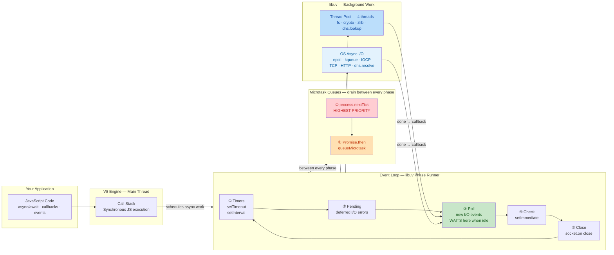

---

### Diagram 2: Event Loop — Complete Tick (Phase Cycle)

One full iteration. **Pink** = microtask drain (must fully empty before the loop advances). **Light green** = Poll phase where Node waits for I/O.

> **How to read this diagram:** Read top to bottom — this is ONE complete tick (iteration) of the event loop.
>
> - **Pink nodes** = microtask drain checkpoints. They appear between _every_ phase. The `nextTick` queue must fully empty first, then the Promise queue — before the loop is allowed to move on.
> - **Light green subgraph (③ POLL)** = the heart of the event loop. Node spends most of its idle time here.
> - **BLOCK node** (medium green) = Node is sleeping — CPU usage is 0. The OS wakes the process when an I/O event arrives or the nearest timer expires.
> - After Close callbacks, the loop restarts at the top. This cycle runs for the entire lifetime of the process.

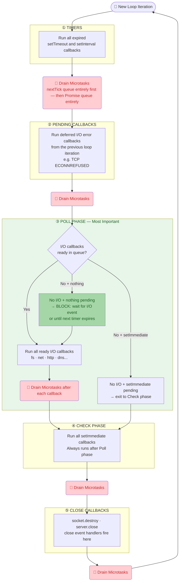

---

### Diagram 3: Microtask Queue — Priority & Drain Logic

Between every event loop phase, Node completely drains two queues in strict order: **`process.nextTick` first** (highest priority), then **Promises**. Only when both are empty does the next phase start.

**Simple mental model — think of it like a priority inbox:**

> You have two inboxes on your desk. Inbox A (nextTick) is always processed before Inbox B (Promise). You empty Inbox A completely, then process Inbox B. But here's the twist: items from Inbox B can drop new items into Inbox A — so after Inbox B empties you must check Inbox A again before you're truly done.

**The 3-step rule (memorise this):**

1. Run **all** `nextTick` callbacks (if a callback adds more, run those too — repeat until empty)
2. Run **all** Promise callbacks (if a callback adds more, run those too — repeat until empty)
3. **Re-check** `nextTick` — a Promise callback may have sneaked new items in. If yes, go back to step 1.

> **How to read this diagram:** Read top to bottom. Each numbered step is a phase. Arrows looping back show "keep going until empty". The "re-check" arrow at the bottom is the only tricky part — it loops back to Step 1 if Promises accidentally queued new `nextTick` callbacks.

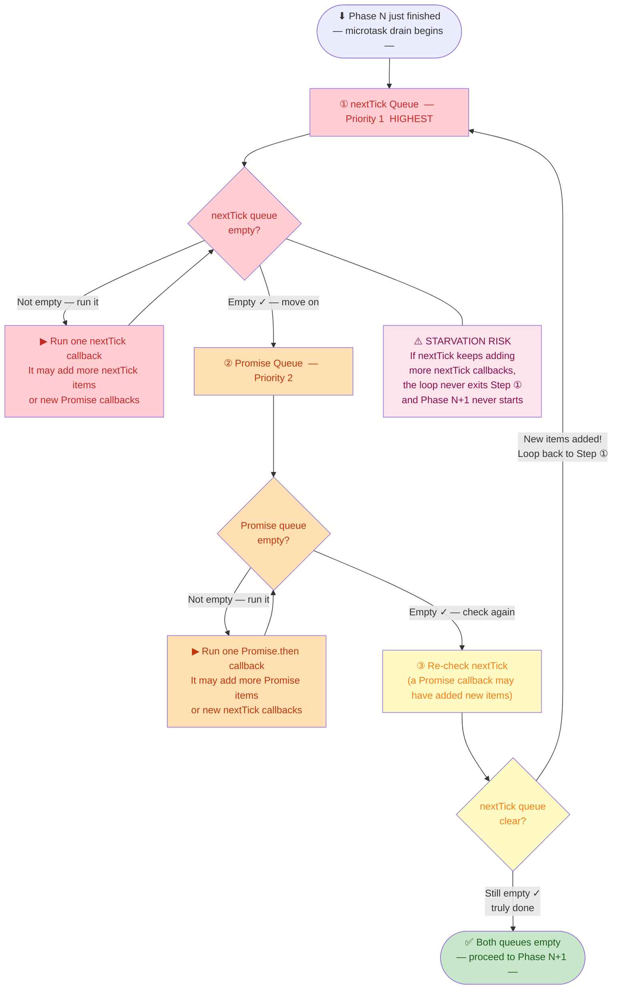

**Concrete trace — what runs and in what order:**

```js
// Code:
process.nextTick(() => console.log("A — nextTick 1"));
Promise.resolve().then(() => {
    console.log("B — Promise 1");
    process.nextTick(() => console.log("C — nextTick added BY Promise")); // adds to nextTick!
});
process.nextTick(() => console.log("D — nextTick 2"));

// Step ①: Drain nextTick queue
//   → 'A — nextTick 1'   (was queued first)
//   → 'D — nextTick 2'   (was queued second)
//   → nextTick empty ✓
//
// Step ②: Drain Promise queue
//   → 'B — Promise 1'    ← this also calls process.nextTick(C)!
//   → Promise empty ✓
//
// Step ③: Re-check nextTick — found C! Loop back to Step ①
//   → 'C — nextTick added BY Promise'
//   → nextTick empty ✓, Promise empty ✓, re-check empty ✓  →  DONE
//
// Final output order:  A  →  D  →  B  →  C
```

---

### Diagram 4: Poll Phase Deep Dive

The Poll phase is the most important — it's where Node actually sleeps waiting for I/O. Its decision tree answers most "why doesn't my callback run?" questions.

> **How to read this diagram:** This is the decision tree Node runs every time it enters the Poll phase.
>
> - **Top diamond** — Is there an I/O callback (fs.readFile, net.connect, etc.) ready in the queue?
> - **Left path (blue nodes)** — Callbacks are ready: run them one at a time. After each, drain microtasks (pink). Exit left when the queue empties or a timer has expired.
> - **Right path** — Queue is empty. Node must decide what to do next:
>     - `setImmediate` registered? → Exit to Check phase immediately (skip sleeping).
>     - Timers pending? → **Sleep** until the nearest timer deadline; OS wakes the process when I/O or the timer fires.
>     - Nothing at all? → **Sleep indefinitely** — block until the OS reports any I/O event.
> - **Green nodes** = sleeping states where Node consumes zero CPU. The OS scheduler handles the wakeup.

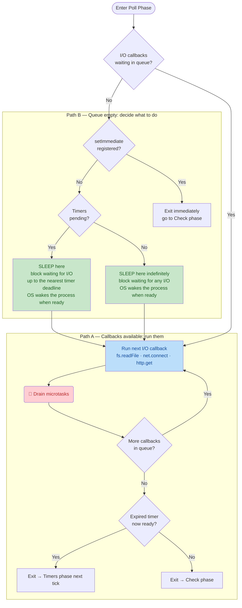

---

### Diagram 5: Step-by-Step Execution Order Trace

Tracing this exact code through the event loop:

```js
console.log("1: sync start");
process.nextTick(() => console.log("2: nextTick"));
Promise.resolve().then(() => console.log("3: promise"));
setTimeout(() => console.log("4: setTimeout"), 0);
setImmediate(() => console.log("5: setImmediate"));
console.log("6: sync end");
// Output: 1 → 6 → 2 → 3 → 4 → 5
```

> **How to read this diagram:** Each colored band is a distinct execution stage. Read top to bottom.
>
> - **Blue band** — Synchronous code runs on the call stack. Async calls are only _registered_ here — nothing executes yet. Produces output `1` then `6`.
> - **Red band** — Microtask drain (runs before any event loop phase): `nextTick` fires first (output `2`), then the Promise callback (output `3`).
> - **Purple band** — Timers phase: `setTimeout(0)` callback fires (output `4`).
> - **Light green band** — Poll phase: no I/O pending; `setImmediate` is registered so Node exits Poll immediately without sleeping.
> - **Darker green band** — Check phase: `setImmediate` callback fires (output `5`).

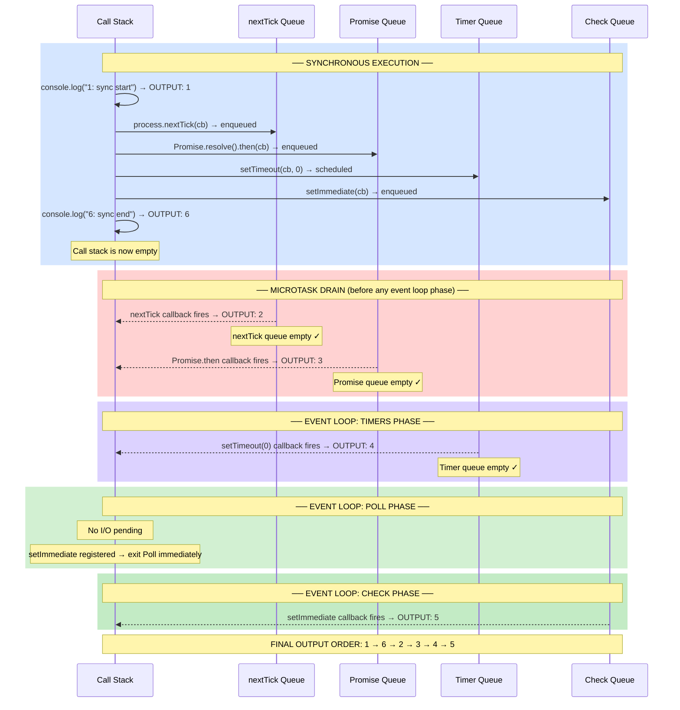

---

### Diagram 6: setTimeout(0) vs setImmediate — Why Order is Non-Deterministic

When `setTimeout(fn, 0)` and `setImmediate(fn)` are registered in the **main module** (not inside an I/O callback), their execution order is unreliable — it depends on how long Node startup takes relative to the 1ms timer minimum.

> **How to read this diagram:** Follow the branching paths from the startup decision diamond.
>
> - **Purple path** — Node startup took less than 1ms: the timer has not expired when the Timers phase runs, so the loop skips Timers → enters Poll → exits to Check → `setImmediate` fires first.
> - **Blue path** — Node startup took more than 1ms: the timer is already expired when Timers runs → `setTimeout` fires first.
> - **Orange box** = the non-deterministic zone — you cannot predict which path runs. This is why the order is unreliable in the main module.
> - **Fix (bottom subgraph)** — Wrap both registrations inside an I/O callback (e.g., `fs.readFile`). You are already in the Poll phase when the callback runs, so after Poll ends, Check **always** comes next — `setImmediate` is **always** first, 100% deterministically.

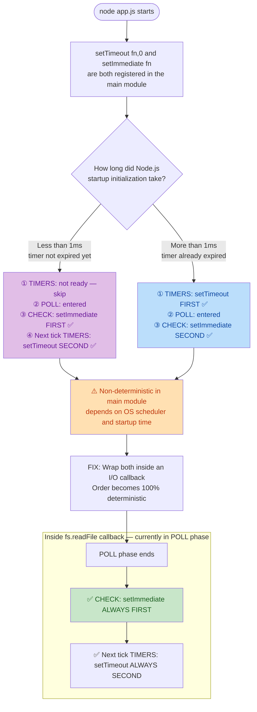

---

### Diagram 7: Event Loop Starvation — Cause and Fix

Starvation happens when one queue never stops growing, preventing the event loop from advancing to any other phase.

> **How to read this diagram:** Compare the two subgraphs side by side.
>
> - **Red subgraph (Bad)** — `process.nextTick` calls itself recursively. Each callback schedules another before the microtask queue can empty. The event loop is stuck draining `nextTick` forever. `fs.readFile` callbacks and `setTimeout` callbacks highlighted in red are **permanently blocked**.
> - **Green subgraph (Good)** — Work is split into fixed-size batches (e.g., 100 items at a time). After each batch, `setImmediate` schedules the next batch. This _yields_ back to the event loop between batches, letting I/O and timers run normally in the gaps.
> - **Key rule**: Never use `process.nextTick` for iterative/recursive scheduling. Use `setImmediate` instead.

```mermaid
graph TD
    subgraph BAD ["❌ BAD — Infinite nextTick Starves Everything"]
        B1["function recurse<br/>  process.nextTick(recurse)<br/>recurse()  ← called once"]
        B2["nextTick #1 runs → schedules #2"]
        B3["nextTick #2 runs → schedules #3"]
        B4["nextTick #N → schedules #N+1<br/>... forever ..."]
        STARVIO["❌ Poll phase: fs.readFile callback<br/>NEVER RUNS"]
        STARVTQ["❌ Timers phase: setTimeout callback<br/>NEVER RUNS"]
        B1 --> B2 --> B3 --> B4
        B4 --> STARVIO
        B4 --> STARVTQ
    end

    subgraph GOOD ["✅ GOOD — Yield to I/O with setImmediate"]
        G1["Process current batch of 100 items"]
        G_IO["✅ Poll: I/O callbacks run normally"]
        G_TQ["✅ Timers: setTimeout runs normally"]
        G2["setImmediate schedules NEXT batch"]
        G3["Check phase: next batch starts"]
        G1 --> G_IO --> G_TQ --> G2 --> G3 --> G1
    end

    style STARVIO fill:#ffcdd2,color:#c62828
    style STARVTQ fill:#ffcdd2,color:#c62828
    style G_IO fill:#c8e6c9,color:#1b5e20
    style G_TQ fill:#c8e6c9,color:#1b5e20
```

---

### Key APIs / Patterns

- `setTimeout(cb, delay)` — runs in **timers phase** (minimum ~1-4ms delay depending on system load).
- `setImmediate(cb)` — runs in **check phase** (after I/O polling).
- `process.nextTick(cb)` — runs _before_ next phase (microtask, highest priority).
- `Promise.resolve().then(cb)` — runs as microtask (after `process.nextTick` queue empties).

### Simple Example

```js
setTimeout(() => console.log("timer"), 0);
setImmediate(() => console.log("immediate"));
Promise.resolve().then(() => console.log("microtask"));
process.nextTick(() => console.log("nextTick"));
console.log("sync");

// Output order:
// sync          ← synchronous, always first
// nextTick      ← microtask, highest async priority
// microtask     ← Promise microtask
// timer         ← timers phase (may swap with immediate in main module)
// immediate     ← check phase
```

### Senior-Level Q&A

**Q1: Why does `setTimeout(..., 0)` not execute immediately? What's the actual minimum delay?**

A: `setTimeout` is scheduled in the **timers phase**. If the event loop is already past the timers phase in the current iteration, your callback must wait for the next full cycle. Additionally:

- OS timer granularity: typically 1-4ms (not 0ms).
- If your system is busy, the timer fires but execution waits for JS execution to be free.
- Even `setTimeout(cb, 0)` in a tight loop won't block; it queues all callbacks for the _next_ timers phase.

```js
// Example: Timer delay varies based on event loop phase
const start = performance.now();
setTimeout(() => {
    console.log("Actual delay:", performance.now() - start); // Often 1-4ms, not 0
}, 0);
```

**Q2: Can you explain event loop starvation and how to avoid it?**

A: **Starvation** occurs when one phase prevents the event loop from progressing to I/O handling (poll phase). Common causes:

- **`process.nextTick` abuse:** Infinite `process.nextTick` loops starve I/O.

    ```js
    // BAD: Starves I/O
    function recurse() {
        process.nextTick(recurse);
    }
    recurse(); // I/O callbacks (HTTP requests, fs operations) never run
    ```

- **Tight sync loops:** Block the entire event loop.

    ```js
    // BAD: CPU blocking
    while (true) {
        /* compute */
    } // Poll phase never executes
    ```

- **Solution:** Use `setImmediate` to yield to I/O between batches.
    ```js
    // GOOD: Yields to I/O
    function batchProcess(items) {
        let i = 0;
        function process() {
            const end = Math.min(i + 100, items.length);
            for (; i < end; i++) {
                /* process item */
            }
            if (i < items.length) setImmediate(process);
        }
        process();
    }
    ```

**Q3: What's the relationship between the microtask queue and macrotask queue? Give an example of starvation.**

A:

- **Microtask queue:** `process.nextTick`, Promises (highest priority, run _between_ phases).
- **Macrotask queue:** Timers, I/O callbacks, `setImmediate` (run _during_ phases).
- Microtasks execute _before_ any macrotask in the next phase.

**Starving macrotasks with microtasks:**

```js
function recursivePromise() {
    return Promise.resolve().then(() => {
        console.log("Promise");
        return recursivePromise(); // Create infinite microtask chain
    });
}
recursivePromise();

setTimeout(() => {
    console.log("This timer may starve — never executes!"); // Waits for Promise chain
}, 0);
```

**Fix:** Yield to the event loop with a macrotask.

```js
function recursivePromise() {
    return Promise.resolve().then(() => {
        console.log("Promise");
        return new Promise((resolve) => setImmediate(() => resolve())).then(
            () => recursivePromise(),
        );
    });
}
```

**Q4: In which phase does `fs.readFile` callback execute? Why?**

A: In the **poll phase** (or pending callbacks phase if delayed). The actual file I/O is offloaded to libuv's thread pool; once complete, the callback is queued and executed when the event loop reaches the poll phase.

```js
fs.readFile("file.txt", (err, data) => {
    console.log("Runs in poll phase");
});
setImmediate(() => console.log("Check phase"));
// Output: Poll phase callback first, then check phase
```

**Q5: What happens if you call `setTimeout` with a negative or very large delay?**

A:

- **Negative:** Treated as 0 (minimum delay).
- **Large (> 24.8 days = 2^31-1 ms):** Overflows system timer, may wrap or be capped.

```js
setTimeout(() => console.log("runs"), -100); // Same as 0
setTimeout(() => console.log("large"), 2 ** 31); // May wrap on some systems; use smaller delays
```

### Best Practices

- Use `process.nextTick` only for critical post-execution callbacks; prefer `setImmediate` for scheduling work after I/O.
- Organize code: sync → `process.nextTick` (microtask) → I/O (poll) → `setImmediate` (check).
- For CPU-bound work, use `setImmediate` to yield to I/O instead of blocking the entire loop.
- Monitor event loop lag with tools like [node-clinicjs](https://clinicjs.org/) to detect blocking code.

### Common Pitfalls

- **Blocking CPU-bound work on the main thread** stalls the event loop — use worker threads or child processes for heavy computation.
- **Misunderstanding ordering** of `setTimeout(..., 0)` vs `setImmediate` leads to race surprises across different OS/Node versions.
- **Infinite microtask loops** starve macrotasks (timers, I/O); always yield with `setImmediate` in loops.
- **Assuming timer precision:** `setTimeout(cb, 100)` may execute at 101-110ms due to system load and OS granularity.

> **💡 Interview Tip — One-Liner Answers:**
>
> - _"Explain the event loop in one sentence."_ → It's a single-threaded loop that processes async callbacks in 6 phases (timers → pending → idle → poll → check → close), draining microtasks between every phase.
> - _"process.nextTick vs setImmediate?"_ → `nextTick` fires before any I/O (microtask, highest priority); `setImmediate` fires after I/O in the check phase.
> - _"What blocks the event loop?"_ → Any synchronous CPU-bound operation (tight loops, JSON.parse of huge data, sync fs calls, RegEx backtracking).
> - _"setTimeout(fn, 0) vs setImmediate(fn)?"_ → Non-deterministic in the main module; inside an I/O callback, `setImmediate` always runs first.

> **📝 Quick Revision — Event Loop:**
>
> | Phase              | What runs                      | Example API                        |
> | ------------------ | ------------------------------ | ---------------------------------- |
> | Timers             | Expired setTimeout/setInterval | `setTimeout(cb, 100)`              |
> | Pending            | Deferred I/O callbacks         | TCP errors                         |
> | Poll               | New I/O events; waits if idle  | `fs.readFile` callback             |
> | Check              | setImmediate callbacks         | `setImmediate(cb)`                 |
> | Close              | Close event callbacks          | `socket.on('close')`               |
> | **Between phases** | **Microtask queue**            | `process.nextTick`, `Promise.then` |
>
> **Priority order:** sync code > `process.nextTick` > `Promise.then` > `setTimeout(0)` > `setImmediate`

### Example file: [eventloop.js](eventloop.js)

[↑ Back to Index](#table-of-contents)

---

### 1.3 libuv Thread Pool

### Concepts

Node.js is famous for being "single-threaded," but that's only half the story. Under the hood, Node uses a C library called **libuv** that manages a **thread pool** — a group of background worker threads that handle operations the OS can't do asynchronously.

**Why does Node need a thread pool?** Some system operations are inherently blocking at the OS level. For example, reading a file on most operating systems requires a blocking system call (`read()`). If Node tried to do this on its main thread, the entire server would freeze. So libuv offloads these blocking operations to background threads — your JavaScript keeps running while the file read happens in the background.

**The default pool has only 4 threads.** This is the most important thing to understand. Those 4 threads are **shared** across ALL operations that use the pool — file system operations, DNS lookups (`dns.lookup`), crypto operations, and compression (zlib). If you have 4 heavy `crypto.pbkdf2()` calls running, all 4 threads are busy, and your `fs.readFile()` must **wait in line** until a thread frees up.

**What DOESN'T use the thread pool?** Network I/O (TCP, HTTP, WebSocket) uses the operating system's own async mechanisms — `epoll` on Linux, `kqueue` on macOS, `IOCP` on Windows. These are truly non-blocking at the OS level, so they don't need pool threads. This is why Node handles thousands of network connections efficiently on a single thread.

**Think of it this way:** The event loop is like a receptionist who can handle many phone calls simultaneously (network I/O). But when someone asks for a file from the back room, the receptionist must send one of only 4 assistants (thread pool) to fetch it. If all 4 assistants are busy, the next file request waits.

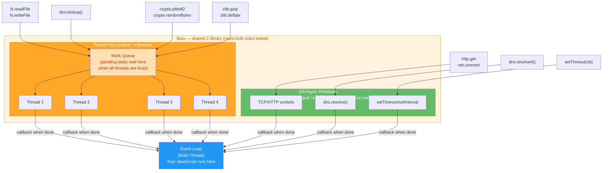

### Which APIs Use the Thread Pool?

| Uses Thread Pool             | Uses OS Async (no pool) |
| ---------------------------- | ----------------------- |
| `fs.*` (all file operations) | `net.*` (TCP sockets)   |
| `dns.lookup()`               | `dns.resolve()`         |
| `crypto.pbkdf2()`            | `http.*` (network I/O)  |
| `crypto.randomBytes()`       | Timers (`setTimeout`)   |
| `zlib.*` (compression)       | `child_process.*`       |
| Pipes (some platforms)       | `process.nextTick()`    |

### Thread Pool Saturation Problem

> 📖 **What this example demonstrates:** The 4 default libuv threads are a shared resource. If all 4 are busy doing heavy crypto work, they can't also work on file reads or DNS lookups. Your `fs.readFile()` call will just sit in a queue and wait — like being stuck behind 4 people at a one-cashier store.
>
> 🔑 **Key terms:**
>
> - **`pbkdf2`** — "Password-Based Key Derivation Function 2" — a deliberately **slow** algorithm used to hash passwords securely. It runs thousands of iterations of SHA-512. This is CPU-heavy work that uses a full thread.
> - **Thread saturation** — When all threads in the pool are busy. New work queues up and waits instead of running in parallel.
> - **`UV_THREADPOOL_SIZE`** — An environment variable that sets how many threads libuv creates. Must be set **before** the Node.js process starts any async operations.

```js
const crypto = require("crypto");
const fs = require("fs");

// ❌ PROBLEM: Starting 4 crypto operations EXACTLY fills all 4 threads.
// Each pbkdf2 call runs 100,000 SHA-512 iterations — takes ~200-500ms per call.
// With 4 threads all occupied, NO other thread-pool work can start until one finishes.
for (let i = 0; i < 4; i++) {
    crypto.pbkdf2(
        "password", // The string to hash (e.g., user's password)
        "salt", // A random string added before hashing to prevent pre-computed attacks
        100000, // Iterations: how many times to apply the hash (more = slower = safer)
        64, // Output key length in bytes
        "sha512", // Hash algorithm to use
        () => {
            console.log(`Crypto ${i} done`); // This fires after ~300ms
        },
    );
}

// This fs.readFile would normally finish in <1ms (fast disk read).
// But RIGHT NOW all 4 libuv threads are busy with crypto above.
// So this readFile cannot even START until one crypto finishes — delayed by ~300ms!
fs.readFile("config.json", (err, data) => {
    console.log("File read done"); // ← Delayed even though disk read is fast!
});

// ✅ FIX: Increase thread pool size BEFORE any async work starts.
// Put this at the very top of your main entry file (e.g., index.js)
// CANNOT be set after the process has already started doing async work
process.env.UV_THREADPOOL_SIZE = 16; // Now 16 threads — crypto gets 4, fs/dns gets the rest

// Alternative: Set via command line when starting your app:
// UV_THREADPOOL_SIZE=16 node app.js
```

> ⚠️ **Real-world impact:** In a web server handling many requests, if each request does a `crypto.pbkdf2` (like hashing user passwords on login), and you have 4 threads, only 4 logins can run concurrently. The 5th login attempt waits. This is why login endpoints can become a bottleneck under high traffic.

### Senior-Level Q&A

**Q1: Your DNS lookups are slow in production. What could be wrong?**

A: `dns.lookup()` uses the libuv thread pool (not OS async). If pool is saturated (e.g., heavy `fs` or `crypto` ops), DNS lookups queue behind them.

> 📖 **What this example demonstrates:** `http.get()` internally uses `dns.lookup()` to resolve domain names. `dns.lookup()` goes through the thread pool. If the thread pool is full, even a simple HTTP request must wait before it can even look up the server's IP address. `dns.resolve4()` bypasses the pool entirely by using the OS's async DNS machinery.
>
> 🔑 **Key terms:**
>
> - **`getaddrinfo()`** — An OS-level C function that resolves a hostname to an IP address. It’s **blocking** (waits for an answer before returning), so libuv must run it in a thread.
> - **c-ares** — A C library that does DNS lookups using non-blocking network I/O (same way Node handles HTTP). Since it’s already async, it doesn’t need a thread.
> - **TTL (Time-To-Live)** — How long a DNS record is valid/cached before needing a fresh lookup. `ttl: 300` means cache DNS results for 300 seconds (5 minutes).

```js
// ❌ Slow path: http.get → dns.lookup → uses thread pool
// If thread pool is saturated by crypto/fs, this DNS lookup queues up and waits
const http = require("http");
http.get("http://example.com", ...); // Internally calls dns.lookup('example.com') — uses a thread

// ✅ Fix 1: Give the pool more threads so DNS doesn’t have to wait
process.env.UV_THREADPOOL_SIZE = 16; // Must be set before any async operations start!

// ✅ Fix 2: Use dns.resolve4 instead of dns.lookup
// dns.resolve4 uses c-ares (async library) — it does NOT use a libuv thread at all
const dns = require("dns");
const { Resolver } = dns;
const resolver = new Resolver(); // Create a resolver instance
resolver.resolve4("example.com", (err, addresses) => {
    // 'addresses' is an array of IPv4 addresses, e.g. ['93.184.216.34']
    // This callback runs via the OS async I/O path — no thread needed!
    console.log(addresses);
});

// ✅ Fix 3: Cache DNS results to avoid repeated lookups entirely
// dnscache intercepts dns.lookup and remembers answers for 'ttl' seconds
const dnscache = require("dnscache")({ enable: true, ttl: 300 });
// Now repeated calls to the same hostname skip the thread pool completely
```

**Q2: How do you determine the right `UV_THREADPOOL_SIZE` for your app?**

A: Profile your app to see how many concurrent thread-pool operations occur:

```js
// Monitor thread pool usage
const { performance, PerformanceObserver } = require("perf_hooks");

// Rule of thumb:
// UV_THREADPOOL_SIZE = max concurrent (fs + dns.lookup + crypto + zlib) operations
// Default: 4 | Heavy I/O apps: 16-64 | Max: 128

// ⚠️ Too many threads = context switching overhead + memory waste
// Each thread: ~8KB stack + OS overhead
```

**Q3: Why does `dns.lookup()` use the thread pool but `dns.resolve()` doesn't?**

A: `dns.lookup()` calls the OS's `getaddrinfo()` which is a blocking C library call — must be offloaded to a thread. `dns.resolve()` uses c-ares (async DNS library) that uses non-blocking I/O — no thread needed.

> **💡 Interview Tip — One-Liner Answers:**
>
> - _"Is Node.js single-threaded?"_ → JavaScript runs on one thread, but libuv manages a thread pool (default 4) for blocking operations like fs, crypto, dns.lookup, and zlib.
> - _"Why are my DNS lookups slow?"_ → `dns.lookup()` uses the libuv thread pool. If it's saturated by fs/crypto ops, DNS queues behind them. Use `dns.resolve()` (OS async) or increase `UV_THREADPOOL_SIZE`.
> - _"How many threads should I use?"_ → `UV_THREADPOOL_SIZE` = max concurrent (fs + dns.lookup + crypto + zlib) operations. Default 4, max 128. Too many = context-switch overhead.

> **📝 Quick Revision — libuv Thread Pool:**
>
> | Uses Thread Pool                             | Uses OS Async (no pool)                    |
> | -------------------------------------------- | ------------------------------------------ |
> | `fs.*`, `dns.lookup()`, `crypto.*`, `zlib.*` | `net.*`, `http.*`, `dns.resolve()`, timers |
>
> **Key number:** Default = 4 threads. Set `UV_THREADPOOL_SIZE` **before** any async operation.

[↑ Back to Index](#table-of-contents)

---

### 1.4 Buffer & Binary Data

### Concepts

JavaScript was designed for web pages — it's great with text (strings), but traditionally weak with raw binary data. **Buffer** fills this gap in Node.js. It represents a chunk of raw memory (like an array of bytes) that Node uses to handle binary data: file contents, network packets, images, encrypted data, etc.

**Why not just use strings?** Strings in JavaScript are encoded as UTF-16 internally, which means every character takes 2 bytes minimum. Binary data (like a PNG image or a TCP packet) isn't text — it's just raw bytes. If you tried to read a PNG file as a string, you'd get garbled data. Buffer lets you work with the raw bytes directly.

**Where Buffers live in memory:** Unlike regular JavaScript objects that live on V8's heap (managed by the garbage collector), Buffers allocate memory **outside** the V8 heap using C++ bindings. This is important because V8's heap has a size limit (~1.5GB), but Buffer memory doesn't count against it. You can allocate much larger Buffers — though you should use streams for truly large data.

**Encoding** is how you convert between Buffers (raw bytes) and strings (human-readable text). Common encodings:

- `utf8` — Standard text encoding (default). Each character is 1-4 bytes
- `base64` — Encodes binary as ASCII text (used in APIs, email attachments)
- `hex` — Each byte represented as 2 hex characters (used in hashes, debugging)
- `ascii` — 7-bit encoding, only English characters

**The dangerous gotcha:** `Buffer.slice()` does NOT copy data — it creates a **view** into the same memory. If you modify the slice, the original changes too. And if you keep a tiny slice reference, the entire original buffer stays in memory. Always use `Buffer.from()` to make an independent copy.

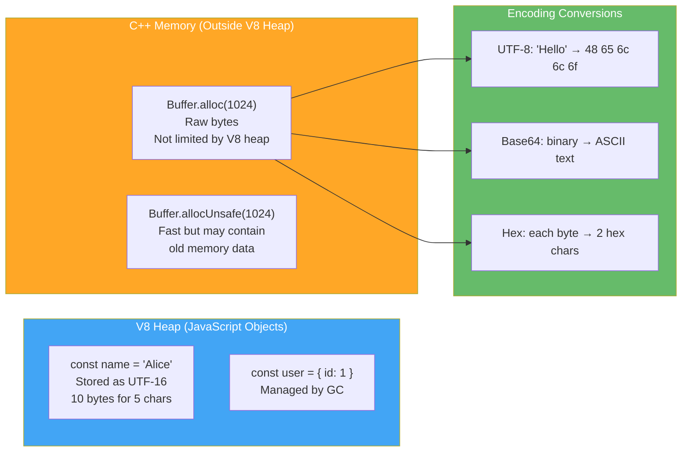

### Key APIs

| Method                     | Description                                        | Returns  |
| -------------------------- | -------------------------------------------------- | -------- |
| `Buffer.alloc(size)`       | Allocate zero-filled buffer (safe)                 | Buffer   |
| `Buffer.allocUnsafe(size)` | Allocate without zeroing (fast, may leak old data) | Buffer   |
| `Buffer.from(string, enc)` | Create from string with encoding                   | Buffer   |
| `Buffer.from(array)`       | Create from byte array                             | Buffer   |
| `buf.toString(enc)`        | Convert to string                                  | String   |
| `buf.slice(start, end)`    | Reference same memory (no copy!)                   | Buffer   |
| `Buffer.concat(buffers)`   | Merge multiple buffers                             | Buffer   |
| `buf.compare(other)`       | Compare for sorting                                | -1, 0, 1 |

### Buffer Safety

> 📖 **What this example demonstrates:** There are two ways to create a Buffer — the safe way (`alloc`) and the fast-but-dangerous way (`allocUnsafe`). It also shows the most dangerous gotcha: `Buffer.slice()` shares memory with the original, so modifying the slice **silently mutates** what you thought was untouched data.
>
> 🔑 **Key terms:**
>
> - **Zero-filled** — Every byte in the buffer is set to `0` before use. Like getting a blank piece of paper. Safe because there's no leftover data from previous operations.
> - **Old memory data** — When your process allocates memory, it might get a block previously used by another part of the program. That old block still has its old bytes. `allocUnsafe` doesn't wipe these old bytes, so they could contain old passwords, tokens, or any other sensitive data.
> - **ASCII code 74** — The number that represents the letter `'J'` in the ASCII encoding table. Each character maps to a number: `'A'=65, 'B'=66, ..., 'J'=74, ..., 'Z'=90`.
> - **Buffer.from(buf)** — Creates a completely new buffer with the same bytes but **independent memory**. Changes to the copy don't affect the original.

```js
// ────────────────────────────────────────────────────────
// ✅ SAFE: alloc(256) creates 256 bytes, ALL set to 0
// Like getting a freshly erased whiteboard — guaranteed clean
const safeBuf = Buffer.alloc(256);
// safeBuf[0] through safeBuf[255] are all 0. Safe to send to users.

// ⚠️ UNSAFE: allocUnsafe(256) creates 256 bytes WITHOUT wiping them
// Node reuses memory from its internal pool — faster, but bytes might have old values
const unsafeBuf = Buffer.allocUnsafe(256);
// unsafeBuf might contain old password bytes, old HTTP headers, etc.
// ONLY use this when you are 100% sure you will write ALL 256 bytes yourself immediately after

// ────────────────────────────────────────────────────────
// ✅ Creating a Buffer FROM a string (most common usage)
const greeting = Buffer.from("Hello, World!", "utf8");
// Node converts each character to its UTF-8 byte representation
// 'H'=72, 'e'=101, 'l'=108, 'l'=108, 'o'=111, ','=44, ' '=32, ...
console.log(greeting.toString()); // 'Hello, World!' ← converts bytes back to text
console.log(greeting.toString("base64")); // 'SGVsbG8sIFdvcmxkIQ==' ← binary as printable ASCII
console.log(greeting.toString("hex")); // '48656c6c6f2c20576f726c6421' ← each byte as 2 hex digits

// ────────────────────────────────────────────────────────
// ⚠️ DANGEROUS: slice() does NOT make a copy — it's a VIEW into the SAME memory!
const original = Buffer.from("Hello"); // bytes: [72, 101, 108, 108, 111]
const slice = original.slice(0, 3); // View of bytes 0,1,2: [72, 101, 108] = 'Hel'
// slice and original point to THE SAME physical memory

slice[0] = 74; // Change byte index 0 to ASCII 74, which is the letter 'J'
console.log(original.toString()); // Prints: 'Jello' — The ORIGINAL was silently changed!
// This is the most common Buffer-related bug — you think you're changing a copy but you're not

// ✅ SAFE copy: Buffer.from(buf) creates INDEPENDENT memory
const copy = Buffer.from(original); // Copies every byte into a brand new memory location
// Now original and copy are completely independent — changing one doesn't affect the other
```

### Encoding Conversions

> 📖 **What this example demonstrates:** How to convert between binary data (Buffers) and human-readable string formats. Base64 is widely used in APIs and file uploads. Hex is used in cryptographic hashes. Understanding these conversions is essential when working with authentication tokens, file uploads, or any binary protocol.
>
> 🔑 **Key terms:**
>
> - **Base64** — An encoding scheme that represents binary data as 64 safe ASCII characters (A-Z, a-z, 0-9, +, /). Every 3 bytes of input become 4 characters of output. Used in Basic Auth headers (`Authorization: Basic dXNlcjpwYXNz`), data URLs, and email attachments.
> - **SHA-256** — A cryptographic hash function that takes any input and produces a fixed 256-bit (32-byte) output. The output is always exactly the same length, and you can't reverse it back to the input.
> - **`digest('hex')`** — The final step of hashing — outputs the hash result as a hex string (64 characters for SHA-256).
> - **PNG magic bytes** — The first few bytes of a file that identify its format. PNG files always start with `[137, 80]` (hex: `89 50`). Applications read these bytes to confirm the file type without relying on the extension.

```js
// ── BASE64: converting text to a safe ASCII representation ──────────────────
const text = "user:password"; // This is what a Basic Auth header contains before encoding
// Step 1: Convert string to Buffer (raw bytes)
// Step 2: Convert those bytes to base64 string (safe for HTTP headers)
const base64 = Buffer.from(text).toString("base64");
console.log(base64); // 'dXNlcjpwYXNzd29yZA==' ← safe to put in an HTTP header

// Decoding: reverse the process
const decoded = Buffer.from(base64, "base64").toString();
console.log(decoded); // 'user:password' ← original text restored
// Real-world: When you send Authorization: Basic dXNlcjpwYXNz, the server does exactly this decode

// ── HEX: for cryptographic hashes ─────────────────────────────────────
const crypto = require("crypto");
// createHash('sha256') → starts a hash computation using the SHA-256 algorithm
// .update('data')      → feeds the string 'data' into the hasher
// .digest('hex')       → finalizes the hash and returns it as a 64-character hex string
const hash = crypto.createHash("sha256").update("data").digest("hex");
console.log(hash); // '3a6eb079...adc8b7' ← ALWAYS the same 64 chars for 'data', can't be reversed
// Real-world: storing password hashes in databases, generating ETags, signing documents

// ── BINARY FILES: working with raw file bytes ────────────────────────────
const fs = require("fs");
// readFileSync with no encoding = returns raw Buffer (not a string)
const fileBuffer = fs.readFileSync("image.png");
console.log(fileBuffer.length); // File size in bytes (e.g., 245760 for a 240KB image)
console.log(fileBuffer[0], fileBuffer[1]); // 137, 80 ← these 2 magic bytes PROVE it's a PNG file
// All PNG files start with: 137 80 78 71 13 10 26 10 (in decimal)
// If fileBuffer[0] is NOT 137, the file is corrupted or not actually a PNG
```

### Senior-Level Q&A

**Q1: What's the difference between `Buffer.alloc()` and `Buffer.allocUnsafe()`? When use unsafe?**

A: `alloc()` zero-fills memory (safe but slower). `allocUnsafe()` skips zeroing (faster but may expose old data from memory).

Use `allocUnsafe()` only when you will **immediately fill** the entire buffer (e.g., receiving network data, reading file into buffer). Never send uninitialized buffer content to users.

**Q2: How do Buffers relate to streams?**

A: Streams internally use Buffers as chunks. Each `data` event emits a Buffer (unless in object mode). `highWaterMark` controls the Buffer size threshold for backpressure.

> 📖 **What this example demonstrates:** When you stream a file, Node doesn't give you the whole file at once. It breaks it into Buffer chunks and fires the `data` event repeatedly. Each chunk is a Buffer object. You can inspect its size and content.
>
> 🔑 **Key terms:**
>
> - **`highWaterMark`** — A threshold (in bytes) that controls how much data Node buffers before pausing the source. Default is 16KB (16,384 bytes). When the buffer exceeds this, Node tells the source to stop sending (backpressure).
> - **`chunk instanceof Buffer`** — Checks if the variable is a Buffer object. This returns `true` for binary streams. If you set `encoding: 'utf8'` on the stream, chunks become strings instead.

```js
const readable = fs.createReadStream("file.txt");
// The 'data' event fires once per chunk as Node reads pieces of the file
readable.on("data", (chunk) => {
    // chunk is a Buffer unless you passed { encoding: 'utf8' } to createReadStream
    console.log(chunk instanceof Buffer); // true ← it's binary data, not a string
    console.log(chunk.length); // How many bytes in this particular chunk
    // Will be <= highWaterMark (default: 16384 bytes = 16KB)
    // To work with text: chunk.toString() or chunk.toString('utf8')
});
```

**Q3: Can Buffer operations cause memory leaks?**

A: Yes — `Buffer.slice()` shares memory with the original. If you keep a small slice reference, the entire original buffer stays in memory (can't be GC'd).

> 📖 **What this example demonstrates:** The memory leak from `Buffer.slice()`. The garbage collector (GC) can only free memory when nothing references it. A 10-byte slice still secretly references the 10MB buffer underneath — so the GC can't free those 10MB.
>
> 🔑 **Key terms:**
>
> - **Garbage Collector (GC)** — An automatic memory manager built into V8. It finds objects in memory that nothing is pointing to anymore, and frees that memory. If something still points to an object, the GC won't touch it.
> - **`10 * 1024 * 1024`** — Math for 10 megabytes: 10 × 1024 bytes/KB × 1024 KB/MB = 10,485,760 bytes.

```js
// ❌ MEMORY LEAK: slice() looks innocent but secretly keeps 10MB alive
function leak() {
    // Allocate 10MB buffer (this goes into C++ memory outside V8's heap)
    const bigBuffer = Buffer.alloc(10 * 1024 * 1024); // 10MB

    // Create a slice of just the first 10 bytes
    // This looks like a tiny 10-byte object, but internally it holds a reference to bigBuffer!
    // As long as this slice exists, bigBuffer CANNOT be freed by the garbage collector
    return bigBuffer.slice(0, 10);
    // After this function returns, bigBuffer goes out of scope...
    // but the slice still exists, so the 10MB stays allocated. Memory wasted!
}

// After calling leak() 1000 times: 10GB of memory slowly accumulates

// ✅ FIX: Use Buffer.from() to copy only the bytes you need
function noLeak() {
    const bigBuffer = Buffer.alloc(10 * 1024 * 1024); // 10MB
    // Buffer.from() creates a BRAND NEW INDEPENDENT buffer with just those 10 bytes
    // Now there are TWO separate allocations: the 10MB (bigBuffer) and the 10-byte copy
    const safeCopy = Buffer.from(bigBuffer.slice(0, 10)); // Only 10 bytes kept alive
    // bigBuffer now has NO references — GC will free its 10MB on next collection
    return safeCopy; // Only 10 bytes returned and kept alive
}
```

> **💡 Interview Tip — One-Liner Answers:**
>
> - _"What is a Buffer?"_ → A fixed-size chunk of raw memory outside V8's heap, used for binary data (files, network packets, crypto output).
> - _"alloc vs allocUnsafe?"_ → `alloc` zero-fills (safe, slower). `allocUnsafe` skips zeroing (fast, may leak old memory). Only use unsafe when you'll immediately overwrite all bytes.
> - _"Why does Buffer.slice() cause memory leaks?"_ → `slice()` shares the original memory. A 10-byte slice keeps the entire 10MB parent alive. Use `Buffer.from(slice)` to copy.

> **📝 Quick Revision — Buffer:**
>
> | Method                  | Safe?            | Use when                                              |
> | ----------------------- | ---------------- | ----------------------------------------------------- |
> | `Buffer.alloc(n)`       | ✅ Yes           | Default choice, zero-filled                           |
> | `Buffer.allocUnsafe(n)` | ⚠️ No            | Performance critical, will fill immediately           |
> | `Buffer.from(str, enc)` | ✅ Yes           | Converting strings ↔ binary                           |
> | `buf.slice()`           | ⚠️ Shares memory | Read-only views; copy with `Buffer.from()` if keeping |
>
> **Key gotcha:** Buffers live outside V8 heap → don't count against `--max-old-space-size` but DO count against system RAM.

[↑ Back to Index](#table-of-contents)

---

## Phase 2 — Core Async & Data Flow

### 2.1 Async Patterns

### Concepts

Asynchronous programming is the **core skill** of Node.js development. In traditional languages like Java or Python, when your code reads a file or calls an API, the thread **blocks** — it sits and waits for the result, doing nothing. Multiply that by thousands of users, and you need thousands of threads (expensive memory-wise).

Node.js flips this model: instead of waiting, your code says "go read that file, and here's a function to call when you're done" — then it immediately moves on to handle the next request. This is **non-blocking I/O**, and it's why a single Node process can handle thousands of concurrent connections.

**The evolution of async in JavaScript:**

1. **Callbacks (2009):** The original pattern. You pass a function that runs when the async work completes. The convention is `callback(error, result)` — error first. The problem? When you chain multiple operations, the code nests deeper and deeper, forming the infamous **"callback hell"** — unreadable, unmaintainable pyramids of code.

2. **Promises (2015, ES6):** A Promise is an object that represents a future value. Instead of nesting, you **chain** `.then()` calls. Errors propagate through `.catch()`. Much cleaner, but long chains still drift horizontally.

3. **Async/Await (2017, ES8):** Syntactic sugar over Promises. You write code that **looks** synchronous but behaves asynchronously. `await` pauses execution of the current function (not the thread!) until the Promise resolves. Combined with `try/catch`, it's the cleanest way to handle async operations.

**Key principle:** All three patterns do the same thing — they schedule work to run later. The difference is only in readability and error handling. Under the hood, `async/await` compiles to Promises, and Promises use the microtask queue.

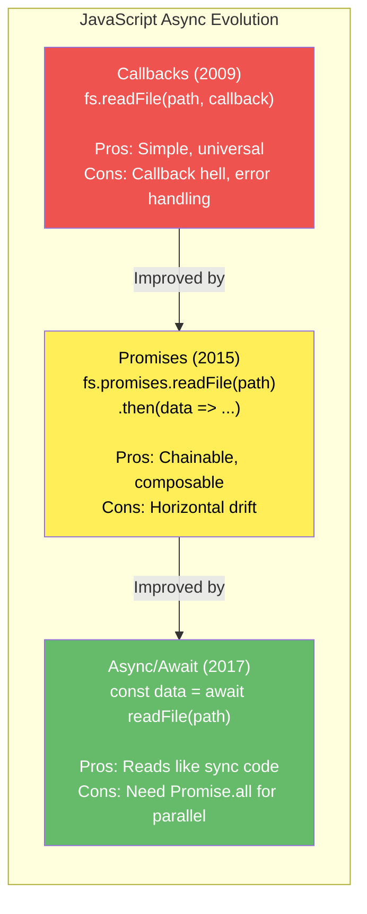

### Key APIs

- `fs.readFile(path, cb)` (callback style) vs `fs.promises.readFile(path)` (promise style).
- `Promise.all(promises)` — wait for all; reject if any fails.
- `Promise.allSettled(promises)` — wait for all; resolve with results and reasons (no early rejection).
- `Promise.race(promises)` — return first settled promise.
- `Promise.any(promises)` — return first fulfilled promise (rejects only if all fail).

### Comparison Table

| Pattern         | Error Handling        | Composability  | Readability    | Common Issues                             |
| --------------- | --------------------- | -------------- | -------------- | ----------------------------------------- |
| **Callback**    | Passed as error param | Poor (nesting) | Hard to follow | Callback hell, forgotten error checks     |
| **Promise**     | `.catch()` chaining   | Good           | Better         | Unhandled rejections, need explicit catch |
| **Async/Await** | `try/catch` blocks    | Excellent      | Excellent      | Harder to parallelize without `.all()`    |

### Promise State Machine & Execution Flow

A Promise is always in one of three states. Once it moves to Fulfilled or Rejected, it **never** changes again — the value/error is locked in forever. This immutability is what makes Promises safe to share across multiple `.then()` handlers.

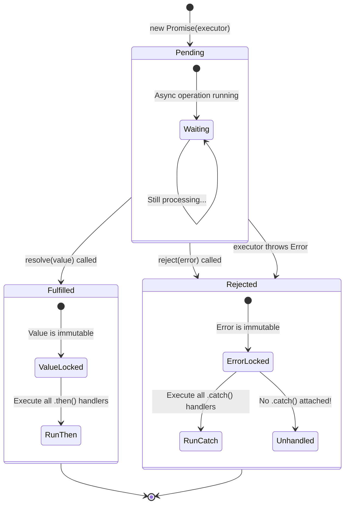

### Async Execution Order (Priority - Highest to Lowest)

This diagram shows the **exact execution order** when you mix different async patterns. This is the most common interview question about the event loop.

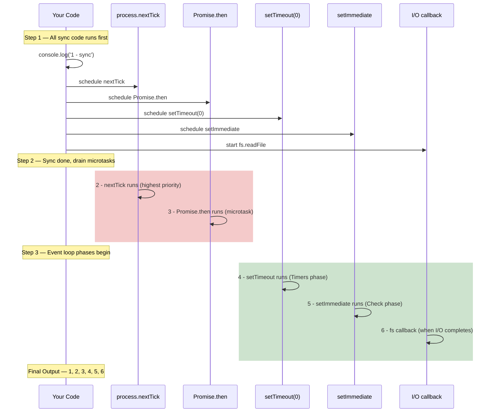

### Detailed Examples

#### Callback Hell & Alternatives

> 📖 **What this example demonstrates:** Three ways to write the same logic — reading 3 files sequentially. Each approach is more readable than the last. The callback version is the hardest to maintain because error handling must be repeated and nesting grows with each step.
>
> 🔑 **Key terms:**
>
> - **Callback hell** (also called "Pyramid of Doom") — When callbacks are nested inside callbacks inside callbacks, creating a staircase-shaped code structure. Hard to read, hard to add error handling, impossible to exit early.
> - **Promise chaining** — Each `.then()` returns a new Promise. You can `.catch()` at the end and it catches errors from any step in the chain.
> - **`async/await`** — The `async` keyword marks a function as one that returns a Promise. Inside it, `await` pauses ONLY that function (not the whole thread!) until a Promise resolves or rejects. Errors become catchable with normal `try/catch`.

````js
// ── APPROACH 1: Callback Style (the old way) ──────────────────────────────
// Notice how the code drifts right with each file — this is callback hell
fs.readFile("file1.txt", (err, data1) => {    // Level 1
    if (err) return console.error(err);        // Must check error at EVERY level
    fs.readFile("file2.txt", (err, data2) => { // Level 2
        if (err) return console.error(err);    // Repeated error check
        fs.readFile("file3.txt", (err, data3) => { // Level 3 ← getting deep!
            if (err) return console.error(err);
            console.log(data1, data2, data3);  // Finally have all 3 files
        }); // closing ) for readFile 3
    }); // closing ) for readFile 2
}); // closing ) for readFile 1
// Problem: Adding a 4th file means adding another level. Bugs are hard to spot.

// ── APPROACH 2: Promise Chaining (better, but still complex) ─────────────────
// Each .then() receives the result of the previous step
// The nested .then() is needed to "carry" data1 to the next step
fs.promises
    .readFile("file1.txt", "utf8")   // Returns a Promise
    .then((data1) =>                   // data1 = contents of file1.txt
        fs.promises
            .readFile("file2.txt", "utf8")
            .then((data2) => [data1, data2]), // Bundle data1+data2 together to pass to next .then()
    )
    .then(([data1, data2]) =>           // Receives [file1contents, file2contents]
        fs.promises
            .readFile("file3.txt", "utf8")
            .then((data3) => [data1, data2, data3]), // Bundle all 3
    )
    .then(([data1, data2, data3]) => console.log(data1, data2, data3))
    .catch((err) => console.error(err)); // ONE catch handles errors from ALL steps → improvement!

// ── APPROACH 3: Async/Await (most readable) ────────────────────────────
async function loadFiles() { // 'async' = this function always returns a Promise
    try {
        // 'await' pauses loadFiles() here until file1 is read. Other code in Node keeps running.
        const data1 = await fs.promises.readFile("file1.txt", "utf8");
        const data2 = await fs.promises.readFile("file2.txt", "utf8"); // waits for data1 first
        const data3 = await fs.promises.readFile("file3.txt", "utf8"); // waits for data2 first
        // Note: these 3 reads are SEQUENTIAL (one after another).
        // For PARALLEL reads, use Promise.all() — see Q4 below.
        console.log(data1, data2, data3);
    } catch (err) {
        console.error(err); // ONE catch handles errors from all 3 reads
    }
}

#### Error Handling Patterns

> 📖 **What this example demonstrates:** Three progressively more sophisticated ways to handle async errors. Pattern 3 shows how to let expected errors fall through gracefully while still re-throwing unexpected ones.
>
> 🔑 **Key terms:**
> - **`err.code`** — A short machine-readable error code like `'ENOENT'` (file not found), `'ECONNREFUSED'` (connection refused), `'ETIMEDOUT'` (timeout). More reliable to check than the error message text which can change.
> - **Re-throw** — Catching an error just to throw it again (with `throw err`). Used when you want to handle only certain error types but let other unexpected errors propagate to a higher-level handler.

```js
// ── PATTERN 1: Promise .catch() at the end of a chain ─────────────────────
fetchUser(id)
    .then((user) => fetchPosts(user.id))   // If fetchUser fails, this .then() is skipped
    .then((posts) => console.log(posts))   // If fetchPosts fails, this is also skipped
    .catch((err) => console.error("Error:", err.message)); // Catches error from ANY .then() above

// ── PATTERN 2: async/await with try/catch ──────────────────────────────
async function loadUserPosts(id) {
    try {
        const user = await fetchUser(id);      // If this throws, jumps to catch
        const posts = await fetchPosts(user.id); // Only runs if fetchUser succeeded
        console.log(posts);
    } catch (err) {
        // err could be from EITHER fetchUser OR fetchPosts — same handler
        console.error("Error:", err.message);
    }
}

// ── PATTERN 3: Handling SPECIFIC errors, re-throwing others ──────────────────
async function robustFetch(id) {
    try {
        return await fetchUser(id);
    } catch (err) {
        // err.code is a short machine-readable error string (e.g., 'ENOENT', 'ECONNREFUSED')
        if (err.code === "ENOENT") {
            // This is an EXPECTED case — user simply doesn't exist yet
            // Gracefully return a sensible default instead of crashing
            console.log("User not found, using default");
            return { id, name: "Default" };
        }
        // If it's any OTHER error (network failure, DB crash, etc.) — we can't handle it here
        // Re-throw it so the CALLER can decide what to do
        throw err;
    }
}
````

### Senior-Level Q&A

**Q1: What's the difference between `Promise.all()` and `Promise.allSettled()`? When would you use each?**

A:

- **`Promise.all()`:** Rejects immediately if ANY promise rejects. You get all results only if ALL succeed.
- **`Promise.allSettled()`:** Always resolves (never rejects). Returns `[{status, value} | {status, reason}]` for each promise.

**Use `Promise.all()` when:**

- You need all results to proceed (e.g., loading critical resources).
- One failure should cancel everything (fail-fast).

**Use `Promise.allSettled()` when:**

- You need results from all even if some fail (e.g., batch user updates, metrics collection).
- You want to process successes and failures separately.

```js
// Example: Batch API calls with mixed success/failure
// Promise.allSettled() sends ALL 3 requests simultaneously, then waits for ALL to finish
// Unlike Promise.all(), it does NOT abort if one fails
const results = await Promise.allSettled([
    fetchUser(1), // Might succeed
    fetchUser(2), // Might succeed or fail
    fetchUser(3), // Might fail (e.g., user 3 doesn't exist)
]);

// results is always an array with one entry per input promise:
// { status: 'fulfilled', value: userData }  ← if it succeeded
// { status: 'rejected',  reason: errorObj } ← if it failed
results.forEach((result, idx) => {
    if (result.status === "fulfilled") {
        console.log(`User ${idx}:`, result.value); // Access result.VALUE for successes
    } else {
        console.log(`User ${idx} failed:`, result.reason.message); // Access result.REASON for failures
    }
});
// Output example:
// User 0: { id: 1, name: 'Alice' }
// User 1: { id: 2, name: 'Bob' }
// User 2 failed: User not found
```

**Q2: Explain how promise chaining can cause "horizontal drift" and how to avoid it.**

A: **Horizontal drift:** Each `.then()` adds nesting indentation, reducing readability of long chains.

```js
// Horizontal drift (hard to read) — notice how each .then() goes INSIDE the previous one
user()
    .then((u) =>
        posts(u.id).then((p) =>
            likes(p[0].id).then(
                (l) => comments(l[0].id).then((c) => console.log(c)), // 4 levels deep!
            ),
        ),
    )
    .catch(console.error);

// Fix: Flatten by returning the next Promise from .then() instead of nesting
// When a .then() returns a Promise, the NEXT .then() waits for that promise to resolve
user()
    .then((u) => posts(u.id)) // Returns a promise → next .then() gets the posts
    .then((p) => likes(p[0].id)) // Returns a promise → next .then() gets the likes
    .then((l) => comments(l[0].id)) // Returns a promise → next .then() gets the comments
    .then((c) => console.log(c)) // Gets the final result
    .catch(console.error); // ONE catch for all errors — clean!

// Best: async/await — reads exactly like synchronous code
async function getComments() {
    try {
        const u = await user(); // Wait for user, store result in 'u'
        const p = await posts(u.id); // Wait for posts for that user
        const l = await likes(p[0].id); // Wait for likes on first post
        const c = await comments(l[0].id); // Wait for comments on first like
        console.log(c);
    } catch (err) {
        console.error(err); // Any failure in any step lands here
    }
}
```

**Q3: What's an unhandled promise rejection? How do you debug it?**

A: **Unhandled rejection:** A promise rejects but has no `.catch()` or `try/catch` handler.

```js
// Unhandled rejection (will crash or warn)
async function badCode() {
    throw new Error("Oops");
}
badCode(); // ⚠️ Unhandled rejection! Not caught!

// Catch it properly
badCode().catch(console.error); // ✅ Handled
```

**Debug with:**

```js
// Global handler for unhandled rejections
process.on("unhandledRejection", (reason, promise) => {
    console.error("Unhandled Rejection:", reason);
    // Log for debugging, then exit or recover
});

// Or use --unhandled-rejections flag
// node --unhandled-rejections=strict app.js
```

**Q4: Explain the difference between these two patterns:**

```js
// Pattern A
async function fetchData() {
    const a = await fetch1();
    const b = await fetch2();
    return [a, b];
}

// Pattern B
async function fetchDataFast() {
    const [a, b] = await Promise.all([fetch1(), fetch2()]);
    return [a, b];
}
```

> 📖 **What this example demonstrates:** Pattern A runs operations one after another (sequential). Pattern B runs them at the same time (parallel). If the operations are independent, Pattern B is always faster. If the second depends on the first result, Pattern A is the only correct choice.
>
> 🔑 **Key terms:**
>
> - **Sequential** — Operations happen one after another. Total time = sum of all times: 200ms + 150ms = 350ms.
> - **Parallel** — All operations start simultaneously. Total time = the slowest one: max(200ms, 150ms) = 200ms.
> - **`Promise.all([a, b, c])`** — Starts all three promises AT THE SAME TIME, then waits until ALL finish. Like starting 3 download timers simultaneously.

```js
// ── PATTERN A: Sequential ───────────────────────────────────────────────
async function fetchData() {
    const a = await fetch1(); // fetch1 starts and we WAIT here until it finishes (~200ms)
    const b = await fetch2(); // ONLY THEN does fetch2 start (another ~150ms)
    // Total time: ~350ms (200 + 150)
    return [a, b];
}
// Use this ONLY when fetch2 needs data from fetch1 — e.g. fetch2 = fetchPosts(user.id)

// ── PATTERN B: Parallel ────────────────────────────────────────────────
async function fetchDataFast() {
    // fetch1() and fetch2() are BOTH called here — they start running in the background simultaneously
    // Promise.all waits until BOTH are done, returns an array in the same order
    const [a, b] = await Promise.all([fetch1(), fetch2()]);
    // Total time: ~200ms (they ran in parallel; we only wait for the slower one)
    return [a, b];
}
// Use this when fetch1 and fetch2 are INDEPENDENT (don't need each other's results)
```

```js
// ── When to use sequential (Pattern A): fetch2 REQUIRES fetch1's result ───────
async function getUser(id) {
    const user = await fetchUser(id); // Must fetch user first
    const posts = await fetchPosts(user.id); // user.id only available after user is fetched
    // Can't parallelize: we literally don't know what user.id is until user loads
    return { user, posts };
}

// ── When to use parallel (Pattern B): all fetches are independent ──────────
async function getMetrics() {
    // All three fetch calls start at the SAME time
    // None of them needs data from the others
    const [users, posts, comments] = await Promise.all([
        fetchAllUsers(), // Starts immediately
        fetchAllPosts(), // Starts immediately (doesn't need users first)
        fetchAllComments(), // Starts immediately (doesn't need posts first)
    ]);
    // All three run in parallel — total time = time of the SLOWEST one
    return { users, posts, comments };
}
```

**Q5: What's Promise.any() and when is it useful?**

A: **`Promise.any()`** — returns the first _fulfilled_ promise (2021 addition). Rejects only if ALL promises fail.

```js
// Use case: Race multiple CDNs, use first successful response
const image = await Promise.any([
    fetch('cdn1.example.com/image.jpg'),
    fetch('cdn2.example.com/image.jpg'),
    fetch('cdn3.example.com/image.jpg'),
]); // Returns first successful fetch

// vs Promise.race: Returns first *settled* (even if rejected)
const fastest = await Promise.race([...]); // Could return an error
```

### Best Practices

- **Always handle rejections:** Use `.catch()` or `try/catch` for every async operation.
- **Use async/await for readability** over promise chains in new code.
- **Parallelize when possible:** Use `Promise.all()` for independent async operations.
- **Fail fast on critical errors:** Use `Promise.all()` for critical paths; use `Promise.allSettled()` for optional/batch operations.
- **Monitor unhandled rejections:** Install a global handler in production apps.

### Common Pitfalls

- **Forgetting to await or `.catch()`** results in unhandled rejections.
- **Serial instead of parallel:** Using sequential `await` in loops when operations are independent (performance regression).

    ```js
    // ❌ BAD: Serial (slow) — waits for each fetch to finish before starting the next
    // If each fetch takes 100ms and there are 5 IDs, total = 500ms
    for (const id of ids) {
        await fetchData(id); // 'await' inside a regular for loop = sequential execution
    }

    // ✅ GOOD: Parallel (fast) — all fetches start at the same time
    // ids.map() creates an array of Promises (all started simultaneously)
    // Promise.all() waits until ALL finish — total time = slowest single fetch
    await Promise.all(ids.map((id) => fetchData(id)));
    ```

- **Mixing callbacks and promises:** Error in callbacks don't automatically reject the promise.

    ```js
    // ❌ BAD: The callback-style error (throw err) is thrown INSIDE a callback
    // It's NOT inside the Promise executor, so the Promise has no way to catch it
    // The error becomes an unhandled exception that crashes the process
    new Promise((resolve) => {
        fs.readFile("file", "utf8", (err, data) => {
            if (err) throw err; // ← This 'throw' is inside a callback, NOT inside the Promise
            // The Promise executor has already returned — this error escapes!
        });
    });

    // ✅ GOOD: Manually call reject() in the callback error path
    // reject() is the Promise-aware way to signal failure from inside a callback
    new Promise((resolve, reject) => {
        fs.readFile("file", "utf8", (err, data) => {
            if (err) return reject(err); // ← Tells the Promise: "you failed with this error"
            resolve(data); // ← Tells the Promise: "you succeeded with this data"
        });
    });
    ```

### References: [async.js](async.js), [async.txt](async.txt)

> **💡 Interview Tip — One-Liner Answers:**
>
> - _"Callbacks vs Promises vs async/await?"_ → Same thing under the hood. Callbacks nest (hell). Promises chain (.then). Async/await reads like sync code. All use microtask queue.
> - _"Promise.all vs allSettled?"_ → `all` fails fast (rejects if ANY rejects). `allSettled` always resolves — gives you `{status, value/reason}` for every promise.
> - _"Sequential vs parallel await?"_ → `await a; await b;` = sequential. `await Promise.all([a, b])` = parallel. If independent, always parallelize.
> - _"What's an unhandled rejection?"_ → A promise rejects with no `.catch()` or `try/catch`. Node 15+ crashes the process. Always add a global `unhandledRejection` handler.

> **📝 Quick Revision — Async Patterns:**
>
> | Pattern     | Error Handling            | Best For              |
> | ----------- | ------------------------- | --------------------- |
> | Callback    | `if (err) return cb(err)` | Legacy APIs           |
> | Promise     | `.catch()`                | Composition, chaining |
> | Async/Await | `try/catch`               | New code, readability |
>
> | Orchestration          | Behavior                          | Use When                                 |
> | ---------------------- | --------------------------------- | ---------------------------------------- |
> | `Promise.all()`        | Fail-fast on first reject         | All results needed, any failure is fatal |
> | `Promise.allSettled()` | Always resolves                   | Batch ops, partial success OK            |
> | `Promise.race()`       | First settled (fulfill or reject) | Timeout patterns                         |
> | `Promise.any()`        | First fulfilled                   | Fastest successful response (CDN racing) |

[↑ Back to Index](#table-of-contents)

---

### 2.2 Error Handling Patterns

### Concepts

Error handling in Node.js is not just about catching exceptions — it's about **building resilient systems** that fail gracefully, protect user data, and recover automatically.

**Why Node.js errors are special:** When an error isn't caught in a browser, the page might glitch but the user refreshes. When an error isn't caught in Node.js, **the entire server process crashes** — every connected user is disconnected, every pending request is lost. This is why error handling is a first-class concern.

**Two fundamentally different types of errors:**

1. **Operational errors** (expected things that go wrong): A database is down, a file doesn't exist, a user sends invalid input, a network request times out. These are **normal** — you should handle them gracefully (retry, show a message, use a fallback). Your code is correct; the external world is just unpredictable.

2. **Programmer errors** (bugs): Accessing a property on `undefined`, passing a string where a number is expected, forgetting to `await` a promise. These are **your fault** — the correct response is to **crash the process and fix the bug**. Trying to "handle" a bug often makes things worse by letting the process continue in a corrupted state.

**The Error-First Callback convention:** Node's original APIs all follow the pattern `callback(error, result)`. You **always** check `err` before using `result`. This convention predates Promises and is still used in many libraries. If you see `if (err) return callback(err)`, that's the error-first pattern.

**Unhandled rejections = silent bugs:** Before Node 15, an unhandled Promise rejection just printed a warning. Starting with Node 15, it **crashes the process** (like an uncaught exception). This was a deliberate change because unhandled rejections hide bugs that cause mysterious failures hours later.

### Error Classification

| Type            | Example                               | Action                        |
| --------------- | ------------------------------------- | ----------------------------- |
| **Operational** | ECONNREFUSED, ENOENT, 404, timeout    | Handle, retry, or inform user |
| **Programmer**  | TypeError, ReferenceError, null deref | Fix the bug, crash + restart  |
| **System**      | ENOMEM, EMFILE (too many open files)  | Alert, scale, or reduce load  |

### Custom Error Classes

> 📖 **What this example demonstrates:** Instead of throwing generic `new Error('something went wrong')`, you create **typed error classes** that carry structured data like HTTP status codes. This lets your error middleware make smart decisions (e.g., send a 404 vs a 500 response) without parsing error messages.
>
> 🔑 **Key terms:**
>
> - **`extends Error`** — Inheritance. `AppError` IS an Error (you can catch it with `try/catch`), but it has extra properties like `statusCode`.
> - **`super(message)`** — Calls the parent `Error` constructor. This sets `this.message` and ensures the error behaves like a real JS Error.
> - **`isOperational = true`** — A flag you add to distinguish between _expected_ errors (operational, `true`) and unexpected bugs (programmer errors, `false`). A `NotFoundError` is operational — it's normal that sometimes a user doesn't exist. A `DatabaseError` triggered by a null pointer is NOT operational — it's a bug.
> - **`Error.captureStackTrace(this, this.constructor)`** — Removes the constructor call itself from the stack trace. Without this, the stack trace starts with `AppError (new AppError)` which is noise. With it, the trace starts at the code that actually threw the error.

```js
// ── BASE CLASS: All application errors extend this ─────────────────────────
class AppError extends Error {
    constructor(message, statusCode, isOperational = true) {
        super(message); // Sets this.message (standard Error behaviour)
        this.statusCode = statusCode; // HTTP status code (404, 400, 500, etc.)
        this.isOperational = isOperational; // true = expected/handled; false = bug/crash
        this.name = this.constructor.name; // 'NotFoundError', 'ValidationError', etc.
        Error.captureStackTrace(this, this.constructor); // Clean stack trace
    }
}

// ── SPECIFIC ERRORS: Each type pre-fills the right status code ───────────────
class NotFoundError extends AppError {
    // Usage: throw new NotFoundError('User')  →  message = 'User not found', status = 404
    constructor(resource = "Resource") {
        super(`${resource} not found`, 404); // 404 = HTTP 'Not Found'
    }
}

class ValidationError extends AppError {
    // Usage: throw new ValidationError('Email is required')  →  status = 400
    constructor(message) {
        super(message, 400); // 400 = HTTP 'Bad Request' (user sent invalid data)
    }
}

class DatabaseError extends AppError {
    // Usage: throw new DatabaseError('Connection refused')  →  status = 500, isOperational = FALSE
    // isOperational = false means this is a BUG or infrastructure failure, not a user error
    constructor(message) {
        super(message, 500, false); // 500 = HTTP 'Internal Server Error'
    }
}

// ── USAGE: Clean, descriptive errors with structured data ──────────────────
async function getUser(id) {
    const user = await db.findById(id);
    if (!user) throw new NotFoundError("User"); // self-documenting AND carries status code
    return user;
    // Before custom errors: throw new Error('User not found') ← how does middleware know it's 404?
    // After custom errors: throw new NotFoundError('User') ← middleware reads err.statusCode = 404
}
```

### Express Error Handling Middleware

> 📖 **What this example demonstrates:** Express has a special pattern for error handling: a middleware function that takes **4 parameters** `(err, req, res, next)`. Express automatically routes to this middleware whenever any other middleware calls `next(err)` or when an async handler throws. This centralizes all error responses in one place instead of repeating error-handling code in every route.
>
> 🔑 **Key terms:**
>
> - **Middleware** — A function that runs between a request arriving and the response being sent. Express chains these together. The 4-parameter signature is how Express knows this one handles errors (not normal requests).
> - **`next(err)`** — Passing an error to Express's middleware chain. Calling `next(err)` says "skip all normal middlewares and go straight to the error handler".
> - **`err.isOperational`** — Our custom flag. If `true`, we tell the user a specific helpful message. If `false` (unexpected bug), we give a generic "Internal server error" to avoid leaking code details.

```js
// ── THE ERROR HANDLER (MUST be the LAST app.use() call) ────────────────────
// ⚠️ The 4 parameters are mandatory — if you write only 3, Express treats it as a regular handler
function errorHandler(err, req, res, next) {
    // Always log the full error for internal debugging (this goes to your logs, not the user)
    console.error({
        message: err.message, // Human-readable error text
        stack: err.stack, // Call stack showing where the error originated
        statusCode: err.statusCode, // Our custom status (or undefined for raw Errors)
        path: req.path, // Which route triggered the error
    });

    if (err.isOperational) {
        // isOperational = true: This is an expected error we designed for (like 404, 400)
        // Safe to send the actual message to the user
        return res.status(err.statusCode).json({
            error: err.message, // e.g., 'User not found' or 'Email is required'
        });
    }

    // isOperational = false (or missing): Unexpected bug, database crash, null pointer, etc.
    // NEVER send internal error details to users (security risk + confusing to users)
    res.status(500).json({ error: "Internal server error" }); // Generic message
    // Alert your team (PagerDuty, Slack, etc.) about this unexpected error
}

// ── USAGE IN ROUTES: Always pass errors to next() in async handlers ───────────
app.get("/users/:id", async (req, res, next) => {
    try {
        const user = await getUser(req.params.id); // getUser throws NotFoundError if missing
        res.json(user);
    } catch (err) {
        next(err); // ← Hands the error to our errorHandler middleware above
        // Without this next(err), Express would hang or show a default error page
    }
});

app.use(errorHandler); // ← MUST be LAST — catches errors from ALL routes registered above it
```

### Global Error Handlers

> 📖 **What this example demonstrates:** Two safety nets for errors that escape all your `try/catch` blocks. These are your **last resort** handlers — by the time these fire, something has gone very wrong. The correct response is to log everything and gracefully shut down.
>
> 🔑 **Key terms:**
>
> - **`unhandledRejection`** — Fires when a Promise is rejected but nobody called `.catch()` or used `try/catch` on it. Example: `someAsyncFn()` without `await` or `.catch()`.
> - **`uncaughtException`** — Fires when a regular `throw` escapes all `try/catch` blocks. After this fires, Node's state is **undefined** — you should always exit.
> - **`process.exit(1)`** — Immediately terminates the process. Exit code `1` means failure (non-zero = error). Exit code `0` means clean exit.
> - **`warning` event** — Fires for non-fatal notices like memory leaks (`MaxListenersExceededWarning`) or deprecated API usage. Does NOT crash the process.

```js
// ── SAFETY NET 1: Unhandled Promise rejections ──────────────────────────
// Example that triggers this:
//   async function boom() { throw new Error('oops'); }
//   boom(); // ← no await, no .catch() — triggers unhandledRejection
process.on("unhandledRejection", (reason, promise) => {
    // 'reason' = the error or value that the promise rejected with
    // 'promise' = the actual Promise object that was rejected
    console.error("Unhandled Rejection:", reason);
    // In production: log to your error tracker (Sentry, Datadog) before exiting
    // process.exit(1); // Node 15+ crashes automatically — uncomment for Node <15
});

// ── SAFETY NET 2: Uncaught exceptions (synchronous throws) ────────────────
// Example that triggers this:
//   setTimeout(() => { throw new Error('surprise'); }, 0);
//   ← throw inside a timer callback with no try/catch around it
process.on("uncaughtException", (err) => {
    console.error("Uncaught Exception:", err);
    // CRITICAL: ALWAYS exit after this. The process state may be corrupted.
    // An open database connection might be half-committed. Memory might be inconsistent.
    // PM2, systemd, or Kubernetes will restart the process automatically.
    process.exit(1); // '1' = abnormal exit (tells the OS something went wrong)
});

// ── MONITORING WARNINGS (non-fatal) ────────────────────────────────
process.on("warning", (warning) => {
    // warning.name = type of warning (e.g., 'MaxListenersExceededWarning')
    // warning.message = human-readable description
    // Does NOT crash the process — just a heads-up that something might be wrong
    console.warn("Warning:", warning.name, warning.message);
    // Common warnings to watch for:
    // 'MaxListenersExceededWarning' → memory leak in EventEmitter
    // 'ExperimentalWarning' → using a Node.js feature that's not stable yet
    // 'DeprecationWarning' → using an API that will be removed in a future version
});
```

### Senior-Level Q&A

**Q1: Should you catch all errors and keep the process alive? Why not?**

A: **No.** After an uncaught exception, Node's state is unreliable (corrupted memory, leaked resources). You should:

1. Log the error with full context
2. Attempt graceful shutdown (close connections, finish requests)
3. Exit and let a process manager (PM2, systemd) restart

```js
process.on("uncaughtException", (err) => {
    logger.fatal(err, "Uncaught exception — shutting down");
    // Step 1: Tell the HTTP server to stop accepting NEW connections
    // But finish any in-progress requests (graceful shutdown)
    server.close(() => process.exit(1)); // Callback fires when server drains
    // Step 2: Safety timeout — if server.close() gets stuck (e.g., long-running request),
    // force kill after 10 seconds to avoid hanging forever
    setTimeout(() => process.exit(1), 10000); // 10,000 ms = 10 seconds
});
```

**Q2: How do you handle errors in `Promise.all()` without failing the entire batch?**

> 📖 **What this example demonstrates:** When you have a batch operation on multiple URLs, you need all results even if some fail. Two approaches: `allSettled` gives you structured results, or you wrap each individual promise in `.catch()` to turn failures into special objects you can identify later.

```js
// ── OPTION 1: Promise.allSettled ────────────────────────────────────────────
// allSettled NEVER rejects itself — it always gives you an array of outcome objects
const results = await Promise.allSettled(urls.map(fetch));
// Filter results by outcome:
const successes = results.filter((r) => r.status === "fulfilled"); // { status, value }
const failures = results.filter((r) => r.status === "rejected"); // { status, reason }
// Use case: Send emails to 100 users, some bounce — record results for all, not just successes

// ── OPTION 2: Wrap each with .catch() to normalize failures ──────────────────
// Instead of a rejected promise, each failure becomes a plain object { error, url }
// So Promise.all() always sees fulfilled promises (never rejects)
const safeResults = await Promise.all(
    urls.map(
        (url) => fetch(url).catch((err) => ({ error: err.message, url })), // Turn rejection into value
    ),
);
// Now safeResults contains either a Response object (success) or { error, url } (failure)
// Easy to spot failures: if (result.error) { ... }
```

**Q3: What's the difference between `throw` in async vs sync functions?**

A:

- **Sync `throw`:** Creates a synchronous exception — caught by `try/catch`
- **Async `throw`:** Rejects the returned promise — caught by `.catch()` or `try/catch` with `await`

```js
// ── Synchronous throw: caught by regular try/catch ──────────────────────────
function syncFn() {
    throw new Error("sync"); // Thrown immediately, synchronously
}
try {
    syncFn(); // Execution stops here if throw happens
} catch (e) {
    /* caught immediately */
    // Execution jumps here
}

// ── Async throw: becomes a rejected Promise ─────────────────────────────
async function asyncFn() {
    throw new Error("async"); // In an async function, throw = reject the returned Promise
}
// asyncFn() returns a Promise that is now rejected with Error('async')
asyncFn().catch((e) => {
    /* caught via .catch() */
});
// Alternatively with `await`:
// try { await asyncFn(); } catch(e) { /* caught */ }

// ── THE INFAMOUS GOTCHA: setTimeout callback ───────────────────────────
async function gotcha() {
    try {
        // The try/catch only protects code that runs SYNCHRONOUSLY inside it.
        // setTimeout schedules a callback for LATER (after the try block has already exited).
        // When the callback runs, the try/catch is long gone — the error escapes!
        setTimeout(() => {
            throw new Error("oops"); // ← This becomes an unhandledException — crashes the process!
        }, 0);
    } catch (e) {
        // This NEVER runs — the error is thrown AFTER the try block exits
        console.log("caught"); // Never printed
    }
    // ✅ Fix: put try/catch INSIDE the callback, or use setImmediate with a promise wrapper
}
```

> **💡 Interview Tip — One-Liner Answers:**
>
> - _"Operational vs programmer errors?"_ → Operational = expected (DB down, file missing) → handle gracefully. Programmer = bugs (null deref, wrong types) → crash and fix.
> - _"Should you catch all errors and keep the process alive?"_ → No. After an uncaught exception, state is unreliable. Log, graceful shutdown, let PM2 restart.
> - _"How does Express handle errors?"_ → Error middleware with 4 params `(err, req, res, next)` — must be last `app.use()`. Async errors need `next(err)` or express-async-errors.

> **📝 Quick Revision — Error Handling:**
>
> | Error Type  | Example                    | Action                       |
> | ----------- | -------------------------- | ---------------------------- |
> | Operational | ECONNREFUSED, 404, timeout | Retry, fallback, inform user |
> | Programmer  | TypeError, null deref      | Crash, fix the bug, restart  |
> | System      | ENOMEM, EMFILE             | Alert ops team, scale up     |
>
> **Golden rule:** Never swallow errors silently. Log + alert + graceful shutdown.

[↑ Back to Index](#table-of-contents)

---

### 2.3 Event Emitters

### Concepts

Event Emitters implement the **Observer pattern** (also called pub/sub) in Node.js. Think of it like a radio station: the station **emits** (broadcasts) signals, and anyone with a radio **listens** for those signals. The station doesn't know how many radios are tuned in, and each radio doesn't know about the others.

**Why are they important?** EventEmitter is the **foundation of most Node.js APIs**. When you write `server.on('request', handler)`, `stream.on('data', chunk => ...)`, or `process.on('exit', ...)`, you're using EventEmitter. HTTP servers, streams, child processes, file watchers — they all inherit from EventEmitter.

**How it works:** An EventEmitter object maintains a list of listener functions for each event name. When you call `emitter.emit('data', payload)`, it calls every function registered for the `'data'` event, in the order they were added. It's **synchronous** — each listener runs one after another, not in parallel.

**The memory leak trap:** The #1 issue with EventEmitters is **forgetting to remove listeners**. Every time you call `.on()`, a new function reference is stored. If you attach listeners in a loop or request handler without removing them, the list grows forever. Node warns you at 10 listeners per event — this isn't a limit, it's a **leak detector**. If you legitimately need more, use `setMaxListeners()`, but first confirm you're not leaking.

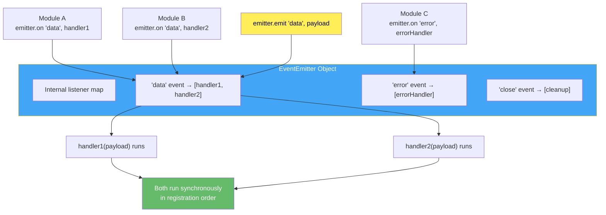

### Key APIs

- `emitter.on(event, listener)` — attach listener (runs every time event fires).
- `emitter.once(event, listener)` — attach listener for single execution.
- `emitter.removeListener(event, listener)` — remove specific listener.
- `emitter.removeAllListeners(event)` — remove all listeners for an event.
- `emitter.listeners(event)` — get array of listeners.
- `emitter.setMaxListeners(n)` — increase default limit (10).

### Senior-Level Q&A

**Q1: Why does Node warn at 10+ listeners and how do you debug this warning?**

A: The warning prevents **memory leaks** from forgotten listener references. A single event with 100+ listeners indicates:

- Listeners not removed in cleanup/destructors
- Repeated attachment without deduplication
- (Rarely) legitimately high listener count

> 📖 **What this example demonstrates:** Every call to `.on()` stores a new function in memory. If you call it in a loop or a recurring operation without ever calling `.removeListener()`, the list grows forever. Node warns you at 10 because that's almost always a sign of a bug, not intentional code.
>
> 🔑 **Key terms:**
>
> - **`setInterval(fn, 100)`** — Calls `fn` every 100 milliseconds. After 1 second, `attachListeners` has been called 10 times, each time adding a new listener. After 1000 requests, 1000 listeners are piled up.
> - **`listenerCount(event)`** — Returns how many listeners are registered for a specific event name. Use this to audit leaks.
> - **`listeners(event)`** — Returns the array of actual function references. Useful to see exactly what's registered.

```js
const { EventEmitter } = require("events");
const emitter = new EventEmitter();

// ❌ MEMORY LEAK: This function keeps adding a NEW listener every time it's called
function attachListeners() {
    // Each call to .on() stores a new anonymous function reference in memory
    // These are NEVER removed — they pile up indefinitely
    emitter.on("data", () => {
        console.log("Processing data"); // After 100 calls: 100 functions stored, only 1 needed!
    });
}

// Called every 100ms → after 1 second = 10 listeners → Node prints a warning
setInterval(attachListeners, 100);
// Node warning: "MaxListenersExceededWarning: Possible EventEmitter memory leak detected.
//               11 data listeners added."

// ✅ FIX: Store handler as a property so it can be removed
class DataProcessor {
    constructor(emitter) {
        this.emitter = emitter;
        // Store handler AS A CLASS PROPERTY — same function reference used to attach AND remove
        this.handler = () => console.log("Processing");
    }

    attach() {
        this.emitter.on("data", this.handler); // Attach: always the same function
    }

    detach() {
        // RemoveListener needs the EXACT same function reference that was passed to .on()
        // That's why anonymous arrow functions inside .on() can NEVER be removed — no reference!
        this.emitter.removeListener("data", this.handler);
    }
}

// Debug tools to inspect listeners:
console.log(emitter.listenerCount("data")); // How many listeners for 'data' event? (e.g., 15)
console.log(emitter.listeners("data")); // Array of actual functions stored for 'data'
```

**Q2: Your Express app creates a new EventEmitter inside each request handler. Is this a memory leak?**

A: Not if the emitter is garbage-collected after the request. But if you attach persistent listeners, they leak:

> 📖 **What this example demonstrates:** A very common mistake in Express apps. Every HTTP request triggers a new `.on()` call on a global emitter. Since the `globalEmitter` lives for the lifetime of the app (not just the request), listeners accumulate. After 1000 requests, 1000 callbacks are registered — each response runs all 1000.

```js
const express = require("express");
const app = express();
const { EventEmitter } = require("events");
const globalEmitter = new EventEmitter(); // This object lives for the entire app lifetime

// ❌ LEAK: Each incoming HTTP request adds a new 'update' listener to globalEmitter
// After request 1: 1 listener
// After request 1000: 1000 listeners — each 'update' event triggers ALL 1000 callbacks!
app.get("/api/data", (req, res) => {
    globalEmitter.on("update", () => {
        // .on() adds to the globalEmitter PERMANENTLY
        res.json({ data: "updated" }); // Worse: if response already sent, this throws an error!
    });
});

// ✅ FIX 1: Save the handler reference and remove it when the response finishes
app.get("/api/data", (req, res) => {
    const handler = () => res.json({ data: "updated" }); // Named handler we can reference
    globalEmitter.on("update", handler); // Attach

    // 'finish' fires when the HTTP response has been sent to the client
    // At that point, we no longer need this handler — remove it!
    res.on("finish", () => {
        globalEmitter.removeListener("update", handler); // Clean up — prevents the leak
    });
});

// ✅ FIX 2: Use .once() — automatically removes itself after firing exactly once
app.get("/api/data", (req, res) => {
    // once() is perfect here: each request only needs to respond once.
    // After the callback fires, Node automatically removes it. No manual cleanup needed.
    globalEmitter.once("update", () => {
        res.json({ data: "updated" });
    });
});
```

**Q3: What's the difference between `on()` and `once()`? When do you use each?**

A:

- **`on()`:** Listener runs every time event fires (persistent).
- **`once()`:** Listener runs exactly once, then auto-removes.

> 📖 **What this example demonstrates:** The concrete difference between `.on()` (keep listening forever) and `.once()` (listen exactly once then stop). The rule of thumb: if an event should trigger repeated actions, use `.on()`. If it's a one-time setup/handshake, use `.once()`.

```js
const { EventEmitter } = require("events");
const emitter = new EventEmitter();

// ── .on(): Persistent listener ─────────────────────────────────────────────
emitter.on("click", () => console.log("Clicked"));
// Listener is stored permanently until you call .removeListener()
emitter.emit("click"); // Prints: "Clicked"
emitter.emit("click"); // Prints: "Clicked" again — the listener is STILL there

// ── .once(): Self-removing listener ──────────────────────────────────────
emitter.once("first-connect", () => console.log("Connected"));
// Listener is stored, but wrapped internally: after it fires once, it removes itself
emitter.emit("first-connect"); // Prints: "Connected" — listener fires and then unregisters
emitter.emit("first-connect"); // Prints nothing — the listener is gone, nothing to call
```

**Use `once()` for:**

- Initialization events ("started", "connected", "loaded")
- Promise-like patterns (first result, error)
- One-off async operations

**Use `on()` for:**

- Continuous monitoring ("data", "update", "error")
- Pub/sub within app lifetime

**Q4: Design a pub/sub system with proper cleanup. How do you avoid memory leaks?**

A:

> 📖 **What this example demonstrates:** A PubSub wrapper around EventEmitter that returns an **unsubscribe function** from every `subscribe()` call. This is the modern React/Redux-style pattern — the caller is responsible for cleanup, and cleanup is as easy as calling one function.
>
> 🔑 **Key terms:**
>
> - **Return an unsubscribe function** — Instead of making the caller remember the event name AND handler to pass to `.removeListener()`, you bundle both in a closure and return a single `() => {}` function. Call it to clean up.
> - **Closure** — A function that "remembers" the variables from its surrounding scope. The `() => emitter.removeListener(topic, handler)` function remembers both `topic` and `handler` even after `subscribe()` returns.

```js
class PubSub {
    constructor() {
        this.emitter = new EventEmitter();
        this.emitter.setMaxListeners(100); // We intentionally support many subscribers; increase limit
    }

    // Returns an UNSUBSCRIBE function — caller stores it and calls it to stop listening
    subscribe(topic, handler) {
        this.emitter.on(topic, handler); // Standard subscription

        // Return a cleanup function (closure) that remembers 'topic' and 'handler'
        return () => {
            this.emitter.removeListener(topic, handler); // Call this to unsubscribe
        };
    }

    subscribeOnce(topic, handler) {
        this.emitter.once(topic, handler); // Auto-removes after first fire
        return () => {
            this.emitter.removeListener(topic, handler); // Manual cancel before it fires
        };
    }

    publish(topic, data) {
        this.emitter.emit(topic, data); // Trigger all handlers for this topic
    }

    getListenerCount(topic) {
        return this.emitter.listenerCount(topic); // Debug: check for leaks
    }
}

// Usage: subscribe and store the returned unsubscribe function
const pubsub = new PubSub();

const unsubscribe = pubsub.subscribe("user:login", (user) => {
    console.log(`${user.name} logged in`);
});

pubsub.publish("user:login", { name: "Alice" }); // Prints: Alice logged in

unsubscribe(); // Clean up — handler removed, no more memory held

pubsub.publish("user:login", { name: "Bob" }); // Prints nothing — unsubscribed!

console.log(pubsub.getListenerCount("user:login")); // 0 — confirmed clean
```

**Q5: You have 50+ EventEmitters in your app. How do you track listener leaks?**

A: Use monitoring tools and patterns:

```js
// Pattern 1: Wrap EventEmitter to track leaks
const originalOn = EventEmitter.prototype.on;
let maxListenersWarnings = [];

EventEmitter.prototype.on = function (event, listener) {
    if (this.listenerCount(event) >= 10) {
        maxListenersWarnings.push({
            emitter: this.constructor.name,
            event,
            count: this.listenerCount(event),
            stack: new Error().stack,
        });
    }
    return originalOn.call(this, event, listener);
};

// Pattern 2: Global unhandledWarning listener
process.on("warning", (warning) => {
    if (warning.name === "MaxListenersExceededWarning") {
        console.warn("Listener leak detected:", warning.message);
        // Log for analysis
    }
});

// Pattern 3: Periodic audit
setInterval(() => {
    maxListenersWarnings.forEach((w) => {
        console.warn(`${w.emitter}.on('${w.event}'): ${w.count} listeners`);
    });
}, 60000);
```

### Best Practices

- **Always remove listeners:** Use `.removeListener()` or `.off()` when object is destroyed.
- **Prefer named handlers for removal:** Arrow functions in `.on()` can't be removed (no reference).

    ```js
    // ❌ Can't remove: anonymous arrow function, no way to reference it later
    emitter.on("event", () => {
        /* do something */
    }); // Node stores this function, but YOU have no variable pointing to it
    // emitter.removeListener("event", ???) ← what would you pass here?

    // ✅ Can be removed: named variable holds the function reference
    const handler = () => {
        /* do something */
    };
    emitter.on("event", handler); // Attach using the variable
    emitter.removeListener("event", handler); // Detach using the SAME variable
    // node compares function references: handler === handler → true → removes it
    ```

- **Use `.once()` for one-off events:** Auto-cleanup prevents leaks.
- **Monitor listener counts in production:** Alert on `MaxListenersExceededWarning`.
- **Increase `.setMaxListeners()` only if intentional:** Don't suppress warnings.

### Common Pitfalls

- **Forgetting to remove listeners:** Grows memory with each instance.
- **Anonymous handler functions:** Can't be removed later.

    ```js
    // ❌ BAD
    emitter.on("data", () => console.log("data"));
    // Later: Can't remove this!

    // ✅ GOOD
    const handler = () => console.log("data");
    emitter.on("data", handler);
    emitter.removeListener("data", handler);
    ```

- **Attaching listeners in loops without cleanup:** Rapidly accumulates listeners.
- **Not cleaning up on object destruction:** Listeners reference destroyed objects, preventing GC.

### References: [EventEmitters/basics.js](EventEmitters/basics.js), [EventEmitters/listeners.js](EventEmitters/listeners.js)

> **💡 Interview Tip — One-Liner Answers:**
>
> - _"What is EventEmitter?"_ → Observer pattern in Node.js. `.emit()` fires an event synchronously; all registered `.on()` listeners execute in order.
> - _"Why does Node warn at 10 listeners?"_ → It's a memory leak detector, not a limit. If you need more, call `setMaxListeners()` — but first check for leaks.
> - _".on() vs .once()?"_ → `.on()` = persistent, fires every time. `.once()` = auto-removes after first fire. Use `once()` for initialization, `on()` for continuous monitoring.
> - _"How to avoid listener leaks in Express?"_ → Don't attach `.on()` to global emitters inside request handlers. Use `.once()`, or remove listener on `res.on('close')`.

> **📝 Quick Revision — Event Emitters:**
>
> | Method                       | Purpose                  | Auto-cleanup?                       |
> | ---------------------------- | ------------------------ | ----------------------------------- |
> | `.on(event, fn)`             | Persistent listener      | No — must remove manually           |
> | `.once(event, fn)`           | One-time listener        | Yes — auto-removes after first call |
> | `.off(event, fn)`            | Remove specific listener | N/A                                 |
> | `.removeAllListeners(event)` | Remove all for an event  | N/A                                 |
>
> **Key number:** Default warning threshold = 10 listeners per event.

[↑ Back to Index](#table-of-contents)

---

### 2.4 Streams & Pipelines

### Concepts

Streams are Node's way of handling data **piece by piece** instead of all at once. Imagine filling a swimming pool: you could dump the entire water supply at once (loading a 2GB file into memory), or you could run a garden hose (streaming chunks of data, using only a small buffer).

**Why do streams matter?** Without streams, processing a 2GB file means loading 2GB into RAM. With 100 concurrent users doing this, that's 200GB of RAM — impossible. Streams solve this by processing data in small **chunks** (typically 16KB-64KB). Your memory usage stays constant regardless of file size.

**The four stream types:**

1. **Readable** — A source of data you read from. Examples: reading a file (`fs.createReadStream`), receiving an HTTP request body, stdin input
2. **Writable** — A destination you write to. Examples: writing to a file (`fs.createWriteStream`), sending an HTTP response, stdout output
3. **Duplex** — Both readable and writable, but the two sides are **independent**. Example: a TCP socket (you read data from the client AND write data back, but what you write isn't related to what you read)
4. **Transform** — A duplex stream where the output IS related to the input — data goes in, gets modified, and comes out. Examples: compression (gzip), encryption, parsing CSV lines

**Backpressure — the most important concept:** When you pipe a fast readable into a slow writable, data piles up in memory. Backpressure is the mechanism where the slow consumer **tells** the fast producer to pause. Think of it like a conveyor belt: if boxes pile up at the end, the belt stops until the worker catches up. Without backpressure handling, your Node process will run out of memory.

**`.pipe()` vs `pipeline()`:** The old `.pipe()` method handles backpressure but NOT error cleanup — if a stream errors, the others aren't destroyed, causing resource leaks. `stream.pipeline()` (added in Node 10) properly destroys all streams on error and calls a final callback. **Always prefer `pipeline()` in production code.**

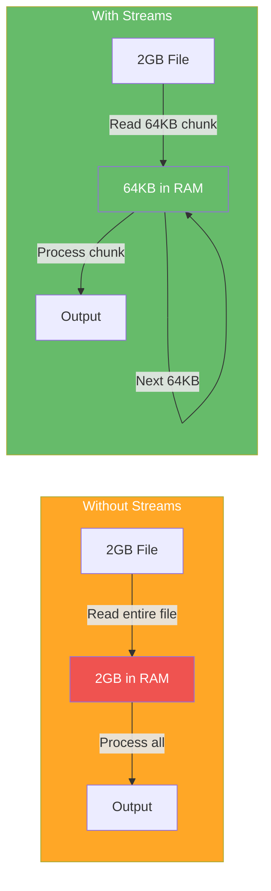

### Stream Types

1. **Readable:** Can read from (e.g., `fs.createReadStream`, HTTP request body).
2. **Writable:** Can write to (e.g., `fs.createWriteStream`, HTTP response).
3. **Duplex:** Both readable and writable (e.g., TCP socket).
4. **Transform:** Readable → Transform → Writable (e.g., compression, encryption).

### Key APIs

- `fs.createReadStream(path, options)` — stream file data.
- `fs.createWriteStream(path, options)` — write data to file.
- `stream.Transform` — custom transformation logic.
- `stream.pipeline(streams..., cb)` — compose streams with proper cleanup.
- `readable.pipe(writable)` — automatic backpressure handling.

### Backpressure Deep Dive

**What is backpressure?**

When a slow consumer can't keep up with a fast producer, the producer should reduce output (or buffer in memory, risking OOM).

> 📖 **What this example demonstrates:** Three approaches to copying a file. The first ignores backpressure (data piles up in memory). The second implements it manually by checking `write()`'s return value. The third uses `.pipe()` which does all this automatically.
>
> 🔑 **Key terms:**
>
> - **`write()` return value** — `writable.write(chunk)` returns `true` if the internal buffer has room, or `false` if the buffer is full and you should stop sending. Most developers ignore this return value — that causes the memory leak.
> - **`pause()` / `resume()`** — Methods on a Readable stream. `pause()` tells the stream to stop reading from the source. `resume()` tells it to start again. Together, they let you manually control the data flow rate.
> - **`drain` event** — Fired by a Writable stream when its internal buffer has emptied and it's ready to accept more data. This is the signal to `resume()` the reader.
> - **`OOM` (Out Of Memory)** — When your process runs out of RAM. Node crashes with `FATAL ERROR: CALL_AND_RETRY_LAST Allocation failed - JavaScript heap out of memory`.

```js
const fs = require("fs");
const readStream = fs.createReadStream("huge-file.txt"); // Reads file in chunks
const writeStream = fs.createWriteStream("output.txt"); // Writes chunks to disk

// ❌ NO BACKPRESSURE: Memory accumulates until crash
readStream.on("data", (chunk) => {
    // write() returns false when the write buffer is full
    // We're ignoring that return value! Node keeps reading from disk at full speed
    // But the write buffer is filling up and can't drain fast enough
    // Result: write buffer grows and grows — for a 1GB file this means ~1GB in RAM
    writeStream.write(chunk);
});

// ✅ MANUAL BACKPRESSURE: Pause when buffer is full, resume when it drains
readStream.on("data", (chunk) => {
    const canContinue = writeStream.write(chunk); // returns true = OK, false = buffer full
    if (!canContinue) {
        readStream.pause(); // Tell the reader: STOP sending data, write is overwhelmed
        // At this point, readStream stops reading from disk — memory usage stays low
    }
});

writeStream.on("drain", () => {
    // 'drain' fires when writeStream's buffer has fully emptied to disk
    readStream.resume(); // OK to start reading again — write buffer has room
});

// ✅ BEST: Use .pipe() — implements the exact manual backpressure pattern above automatically
readStream.pipe(writeStream);
// .pipe() internally wires up all the pause/resume/drain logic — clean and reliable
```

**Performance example: Without vs with backpressure**

> 📖 **What this example demonstrates:** Functionally, `badStream` and `goodStream` produce identical output files. The difference is invisible to users — but `badStream` might crash the server while `goodStream` uses a constant ~64KB of RAM.

```js
const fs = require("fs");

// ❌ BAD: Read events fire as fast as disk can deliver; write buffer grows endlessly
function badStream() {
    const read = fs.createReadStream("1gb-file.txt"); // Reads chunks as fast as possible
    const write = fs.createWriteStream("output.txt");

    read.on("data", (chunk) => {
        write.write(chunk); // Dump chunk into write buffer immediately, no checking
        // After 100ms: write buffer might hold 50MB of unwritten data
        // After 500ms: write buffer might hold 200MB — approaching OOM territory
    });
}

// ✅ GOOD: read.pipe(write) handles the pause/resume/drain cycle automatically
function goodStream() {
    const read = fs.createReadStream("1gb-file.txt");
    const write = fs.createWriteStream("output.txt");
    read.pipe(write); // One line replaces all the manual backpressure code above
    // Memory usage: ~64KB at all times (one chunk in transit), regardless of file size
}
```

### Stream Architecture & Backpressure Flow

This shows what happens step-by-step when a fast reader sends data to a slow writer. The key moment is when the buffer fills up and the system **automatically pauses** the reader.

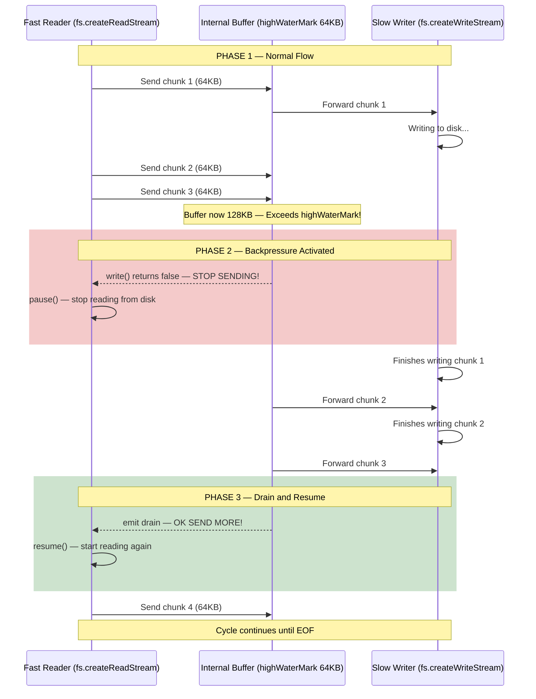

### Memory Usage: Streams vs readFile


### Transform Streams Examples

```js
const { Transform } = require("stream");
const fs = require("fs");

// Example 1: Uppercase transform
const upperTransform = new Transform({
    transform(chunk, encoding, callback) {
        this.push(chunk.toString().toUpperCase());
        callback(); // Signal completion
    },
});

fs.createReadStream("input.txt")
    .pipe(upperTransform)
    .pipe(fs.createWriteStream("output.txt"));

// Example 2: CSV to JSON transform
const csvToJson = new Transform({
    readableObjectMode: true,
    transform(chunk, encoding, callback) {
        const lines = chunk.toString().split("<br/>");
        const [headers, ...rows] = lines;
        const keys = headers.split(",");

        rows.forEach((row) => {
            const values = row.split(",");
            const obj = Object.fromEntries(
                keys.map((key, i) => [key.trim(), values[i]]),
            );
            this.push(obj);
        });
        callback();
    },
});

// Example 3: Compression transform (using zlib)
const zlib = require("zlib");
const gzip = zlib.createGzip();

fs.createReadStream("input.txt")
    .pipe(gzip)
    .pipe(fs.createWriteStream("input.txt.gz"));
```

### Pipeline Composition

```js
const { pipeline } = require("stream");
const fs = require("fs");
const zlib = require("zlib");

// Chain multiple streams safely
pipeline(
    fs.createReadStream("input.txt"),
    zlib.createGzip(),
    fs.createWriteStream("input.txt.gz"),
    (err) => {
        if (err) {
            console.error("Pipeline failed:", err.message);
            // Cleanup happens automatically
        } else {
            console.log("Pipeline succeeded");
        }
    },
);
```

### Senior-Level Q&A

**Q1: Explain backpressure. What happens if you ignore it on a 1GB file?**

A: **Backpressure** signals that the consumer is slower than the producer. Ignoring it floods memory:

> 📖 **What this example demonstrates:** `write()` returns `false` to signal backpressure. When that happens, pause the reader. Only resume when the `drain` event fires. Without this, a 1GB file could consume 500MB+ of RAM.

```js
// Without backpressure: Memory usage ~500MB+ for 1GB file
const read = fs.createReadStream("1gb.txt", { highWaterMark: 64 * 1024 }); // Read in 64KB chunks
const write = fs.createWriteStream("out.txt");

// ❌ Ignoring write()'s return value — keeps reading even when write buffer is full
read.on("data", (chunk) => {
    write.write(chunk); // Return value ignored → buffer accumulates in memory
});

// ✅ With backpressure: Memory stays at ~64KB (one chunk) at all times
read.on("data", (chunk) => {
    if (!write.write(chunk)) {
        // write() returns false = buffer full, stop reading!
        read.pause(); // Pause disk reading until write buffer drains
    }
});

// When the write buffer empties to disk, 'drain' event fires → resume reading
write.on("drain", () => read.resume());
```

**Q2: When would you use a Transform vs Duplex stream?**

A:

- **Transform:** One-way transformation (read → transform → write). Example: compression, parsing.
- **Duplex:** Two-way communication (can read AND write, independently). Example: TCP socket, WebSocket.

> 📖 **What this example demonstrates:** The core difference between Transform (one-directional data processing) and Duplex (two independent communication channels). A network socket is Duplex: you read incoming data from the browser AND write response data back, but what you READ is not a transformation of what you WRITE — they are independent.
>
> 🔑 **Key terms:**
>
> - **Duplex** — Like a walkie-talkie: you can both talk (write) and listen (read) on the same channel, but what you hear isn’t derived from what you say.
> - **Transform** — Like a text-to-speech converter: whatever text you put in comes out as speech. Output IS derived from input.

```js
// ── Transform: one-way data processing ────────────────────────────────────────
// Input: 'hello' Buffer → Output: 'HELLO' Buffer
// Whatever you READ is derived FROM what comes in. Completely one-directional.
const upperTransform = new Transform({
    transform(chunk, enc, cb) {
        cb(null, chunk.toString().toUpperCase()); // Modify input and pass it along
    },
});

// ── Duplex: two independent channels ─────────────────────────────────────
const { Duplex } = require("stream");
const echoServer = new Duplex({
    // read() = the READABLE side: provides data OUT (what the other end will receive)
    read() {}, // Actual data pushed via this.push() inside write()
    // write() = the WRITABLE side: receives data IN from the other end
    write(chunk, enc, cb) {
        this.push(chunk); // Echo: push received data back out on the readable side
        cb(); // Signal: done processing this chunk, ready for next
    },
});
// A real TCP socket works the same: you write() to send data to client, read() to receive from client
// The READ and WRITE channels are completely independent — that's what makes it Duplex
```

**Q3: Your transform stream is buffering data before calling callback. When is this a problem?**

A: If the transform is slow but you don't signal backpressure in the upstream, input will buffer:

> 📖 **What this example demonstrates:** The `callback` in a Transform's `transform()` is your signal to the stream system: "I'm done, send me the next chunk". If you delay calling it (e.g., waiting 1 second for a database write), input chunks queue up in memory. The fix is to also check whether the output side can accept more data.

```js
// ❌ SLOW TRANSFORM: Delays callback by 1 second per chunk
// If file has 1000 chunks, last chunk waits 1000 seconds! Meanwhile, input buffers all chunks.
const slowTransform = new Transform({
    transform(chunk, enc, cb) {
        setTimeout(() => {
            cb(null, chunk); // Callback fires 1 second later — input waits and buffers!
        }, 1000);
    },
});

// Effects if you pipe a fast reader into this:
// - Input stream tries to send chunks as fast as disk allows
// - slowTransform's internal buffer fills up (each chunk waits 1s)
// - Buffer grows until highWaterMark (16KB default) → read stream pauses
// - Memory stays bounded, BUT throughput is limited to 1 chunk per second

// ✅ Better: Also respect downstream backpressure
const slowTransform2 = new Transform({
    transform(chunk, enc, cb) {
        setTimeout(() => {
            const canContinue = this.push(chunk); // Push to output side
            // If canContinue is false, downstream (the writable) is also overwhelmed
            cb(); // Always call callback, but result signals backpressure
        }, 1000);
    },
});
```

**Q4: What's the difference between `stream.pipe()` and `stream.pipeline()`?**

A:

- **`.pipe()`:** Direct piping; error in one stream doesn't clean up others.
- **`.pipeline()`:** Proper cleanup; destroys all streams on error; handles backpressure across all streams.

```js
// ❌ pipe() - manual cleanup needed
read.pipe(transform).pipe(write);
read.on("error", () => {
    /* cleanup? */
});
transform.on("error", () => {
    /* cleanup? */
});
write.on("error", () => {
    /* cleanup? */
});

// ✅ pipeline() - automatic cleanup
pipeline(read, transform, write, (err) => {
    if (err) console.error(err);
    // Streams auto-destroyed
});
```

**Q5: How does `highWaterMark` affect memory and performance?**

A: **`highWaterMark`** is the threshold for buffering. When internal buffer ≥ `highWaterMark`, backpressure signals "pause."

```js
// Small highWaterMark: More frequent pause/resume (CPU overhead, slower throughput)
const read = fs.createReadStream("file.txt", { highWaterMark: 16 * 1024 }); // 16KB

// Large highWaterMark: Less pause/resume (higher memory, better throughput)
const read2 = fs.createReadStream("file.txt", { highWaterMark: 256 * 1024 }); // 256KB

// Trade-off: Balance throughput vs memory
// Default: 16KB (readable), 16KB (writable)
// Typical tuning: 64KB-256KB
```

### Best Practices

- **Always use `.pipe()` or `.pipeline()`** for stream composition; never manually buffer without backpressure handling.
- **Handle `error` events** on all streams; errors can silently fail without explicit handlers.
- **Respect backpressure:** Check `.write()` return value or use `.pause()/.resume()`.
- **Choose appropriate `highWaterMark`:** Test with your typical data sizes and throughput.
- **Use Transform streams** for data transformation; avoid buffering entire file in memory.

### Common Pitfalls

- **Not handling errors:** Silent stream failures leave resources open.

    ```js
    // ❌ Error silently ignored
    read.pipe(write); // No error listener

    // ✅ Handle errors
    read.on("error", console.error);
    write.on("error", console.error);
    ```

- **Ignoring backpressure:** Floods memory for large files.
- **Converting streams to buffers:** `stream.pipe(new PassThrough().on("data", chunk => buffer += chunk))` defeats streaming benefits.
- **Not destroying streams on error:** Left-over file handles, sockets, etc.

### Advanced Stream Patterns

#### Object Mode Streams

```js
// Parse JSONL (JSON Lines: one JSON per line)
const { Transform } = require("stream");

const jsonlParser = new Transform({
    readableObjectMode: true, // Output objects, not buffers
    transform(chunk, enc, cb) {
        this.buffer = (this.buffer || "") + chunk.toString();
        const lines = this.buffer.split("<br/>");

        // Keep last incomplete line in buffer
        this.buffer = lines.pop();

        // Push complete lines as objects
        lines.forEach((line) => {
            if (line.trim()) {
                try {
                    this.push(JSON.parse(line));
                } catch (err) {
                    cb(err);
                }
            }
        });

        cb();
    },

    flush(cb) {
        if (this.buffer && this.buffer.trim()) {
            try {
                this.push(JSON.parse(this.buffer));
            } catch (err) {
                cb(err);
                return;
            }
        }
        cb();
    },
});

// Usage: Stream JSONL file without loading entire file
fs.createReadStream("data.jsonl")
    .pipe(jsonlParser)
    .on("data", (obj) => {
        console.log("Parsed object:", obj);
    });
```

#### Stream Composition & Error Handling

```js
const { pipeline } = require("stream");
const fs = require("fs");
const zlib = require("zlib");
const crypto = require("crypto");

// Chain: read → encrypt → compress → write
// Error in ANY stream properly cleans up all

pipeline(
    fs.createReadStream("secret.txt"),
    crypto.createCipheriv(
        "aes-256-cbc",
        crypto.randomBytes(32),
        crypto.randomBytes(16),
    ),
    zlib.createGzip(),
    fs.createWriteStream("secret.txt.gz.enc"),
    (err) => {
        if (err) {
            console.error("Pipeline failed", err);
            // All streams automatically destroyed
        } else {
            console.log("Pipeline succeeded");
        }
    },
);
```

#### Buffering vs Streaming: Performance Impact

```js
// Benchmark: Read 100MB file
const fs = require("fs");
const { performance } = require("perf_hooks");

// Method 1: Buffer entire file (SLOW for large files)
async function bufferedRead() {
    const start = performance.now();
    const data = await fs.promises.readFile("100mb.bin");
    console.log(
        `Buffered: ${(performance.now() - start).toFixed(0)}ms, Memory: ${process.memoryUsage().heapUsed / 1024 / 1024}MB`,
    );
}

// Method 2: Stream & process chunks (FAST)
async function streamRead() {
    const start = performance.now();
    let count = 0;

    for await (const chunk of fs.createReadStream("100mb.bin")) {
        count += chunk.length;
    }

    console.log(
        `Streamed: ${(performance.now() - start).toFixed(0)}ms, Count: ${count}, Memory: ${process.memoryUsage().heapUsed / 1024 / 1024}MB`,
    );
}

// Buffered: ~500ms, Memory: 100MB+
// Streamed: ~150ms, Memory: ~10MB
```

### Stream Processing Patterns

#### Fan-out Pattern (One source → Multiple destinations)

One readable stream sends the same data to multiple processors simultaneously. Each consumer gets every chunk independently.

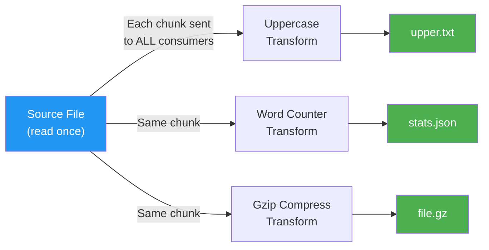

#### Backpressure Propagation Through Pipeline

When the slowest stage hits its limit, the pause signal travels **backwards** through the entire pipeline, all the way to the source. This keeps memory usage constant.


### Additional Stream Q&A

**Q6: Design a CSV file processor that handles 1GB files without loading into memory.**

A:

```js
const fs = require("fs");
const { Transform } = require("stream");
const csv = require("csv-parser"); // or custom parser

function processCSV(filepath, onRow, onError) {
    fs.createReadStream(filepath)
        .pipe(csv())
        .on("data", (row) => {
            // Process row-by-row
            onRow(row);
        })
        .on("error", onError)
        .on("end", () => {
            console.log("Processing complete");
        });
}

// Usage
let rowCount = 0;
processCSV("large-data.csv", (row) => {
    // Maybe validate, aggregate, transform
    rowCount++;
    if (rowCount % 10000 === 0) {
        console.log(`Processed ${rowCount} rows`);
    }
});
```

**Q7: Your transform stream sometimes needs to emit multiple output chunks per input chunk. How do you handle this?**

A: Use `this.push()` multiple times in `transform()`:

```js
const { Transform } = require("stream");

// Example: Explode arrays into individual items
const arrayExploder = new Transform({
    readableObjectMode: true,
    writableObjectMode: true,
    transform(chunk, enc, cb) {
        if (Array.isArray(chunk)) {
            chunk.forEach((item) => this.push(item));
        } else {
            this.push(chunk);
        }
        cb();
    },
});

// Input: [1, 2, 3], [4, 5]
// Output: 1, 2, 3, 4, 5
```

**Q8: How do you implement a `retry` stream that replays failed chunks?**

A:

```js
const { Transform } = require("stream");

class RetryTransform extends Transform {
    constructor(fn, maxRetries = 3) {
        super({ objectMode: true });
        this.fn = fn;
        this.maxRetries = maxRetries;
        this.failedChunks = [];
    }

    async transform(chunk, enc, cb) {
        for (let attempt = 0; attempt <= this.maxRetries; attempt++) {
            try {
                const result = await this.fn(chunk);
                this.push(result);
                return cb();
            } catch (err) {
                if (attempt === this.maxRetries) {
                    this.failedChunks.push({ chunk, error: err });
                    return cb(err);
                }
                // Exponential backoff
                await new Promise((resolve) =>
                    setTimeout(resolve, Math.pow(2, attempt) * 100),
                );
            }
        }
    }

    getFailedChunks() {
        return this.failedChunks;
    }
}

// Usage
const retryStream = new RetryTransform(async (item) => {
    // Might fail (network, etc)
    return await processItem(item);
});

fs.createReadStream("data.jsonl")
    .pipe(jsonlParser)
    .pipe(retryStream)
    .on("end", () => {
        console.log("Failed items:", retryStream.getFailedChunks());
    });
```

### References: [NodeServer/\_\_streams.js](NodeServer/__streams.js), [\_Stream_Buffer.js](_Stream_Buffer.js)

> **💡 Interview Tip — One-Liner Answers:**
>
> - _"What is backpressure?"_ → When a consumer is slower than a producer, the producer pauses to avoid flooding memory. `.pipe()` handles this automatically.
> - _"pipe() vs pipeline()?"_ → `pipe()` = no error cleanup (leaked streams). `pipeline()` = auto-destroys all streams on error. Always use `pipeline()` in production.
> - _"How to process a 5GB file without OOM?"_ → `fs.createReadStream()` → transform → writable. Memory stays at ~64KB regardless of file size.
> - _"What is highWaterMark?"_ → Buffer threshold (bytes) before backpressure kicks in. Default 16KB. Larger = faster throughput but more memory.

> **📝 Quick Revision — Streams:**
>
> | Stream Type | Direction               | Example                              |
> | ----------- | ----------------------- | ------------------------------------ |
> | Readable    | Source → you            | `fs.createReadStream`, HTTP req body |
> | Writable    | You → destination       | `fs.createWriteStream`, HTTP res     |
> | Duplex      | Both (independent)      | TCP socket, WebSocket                |
> | Transform   | Input → modify → output | gzip, crypto, CSV parser             |
>
> **Memory comparison (1GB file):**
>
> - `readFile()` = **1GB RAM**
> - `createReadStream()` = **~64KB RAM**
>
> **Golden rule:** If file size > 10MB, always use streams.

[↑ Back to Index](#table-of-contents)

---

## Phase 3 — I/O & System APIs

### 3.1 File System (fs)

### Concepts

The `fs` module lets Node.js interact with the file system — reading files, writing data, watching for changes, and managing directories. It's one of the most used modules, but also one of the easiest to misuse.

**Three API styles:** Node offers the same operations in three flavors:

- **Synchronous** (`fs.readFileSync`) — Blocks the event loop until done. Only use at startup (loading config) or in CLI tools. **Never** use in a server handling requests.
- **Callback** (`fs.readFile(path, callback)`) — The original async style. Non-blocking, but nests badly.
- **Promise** (`fs.promises.readFile(path)`) — Modern, clean, works with async/await. **Use this for all new code.**

**File descriptors:** Every time you open a file, the OS assigns a **file descriptor** (an integer). There's a system-wide limit (typically 1024-65535). If you open files without closing them, you'll hit `EMFILE: too many open files`. Streams handle this automatically; manual `fs.open()` requires manual `fs.close()`.

**The readFile vs createReadStream decision:** For small files (< 10MB), `readFile` is simpler. For large files, **always use streams** — `readFile` loads the entire file into memory. With 100 concurrent requests each reading a 50MB file, that's 5GB of RAM.

**File watching:** `fs.watch()` listens for file changes using OS-level mechanisms (inotify on Linux, FSEvents on macOS, ReadDirectoryChangesW on Windows). But it fires **multiple events** per save (editors write-rename-delete), so you need debouncing. The `chokidar` library wraps this with cross-platform reliability.

**Concurrent writes:** Node.js doesn't have built-in file locking. If two processes write to the same file simultaneously, data can be corrupted. Solutions include: lock files, append-only patterns, or using a database instead.

### Key APIs

- `fs.promises` — promise-based FS operations (preferred for new code).
- `fs.createReadStream` / `fs.createWriteStream` — streaming large files.
- `fs.watch(path, (eventType, filename) => {...})` — file change notifications (inotify on Linux, FSEvents on macOS).
- `fs.appendFile()` / `fs.appendFileSync()` — append data without reading entire file.
- `fs.access()` — check file permissions before operations.
- `fs.truncate()` — resize file.
- `fs.stat()` — get file metadata (size, timestamps, permissions).

### File Operations Decision Matrix

This diagram helps you choose the right `fs` API based on your situation. Follow the arrows from your operation type to the recommended approach.

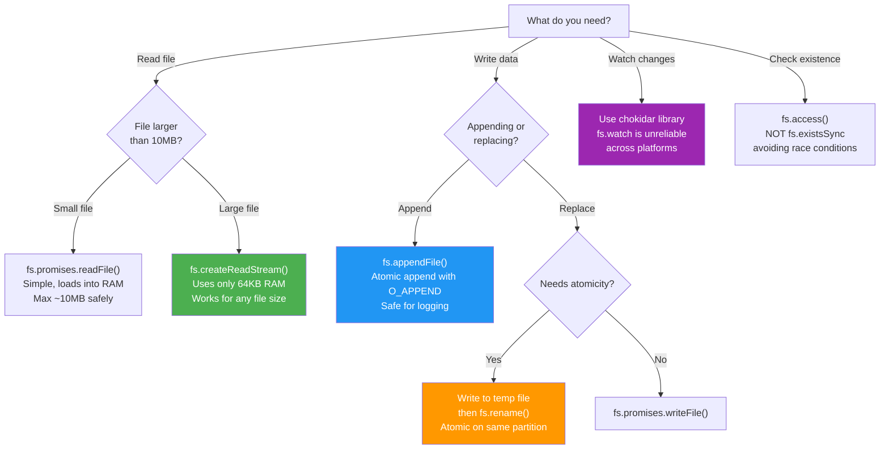

### Memory: readFile vs Streams

```mermaid
graph TB
    subgraph Small ["Small File: 5MB"]
        S1["readFile: OK<br/>5MB in RAM"]
        S2["Stream: Also OK<br/>but unnecessary"]
    end

    subgraph Medium ["Medium File: 100MB"]
        M1["readFile: Risky<br/>100MB per request<br/>10 users = 1GB RAM"]
        M2["Stream: Safe<br/>64KB per request<br/>10 users = 640KB RAM"]
    end

    subgraph Large ["Large File: 1GB+"]
        L1["readFile: CRASH<br/>Exceeds V8 heap"]
        L2["Stream: Safe<br/>Still only 64KB"]
    end

    style S1 fill:#66bb6a,color:#fff
    style S2 fill:#66bb6a,color:#fff
    style M1 fill:#ffee58,color:#000
    style M2 fill:#66bb6a,color:#fff
    style L1 fill:#ef5350,color:#fff
    style L2 fill:#66bb6a,color:#fff
```

### Performance Considerations

**Memory usage: Read entire file vs streaming**

> 📖 **What this example demonstrates:** Compares all three ways to read a file. Only streams are safe for large files — they process the file in ~64KB chunks at a time, so a 1GB file still only uses 64KB of RAM regardless of file size.
>
> 🔑 **Key terms:**
>
> - **readFileSync** — Synchronous = blocking. The entire event loop freezes until the OS finishes reading the file. All other HTTP requests wait.
> - **readFile (callback)** — Async, but still loads the ENTIRE file into a JavaScript Buffer in RAM before calling your callback.
> - **createReadStream** — Reads in chunks (default 64KB per chunk). Only one chunk is in memory at a time. Perfect for large files.
> - **highWaterMark** — The internal buffer size for streams. Default 64KB — the stream reads the next chunk only after you've consumed the current one.

```js
// ❌ BAD: Loads 1GB into memory
const fs = require("fs");
const data = fs.readFileSync("1gb-file.txt"); // Blocks event loop, uses 1GB RAM
console.log(data.toString());

// ❌ ALSO BAD: Async callback, still loads 1GB into a single Buffer
fs.readFile("1gb-file.txt", (err, data) => {
    console.log(data.toString()); // Entire file in RAM before you can read any of it
});

// ✅ GOOD: Streams use ~64KB (one chunk at a time — constant memory)
fs.createReadStream("1gb-file.txt").on("data", (chunk) => {
    console.log(chunk.toString()); // Process chunk-by-chunk, old chunk is garbage-collected
});

// ✅ PIPE: Automatic backpressure — reads next chunk only when stdout is ready
fs.createReadStream("1gb-file.txt").pipe(process.stdout);

// ✅ FOR-AWAIT: Modern async iteration (same as stream events, cleaner syntax)
for await (const chunk of fs.createReadStream("1gb-file.txt")) {
    console.log(chunk.toString()); // Each iteration yields one 64KB chunk
}
```

### File Watching Patterns

#### File Change Detection with Debounce

Text editors fire **multiple** file system events per save (write temp file, rename, delete old). Without debouncing, your code runs 3-5 times per save.

```mermaid
sequenceDiagram
    participant Editor as Text Editor
    participant FS as File System
    participant Watcher as fs.watch()
    participant Debounce as Debounce Timer
    participant App as Your Handler

    Editor->>FS: Save file (write temp)
    FS->>Watcher: change event #1
    Watcher->>Debounce: Start 300ms timer

    Editor->>FS: Rename temp to target
    FS->>Watcher: rename event #2
    Watcher->>Debounce: Cancel timer, restart

    Editor->>FS: Delete temp file
    FS->>Watcher: change event #3
    Watcher->>Debounce: Cancel timer, restart

    Note over Debounce: 300ms of silence...

    Debounce->>App: Execute handler ONCE
    Note over App: Process file change
```

> 📖 **What this example demonstrates:** Shows three ways to watch files for changes. `fs.watch` is fastest but fires multiple events per save (editors do write→rename→delete behind the scenes). `fs.watchFile` polls with stat() every interval — reliable but slow. `chokidar` wraps both with cross-platform reliability.
>
> 🔑 **Key terms:**
>
> - **inotify** — Linux kernel's file-change notification system. Near-zero CPU, near-zero latency (~1ms). `fs.watch` uses this on Linux.
> - **FSEvents** — macOS's equivalent of inotify. Also event-driven (not polling).
> - **Polling** — The OS or library repeatedly calls `stat()` ("has this file changed?") on a timer. Works everywhere, but uses CPU and has latency = poll interval.
> - **chokidar** — npm package that wraps fs.watch/FSEvents with proper debouncing and cross-platform fixes. Use in production.

```js
// Platform differences: fs.watch is unreliable on some systems
// Use fs.watchFile as fallback or external library (chokidar)

const fs = require("fs");

// fs.watch: Uses kernel-level notifications (inotify/FSEvents — fast, low CPU)
// BUT: Can fire 2-5 events per single save (editor writes temp file, renames, deletes)
fs.watch("file.txt", (eventType, filename) => {
    console.log(`Event: ${eventType} on ${filename}`);
    // 'change' = file content changed; 'rename' = file was renamed or deleted
});

// fs.watchFile: Polling approach (calls stat() on a timer — works everywhere, uses more CPU)
fs.watchFile("file.txt", (curr, prev) => {
    if (curr.mtime !== prev.mtime) {
        // mtime = modification timestamp
        console.log("File modified");
    }
});

// Best practice: Use chokidar (cross-platform, de-duplicates events, handles edge cases)
const chokidar = require("chokidar");
chokidar.watch("file.txt").on("change", () => console.log("Changed"));
// chokidar internally debounces rapid events so your handler fires exactly once per save
```

### Concurrent File Writing Strategies

#### Strategy 1: Append-Only Files

```js
// Multiple processes can safely append (atomic at OS level)
const fs = require("fs");

// All writers append independently
function safeAppend(filename, data) {
    return fs.promises.appendFile(filename, data + "<br/>");
}

// Process 1
safeAppend("log.txt", "Message from process 1");

// Process 2
safeAppend("log.txt", "Message from process 2");

// Result: Both messages safely in file, no corruption
```

#### Strategy 2: File Locking with Lock File

```js
const fs = require("fs");
const path = require("path");

class FileLock {
    constructor(filepath, lockTimeout = 5000) {
        this.filepath = filepath;
        this.lockPath = filepath + ".lock";
        this.lockTimeout = lockTimeout;
    }

    async acquire() {
        const maxRetries = 50; // 5 seconds with 100ms backoff
        for (let i = 0; i < maxRetries; i++) {
            try {
                // Fail if lock file exists (O_EXCL = atomic)
                const fd = fs.openSync(this.lockPath, "wx");
                fs.closeSync(fd);
                return true;
            } catch (err) {
                if (err.code !== "EEXIST") throw err;

                // Check for stale lock (older than lockTimeout)
                const lockStat = await fs.promises
                    .stat(this.lockPath)
                    .catch(() => null);
                if (
                    lockStat &&
                    Date.now() - lockStat.mtimeMs > this.lockTimeout
                ) {
                    await fs.promises.unlink(this.lockPath);
                    continue;
                }

                // Backoff and retry
                await new Promise((resolve) => setTimeout(resolve, 100));
            }
        }
        throw new Error("Could not acquire lock");
    }

    async release() {
        try {
            await fs.promises.unlink(this.lockPath);
        } catch (err) {
            if (err.code !== "ENOENT") throw err;
        }
    }
}

// Usage
async function criticalWrite(data) {
    const lock = new FileLock("shared.txt");
    await lock.acquire();
    try {
        await fs.promises.appendFile("shared.txt", data + "<br/>");
    } finally {
        await lock.release();
    }
}
```

#### Strategy 3: Write-to-Temp-then-Rename (Atomic)

```js
const fs = require("fs");
const path = require("path");

async function atomicWrite(filepath, data) {
    const tempPath = filepath + ".tmp." + Date.now();

    try {
        // Write to temporary file
        await fs.promises.writeFile(tempPath, data, "utf8");

        // Atomic rename (POSIX guarantees atomicity)
        await fs.promises.rename(tempPath, filepath);
    } catch (err) {
        // Cleanup temp file on error
        await fs.promises.unlink(tempPath).catch(() => {});
        throw err;
    }
}

// Usage: Safe simultaneous writes (last one wins)
Promise.all([
    atomicWrite("config.json", JSON.stringify({ version: 1 })),
    atomicWrite("config.json", JSON.stringify({ version: 2 })),
    atomicWrite("config.json", JSON.stringify({ version: 3 })),
]);
```

### Directory Traversal with Streaming

```js
const fs = require("fs");
const path = require("path");

// Recursive directory walk (memory-efficient)
async function* walk(dir) {
    const entries = await fs.promises.readdir(dir, { withFileTypes: true });

    for (const entry of entries) {
        const fullPath = path.join(dir, entry.name);

        yield {
            path: fullPath,
            isDirectory: entry.isDirectory(),
            name: entry.name,
        };

        if (entry.isDirectory()) {
            yield* walk(fullPath); // Recursive generator
        }
    }
}

// Usage: Stream through all files (no memory buildup)
async function findLargeFiles(startDir, minSize) {
    for await (const file of walk(startDir)) {
        if (!file.isDirectory) {
            const stat = await fs.promises.stat(file.path);
            if (stat.size > minSize) {
                console.log(`${file.path}: ${stat.size} bytes`);
            }
        }
    }
}

findLargeFiles(".", 1024 * 1024); // Find all files > 1MB
```

### Senior-Level Q&A

**Q1: When would you use `fs.readFileSync` in a server? What are the consequences?**

A: **Never in production HTTP servers.** Blocks the entire event loop, freezing all other requests.

> 📖 **What this example demonstrates:** Node.js is single-threaded: one blocking call freezes EVERYONE. `readFileSync` tells the OS to read the file and doesn't return until it's done — during that time, no other code runs. In a server handling 100 concurrent users, all 100 users freeze.
>
> 🔑 **Key terms:**
>
> - **Blocking** — A function that doesn't return until the OS completes the operation. The JavaScript thread is stuck waiting. All timers, callbacks, and other requests are paused.
> - **Non-blocking / async** — The operation starts, Node registers a callback, and immediately continues processing other requests. When the OS is done, the callback is queued on the event loop.

```js
// ❌ CATASTROPHIC: Blocks all requests
const express = require("express");
const app = express();

app.get("/config", (req, res) => {
    const config = fs.readFileSync("config.json"); // BLOCKS event loop — freezes for everyone!
    // While this reads, ALL other HTTP requests are paused, even unrelated routes
    res.json(JSON.parse(config));
});

// Effects:
// - All pending HTTP requests hang while one request reads the file
// - ~100ms block causes 100ms latency spike for all concurrent users

// ✅ CORRECT: Use promise-based async (non-blocking)
app.get("/config", async (req, res) => {
    // readFile asks the OS to read, then Node continues processing OTHER requests
    // When OS is done, this callback resumes — other users were served in the meantime
    const config = await fs.promises.readFile("config.json", "utf8");
    res.json(JSON.parse(config));
});
```

**Valid use cases for sync:**

- CLI tools (no concurrent requests)
- Single-run scripts
- Initialization (application startup, before server starts)

**Q2: Compare different ways to read a file. What's the memory footprint and when to use each?**

A:
| Method | Memory | Latency | Use Case |
|--------|--------|---------|----------|
| `readFileSync` | Entire file | Locks event loop | CLI, startup |
| `readFile` callback | Entire file | Non-blocking | Legacy code |
| `fs.promises.readFile` | Entire file | Non-blocking | Small files, JSON |
| `createReadStream` | ~64KB (highWaterMark) | Streaming | Large files, pipes |
| `for await` + stream | ~64KB | Streaming | Modern, readable |

> 📖 **What this example demonstrates:** How to decide which file-read method to use based on file size. The 10MB threshold is a practical rule of thumb — below it, loading the whole file into memory is fine; above it, use streams to avoid RAM exhaustion when multiple requests arrive simultaneously.

```js
// Example: 100MB file
// readFile: Loads 100MB into memory
// createReadStream: Uses ~64KB, streams data in chunks

const fs = require("fs");

async function loadLargeFile() {
    // If file < 10MB: readFile is fine (simple, returns full string)
    if (fileSize < 10 * 1024 * 1024) {
        return await fs.promises.readFile("file.json", "utf8"); // Entire file in RAM (safe at this size)
    }

    // If file > 10MB: Use streams (reads one 64KB chunk at a time)
    const chunks = []; // Collect all chunks
    for await (const chunk of fs.createReadStream("file.json")) {
        chunks.push(chunk); // Each chunk is a Buffer (binary data)
    }
    return Buffer.concat(chunks).toString("utf8"); // Join all chunks into one string at the end
}
```

**Q3: You're building a file upload service. How would you handle a 5GB video file without running out of memory?**

A: **Use streams with backpressure:**

> 📖 **What this example demonstrates:** In Express/Node HTTP, `req` (the incoming request body) IS a Readable stream and `res` (the response) IS a Writable stream. So `req.pipe(writeStream)` means: "take bytes from the incoming upload and write them directly to disk". The entire 5GB file flows through just 64KB of RAM at a time — never buffered.
>
> 🔑 **Key terms:**
>
> - **`req.pipe(writeStream)`** — Connects two streams: bytes arriving from the client flow directly to the file on disk. No intermediate buffering.
> - **413** — HTTP status code meaning "Payload Too Large". Telling the client: "your upload is bigger than we allow".
> - **`req.pause()`** — Tells the TCP socket to stop reading data (applies backpressure to the client). Used here to stop receiving data when size limit is hit.

```js
const express = require("express");
const fs = require("fs");
const app = express();

app.post("/upload", (req, res) => {
    // req is a Readable stream (upload bytes arrive over the network, chunk by chunk)
    // writeStream is a Writable stream (accepts bytes and writes them to disk)
    const uploadPath = `./uploads/${Date.now()}.mp4`;
    const writeStream = fs.createWriteStream(uploadPath); // Opens file on disk

    // pipe() connects them: upload bytes flow to disk without buffering the entire file
    req.pipe(writeStream)
        .on("close", () => {
            res.json({ success: true, file: uploadPath }); // Upload complete
        })
        .on("error", (err) => {
            fs.unlink(uploadPath, () => {}); // Delete partial file on error
            res.status(500).json({ error: err.message });
        });

    // Optional: enforce file size limit (e.g., 5GB max)
    let uploadedSize = 0;
    const MAX_SIZE = 5 * 1024 * 1024 * 1024; // 5GB in bytes

    req.on("data", (chunk) => {
        uploadedSize += chunk.length; // Track cumulative bytes received
        if (uploadedSize > MAX_SIZE) {
            req.pause(); // Stop reading (backpressure to client)
            writeStream.destroy(); // Close and delete partial file
            res.status(413).json({ error: "File too large" }); // 413 = Payload Too Large
        }
    });
});
```

**Q4: fs.watch fires multiple events for a single file change. How do you debounce it?**

A: File watchers can fire multiple events (e.g., one change triggers 2-3 events). Debounce to avoid duplicate processing:

```js
const fs = require("fs");

function watchFileDebounced(filepath, callback, delay = 500) {
    let timeout;

    fs.watch(filepath, (eventType, filename) => {
        clearTimeout(timeout);
        timeout = setTimeout(() => {
            callback(eventType, filename);
        }, delay);
    });
}

watchFileDebounced("config.json", (eventType, filename) => {
    console.log(`File changed: ${filename}`);
    // Reload config once per 500ms
});
```

**Q5: You need to write to a shared file from multiple processes safely. What are your options?**

A: Three strategies:

1. **Append-only:** Each process appends independently (safest, no locking)
2. **File lock:** Exclusive lock before write (can deadlock, performance hit)
3. **Atomic rename:** Write to temp, then rename (no intermediate corruption)

```js
// Best: Atomic write + append-only log
async function logEvent(event) {
    // Safe even with 100 concurrent writers
    await fs.promises.appendFile("events.log", JSON.stringify(event) + "<br/>");
}

// For structured data (JSON): Atomic write
async function saveState(data) {
    const tempFile = "state.json.tmp";
    await fs.promises.writeFile(tempFile, JSON.stringify(data));
    await fs.promises.rename(tempFile, "state.json"); // Atomic
}
```

**Q6: How do you handle very large directory trees (100k+ files) efficiently?**

A: Use async generators and streaming to avoid loading entire tree into memory:

```js
// ❌ BAD: Loads entire tree (recursive promise array)
async function badWalk(dir) {
    const entries = await fs.promises.readdir(dir);
    let files = [];
    for (const entry of entries) {
        const fullPath = path.join(dir, entry);
        const stat = await fs.promises.stat(fullPath);
        if (stat.isDirectory()) {
            files = files.concat(await badWalk(fullPath)); // Recursively concat
        } else {
            files.push(fullPath);
        }
    }
    return files; // Returns array of 100k items
}

// ✅ GOOD: Uses async generators (memory-efficient)
async function* walk(dir) {
    const entries = await fs.promises.readdir(dir, { withFileTypes: true });
    for (const entry of entries) {
        const fullPath = path.join(dir, entry.name);
        yield fullPath;
        if (entry.isDirectory()) {
            yield* walk(fullPath);
        }
    }
}

// Usage: Process files one at a time
for await (const file of walk(".")) {
    console.log(file); // Processes as it discovers
}
```

**Q7: What's the performance difference between fs.watch and fs.watchFile?**

A:

| Method                | Mechanism              | Latency   | CPU  | Reliability        | Best For                 |
| --------------------- | ---------------------- | --------- | ---- | ------------------ | ------------------------ |
| `fs.watch`            | inotify/FSEvents       | ~1-10ms   | Low  | Platform-dependent | Development, Linux/macOS |
| `fs.watchFile`        | Polling (stat() calls) | ~5000ms+  | High | Works everywhere   | Fallback                 |
| `chokidar` (external) | Hybrid + fallback      | ~10-100ms | Low  | High               | Production               |

```js
// Benchmark: Watch file for changes
const fs = require("fs");
const { performance } = require("perf_hooks");

let watchCount = 0;
let pollCount = 0;

// fs.watch (fast)
fs.watch("test.txt", () => {
    watchCount++;
});

// fs.watchFile (slow, polls every 5s default)
fs.watchFile("test.txt", { interval: 1000 }, () => {
    pollCount++;
});

// Modify file 10 times
for (let i = 0; i < 10; i++) {
    fs.appendFileSync("test.txt", "data<br/>");
}

// Result:
// fs.watch: 10-20 callbacks (multiple per change)
// fs.watchFile: 1-2 callbacks (misses changes if too fast)
```

**Q8: How would you implement a safe config file reload pattern?**

A:

```js
const fs = require("fs");
const path = require("path");

class ConfigManager {
    constructor(configPath) {
        this.configPath = configPath;
        this.config = null;
        this.loading = false;
        this.watchers = [];
    }

    async load() {
        if (this.loading) return; // Prevent concurrent reloads
        this.loading = true;

        try {
            const raw = await fs.promises.readFile(this.configPath, "utf8");
            const newConfig = JSON.parse(raw);

            // Validate before replacing
            this.validate(newConfig);

            this.config = newConfig;
            this.emit("loaded", newConfig);
        } catch (err) {
            console.error("Config load failed:", err);
            this.emit("error", err);
        } finally {
            this.loading = false;
        }
    }

    watch() {
        let timeout;
        fs.watch(this.configPath, (eventType) => {
            clearTimeout(timeout);
            timeout = setTimeout(() => this.load(), 500); // Debounce
        });
    }

    validate(config) {
        // Check required fields, types, etc
        if (!config || typeof config !== "object") {
            throw new Error("Invalid config format");
        }
    }

    get() {
        if (!this.config) {
            throw new Error("Config not loaded");
        }
        return this.config;
    }

    subscribe(callback) {
        this.watchers.push(callback);
    }

    emit(event, data) {
        this.watchers.forEach((cb) => cb(event, data));
    }
}

// Usage
const config = new ConfigManager("config.json");
await config.load();
config.watch();

config.subscribe((event, data) => {
    if (event === "loaded") {
        console.log("Config reloaded:", data);
    }
});
```

### Best Practices

- **Use streaming for files > 10MB:** Avoid loading entire file into memory.
- **Always use `fs.promises` or callbacks** in async code; never sync in servers.
- **Handle watch errors:** fs.watch can be unreliable; use chokidar for production.
- **Test file operations cross-platform:** fs.watch behavior differs (Linux vs macOS vs Windows).
- **Use append-only for logs:** Safest for concurrent writes (atomic at OS level).
- **Atomic writes for structured data:** Write to temp, then rename to guarantee atomicity.
- **Debounce watchers:** Prevent duplicate processing from multiple file change events.
- **Check permissions before operations:** Use `fs.access()` for fail-fast design.

### Common Pitfalls

- **Using `readFileSync` in servers:** Blocks all requests.
- **Forgetting to handle stream errors:** Silent failures, left-over file handles.
- **Assuming fs.watch is reliable:** May miss events or fire duplicates; use chokidar in production.
- **Not handling concurrent writes:** Multiple processes can corrupt shared files (use locking/appending strategies).
- **Loading entire files into memory:** Causes OOM for large files (use streams instead).
- **Race conditions with file operations:** TOCTOU (time-of-check, time-of-use) between stat() and subsequent operations.
- **Ignoring stale locks:** Fill disk with abandoned lock files; implement timeout-based cleanup.

### References: [fs/basics.js](fs/basics.js)

> **💡 Interview Tip — One-Liner Answers:**
>
> - _"Why avoid readFileSync in servers?"_ → It blocks the event loop; zero requests are served until the read completes.
> - _"How do you read a 5GB file in Node?"_ → Use `fs.createReadStream()` to stream it chunk-by-chunk instead of loading it all into memory.
> - _"What is TOCTOU?"_ → Time-of-check-to-time-of-use race condition — a file can change between `stat()` and the subsequent operation.
> - _"fs.watch vs chokidar?"_ → `fs.watch` is unreliable across platforms (duplicates, missing events); chokidar normalizes behaviour and is production-safe.

> **📝 Quick Revision — File System:**
> | Concept | Key Point |
> |---|---|
> | Sync vs Async | Sync blocks the event loop; always use async in servers |
> | Streams | `createReadStream` / `createWriteStream` for large files |
> | `fs/promises` | Modern API — `await fs.readFile()` instead of callbacks |
> | File Watching | Use `chokidar` in production, not raw `fs.watch` |
> | File Locking | Use lock files or `proper-lockfile` to prevent concurrent writes |
> | Thread Pool | `fs` operations use libuv thread pool (default 4 threads) |

[↑ Back to Index](#table-of-contents)

---

### 3.2 HTTP Server & NodeServer

### Concepts

Node.js was **designed for building network servers**. The built-in `http` module gives you the raw primitives to handle HTTP requests and responses without any framework.

**How a Node HTTP server works:** When you call `http.createServer(handler)`, Node creates a TCP server that:

1. Listens for incoming TCP connections on a port
2. Parses the raw bytes into an HTTP request (method, path, headers, body)
3. Calls your handler function with two objects: `req` (the incoming request as a Readable stream) and `res` (the outgoing response as a Writable stream)
4. Your handler reads the request, does work, and writes the response

**Why `req` and `res` are streams:** The request body might be huge (a file upload), and the response might be huge (a file download). By making them streams, Node never needs to buffer the entire payload in memory. You can stream a 10GB file to the client using only ~64KB of RAM.

**The connection lifecycle:** Each HTTP request goes through: TCP handshake → HTTP parsing → your handler → response sent → keep-alive or close. With `keep-alive` (default in HTTP/1.1), the TCP connection stays open for multiple requests, saving the overhead of repeated handshakes.

**Frameworks vs raw `http`:** Express, Fastify, Koa, and Hapi all build on top of `http.createServer()`. They add routing, middleware, request parsing, and error handling. For interviews, you should know the raw `http` module to understand what frameworks abstract away.

### Examples

#### Basic Streaming Response

> 📖 **What this example demonstrates:** The core HTTP streaming pattern in Node. `res` (the response object) is a Writable stream. `stream.pipe(res)` connects the file's Readable stream to the response — bytes flow from disk directly to the client's browser without ever being fully in RAM.
>
> 🔑 **Key terms:**
>
> - **`req.url`** — The path part of the URL (e.g., `/large-file` in `http://localhost:3000/large-file`).
> - **`stream.pipe(res)`** — Tells Node: "read chunks from the file and write them as HTTP response body". Handles backpressure automatically.
> - **`stream.on('error')`** — Files can fail to open (not found, permission denied). Without this handler, the error would crash your server.

```js
const http = require("http");
const fs = require("fs");

http.createServer((req, res) => {
    if (req.url === "/large-file") {
        // Stream file without loading into memory
        // createReadStream reads the file in 64KB chunks
        const stream = fs.createReadStream("large.txt");
        stream.pipe(res); // Pipe file bytes directly to the HTTP response

        stream.on("error", (err) => {
            // Error handling: file not found, permission denied, etc.
            res.writeHead(500);
            res.end("Stream error");
        });
    } else {
        res.writeHead(200);
        res.end("OK");
    }
}).listen(3000);
```

#### Request Body Streaming (File Upload)

> 📖 **What this example demonstrates:** In a raw Node HTTP server, `req` (the incoming request body) is a Readable stream. `req.pipe(writeStream)` means the upload data flows directly from the client to disk — no body parser, no buffering. This is exactly how frameworks like `multer` work under the hood.

```js
const http = require("http");
const fs = require("fs");

http.createServer((req, res) => {
    if (req.method === "POST" && req.url === "/upload") {
        const writeStream = fs.createWriteStream("uploaded.dat"); // Open file for writing

        // pipe() streams request body bytes directly to disk
        // 'close' event fires when all bytes are written and file is closed
        req.pipe(writeStream)
            .on("close", () => {
                res.writeHead(200);
                res.end("Upload complete");
            })
            .on("error", (err) => {
                res.writeHead(500);
                res.end("Upload failed");
            });
    }
}).listen(3000);
```

### Senior-Level Q&A

**Q1: You're building a file download endpoint for large files (500MB+). Compare three approaches.**

A:

**Approach 1: Buffer entire file (❌ BAD)**

> 📖 **What this example demonstrates:** `readFileSync` loads the ENTIRE 500MB into a JavaScript Buffer. With 10 concurrent downloads, that's 5GB of RAM. Plus it blocks the event loop while reading — no other requests can be served during the read.

```js
// Loads 500MB into memory — will crash on 10 concurrent downloads!
// Also BLOCKS the event loop during the read (no requests served until it completes)
http.createServer((req, res) => {
    const data = fs.readFileSync("large-file.bin"); // Entire 500MB in RAM as one Buffer
    res.end(data); // Sends all 500MB at once
}).listen(3000);
```

**Approach 2: Async read (❌ STILL BAD)**

> 📖 **What this example demonstrates:** `readFile` is async so it doesn't block, but it STILL loads the entire file into a single Buffer before calling your callback. With 10 concurrent requests, 10 × 500MB = 5GB of RAM simultaneously.

```js
// Slightly better: non-blocking, but still loads entire file
// 10 concurrent requests = 10 × 500MB = 5GB peak RAM usage
fs.readFile("large-file.bin", (err, data) => {
    res.end(data); // Still buffers the whole 500MB before sending
});
```

**Approach 3: Stream (✅ GOOD)**

> 📖 **What this example demonstrates:** `createReadStream` reads the file in 64KB chunks and pipes them to the response. Regardless of file size (500MB or 500GB), only 64KB is in RAM at any moment. 1000 concurrent downloads still only use 64KB × 1000 = 64MB.
>
> 🔑 **Key terms:**
>
> - **`Content-Disposition: attachment`** — HTTP header that tells the browser to download the file rather than display it.
> - **`application/octet-stream`** — Generic binary content-type. Browser won't try to render it.
> - **`pipe(res)`** — Automatically manages backpressure: reads the next chunk only when the HTTP response (the client) can accept more data.

```js
// Uses ~64KB memory regardless of file size
// 1000 concurrent downloads = 64KB × 1000 = 64MB total (vs 500GB with readFile!)
http.createServer((req, res) => {
    res.setHeader("Content-Type", "application/octet-stream"); // Tell browser: download this
    res.setHeader(
        "Content-Disposition",
        'attachment; filename="large-file.bin"', // Suggest a filename for the download dialog
    );

    fs.createReadStream("large-file.bin").pipe(res); // Pipe chunks directly to client
    // pipe() handles backpressure: waits for slow clients instead of buffering
}).listen(3000);
```

**Memory comparison:**

- Buffer: 500MB (constant)
- Stream: ~64KB (constant, regardless of file size)

**Q2: How do you implement range requests (HTTP 206) for video streaming?**

A: Range requests allow clients to resume downloads and seek in videos:

> 📖 **What this example demonstrates:** Video players need to "seek" to any position in a file. They do this by sending an HTTP `Range` header like `bytes=500000-999999` ("give me bytes 500K to 1M"). Your server responds with HTTP 206 (Partial Content) and streams only those bytes. Without range support, video seeking downloads from the beginning every time.
>
> 🔑 **Key terms:**
>
> - **HTTP 206 Partial Content** — Status code meaning "here's part of the file you requested". Enables video seeking and download resumption.
> - **`Range: bytes=0-1023`** — HTTP request header asking for the first 1024 bytes.
> - **`Content-Range`** — Response header telling the client which bytes are included and the total file size.
> - **`createReadStream({ start, end })`** — fs feature that reads ONLY a slice of a file, not the whole thing.

```js
const http = require("http");
const fs = require("fs");

http.createServer((req, res) => {
    if (req.url === "/video.mp4") {
        const stat = fs.statSync("video.mp4"); // Get file metadata (size, etc.)
        const fileSize = stat.size; // Total file size in bytes
        const range = req.headers.range; // e.g. "bytes=0-1023" from the video player

        if (range) {
            // Parse Range header: "bytes=0-1023" → start=0, end=1023
            const parts = range.replace(/bytes=/, "").split("-");
            const start = parseInt(parts[0], 10); // Start byte (inclusive)
            const end = parts[1] ? parseInt(parts[1], 10) : fileSize - 1; // End byte (inclusive)

            if (start >= fileSize || end >= fileSize) {
                res.writeHead(416); // 416 = Range Not Satisfiable (requested bytes don't exist)
                res.end("Requested range out of bounds");
                return;
            }

            // Send 206 Partial Content (not 200 OK — sending just a slice)
            res.writeHead(206, {
                "Content-Range": `bytes ${start}-${end}/${fileSize}`, // Which bytes + total size
                "Content-Length": end - start + 1, // How many bytes in this response
                "Content-Type": "video/mp4",
            });

            // Read ONLY the requested byte range from disk (very efficient!)
            fs.createReadStream("video.mp4", { start, end }).pipe(res);
        } else {
            // No range header: send full file (first play or non-seekable player)
            res.writeHead(200, {
                "Content-Length": fileSize,
                "Content-Type": "video/mp4",
            });
            fs.createReadStream("video.mp4").pipe(res);
        }
    }
}).listen(3000);
```

**Q3: How does backpressure work with HTTP responses? Why does it matter?**

A: If client is slow, response stream buffers in memory. Without backpressure handling, memory grows:

```js
// ❌ Ignores backpressure (memory leak!)
http.createServer((req, res) => {
    const data = Buffer.alloc(1024 * 1024); // 1MB chunk
    for (let i = 0; i < 10000; i++) {
        res.write(data); // Never checks return value
    }
    res.end();
}).listen(3000);

// ✅ Respects backpressure
http.createServer((req, res) => {
    const data = Buffer.alloc(1024 * 1024);
    let i = 0;

    function write() {
        let canContinue = true;
        while (i < 10000 && canContinue) {
            canContinue = res.write(data);
            if (!canContinue) break;
            i++;
        }

        if (i < 10000 && !canContinue) {
            res.once("drain", write); // Resume when client ready
        }
    }

    write();
}).listen(3000);

// ✅ SIMPLE: Use pipe() (handles backpressure automatically)
// See streaming examples above
```

**Q4: How would you implement a health check endpoint that's fast and non-blocking?**

A:

```js
const http = require("http");

// Simple in-memory health state
let isHealthy = true;
let startTime = Date.now();

http.createServer((req, res) => {
    // Health check (fast, non-blocking)
    if (req.url === "/health") {
        const uptime = Date.now() - startTime;

        if (isHealthy) {
            res.writeHead(200, { "Content-Type": "application/json" });
            res.end(JSON.stringify({ status: "ok", uptime }));
        } else {
            res.writeHead(503);
            res.end(JSON.stringify({ status: "unhealthy" }));
        }
        return;
    }

    // Regular request handling
    res.writeHead(200);
    res.end("OK");
}).listen(3000);

// Set health status based on app state
app.on("error", () => {
    isHealthy = false;
    setTimeout(() => {
        isHealthy = true; // Recover after timeout
    }, 5000);
});
```

### Best Practices

- **Always stream large responses:** Avoid buffering entire payloads.
- **Handle stream errors:** Both `req` and `res` can error.
- **Set appropriate headers:** `Content-Type`, `Content-Length`, `Content-Range`.
- **Implement timeouts:** Slow clients shouldn't block forever.
- **Use compression:** `gzip` reduces bandwidth for text responses.

### Common Pitfalls

- **Buffering large responses:** Causes memory to grow with file size.
- **Not handling slow clients:** Memory leak if slow client doesn't consume.
- **Ignoring error events:** Unhandled stream errors leave sockets open.
- **Mixing callback and stream APIs:** Hard to manage error propagation.

### References: [NodeServer/server.js](NodeServer/server.js), [NodeServer/http_server.js](NodeServer/http_server.js), [NodeServer/\_\_streams.js](NodeServer/__streams.js)

> **💡 Interview Tip — One-Liner Answers:**
>
> - _"How does Node handle HTTP requests internally?"_ → `http.createServer` wraps a TCP socket; each request is an event emitted on the server object — no thread-per-request.
> - _"Why stream responses?"_ → Buffering a 500MB file means 500MB of RAM per request; streaming serves it in small chunks with constant memory.
> - _"req and res — what are they?"_ → `req` is a Readable stream (incoming data), `res` is a Writable stream (outgoing data) — both follow the stream API.
> - _"How to handle slow clients?"_ → Set `server.timeout` and `server.keepAliveTimeout`; if a client doesn't consume, backpressure kicks in via the stream pipeline.

> **📝 Quick Revision — HTTP Server:**
> | Concept | Key Point |
> |---|---|
> | `http.createServer` | Creates TCP server + HTTP parser, emits `request` events |
> | req (IncomingMessage) | Readable stream — body arrives in chunks |
> | res (ServerResponse) | Writable stream — call `.write()` / `.end()` |
> | Streaming files | `fs.createReadStream(path).pipe(res)` — constant memory |
> | Timeouts | `server.timeout` prevents slow-client resource exhaustion |
> | Keep-Alive | HTTP/1.1 reuses connections; set `keepAliveTimeout` |

[↑ Back to Index](#table-of-contents)

---

### 3.3 Child Processes (exec / spawn / fork)

### Concepts

Node.js runs your code on a single thread, which is great for I/O but terrible for CPU-heavy work. If you compute a Fibonacci number for 30 seconds, **every user on your server waits** 30 seconds. Child processes are the escape hatch.

**What is a child process?** It's a completely separate OS process — with its own memory, its own V8 engine (if it's Node), and its own event loop. The parent and child communicate by sending messages through a pipe (IPC channel). Think of it as hiring an assistant: you give them a task, they work on it in their own workspace, and bring back the result.

**The three APIs:**

1. **`exec(command)`** — Runs a **shell command** (like typing in a terminal). Buffers the entire output in memory, then gives it to you. Great for quick commands like `git status` or `ls`. **Security warning:** because it runs through a shell (`/bin/sh` or `cmd.exe`), user input can be injected as shell commands.

2. **`spawn(command, args)`** — Like `exec` but **streams** output instead of buffering. Use for long-running processes or large output. NO shell involved, so it's safer. Arguments are passed as an array, not a string.

3. **`fork(scriptPath)`** — Spawns a **new Node.js process** with a built-in IPC (Inter-Process Communication) channel. Parent and child can send messages with `process.send()` and `.on('message')`. This is how you run CPU-heavy JavaScript in the background without blocking your server.

**Important:** Each child process is a full OS process with its own memory (~30MB minimum for Node). Don't fork hundreds of processes — use a pool of 4-8 workers and queue tasks.

### Key APIs

- **`exec(command, cb)`** — Run shell command, buffer entire stdout/stderr.
- **`spawn(cmd, args, opts)`** — Stream-based child process (no buffering).
- **`fork(modulePath, args, opts)`** — Spawn Node process with IPC channel.
- **Message passing:** `process.send()` (child), `child.send()` (parent), `.on('message', ...)`

### Comparison Table

| API        | Buffer              | Streams | Shell | IPC | Use Case                             |
| ---------- | ------------------- | ------- | ----- | --- | ------------------------------------ |
| `exec`     | Yes (entire output) | No      | Yes   | No  | Short commands, need full output     |
| `execFile` | Yes                 | No      | No    | No  | Safer than exec (no shell injection) |
| `spawn`    | No                  | Yes     | No    | No  | Long-running, high output            |
| `fork`     | No                  | No      | N/A   | Yes | Node worker processes                |

### exec vs spawn Examples

> 📖 **What this example demonstrates:** The fundamental difference between `exec` and `spawn`. `exec` is convenient for short commands but buffers ALL output in RAM first. `spawn` streams output, so it works safely even if the output is hundreds of MB. It also shows how to add a safety limit on output size.
>
> 🔑 **Key terms:**
>
> - **`exec`** — Runs a command through the shell (`/bin/sh -c "ls"`). Returns stdout and stderr as strings AFTER the command finishes. Max buffer ~1MB by default.
> - **`spawn`** — Runs a command directly (no shell). stdout/stderr are streams you can listen to as chunks arrive.
> - **`ls.kill()`** — Sends SIGTERM to the child process, terminating it. Used here as a safety valve if output exceeds 100MB.

```js
const { exec, spawn } = require("child_process");

// ❌ exec: Buffers entire output in RAM (bad for large outputs)
// Default max buffer is 200KB; exceeding it throws an error
exec("ls -la /large-directory", (err, stdout, stderr) => {
    // stdout and stderr are full strings — entire output is in RAM
    console.log(stdout);
});

// ✅ spawn: Streams output (good for large outputs or long-running commands)
const ls = spawn("ls", ["-la", "/large-directory"]); // Args as array (safer than string)
ls.stdout.on("data", (chunk) => {
    console.log("Output chunk:", chunk.toString()); // Each chunk arrives as it's produced
});
ls.stderr.on("data", (chunk) => {
    console.error("Error chunk:", chunk.toString()); // stderr is a separate stream
});
ls.on("close", (code) => {
    console.log("Exited with code", code); // 0 = success, non-zero = error
});

// Safety: Stop a runaway process if output exceeds a limit
let outputSize = 0;
ls.stdout.on("data", (chunk) => {
    outputSize += chunk.length;
    if (outputSize > 100 * 1024 * 1024) {
        // 100MB limit
        ls.kill(); // Send SIGTERM — tells the process to stop gracefully
    }
});
```

### IPC Patterns (fork)

> 📖 **What this example demonstrates:** `fork` creates a NEW Node.js process (a full separate copy of Node) and sets up an IPC (Inter-Process Communication) channel between parent and child. The parent sends a task message, the child does the CPU-heavy work in its own thread, then replies. Your main server is never blocked.
>
> 🔑 **Key terms:**
>
> - **IPC (Inter-Process Communication)** — A mechanism for two separate OS processes to exchange messages. Node's `fork` automatically creates a pipe-based IPC channel.
> - **`worker.send(msg)`** — Parent sends a JavaScript object to the child process (serialized as JSON through the pipe).
> - **`process.on('message')`** — Inside the child: listen for messages from the parent.
> - **`process.send(msg)`** — Inside the child: send a reply back to the parent.
> - **Fork overhead** — Each `fork` starts a NEW Node.js process with its own V8 engine, ~100-200MB of RAM. Don't fork hundreds of processes; use a pool.

```js
// parent.js
const { fork } = require("child_process");
const worker = fork("worker.js"); // Start a new Node.js process (uses ~100-200MB RAM)

// Send a task to the child via IPC channel (serialized as JSON)
worker.send({ type: "compute", n: 1e8 }); // 1e8 = 100,000,000

// Receive the result when child calls process.send()
worker.on("message", (result) => {
    console.log("Result from worker:", result); // { result: 4999999950000000 }
});

// Clean up when the child process terminates
worker.on("close", (code) => {
    console.log("Worker exited with code", code); // 0 = normal exit
});

// -----

// worker.js (runs in its own separate Node.js process)
process.on("message", (msg) => {
    if (msg.type === "compute") {
        // This CPU-heavy loop runs in the child process — parent's event loop is NOT blocked!
        let sum = 0;
        for (let i = 0; i < msg.n; i++) sum += i;
        process.send({ result: sum }); // Send result back to parent
    }
});
```

### Senior-Level Q&A

**Q1: When would you use `exec` vs `spawn` vs `fork`? Give specific examples.**

A:

**`exec`:** Short commands, small output

```js
const { exec } = require("child_process");

// Example: Check if service is running
exec("systemctl is-active nginx", (err, stdout) => {
    if (stdout.includes("active")) {
        console.log("Nginx is running");
    }
});
```

**`spawn`:** Long-running, high output, streaming

```js
const { spawn } = require("child_process");

// Example: Process log file (large)
const tail = spawn("tail", ["-f", "/var/log/app.log"]);
tail.stdout.on("data", (chunk) => {
    // Stream log lines
    console.log(chunk.toString());
});
```

**`fork`:** CPU-bound work, need communication

```js
const { fork } = require("child_process");

// Example: Batch processing
const worker = fork("image-processor.js");
worker.send({ images: [...], operation: "resize" });
worker.on("message", (processed) => {
    console.log("Processed batch:", processed.count);
});
```

**Q2: Your app uses `exec` to run a system command. What's the security risk?**

A: **Shell injection.** User input in `exec` command can execute arbitrary code:

> 📖 **What this example demonstrates:** `exec` passes the command to the shell (`/bin/sh`), which interprets special characters like `;`, `&&`, `|`, `$(...)`. If user input contains these characters, the shell executes attacker-controlled commands. This is the Node.js equivalent of SQL injection, but for the OS.
>
> 🔑 **Key terms:**
>
> - **Shell injection** — Attacker inserts shell metacharacters (`;`, `&&`, `|`) into user input. The shell interprets them and runs extra commands.
> - **`execFile`** — Does NOT use a shell. Arguments are passed as an array directly to the OS. No shell metacharacters are interpreted. Always prefer over `exec` when arguments include user input.
> - **`spawn` with array args** — Same as execFile — args are OS-level, not shell-interpreted.

```js
// ❌ VULNERABLE: User input in shell command
const { exec } = require("child_process");
const userId = req.query.id; // User-controlled input from URL

exec(`cat /tmp/user_${userId}.txt`, (err, stdout) => {
    console.log(stdout);
});

// Attack: malicious input sets userId to:  ; rm -rf /
// Resulting full command:  cat /tmp/user_; rm -rf / .txt
// Shell sees: (1) cat /tmp/user_  (2) rm -rf /  <-- DELETES EVERYTHING!

// ✅ SAFE: Use execFile (no shell — semicolons & special chars are literal)
const { execFile } = require("child_process");
execFile("cat", [`/tmp/user_${userId}.txt`], (err, stdout) => {
    // Arguments passed as array directly to OS — shell is never involved
    // userId could be "; rm -rf /" and it would just fail to find the file
    console.log(stdout);
});

// ✅ ALSO SAFE: Input validation + escaping (if you must use exec)
const shell = require("shellwords");
const escaped = shell.escape(userId); // Escapes all shell metacharacters
exec(`cat /tmp/user_${escaped}.txt`, ...);
```

**Q3: You spawn a child process for a long task. How do you handle cleanup if the parent crashes?**

A: Orphaned child processes continue running. Proper cleanup:

```js
const { spawn } = require("child_process");

class ChildProcessManager {
    constructor() {
        this.children = new Set();
    }

    spawn(cmd, args) {
        const child = spawn(cmd, args);
        this.children.add(child);

        child.on("close", () => {
            this.children.delete(child);
        });

        // If parent exits, kill all children
        process.on("exit", () => this.killAll());
        process.on("SIGTERM", () => this.killAll());
        process.on("SIGINT", () => this.killAll());

        return child;
    }

    killAll() {
        this.children.forEach((child) => {
            if (!child.killed) {
                child.kill("SIGTERM");
                // Force kill after timeout
                setTimeout(() => {
                    if (!child.killed) child.kill("SIGKILL");
                }, 5000);
            }
        });
    }
}
```

**Q4: How do you handle errors and timeouts in child processes?**

A:

> 📖 **What this example demonstrates:** Wrapping a child process in a Promise with a built-in timeout. Without a timeout, a hung process consumes a slot forever. The pattern collects stdout/stderr as Buffers, then resolves/rejects when the process exits or when the timer fires.
>
> 🔑 **Key terms:**
>
> - **`child.kill('SIGTERM')`** — Sends a termination signal to the child process. SIGTERM is polite ("please shut down"); the child can handle it. SIGKILL is forceful ("die now").
> - **`child.on('close', code)`** — Fires when the process AND its stdio streams have closed. `code` is the exit code (0 = success, non-zero = error).
> - **`child.on('error')`** — Fires if the process could NOT be started at all (e.g., command not found).

```js
const { spawn } = require("child_process");

function spawnWithTimeout(cmd, args, timeoutMs = 30000) {
    const child = spawn(cmd, args);
    let timedOut = false;

    // Set a timer: if process doesn't finish in time, kill it
    const timeout = setTimeout(() => {
        timedOut = true; // Remember it was a timeout (not a natural exit)
        child.kill("SIGTERM"); // Ask process to shut down (graceful)
    }, timeoutMs);

    return new Promise((resolve, reject) => {
        let stdout = "";
        let stderr = "";

        child.stdout.on("data", (chunk) => {
            stdout += chunk;
        }); // Collect all output
        child.stderr.on("data", (chunk) => {
            stderr += chunk;
        }); // Collect error output

        child.on("close", (code) => {
            clearTimeout(timeout); // Cancel timer (process exited naturally)

            if (timedOut) {
                reject(new Error(`Process timed out after ${timeoutMs}ms`));
            } else if (code !== 0) {
                reject(
                    new Error(`Process exited with code ${code}: ${stderr}`),
                ); // Non-zero = failure
            } else {
                resolve(stdout); // Success: return collected output
            }
        });

        child.on("error", (err) => {
            clearTimeout(timeout);
            reject(new Error(`Failed to spawn process: ${err.message}`)); // e.g., command not found
        });
    });
}

// Usage
spawnWithTimeout("node", ["compute.js"], 10000)
    .then((result) => console.log(result))
    .catch((err) => console.error("Failed:", err));
```

**Q5: Design an IPC-based task queue (parent distributes work to workers).**

A:

```js
// task-queue.js
const { fork } = require("child_process");
const os = require("os");

class TaskQueue {
    constructor(workerScript, numWorkers = os.cpus().length) {
        this.workers = [];
        this.taskQueue = [];
        this.activeWorkers = new Map();

        for (let i = 0; i < numWorkers; i++) {
            const worker = fork(workerScript);
            worker.on("message", (result) => {
                this.handleWorkerResult(result);
            });
            this.workers.push(worker);
        }
    }

    enqueue(task, id) {
        this.taskQueue.push({ task, id });
        this.distributeWork();
    }

    distributeWork() {
        while (this.taskQueue.length > 0) {
            const availableWorker = this.workers.find(
                (w) => !this.activeWorkers.has(w.pid),
            );

            if (!availableWorker) break; // All workers busy

            const { task, id } = this.taskQueue.shift();
            this.activeWorkers.set(availableWorker.pid, id);
            availableWorker.send({ id, task });
        }
    }

    handleWorkerResult(result) {
        const { id, output, error } = result;
        this.activeWorkers.delete(result.workerPid);
        // Handle result...
        this.distributeWork(); // Process next queued task
    }

    shutdown() {
        this.workers.forEach((w) => w.kill());
    }
}

module.exports = TaskQueue;
```

### Best Practices

- **Use `spawn` for long-running processes;** `exec` for short commands.
- **Use `execFile` instead of `exec`** to avoid shell injection.
- **Always handle child process errors** and exits.
- **Implement timeouts** for long-running tasks.
- **Clean up children on parent exit:** `process.on('exit', killChildren)`.
- **Monitor child process resource usage:** CPU, memory; restart if exceeded.

### Common Pitfalls

- **Shell injection with `exec`:** Always use `execFile` or escape input.
- **Memory leaks from buffered output:** Use `spawn` with streams for large output.
- **Orphaned child processes:** Always kill on parent exit.
- **Not handling timeouts:** Endless waiting for slow children.
- **Ignoring stdio:** Uncaught child errors (not logged) make debugging hard.

### References: [EventEmitters/\_exec.js](EventEmitters/_exec.js), [EventEmitters/\_spawn.js](EventEmitters/_spawn.js), [ClusterAndFork/index.js](ClusterAndFork/index.js), [ClusterAndFork/child.js](ClusterAndFork/child.js)

> **💡 Interview Tip — One-Liner Answers:**
>
> - _"exec vs spawn?"_ → `exec` buffers all output into a string (good for small commands); `spawn` streams output (good for long-running processes).
> - _"When to use fork?"_ → `fork` is a special `spawn` for Node scripts — it creates an IPC channel for message passing between parent and child.
> - _"How to prevent shell injection?"_ → Use `execFile` or `spawn` (no shell) instead of `exec`; never pass user input directly to a shell command.
> - _"What happens if the parent dies?"_ → Orphaned children keep running; use `process.on('exit', killChildren)` or set `detached: false`.

> **📝 Quick Revision — Child Processes:**
> | Method | Shell? | Output | IPC? | Best For |
> |---|---|---|---|---|
> | `exec` | ✅ Yes | Buffered string | ❌ | Short commands, small output |
> | `execFile` | ❌ No | Buffered string | ❌ | Safe alternative to exec |
> | `spawn` | ❌ No | Streamed | ❌ | Long-running, large output |
> | `fork` | ❌ No | Streamed | ✅ Yes | Node-to-Node communication |

[↑ Back to Index](#table-of-contents)

---

## Phase 4 — Concurrency & Scaling

### 4.1 Worker Threads & Atomics

### Concepts

Worker threads give Node.js **true multithreading** — multiple JavaScript execution contexts running in parallel on separate CPU cores. This is fundamentally different from child processes.

**The problem worker threads solve:** Node's main thread is great for I/O, but terrible for CPU-heavy work. If you need to hash passwords, resize images, parse large JSON, or compute analytics, blocking the main thread means **zero requests are served** until the computation finishes. Worker threads let you run this heavy work on a separate thread.

**How are they different from child processes?** A child process (`fork`) creates an entirely new Node.js process with its own memory space (~100-200MB). Worker threads run inside the **same process** but with their own V8 isolate (JavaScript engine instance), their own event loop, and their own stack. Memory overhead is much lower (~30-50MB per thread) and you can **share memory** between threads using `SharedArrayBuffer`.

**V8 Isolate:** Each worker thread gets its own V8 isolate — a completely independent JavaScript execution environment. Variables, functions, and closures in one thread are invisible to another thread. Communication happens through **message passing** (`postMessage`) or **shared memory** (`SharedArrayBuffer`).

**Shared memory and Atomics:** `SharedArrayBuffer` lets multiple threads access the same block of raw memory. But this introduces **race conditions** — two threads reading and writing the same memory location simultaneously can corrupt data. `Atomics` provides thread-safe operations: `Atomics.add()` for atomic increment, `Atomics.compareExchange()` for compare-and-swap, and `Atomics.wait()`/`Atomics.notify()` for thread signaling.

**When NOT to use worker threads:** If your work is I/O-bound (database queries, HTTP calls, file reads), worker threads won't help because Node already handles I/O asynchronously. Worker threads shine only for **CPU-bound** work.

```mermaid
graph TB
    subgraph Process ["Single Node.js Process"]
        Main["Main Thread<br/>Event Loop + Your Server Code<br/>Handles HTTP, I/O, etc."]

        subgraph Workers ["Worker Thread Pool"]
            W1["Worker 1<br/>Own V8 Isolate<br/>Own Event Loop"]
            W2["Worker 2<br/>Own V8 Isolate<br/>Own Event Loop"]
            W3["Worker 3<br/>Own V8 Isolate<br/>Own Event Loop"]
        end

        SAB["SharedArrayBuffer<br/>Shared Memory Region<br/>Access via Atomics"]

        LIBUV["libuv (shared across ALL threads)<br/>Thread Pool · Timer Wheel · OS Async I/O<br/>Each thread has its own event loop<br/>but ALL share the same libuv instance"]
    end

    Main -->|"postMessage()<br/>(structured clone)"| W1
    Main -->|"postMessage()"| W2
    W1 -->|"parentPort.postMessage()"| Main

    W1 -.->|"Direct memory access<br/>(use Atomics!)"| SAB
    W2 -.->|"Direct memory access<br/>(use Atomics!)"| SAB
    W3 -.->|"Direct memory access<br/>(use Atomics!)"| SAB
    Main -.->|"Direct memory access<br/>(use Atomics!)"| SAB

    Main --- LIBUV
    W1 --- LIBUV
    W2 --- LIBUV
    W3 --- LIBUV

    style Main fill:#2196f3,color:#fff
    style SAB fill:#ff9800,color:#fff
    style Workers fill:#66bb6a,color:#fff
    style LIBUV fill:#fff3e0,color:#e65100
```

### Key APIs

- `new Worker(path, { workerData })` — create worker thread.
- `parentPort.postMessage(data)` — send message from worker.
- `parentPort.on('message', cb)` — receive message in worker.
- `worker.on('message', cb)` — receive message in parent.
- `Atomics.wait(typedArray, index)` — block thread until notify.
- `Atomics.notify(typedArray, index)` — wake waiting threads.

### Worker Basics

> 📖 **What this example demonstrates:** The simplest Worker Thread pattern. The main file creates a worker (a separate thread with its own V8 engine), passes initial data via `workerData`, and receives the result via `postMessage`. The heavy computation loop runs in the worker thread — the main thread's event loop keeps responding to HTTP requests while the worker is busy.
>
> 🔑 **Key terms:**
>
> - **`workerData`** — A plain JavaScript object you can pass to the worker when creating it. It's cloned (deep-copied) — changes in the worker don't affect the original.
> - **`parentPort`** — The communication channel between worker and parent. Think of it as a pipe: `.postMessage()` sends, `.on('message')` receives.
> - **`worker.on('exit', code)`** — The thread finished. Code 0 = success; non-zero = the thread threw an uncaught error.
> - **V8 isolate** — Each worker gets its own JavaScript engine instance. Variables don't leak between threads; they're completely isolated.

```js
// main.js
const { Worker } = require("worker_threads");

const worker = new Worker("./worker.js", {
    workerData: { n: 1e8 }, // Initial data passed to worker (deep-cloned, not shared)
});

worker.on("message", (result) => {
    console.log("Worker result:", result); // Receives { sum: 4999999950000000 }
});

worker.on("error", (err) => {
    console.error("Worker error:", err); // Worker threw an uncaught exception
});

worker.on("exit", (code) => {
    console.log("Worker exited with code", code); // 0 = normal, 1 = uncaught error
});

// -----

// worker.js (this file runs in its own thread)
const { parentPort, workerData } = require("worker_threads");

// This loop runs in a SEPARATE thread — the main thread is NOT blocked!
let sum = 0;
for (let i = 0; i < workerData.n; i++) {
    sum += i; // 100 million iterations — takes ~1-2 seconds
}

parentPort.postMessage({ sum }); // Send result back to main thread
// Worker thread terminates after this (no more code to run)
```

### Shared Memory & Atomics

> 📖 **What this example demonstrates:** `SharedArrayBuffer` lets two threads read/write the SAME block of memory without copying. The parent uses `Atomics.wait()` to block and sleep until the worker puts a value in the buffer and calls `Atomics.notify()`. This is faster than message passing for tight loops because there's no serialization overhead.
>
> 🔑 **Key terms:**
>
> - **`SharedArrayBuffer`** — A raw block of binary memory shared between threads. Unlike `workerData`, no copying happens — both threads literally see the same bytes.
> - **`Int32Array(sharedBuffer)`** — A typed view over the shared buffer. Treats each 4 bytes as a signed 32-bit integer.
> - **`Atomics.wait(array, index, expected)`** — Blocks the current thread until `array[index] !== expected`. Like a "wait until the value changes".
> - **`Atomics.notify(array, index)`** — Wakes up any thread waiting on `array[index]`.
> - **Caution:** `Atomics.wait` BLOCKS the thread. Never call it on the main thread — it would freeze your server.

```js
// main.js: Shared buffer communication
const { Worker } = require("worker_threads");

const sharedBuffer = new SharedArrayBuffer(4); // 4 bytes of shared memory (holds one Int32)
const sharedArray = new Int32Array(sharedBuffer); // Typed view: treats those 4 bytes as an integer
sharedArray[0] = 0; // Initial value = 0 ("not ready yet")

const worker = new Worker("./worker.js", {
    workerData: { sharedBuffer }, // Pass the SAME buffer to worker (zero-copy shared memory)
});

// Block this thread until sharedArray[0] changes from 0
// This is like saying: "sleep until the worker puts a result in slot 0"
console.log("Waiting for worker...");
Atomics.wait(sharedArray, 0, 0); // (array, index, current value to wait on)
console.log("Worker signaled! Value:", sharedArray[0]); // Reads the result (42)

// -----

// worker.js: Modify shared buffer and signal parent
const { workerData } = require("worker_threads");
const sharedArray = new Int32Array(workerData.sharedBuffer); // Same memory as parent!

// Do computation
const result = 42;

// Store result directly into shared memory (NO message passing, NO serialization)
sharedArray[0] = result; // Write result to shared slot 0
Atomics.notify(sharedArray, 0); // Wake parent — it was sleeping in Atomics.wait()
```

### Senior-Level Q&A

**Q1: When should you use worker_threads vs cluster? Performance comparison?**

A:

| Aspect          | Worker Threads       | Cluster                   |
| --------------- | -------------------- | ------------------------- |
| Processes       | 1 (shared libuv)     | Multiple (each has libuv) |
| Memory overhead | ~30-50MB per thread  | ~100-200MB per process    |
| IPC cost        | Shared memory (fast) | OS pipes (slower)         |
| Shared state    | SharedArrayBuffer    | External store (Redis)    |
| Best for        | CPU-bound            | HTTP servers, I/O-bound   |
| GC pause impact | Affects all threads  | Isolated per process      |

```js
// CPU-bound: Worker threads win
const { Worker } = require("worker_threads");
const os = require("os");

function computeHeavy(data) {
    return new Promise((resolve) => {
        const worker = new Worker("./compute.js", {
            workerData: { data },
        });
        worker.on("message", resolve);
    });
}

// Parallel heavy compute (faster with threads)
const results = await Promise.all([
    computeHeavy(data1),
    computeHeavy(data2),
    computeHeavy(data3),
]);

// I/O-bound: Cluster wins (built-in load balancing for HTTP)
const cluster = require("cluster");
const http = require("http");

if (cluster.isMaster) {
    for (let i = 0; i < os.cpus().length; i++) {
        cluster.fork();
    }
} else {
    http.createServer((req, res) => {
        res.end("OK");
    }).listen(3000);
}
```

**Q2: Explain race conditions with shared memory. Give an example and solution.**

A: **Race condition:** Multiple threads modify shared state simultaneously, causing data corruption.

> 📖 **What this example demonstrates:** The classic "lost update" race condition. `sharedInt[0]++` looks like ONE operation but is actually THREE steps: (1) Read value from memory, (2) Increment in CPU register, (3) Write back to memory. If two threads both read the same value (say, 5) before either writes back, both write 6 — and you lose one increment. With 10M increments across 10 threads, you expect 10M but get ~5M.
>
> 🔑 **Key terms:**
>
> - **Race condition** — A bug that only manifests when two operations overlap in time. Hard to reproduce, depends on CPU scheduling.
> - **Read-modify-write** — Three-step operation (read → compute → write). Not atomic — another thread can sneak in between steps.
> - **`Atomics.add()`** — Performs read-modify-write as a SINGLE uninterruptible hardware instruction. No other thread can interleave.

```js
// ❌ RACE CONDITION: Many threads increment shared counter
// Expected: 10,000,000 (10 threads × 1,000,000 each)
// Actual: ~5,000,000 (random, due to race condition)

// main.js
const { Worker } = require("worker_threads");

const shared = new SharedArrayBuffer(4);
const sharedInt = new Int32Array(shared);
sharedInt[0] = 0;

// Create 10 workers, each increments 1,000,000 times
const workers = [];
for (let i = 0; i < 10; i++) {
    const w = new Worker("./worker.js", { workerData: { shared } });
    workers.push(w);
}

Promise.all(workers.map((w) => new Promise((r) => w.on("exit", r)))).then(
    () => {
        console.log("Final count:", sharedInt[0]);
        console.log("Expected: 10,000,000"); // Will see ~5M due to race condition
    },
);

// -----

// worker.js (❌ UNSAFE)
const { workerData } = require("worker_threads");
const sharedInt = new Int32Array(workerData.shared);

for (let i = 0; i < 1000000; i++) {
    sharedInt[0]++; // RACE CONDITION: Thread A reads 5, Thread B reads 5, both write 6 — lost one!
    // sharedInt[0]++ expands to: temp = sharedInt[0]; temp++; sharedInt[0] = temp;
    // Another thread can interrupt between any of those three steps!
}
```

**Fix: Use Atomics for atomic operations**

```js
// worker.js (✅ SAFE with Atomics)
const { workerData } = require("worker_threads");
const sharedInt = new Int32Array(workerData.shared);

for (let i = 0; i < 1000000; i++) {
    Atomics.add(sharedInt, 0, 1); // Read + increment + write as ONE indivisible hardware instruction
    // No thread can interrupt this — CPU guarantees atomicity
}
```

**Result:**

- Without Atomics: ~5,000,000 (WRONG)
- With Atomics: 10,000,000 (CORRECT)

**Q3: Design a task pool that distributes CPU-bound work across worker threads.**

A:

```js
class WorkerPool {
    constructor(workerScript, poolSize = 4) {
        this.workers = [];
        this.taskQueue = [];
        this.activeWorkers = new Map();

        for (let i = 0; i < poolSize; i++) {
            const worker = new Worker(workerScript);
            worker.on("message", (result) => {
                this.handleWorkerResult(worker, result);
            });
            this.workers.push(worker);
        }
    }

    execute(task) {
        return new Promise((resolve, reject) => {
            const taskId = Math.random();

            const availableWorker = this.workers.find(
                (w) => !this.activeWorkers.has(w),
            );

            if (availableWorker) {
                this.assignTask(availableWorker, task, taskId, resolve, reject);
            } else {
                // Queue task if all workers busy
                this.taskQueue.push({ task, taskId, resolve, reject });
            }
        });
    }

    assignTask(worker, task, taskId, resolve, reject) {
        this.activeWorkers.set(worker, { taskId, resolve, reject });
        worker.send({ task, taskId });
    }

    handleWorkerResult(worker, { taskId, error, result }) {
        const pending = this.activeWorkers.get(worker);
        this.activeWorkers.delete(worker);

        if (error) {
            pending.reject(new Error(error));
        } else {
            pending.resolve(result);
        }

        // Process next queued task
        if (this.taskQueue.length > 0) {
            const { task, taskId, resolve, reject } = this.taskQueue.shift();
            this.assignTask(worker, task, taskId, resolve, reject);
        }
    }

    terminate() {
        this.workers.forEach((w) => w.terminate());
    }
}

// Usage
const pool = new WorkerPool("./cpu-worker.js", 4);

const results = await Promise.all([
    pool.execute({ n: 1e8 }),
    pool.execute({ n: 1e8 }),
    pool.execute({ n: 1e8 }),
]);

pool.terminate();
```

**Q4: When would you use `Atomics.wait()` and `Atomics.notify()`? What are the pitfalls?**

A: **Use case:** Thread synchronization and signaling (low-latency inter-thread coordination).

```js
// Example: Producer-consumer with shared buffer
// main.js (producer)
const sharedBuffer = new SharedArrayBuffer(4);
const sharedArray = new Int32Array(sharedBuffer);

const worker = new Worker("./consumer.js", { workerData: { sharedBuffer } });

// Produce data
for (let i = 0; i < 10; i++) {
    setTimeout(() => {
        sharedArray[0] = i;
        Atomics.notify(sharedArray, 0); // Wake consumer
    }, 100 * i);
}

// -----

// consumer.js (consumer)
const { workerData } = require("worker_threads");
const sharedArray = new Int32Array(workerData.sharedBuffer);

for (let i = 0; i < 10; i++) {
    Atomics.wait(sharedArray, 0, i - 1); // Block until value changes
    console.log("Received:", sharedArray[0]);
}
```

**Pitfalls:**

- **Only works with Int32Array/BigInt64Array:** Other types throw.
- **Blocks the entire worker thread:** No event loop processing while waiting.
- **Complex to reason about:** Easy to deadlock or miss signals.
- **Performance overhead:** Spinning/polling in `Atomics.wait` is expensive.

**Best practice:** Use `Atomics.wait` only for ultra-low-latency coordination (< 1ms); prefer message passing for most cases.

### Best Practices

- **Use workers for pure CPU-bound tasks:** Heavy computation, bulk data processing.
- **Avoid workers for I/O-bound work:** Cluster or async better for HTTP/network.
- **Prefer message passing over shared memory:** Safer, simpler reasoning about correctness.
- **Use `Atomics` only for fine-grained synchronization:** The complexity cost is high.
- **Pool workers to avoid creation overhead:** Creating workers is expensive (~30MB each).

### Common Pitfalls

- **Serializing large data between threads:** Expensive; consider shared buffers for huge arrays.
- **Race conditions with Atomics:** Must use atomic operations (add, compareExchange, etc.).
- **Blocking on `Atomics.wait`:** Prevents event loop; entire worker freezes.
- **Resource leaks:** Forgetting to `terminate()` workers leaves threads running.

### References: [workerthreads/server.js](workerthreads/server.js), [workerthreads/worker.js](workerthreads/worker.js), [\_atomics/atomics.js](_atomics/atomics.js), [\_atomics/parent.js](_atomics/parent.js)

> **💡 Interview Tip — One-Liner Answers:**
>
> - _"Worker threads vs child processes?"_ → Workers share the same process (~40MB overhead, can share memory via SharedArrayBuffer); child processes are fully isolated (~150MB, communicate via IPC).
> - _"When to use worker threads?"_ → For CPU-bound tasks like hashing, image processing, or parsing large JSON — anything that would block the event loop.
> - _"What is SharedArrayBuffer?"_ → A fixed-size binary buffer that can be shared between threads without copying — both threads see the same memory.
> - _"What do Atomics do?"_ → Atomic operations (load, store, add, wait, notify) prevent race conditions when multiple threads read/write shared memory simultaneously.

> **📝 Quick Revision — Worker Threads:**
> | Concept | Key Point |
> |---|---|
> | `new Worker(file)` | Creates a new thread with its own V8 isolate and event loop |
> | `postMessage` / `on('message')` | Message passing (data is cloned by default) |
> | `SharedArrayBuffer` | Zero-copy shared memory between threads |
> | `Atomics.wait/notify` | Thread synchronization primitives |
> | `workerData` | Pass initial data to worker at creation time |
> | `worker.terminate()` | Kill a worker; always clean up to prevent leaks |

[↑ Back to Index](#table-of-contents)

---

### 4.2 Cluster & Fork

### Concepts

The cluster module lets you run **multiple copies of your Node.js server** on the same machine, each on its own CPU core. It's the easiest way to utilize a multi-core machine for handling more HTTP requests.

**Why clustering matters:** A single Node.js process uses only **one CPU core**. On an 8-core server, you're using only 12.5% of the CPU. Clustering runs 8 instances of your server, each handling requests independently, multiplying your throughput by up to 8x.

**How it works at the OS level:** The master process creates a TCP server socket and listens on a port. When it forks worker processes, the workers **inherit** the same socket. The OS kernel distributes incoming connections across workers using **round-robin** scheduling (on Linux/macOS). No reverse proxy needed — the OS handles load balancing.

**Master vs Worker roles:**

- **Master:** Never handles requests. Only manages workers: forking, monitoring health, restarting crashed workers, coordinating graceful shutdown. Think of it as a factory supervisor.
- **Workers:** Handle requests. Each worker is a full Node.js process with its own V8 engine, event loop, and memory. Workers don't share state — they're like separate servers that happen to listen on the same port.

**The stateless requirement:** Because workers don't share memory, you can't store sessions or caches in JavaScript variables (each worker has its own). Use **external stores** (Redis, database) for shared state. This is actually a benefit — it forces a stateless architecture that scales horizontally.

**Cluster vs PM2:** PM2 essentially wraps the cluster module with extras: zero-downtime deployment, log management, process monitoring, and auto-restart. For production, PM2 is the practical choice. For interviews, know how cluster works internally.

### Key APIs

- `cluster.fork()` — create worker process.
- `cluster.on('online', 'exit', 'message')` — master-side events.
- `cluster.isMaster` / `cluster.isWorker` — process type check.
- `process.send()` / `process.on('message')` — IPC between master and worker.

### Basic Cluster Example

> 📖 **What this example demonstrates:** The complete cluster pattern. The master checks `cluster.isMaster` and forks N workers (one per CPU core). Each worker runs the same file but takes the `else` branch and starts an HTTP server. The OS shares the same port across all workers — each incoming connection goes to one worker via round-robin.
>
> 🔑 **Key terms:**
>
> - **`cluster.isMaster`** — True in the original process (the one you ran with `node`). False in forked copies.
> - **`cluster.fork()`** — Spawns a new copy of the current script as a child process. It's a full OS process with ~100-200MB RAM.
> - **`cluster.on('exit', ...)`** — Fires when a worker crashes. Calling `cluster.fork()` here auto-restarts crashed workers.
> - **Round-robin** — Incoming connections are assigned to workers in rotation: worker 1, worker 2, ... worker N, worker 1, ... Each gets roughly equal load.

```js
const cluster = require("cluster");
const http = require("http");
const os = require("os");

if (cluster.isMaster) {
    // This branch runs in the MASTER process (the one you launched)
    const numWorkers = os.cpus().length; // e.g., 8 on an 8-core machine

    // Fork one worker per CPU core (each is a full Node.js process)
    for (let i = 0; i < numWorkers; i++) {
        cluster.fork(); // Spawns the same script but it takes the else branch below
    }

    // Auto-restart workers if they crash
    cluster.on("exit", (worker, code, signal) => {
        console.log(`Worker ${worker.process.pid} died`);
        cluster.fork(); // Replace the dead worker immediately
    });
} else {
    // This branch runs in each WORKER process
    // All workers listen on the same port 3000 (OS shares the socket)
    http.createServer((req, res) => {
        res.writeHead(200);
        res.end(`Hello from worker ${process.pid}`); // Shows which worker handled the request
    }).listen(3000);
    // The OS distributes incoming connections across all workers (round-robin)
}
```

### Senior-Level Q&A

**Q1: Compare cluster vs worker_threads vs child_process.fork. When to use each?**

A:

| Aspect           | Cluster                     | Worker Threads    | Fork (child_process) |
| ---------------- | --------------------------- | ----------------- | -------------------- |
| Process/Thread   | Process                     | Thread            | Process              |
| Memory per       | ~100-200MB                  | ~30-50MB          | ~100-200MB           |
| Use case         | HTTP servers                | CPU-bound work    | External commands    |
| Shared state     | External store              | SharedArrayBuffer | IPC messages         |
| Load balancing   | Built-in (round-robin)      | Manual (pool)     | Manual               |
| Restart on crash | Easy (`cluster.on('exit')`) | Manual            | Manual               |

```js
// Cluster: Best for HTTP servers (built-in load balancing)
const cluster = require("cluster");
const http = require("http");

if (cluster.isMaster) {
    const cpuCount = require("os").cpus().length;
    for (let i = 0; i < cpuCount; i++) cluster.fork();
} else {
    http.createServer((req, res) => {
        // Automatically load-balanced by OS
        res.end("OK");
    }).listen(3000);
}

// Worker threads: Best for CPU-bound (shared memory, lower overhead)
const { Worker } = require("worker_threads");
const pool = new WorkerPool("compute.js", 4);
const results = await Promise.all([pool.execute(task1), pool.execute(task2)]);

// Fork: Best for external tools or one-off heavy tasks
const { fork } = require("child_process");
const worker = fork("heavy-script.js");
worker.send({ data: largeFile });
worker.on("message", (result) => console.log(result));
```

**Q2: How does cluster load balancing work? Is it truly fair?**

A: **Cluster uses OS-level round-robin** (on most systems). The master accepts connections and distributes to idle workers.

```js
// Simplified cluster behavior:
// Master: accept() → distribute to worker[i]
// Workers: listen on inherited socket, accept connections

// Fair distribution? Generally yes, BUT:
// - Slow workers might lag (no automatic rebalancing)
// - Sticky sessions need special handling
// - Hash-based routing more fair for long connections

// Example: Sticky load balancing (session affinity)
const net = require("net");
const { v4: uuid } = require("uuid");
const cluster = require("cluster");

if (cluster.isMaster) {
    // Hash-based routing for sticky sessions
    const workers = [];
    for (let i = 0; i < 4; i++) {
        workers.push(cluster.fork());
    }

    const server = net.createServer((socket) => {
        // Hash client IP to consistent worker
        const clientIp = socket.remoteAddress;
        const hash = clientIp.split(".").reduce((a, b) => a + parseInt(b), 0);
        const workerIndex = hash % workers.length;

        // Send socket handle to selected worker
        workers[workerIndex].send("sticky-session:connection", socket);
    });

    server.listen(3000);
} else {
    // Worker handles sticky connections
    process.on("message", (msg) => {
        // Handle connection...
    });
}
```

**Q3: Explain graceful shutdown in cluster mode. How do you avoid dropping requests?**

A: Graceful shutdown: finish in-flight requests, reject new connections, then exit.

```js
const cluster = require("cluster");
const http = require("http");

if (cluster.isMaster) {
    const workers = [];

    for (let i = 0; i < 4; i++) {
        workers.push(cluster.fork());
    }

    // Gracefully shutdown on SIGTERM
    process.on("SIGTERM", () => {
        console.log("Master received SIGTERM, shutting down gracefully");

        // Tell workers to stop accepting new connections
        workers.forEach((w) => w.send({ cmd: "shutdown" }));

        // Give workers 30 seconds to finish in-flight requests
        const timeout = setTimeout(() => {
            workers.forEach((w) => w.kill());
            process.exit(1);
        }, 30000);

        cluster.on("exit", () => {
            if (workers.length === 0) {
                clearTimeout(timeout);
                process.exit(0);
            }
        });
    });
} else {
    // Worker process
    const server = http.createServer((req, res) => {
        res.end("Hello");
    });

    let isShuttingDown = false;

    process.on("message", (msg) => {
        if (msg.cmd === "shutdown") {
            isShuttingDown = true;
            server.close(() => {
                process.exit(0);
            });

            // Force exit after timeout
            setTimeout(() => {
                process.exit(1);
            }, 30000);
        }
    });

    // Reject new connections during shutdown
    server.on("connection", (socket) => {
        if (isShuttingDown) {
            socket.destroy();
        }
    });

    server.listen(3000);
}
```

**Q4: Your app uses sticky sessions but workers crash. How do you handle session affinity on worker restart?**

A: Store sessions externally (Redis); restarted worker can resume client sessions:

```js
const redis = require("redis");
const client = redis.createClient();

class SessionStore {
    async getSession(sessionId) {
        return JSON.parse(await client.get(`session:${sessionId}`));
    }

    async setSession(sessionId, data) {
        await client.setEx(`session:${sessionId}`, 3600, JSON.stringify(data));
    }
}

// Use in worker
http.createServer(async (req, res) => {
    const sessionId = req.headers.cookie?.match(/sid=([^;]+)/)?.[1];
    let session = await sessionStore.getSession(sessionId);

    if (!session) {
        session = { id: uuid(), data: {} };
        await sessionStore.setSession(session.id, session.data);
    }

    // Use session...
    res.end(JSON.stringify(session.data));
}).listen(3000);
```

**Q5: Your cluster app grows to 100+ workers. What scaling issues emerge?**

A:

1. **Master is bottleneck** (single process managing all workers).
    - Solution: Reverse proxy (nginx) in front, each cluster instance handles subset.

2. **Memory explosion** (100 workers × 150MB = 15GB).
    - Solution: Vertical scaling (distributed cluster across machines) or worker pool.

3. **Thundering herd** (all workers wake on single connection).
    - Solution: Custom load balancer (uvuson, node-cluster-service) with intelligent routing.

4. **Long-lived connections** (WebSockets) cause load imbalance.
    - Solution: Sticky routing + monitoring connection count per worker, rebalance if needed.

### Best Practices

- **Use cluster for HTTP servers** with stateless workers.
- **Implement graceful shutdown:** Finish in-flight requests, then exit.
- **Monitor worker crashes:** Log and alert; auto-restart via supervisor (PM2, systemd).
- **Externalize session state:** Redis for session affinity across worker restarts.
- **Use reverse proxy for horizontal scaling:** nginx in front of cluster instances.

### Common Pitfalls

- **Forgetting graceful shutdown:** Clients lose connections on deployment.
- **No monitor for worker crashes:** Silent worker deaths reduce capacity.
- **Sticky sessions without external store:** Session lost on worker crash.
- **Master process doing work:** Master should only manage; let workers do real work.
- **Too many workers:** Memory bloat; diminishing returns after CPU count.

### References: [ClusterAndFork/index.js](ClusterAndFork/index.js), [ClusterAndFork/child.js](ClusterAndFork/child.js)

> **💡 Interview Tip — One-Liner Answers:**
>
> - _"Why use cluster?"_ → A single Node process uses one CPU core; cluster forks N workers sharing the same port to utilize all cores.
> - _"How does cluster load balancing work?"_ → On Linux/macOS the OS kernel distributes connections round-robin; on Windows, the master accepts and distributes.
> - _"Master should never handle requests — why?"_ → If the master crashes, ALL workers die; it should only manage lifecycle (fork, monitor, restart).
> - _"PM2 vs manual cluster?"_ → PM2 wraps cluster with auto-restart, log management, zero-downtime reload, and metrics — production-ready out of the box.

> **📝 Quick Revision — Cluster:**
> | Concept | Key Point |
> |---|---|
> | `cluster.fork()` | Creates a worker process (separate V8 + event loop) |
> | Shared port | All workers listen on the same port; OS distributes connections |
> | Master role | Only manages: fork, monitor health, restart crashed workers |
> | Graceful restart | Stop accepting new connections → finish in-flight → exit |
> | Stateless workers | Externalize state to Redis/DB; workers are disposable |
> | Worker count | `os.cpus().length` is the sweet spot; more = memory waste |

[↑ Back to Index](#table-of-contents)

---

### 4.3 Inter-thread / IPC Patterns

### Concepts

IPC (Inter-Process Communication) is how separate processes or threads talk to each other. Since each process/thread has its own memory, they can't just share variables — they need a communication channel.

**Two fundamental approaches:**

1. **Message Passing** (safe, higher latency): Processes send serialized messages through a pipe. The sender's data is **copied** to the receiver. No shared state means no race conditions. This is what `process.send()` and `worker.postMessage()` use. Think of it like sending letters — the sender writes a copy, and the receiver reads their own copy.

2. **Shared Memory** (fast, dangerous): Multiple threads access the **same** block of memory simultaneously. No copying means near-zero latency. But you must use `Atomics` to prevent data corruption. Think of it like a shared whiteboard — if two people write at the same time, the result is garbled.

**When to choose which:**

- **Message passing** for most cases: API calls, task distribution, status updates. Simpler to reason about, no race conditions.
- **Shared memory** for high-frequency data exchange (>10,000 ops/sec): Real-time analytics, gaming, audio processing. Worth the complexity only when message passing is too slow.

### Patterns

**Message passing (safe, decoupled):**

- `parentPort.postMessage()` / `worker.on('message')` (worker threads).
- `process.send()` / `process.on('message')` (forked processes).
- No shared state; each process/thread owns its data.

**Shared memory (low-latency, complex):**

- `SharedArrayBuffer` + `Atomics` for fine-grained synchronization.
- Direct memory access; must design for data races.

### Message Passing Patterns

> 📖 **What these examples demonstrate:** Two IPC communication patterns: Request-Reply (parent asks, worker answers — like a function call across processes) and Publish-Subscribe (parent broadcasts to all workers, workers report back independently). These are the building blocks for all multi-process Node.js communication.
>
> 🔑 **Key terms:**
>
> - **IPC (Inter-Process Communication)** — Communication between separate OS processes. Node implements this with Unix domain sockets or Windows named pipes — essentially a fast local pipe.
> - **`process.send(msg)`** — Serializes a JavaScript object to JSON and sends it through the IPC pipe to the parent.
> - **`worker.on('message', cb)`** — Parent listens for messages from a specific worker.
> - **Broadcast** — Send the same message to ALL workers at once (e.g., config update, cache flush).

```js
// Pattern 1: Request-Reply (simple RPC)
// parent.js
const { fork } = require("child_process");
const worker = fork("worker.js");

// Send a task (serialized to JSON, sent through IPC pipe)
worker.send({ method: "compute", args: [10, 20] });
// Receive the reply when worker calls process.send()
worker.on("message", (result) => {
    console.log("Result:", result); // { result: 30 }
});

// -----

// worker.js
process.on("message", (msg) => {
    if (msg.method === "compute") {
        const [a, b] = msg.args;
        process.send({ result: a + b }); // Send reply back through IPC pipe
    }
});

// Pattern 2: Publish-Subscribe (async notifications)
// parent.js
const workers = [fork("worker.js"), fork("worker.js")];

// Broadcast message to ALL workers at once (e.g., config has changed)
workers.forEach(w => w.send({ type: "config-update", data: {...} }));

// Receive updates from ANY worker (each worker can independently report status)
workers.forEach(w => {
    w.on("message", (msg) => {
        if (msg.type === "status-update") {
            console.log("Worker status:", msg.data); // { cpu: 25, mem: 512 }
        }
    });
});

// -----

// worker.js
process.on("message", (msg) => {
    if (msg.type === "config-update") {
        // Update local config in this worker process
    }

    // Periodically report status to parent (unsolicited push)
    setInterval(() => {
        process.send({ type: "status-update", data: { cpu: 25, mem: 512 } });
    }, 5000);
});
```

### Shared Memory Patterns

```js
// Pattern: Lock-free counter with Atomics
const shared = new SharedArrayBuffer(8);
const counter = new BigInt64Array(shared);

// Worker: Atomic increment
const { workerData } = require("worker_threads");
const sharedCounter = new BigInt64Array(workerData.shared);

for (let i = 0; i < 1000000; i++) {
    Atomics.add(sharedCounter, 0, 1n); // Atomic increment
}

// Pattern: Signaling (worker waits for parent signal)
const signal = new Int32Array(new SharedArrayBuffer(4));

// Worker: Block until signal
Atomics.wait(signal, 0, 0); // Wait for value to change

// Parent: Send signal
signal[0] = 1;
Atomics.notify(signal, 0); // Wake worker
```

### Senior-Level Q&A

**Q1: You have high-frequency communication between parent and worker (1000 msgs/sec). Message passing or shared memory?**

A:

**Message passing overhead:** ~100-500µs per message (serialization, OS IPC).
**Shared memory overhead:** ~1-10µs per operation (in-memory, atomic ops).

For 1000 msgs/sec: Message passing loses ~100-500ms/sec latency. Use shared memory for high-frequency.

```js
// Message-passing solution (slower)
worker.on("message", (data) => {
    total += data.value;
});

setInterval(() => {
    worker.send({ type: "fetch-data" });
}, 1); // Send 1000 msgs/sec

// Shared memory solution (faster)
const shared = new SharedArrayBuffer(8);
const sharedInt = new BigInt64Array(shared);

// Worker continuously updates sharedInt[0]
// Parent reads without triggering messages

// Every second, read atomically
const total = Atomics.load(sharedInt, 0);
```

**Q2: Design a message queue between multiple workers that respects order and handles backpressure.**

A:

```js
// Ring buffer with atomic indices
class MessageQueue {
    constructor(bufferSize = 1000) {
        this.sharedBuffer = new SharedArrayBuffer(3 * 4 + bufferSize * 8);
        this.indices = new Int32Array(this.sharedBuffer, 0, 3);
        this.data = new BigInt64Array(this.sharedBuffer, 12, bufferSize);
        this.bufferSize = bufferSize;
        // indices[0] = writeIndex, indices[1] = readIndex, indices[2] = count
    }

    enqueue(value) {
        const count = Atomics.load(this.indices, 2);
        if (count >= this.bufferSize) {
            return false; // Queue full
        }

        const writeIdx = Atomics.load(this.indices, 0);
        this.data[writeIdx] = BigInt(value);

        Atomics.store(this.indices, 0, (writeIdx + 1) % this.bufferSize);
        Atomics.add(this.indices, 2, 1);
        Atomics.notify(this.indices, 2); // Signal reader

        return true;
    }

    dequeue() {
        const count = Atomics.load(this.indices, 2);
        if (count === 0) {
            Atomics.wait(this.indices, 2, 0); // Block until data available
            return this.dequeue(); // Retry
        }

        const readIdx = Atomics.load(this.indices, 1);
        const value = this.data[readIdx];

        Atomics.store(this.indices, 1, (readIdx + 1) % this.bufferSize);
        Atomics.sub(this.indices, 2, 1);

        return Number(value);
    }

    isFull() {
        return Atomics.load(this.indices, 2) >= this.bufferSize;
    }
}
```

**Q3: How do you handle errors across process boundaries without losing the error context?**

A:

```js
// Serialize error with stack trace
function serializeError(err) {
    return {
        message: err.message,
        stack: err.stack,
        code: err.code,
        name: err.name,
    };
}

function deserializeError(obj) {
    const err = new Error(obj.message);
    err.stack = obj.stack;
    err.code = obj.code;
    return err;
}

// Parent
worker.on("message", (msg) => {
    if (msg.error) {
        const err = deserializeError(msg.error);
        // Handle error with original stack
    }
});

// Worker
try {
    const result = await heavyCompute();
    process.send({ result });
} catch (err) {
    process.send({ error: serializeError(err) });
}
```

### Best Practices

- **Prefer message passing for safety:** Easier to reason about correctness.
- **Use shared memory only for high-frequency coordination:** The complexity cost is high.
- **Always handle both success and error messages:** Timeouts + error handling.
- **Design for idempotency:** Network/process failures can duplicate messages.
- **Order matters:** Maintain message order if ordering is critical (use sequence numbers).

### Common Pitfalls

- **Fire-and-forget without confirmation:** Message loss on crash.
- **Unbounded message backlog:** Memory leak if producer faster than consumer.
- **Not handling message order:** Concurrent processing might reorder messages.
- **Synchronous wait on Atomics.wait:** Can deadlock if both threads wait.

### References: [threads.js](threads.js), [\_atomics/parent.js](_atomics/parent.js)

> **💡 Interview Tip — One-Liner Answers:**
>
> - _"Message passing vs shared memory?"_ → Message passing copies data (safe, no races); shared memory is zero-copy (fast, but needs Atomics for synchronization).
> - _"What serialization format does IPC use?"_ → `process.send()` uses JSON serialization; `postMessage()` uses the structured clone algorithm (supports more types like ArrayBuffer, Map, Set).
> - _"How to avoid IPC bottlenecks?"_ → Batch messages, use back-pressure (don't send faster than the consumer can process), and consider shared memory for high-frequency data.
> - _"Can two child processes talk directly?"_ → No — they must go through the parent process; or use an external broker (Redis pub/sub, message queue).

> **📝 Quick Revision — IPC Patterns:**
> | Pattern | Mechanism | Latency | Use Case |
> |---|---|---|---|
> | Message Passing | `send()` / `postMessage()` | ~100–500µs | General communication |
> | Shared Memory | `SharedArrayBuffer` + `Atomics` | ~1–10µs | High-frequency data exchange |
> | External Broker | Redis pub/sub, RabbitMQ | ~1–10ms | Cross-machine communication |
> | Pipe/Stream | `stdio` pipes | ~50–200µs | Streaming data between processes |

[↑ Back to Index](#table-of-contents)

---

### 4.4 Concurrency Models Comparison

Node.js gives you three main ways to run code in parallel. Understanding **when to use which** is the most common architecture interview question. Here's a simple mental model:

- **Cluster** = Multiple waiters in a restaurant, each serving their own tables. Great for handling many customers (HTTP requests). Each waiter works independently.
- **Worker Threads** = One waiter who asks the kitchen staff to help with heavy tasks (math, image processing). They share the same kitchen (process memory).
- **Child Process (Fork)** = Calling a separate catering company for a special order. Completely independent, more overhead, but totally isolated.

### Decision Matrix: Cluster vs Worker Threads vs Child Process

| Requirement                 | Cluster         | Worker Threads       | Fork (Child Process) |
| --------------------------- | --------------- | -------------------- | -------------------- |
| **HTTP server**             | ✅ Best         | ⚠️ Possible          | ❌ Overkill          |
| **CPU-bound tasks**         | ⚠️ Good         | ✅ Best              | ✅ Good              |
| **Shared state**            | ❌ Redis needed | ✅ SharedArrayBuffer | ❌ IPC messages      |
| **Memory overhead**         | ~150MB/process  | ~40MB/thread         | ~150MB/process       |
| **Startup time**            | ~100-300ms      | ~50ms                | ~100-300ms           |
| **Built-in load balancing** | ✅ Yes          | ❌ Manual            | ❌ No                |
| **Graceful restart**        | ✅ Easy         | ⚠️ Manual            | ⚠️ Manual            |
| **Code locality**           | ✅ Same code    | ✅ Same code         | ✅ Same code         |
| **Horizontal scaling**      | ✅ Easy         | ⚠️ Hard              | ✅ Easy              |

### Concurrency Models Architecture Diagram

This diagram shows the **fundamental difference** in how memory and resources are organized. Notice how Cluster creates separate processes (isolated) while Worker Threads share a single process.

```mermaid
graph TB
    subgraph Cluster["CLUSTER MODEL<br/>Multiple Processes"]
        direction TB
        Master["Master Process<br/>Manages workers<br/>No request handling"]
        W1["Worker 1<br/>Own V8 + Event Loop<br/>Own Memory: 150MB"]
        W2["Worker 2<br/>Own V8 + Event Loop<br/>Own Memory: 150MB"]
        W3["Worker 3<br/>Own V8 + Event Loop<br/>Own Memory: 150MB"]
        SharedPort["Shared Port 3000<br/>OS distributes connections"]

        Master -->|"fork()"| W1
        Master -->|"fork()"| W2
        Master -->|"fork()"| W3
        W1 --- SharedPort
        W2 --- SharedPort
        W3 --- SharedPort
    end

    subgraph ThreadModel["WORKER THREADS MODEL<br/>Single Process, Multiple Threads"]
        direction TB
        MainT["Main Thread<br/>HTTP Server<br/>Distributes tasks"]
        T1["Worker Thread 1<br/>CPU Task: hash password"]
        T2["Worker Thread 2<br/>CPU Task: resize image"]
        SharedMem["SharedArrayBuffer<br/>Zero-copy data sharing"]

        MainT -->|"postMessage()"| T1
        MainT -->|"postMessage()"| T2
        T1 -.->|"read/write"| SharedMem
        T2 -.->|"read/write"| SharedMem
    end

    Total1["Total Memory: 3 x 150MB = 450MB"]
    Total2["Total Memory: 1 process + 2 threads = 180MB"]

    Cluster --> Total1
    ThreadModel --> Total2

    style Cluster fill:#42a5f5,color:#fff
    style ThreadModel fill:#ffa726,color:#fff
    style Total1 fill:#ef5350,color:#fff
    style Total2 fill:#66bb6a,color:#fff
```

### Detailed Scenarios

**Scenario 1: HTTP API Server (1000 req/sec)**

```
→ Use: Cluster (4-8 workers)
  - Built-in load balancing
  - Each worker handles ~125-250 req/sec
  - Supervisor (PM2) restarts crashed workers
  - Redis for session/cache

→ Why not worker threads?
  - HTTP I/O-bound; workers better at CPU
  - Load balancing overhead not worth it
  - Cluster is battle-tested for HTTP
```

**Scenario 2: Real-time Analytics (high-frequency data processing)**

```
→ Use: Worker Threads + Shared Memory
  - Low-latency inter-thread communication
  - ~1-10µs vs ~100-500µs (message passing)
  - Shared buffers for 1000+ updates/sec
  - single process, coordinated V8 GC

→ Why not cluster?
  - Message passing too slow for 1000+/sec
  - IPC overhead (OS pipes, serialization)
  - Need tight synchronization
```

**Scenario 3: Batch Image Processing (10GB of images)**

```
→ Use: Child Process (fork) + Work Queue
  - Each worker processes subset of images
  - Master distributes via IPC message queue
  - Can be horizontal (multiple machines)
  - External database tracks progress (fault tolerance)

→ Why not workers or cluster?
  - Each worker might need different memory profiles
  - Independent failure/restart simplicity
  - Easier to distribute across machines
```

> **💡 Interview Tip — One-Liner Answers:**
>
> - _"Cluster vs Worker Threads — one sentence?"_ → Cluster = multiple processes sharing a port (best for HTTP); Worker Threads = multiple threads in one process sharing memory (best for CPU tasks).
> - _"How many cluster workers should I run?"_ → `os.cpus().length` — one per core; more than that wastes memory without improving throughput.
> - _"Can worker threads replace clustering?"_ → No — clustering provides built-in load balancing and automatic port sharing; worker threads are for offloading CPU work from the main thread.

> **📝 Quick Revision — Concurrency Models:**
> | Factor | Cluster | Worker Threads | Child Process |
> |---|---|---|---|
> | Isolation | Full (separate process) | Partial (same process) | Full (separate process) |
> | Memory | ~150MB each | ~40MB each | ~150MB each |
> | Communication | IPC (JSON copy) | postMessage + SharedArrayBuffer | IPC (JSON copy) |
> | Best for | HTTP servers | CPU-bound tasks | External commands, isolation |
> | Load Balancing | Built-in (OS round-robin) | Manual | Manual |

[↑ Back to Index](#table-of-contents)

---

## Phase 5 — Architecture & Production

### 5.1 System Design & Architecture

### Concepts

System design in Node.js is about building applications that handle **real-world scale** — thousands of concurrent users, gigabytes of data, and 99.9% uptime. The key principles:

**Stateless servers:** Store NO state in your Node process (no in-memory sessions, no local caches that aren't replicated). This lets you scale horizontally — add more servers behind a load balancer. Use Redis for sessions, a database for data.

**Connection pooling:** Don't create a new database connection per request. Maintain a **pool** of reusable connections (typically 10-20 per server). Each request borrows a connection, uses it, and returns it. This avoids the overhead of TCP handshake + auth per query.

**Caching layers:** Cache-aside pattern (check cache first, then DB) can reduce database load by 90%+. But cache invalidation is one of the hardest problems in computer science — stale data means users see outdated information.

**Queue-based architecture:** For long-running tasks (image processing, email sending, report generation), don't make the user wait. Accept the request, put a job in a queue (Redis, RabbitMQ), return immediately with a job ID, and process asynchronously. The user polls for the result.

---

### Proxy, Reverse Proxy & Types

Before discussing scaling patterns, it helps to understand what a **proxy** is and why a **reverse proxy** is central to every production Node.js system.

#### What is a Proxy?

A **proxy** is an intermediate server that sits between two communicating systems.

Instead of direct communication:

```text
Client → Server
```

the request flows through a middleman:

```text
Client → Proxy → Server
```

The proxy may:

- forward requests on behalf of the client
- hide one side from the other
- filter or block traffic
- cache responses
- apply security rules
- log everything passing through
- compress data

```mermaid
flowchart LR
    C[Client] --> P[Proxy]
    P --> S[Target Server]

    style C fill:#42a5f5,color:#fff
    style P fill:#ff9800,color:#fff
    style S fill:#66bb6a,color:#fff
```

---

#### Types of Proxy

##### 1. Forward Proxy

A **forward proxy** sits in front of the **client**.

The client knows it is talking to a proxy. The proxy makes requests to the internet on behalf of the client. The destination server never sees the real client.

```text
Client → Forward Proxy → Internet / Target Server
```

**Common uses:**

- corporate internet filtering (block social media, gambling sites)
- hiding client IP address
- accessing geo-restricted content
- caching frequently visited pages

```mermaid
flowchart LR
    C[Client / Corporate Laptop] --> FP[Forward Proxy]
    FP --> I[Internet / Target Server]

    style C fill:#42a5f5,color:#fff
    style FP fill:#ff9800,color:#fff
    style I fill:#66bb6a,color:#fff
```

**Example:** A company routes all employee internet traffic through a proxy that blocks gambling sites. The destination website only sees the proxy's IP — not the employee's machine.

---

##### 2. Reverse Proxy

A **reverse proxy** sits in front of the **server**.

The client thinks it is talking directly to the application server. In reality, the request first hits the reverse proxy which then forwards it to one of many backend servers.

```text
Client → Reverse Proxy → Backend App Server
```

**Common uses:**

- load balancing across multiple servers
- SSL/TLS termination (HTTPS decryption happens here, not in Node)
- caching responses
- rate limiting and DDoS protection
- request routing (`/api` → Node app, `/assets` → CDN)
- hiding backend server IPs from the public internet
- gzip compression

```mermaid
flowchart LR
    C[Client / Browser] --> RP["Reverse Proxy\nnginx / HAProxy"]
    RP --> A1[Node App Instance 1]
    RP --> A2[Node App Instance 2]
    RP --> A3[Node App Instance 3]

    style C fill:#42a5f5,color:#fff
    style RP fill:#ff9800,color:#fff
    style A1 fill:#66bb6a,color:#fff
    style A2 fill:#66bb6a,color:#fff
    style A3 fill:#66bb6a,color:#fff
```

**Example:** User hits `api.myapp.com` → nginx receives the HTTPS request → decrypts TLS → forwards plain HTTP to one of 3 Node.js instances → Node responds → nginx sends it back to the user.

---

##### 3. Transparent Proxy

Intercepts traffic **without the client knowing or configuring anything**. Common at ISP level or enterprise networks for caching and filtering.

##### 4. Open Proxy

A publicly accessible proxy that forwards requests for anyone. Generally unsafe and often abused — not a production architecture pattern.

---

#### Forward Proxy vs Reverse Proxy — Side by Side

| Feature           | Forward Proxy             | Reverse Proxy                |
| ----------------- | ------------------------- | ---------------------------- |
| Sits in front of  | **Client**                | **Server**                   |
| Protects / hides  | Client identity           | Backend servers              |
| Who configures it | Client (explicit)         | Server owner                 |
| Common tool       | Squid, corporate firewall | nginx, HAProxy, Traefik      |
| Common use        | Outbound traffic control  | Load balancing, TLS, routing |

```mermaid
flowchart TB
    subgraph FP_Flow["Forward Proxy — hides the client"]
        C1[Client] --> FP[Forward Proxy]
        FP --> T1[Target Server]
    end

    subgraph RP_Flow["Reverse Proxy — hides the servers"]
        C2[Client] --> RP[Reverse Proxy]
        RP --> T2[Backend Server A]
        RP --> T3[Backend Server B]
    end

    style FP fill:#ff9800,color:#fff
    style RP fill:#ff9800,color:#fff
    style C1 fill:#42a5f5,color:#fff
    style C2 fill:#42a5f5,color:#fff
    style T1 fill:#66bb6a,color:#fff
    style T2 fill:#66bb6a,color:#fff
    style T3 fill:#66bb6a,color:#fff
```

---

#### Why Node.js Always Uses a Reverse Proxy in Production

A raw Node.js process listening on port 3000 is **not production-ready**. A reverse proxy is placed in front of it for several reasons:

##### Reason 1: Load Balancing

Distribute requests across multiple Node instances so no single process is overwhelmed.

```mermaid
flowchart LR
    U[1000 Users] --> RP["Reverse Proxy\nport 443"]

    RP --> N1["Node :3001\nPID 1234"]
    RP --> N2["Node :3002\nPID 1235"]
    RP --> N3["Node :3003\nPID 1236"]
    RP --> N4["Node :3004\nPID 1237"]

    style U fill:#42a5f5,color:#fff
    style RP fill:#ff9800,color:#fff
    style N1 fill:#66bb6a,color:#fff
    style N2 fill:#66bb6a,color:#fff
    style N3 fill:#66bb6a,color:#fff
    style N4 fill:#66bb6a,color:#fff
```

##### Reason 2: TLS / SSL Termination

The reverse proxy handles HTTPS certificates and decryption. Node.js only sees plain HTTP internally — no certificate management in your app code.

```mermaid
flowchart LR
    C[Client] -->|"HTTPS encrypted"| RP["Reverse Proxy\nDecrypts TLS here"]
    RP -->|"Plain HTTP internal"| N[Node.js App]

    style C fill:#42a5f5,color:#fff
    style RP fill:#ff9800,color:#fff
    style N fill:#66bb6a,color:#fff
```

##### Reason 3: Request Routing

Route different URL paths to completely different backend services.

```mermaid
flowchart LR
    C[Client] --> RP[Reverse Proxy]

    RP -->|"/api/*"| API["Node.js API\nport 3001"]
    RP -->|"/admin/*"| ADMIN["Admin Service\nport 3002"]
    RP -->|"/assets/*"| STATIC["Static File Server\nCDN / nginx"]
    RP -->|"/ws/*"| WS["WebSocket Server\nport 3003"]

    style C fill:#42a5f5,color:#fff
    style RP fill:#ff9800,color:#fff
    style API fill:#66bb6a,color:#fff
    style ADMIN fill:#66bb6a,color:#fff
    style STATIC fill:#66bb6a,color:#fff
    style WS fill:#66bb6a,color:#fff
```

##### Reason 4: Security — Hide Backend Servers

The reverse proxy is the only publicly exposed component. Backend servers live inside a private network — attackers cannot directly reach them.

```mermaid
flowchart LR
    Internet[Public Internet] --> RP

    subgraph Private["Private Network — not accessible from internet"]
        RP["Reverse Proxy\nOnly public-facing component"]
        N1[Node App 1]
        N2[Node App 2]
        DB[(Database)]

        RP --> N1
        RP --> N2
        N1 --> DB
        N2 --> DB
    end

    style Internet fill:#ef5350,color:#fff
    style RP fill:#ff9800,color:#fff
    style N1 fill:#66bb6a,color:#fff
    style N2 fill:#66bb6a,color:#fff
    style DB fill:#ab47bc,color:#fff
```

##### Reason 5: Static File Serving

nginx serves static files (images, CSS, JS bundles) far more efficiently than Node.js for most workloads, freeing Node to handle only API logic.

##### Reason 6: Caching

Frequently requested responses can be cached at the reverse proxy layer. Identical requests may never even reach Node.js.

---

#### Reverse Proxy vs Load Balancer — Are They the Same?

These two terms are often used interchangeably, but they are not identical.

| Term              | Definition                                                                                                                               |
| ----------------- | ---------------------------------------------------------------------------------------------------------------------------------------- |
| **Reverse Proxy** | Forwards requests from clients to backend servers. May have one or many backends.                                                        |
| **Load Balancer** | A reverse proxy that also distributes traffic across **multiple** backends using an algorithm (round-robin, least-connections, IP hash). |

**Conclusion:** Every load balancer is a reverse proxy. Not every reverse proxy is a load balancer.

---

#### Full Production Request Flow

This is the complete picture from a user typing a URL to your Node.js handler running.

```mermaid
sequenceDiagram
    participant U as User / Browser
    participant DNS as DNS Server
    participant CF as Cloudflare / CDN Edge
    participant LB as Load Balancer (nginx)
    participant N as Node.js App
    participant R as Redis Cache
    participant DB as PostgreSQL

    U->>DNS: Resolve api.myapp.com
    DNS-->>U: IP address

    U->>CF: HTTPS GET /api/data (TLS terminated at edge)

    alt CDN Cache HIT
        CF-->>U: 200 OK — cached response served at edge
    else CDN Cache MISS
        CF->>LB: Forward to origin (plain HTTP)
        LB->>LB: Health check — select available backend
        LB->>N: Forward request to Node instance

        N->>R: Check Redis cache

        alt Redis Cache HIT
            R-->>N: Cached data returned
        else Redis Cache MISS
            N->>DB: SQL query
            DB-->>N: Result rows
            N->>R: Store result in cache (TTL 3600s)
        end

        N-->>LB: HTTP response
        LB-->>CF: Forward response
        CF-->>U: HTTPS response to client
    end
```

---

#### Common Reverse Proxy Tools in Node.js Ecosystems

| Tool           | Type        | Common Use                                        |
| -------------- | ----------- | ------------------------------------------------- |
| **nginx**      | Open source | Most popular — static files + reverse proxy + TLS |
| **HAProxy**    | Open source | High-performance TCP/HTTP load balancer           |
| **Traefik**    | Open source | Cloud-native, auto-discovers Docker/K8s services  |
| **AWS ALB**    | Cloud (AWS) | Application load balancer                         |
| **AWS NLB**    | Cloud (AWS) | Network load balancer (TCP level)                 |
| **Cloudflare** | CDN + Proxy | Edge caching, DDoS protection, TLS                |

---

#### Interview One-Liners

- **What is a reverse proxy?** → A server placed in front of backend servers that receives client requests and forwards them to the appropriate application server — handles load balancing, TLS, routing, and security.
- **Reverse proxy vs load balancer?** → Every load balancer is a reverse proxy. A load balancer adds health checks and traffic distribution across multiple backends.
- **Why put nginx in front of Node.js?** → Node.js is single-process by default. nginx handles TLS, static files, rate limiting, and distributes traffic across multiple Node instances — things Node should not do itself.
- **Forward proxy vs reverse proxy?** → Forward proxy hides the client (outbound traffic control). Reverse proxy hides the server (load balancing, TLS, routing).

---

### Scalability Patterns

#### Pattern 1: Horizontal Scaling with Reverse Proxy

```
Client → nginx (load balancer) → Cluster 1 (4 workers)
                              → Cluster 2 (4 workers)
                              → Cluster 3 (4 workers)

Shared:  Redis (sessions, cache)
         PostgreSQL (database)
```

#### Horizontal Scaling Architecture Diagram

This shows a production-ready architecture where multiple servers share the load. The load balancer distributes requests, and all servers share the same Redis (sessions/cache) and PostgreSQL (data).

```mermaid
graph TB
    Client["Users<br/>(thousands)"]
    LB["Load Balancer<br/>nginx or HAProxy<br/>Round-robin or IP hash"]

    subgraph Server1 ["Server A (4 cores)"]
        M1["Master"] --> W1a["Worker"]
        M1 --> W1b["Worker"]
        M1 --> W1c["Worker"]
        M1 --> W1d["Worker"]
    end

    subgraph Server2 ["Server B (4 cores)"]
        M2["Master"] --> W2a["Worker"]
        M2 --> W2b["Worker"]
        M2 --> W2c["Worker"]
        M2 --> W2d["Worker"]
    end

    subgraph SharedInfra ["Shared Infrastructure"]
        Redis["Redis<br/>Sessions + Cache<br/>Pub/Sub for events"]
        DB["PostgreSQL<br/>Primary data store<br/>Connection pooling"]
    end

    Client --> LB
    LB --> Server1
    LB --> Server2

    W1a -.-> Redis
    W2a -.-> Redis
    W1b -.-> DB
    W2b -.-> DB

    style LB fill:#ff9800,color:#fff
    style SharedInfra fill:#66bb6a,color:#fff
    style Server1 fill:#42a5f5,color:#fff
    style Server2 fill:#42a5f5,color:#fff
```

```js
// Cluster with graceful shutdown
const cluster = require("cluster");
const http = require("http");
const os = require("os");

const numWorkers = os.cpus().length;

if (cluster.isMaster) {
    for (let i = 0; i < numWorkers; i++) cluster.fork();

    process.on("SIGTERM", gracefulShutdown);

    function gracefulShutdown() {
        console.log("Shutting down...");
        Object.values(cluster.workers).forEach((w) => w.send({ cmd: "close" }));
        setTimeout(() => process.exit(0), 30000);
    }
} else {
    http.createServer(async (req, res) => {
        // Handle request...
    }).listen(3000);

    process.on("message", (msg) => {
        if (msg.cmd === "close") {
            process.exit(0);
        }
    });
}
```

#### Pattern 2: Task Queue for Long-Running Jobs

```
Client → API Server (returns job_id)
         ↓
         Redis Queue (Bull, RabbitMQ)
         ↓
    Worker Pool (processes jobs)
         ↓
    Database (stores results)
         ↓
Client polls for results
```

#### Task Queue Architecture

This pattern separates the API (fast response) from heavy processing (background). The user doesn't wait for the job to complete — they get a job ID immediately and can check back later.

```mermaid
sequenceDiagram
    participant Client
    participant API as API Server
    participant Queue as Redis Queue (Bull)
    participant Worker as Background Worker
    participant DB as Database

    Note over Client,DB: Step 1: Submit Job
    Client->>API: POST /resize-image
    API->>Queue: Add job to queue
    API-->>Client: 202 Accepted, jobId: abc123
    Note over Client: User continues browsing

    Note over Queue,DB: Step 2: Process in Background
    Queue->>Worker: Dequeue next job
    Worker->>Worker: Resize image (60 seconds)
    Worker->>DB: Save result
    Worker->>Queue: Mark job complete

    Note over Client,DB: Step 3: Check Result
    Client->>API: GET /jobs/abc123
    API->>DB: Lookup result
    DB-->>API: { status: done, url: 'resized.jpg' }
    API-->>Client: { status: done, url: 'resized.jpg' }
```

```js
// Using Bull queue
const Queue = require("bull");
const imageQueue = new Queue("image-processing");

// Producer (API server)
app.post("/resize-image", async (req, res) => {
    const job = await imageQueue.add(
        { imageUrl: req.body.url, width: 300 },
        { attempts: 3, backoff: "exponential" },
    );
    res.json({ jobId: job.id });
});

// Consumer (worker)
imageQueue.process(async (job) => {
    const { imageUrl, width } = job.data;
    const resized = await resizeImage(imageUrl, width);
    return { url: resized };
});

// Client polls for result
app.get("/job/:id", async (req, res) => {
    const job = await imageQueue.getJob(req.params.id);
    if (job.isCompleted()) {
        res.json({ result: job.returnvalue });
    } else {
        res.status(202).json({ progress: job.progress() });
    }
});
```

#### Pattern 3: Request Flow in High-Concurrency System

```
1. Client sends request
2. Load balancer routes to worker A (nginx/HAProxy)
3. Worker A checks session cache (Redis)
4. Worker A queries database (connection pool)
5. Worker responds TO client

Concurrency:
- Multiple workers process different clients simultaneously
- Connection pooling reuses DB connections
- Cache hits avoid DB queries
- Backpressure: slow DB doesn't block other workers
```

### Senior-Level Scenarios

**Scenario: Design a Real-Time Chat Application (1000 concurrent WebSocket connections)**

#### Chat Application Architecture

This shows how a real-time chat system handles users distributed across multiple servers. Redis Pub/Sub ensures messages reach users on ANY server, not just the one the sender is connected to.

```mermaid
graph TB
    Users["1000 WebSocket Clients"]
    LB["Load Balancer<br/>Sticky sessions by user ID"]

    subgraph Servers["Chat Servers"]
        S1["Server 1<br/>~333 connections"]
        S2["Server 2<br/>~333 connections"]
        S3["Server 3<br/>~334 connections"]
    end

    subgraph Backend ["Backend Services"]
        PubSub["Redis Pub/Sub<br/>Broadcast messages<br/>across servers"]
        Cache["Redis Cache<br/>Online status<br/>Room members"]
        DB["PostgreSQL<br/>Message history<br/>User accounts"]
    end

    Users --> LB
    LB --> S1
    LB --> S2
    LB --> S3

    S1 <-->|"subscribe + publish"| PubSub
    S2 <-->|"subscribe + publish"| PubSub
    S3 <-->|"subscribe + publish"| PubSub

    S1 -.-> Cache
    S1 -.-> DB

    style LB fill:#ff9800,color:#fff
    style PubSub fill:#f44336,color:#fff
    style Cache fill:#4caf50,color:#fff
    style DB fill:#2196f3,color:#fff
```

#### Chat Message Flow Sequence Diagram

This shows the step-by-step flow when User 1 (on Server 1) sends a message to User 2 (on Server 2). Redis Pub/Sub is the bridge between servers.

```mermaid
sequenceDiagram
    participant U1 as User 1 (Server 1)
    participant S1 as Server 1
    participant Redis as Redis Pub/Sub
    participant S2 as Server 2
    participant U2 as User 2 (Server 2)
    participant DB as PostgreSQL

    U1->>S1: WebSocket: send message
    Note over S1: Validate message

    par Save and broadcast
        S1->>DB: INSERT INTO messages
        S1->>Redis: PUBLISH chat:room123
    end

    Redis->>S1: Message event (own server)
    Note over S1: User 1 already has it, skip

    Redis->>S2: Message event
    S2->>S2: Find local users in room123
    S2->>U2: WebSocket: new message

    U2-->>S2: ACK received
    Note over U1,U2: Message delivered cross-server
```

**Architecture:**

```
Architecture:
┌─────────────────────────────────────────────────────────────┐
│                    Load Balancer (nginx)                    │
├─────────────────────────────────────────────────────────────┤
│ Chat Server 1   Chat Server 2   Chat Server 3 (cluster)    │
│ (4 workers)     (4 workers)     (4 workers)                │
└─────────────────────────────────────────────────────────────┘
         ↓              ↓              ↓
    ┌───────────────────────────────────────┐
    │    Redis (pub/sub for cross-server)  │
    │    Redis (store rooms/messages)      │
    │    PostgreSQL (data persistence)     │
    └───────────────────────────────────────┘

Challenges & Solutions:
1. Sticky sessions (user stays on same server)
   → nginx hash routing based on user_id

2. Message broadcast across servers
   → Redis pub/sub (server 1 sends → all servers receive)

3. Presence tracking (who's online)
   → Redis sorted set: user_id, last_heartbeat
   → Cleanup stale users via TTL

4. Room scalability
   → Each server subscribes to rooms it has users in
   → Leave room → unsubscribe if no local users
```

**Code:**

```js
const http = require("http");
const WebSocket = require("ws");
const redis = require("redis");

const sub = redis.createClient();
const pub = redis.createClient();
const db = redis.createClient({ db: 1 }); // Separate DB for data

const wss = new WebSocket.Server({ port: 8080 });
const clients = new Map(); // userId → WebSocket

// Subscribe to broadcasts
sub.subscribe("chat:broadcast", (err, count) => {
    if (err) console.error("Redis subscription error", err);
});

sub.on("message", (channel, message) => {
    const { roomId, msg, senderId } = JSON.parse(message);

    // Broadcast to local clients in this room
    for (const [userId, ws] of clients) {
        const userRooms = db.smembers(`user:${userId}:rooms`);
        if (userRooms.includes(roomId) && userId !== senderId) {
            ws.send(JSON.stringify({ type: "message", msg }));
        }
    }
});

// WebSocket connection
wss.on("connection", (ws) => {
    const userId = extractUserIdFromWS(ws);
    clients.set(userId, ws);

    // Update presence
    db.setEx(`presence:${userId}`, 300, Date.now()); // 5 min TTL
    pub.publish(
        "chat:broadcast",
        JSON.stringify({
            type: "user_joined",
            userId,
            timestamp: Date.now(),
        }),
    );

    // Handle messages
    ws.on("message", async (data) => {
        const { roomId, text } = JSON.parse(data);

        // Store in database
        const msgId = uuid();
        await db.zadd(
            `room:${roomId}:messages`,
            Date.now(),
            `${msgId}:${text}`,
        );

        // Broadcast to all servers
        pub.publish(
            "chat:broadcast",
            JSON.stringify({
                roomId,
                msg: text,
                senderId: userId,
                timestamp: Date.now(),
            }),
        );
    });

    // Handle disconnect
    ws.on("close", () => {
        clients.delete(userId);
        db.del(`presence:${userId}`);
        pub.publish(
            "chat:broadcast",
            JSON.stringify({
                type: "user_left",
                userId,
            }),
        );
    });
});
```

> **💡 Interview Tip — One-Liner Answers:**
>
> - _"How do you design a scalable Node.js system?"_ → Stateless servers + external state (Redis/DB) + load balancer + horizontal scaling. Each server is disposable.
> - _"Monolith vs microservices?"_ → Start monolith for speed; split into microservices when teams/domains grow and you need independent deployment.
> - _"How do you handle 10K concurrent WebSocket connections?"_ → One Node process handles ~10K WS easily (event-driven I/O). Scale horizontally with Redis pub/sub to relay messages across servers.
> - _"What is CQRS?"_ → Command Query Responsibility Segregation — separate write model (optimized for consistency) from read model (optimized for speed). Often paired with event sourcing.

> **📝 Quick Revision — System Design:**
> | Principle | Key Point |
> |---|---|
> | Stateless servers | No in-memory sessions/cache; use Redis/DB |
> | Horizontal scaling | Add more instances behind a load balancer |
> | Request flow | Client → LB → Server → Cache → DB |
> | Rate limiting | Token bucket / sliding window per IP/API key |
> | Circuit breaker | Fail fast when downstream is unhealthy; auto-recover |
> | Idempotency | Safe retries — same request produces same result |

[↑ Back to Index](#table-of-contents)

---

### 5.2 Database & Caching Patterns

### Concepts

Every Node.js application eventually talks to a database. How you manage database connections and caching determines whether your app handles 100 users or 100,000.

**Connection pooling:** Opening a database connection is expensive — TCP handshake, TLS negotiation, authentication. This takes ~50-100ms per connection. If you create a new connection per request, that's 50ms of wasted time **every request**. A connection pool creates a fixed number of connections at startup (say 20) and reuses them. Each request borrows a connection, runs a query, and returns it. Think of it like a car rental service — you don't buy a car for each trip.

**Caching with Redis:** Databases are slow (10-100ms per query). Redis is fast (~1ms). The **cache-aside** pattern is simple: before querying the DB, check Redis. If the data is there (cache hit), return immediately. If not (cache miss), query the DB, store the result in Redis with a TTL, and return it. Cache hit rates of 90%+ dramatically reduce DB load.

**Cache invalidation — the hard problem:** When data changes in the DB, the cache becomes **stale**. Three strategies:

- **TTL expiry:** Let cached data expire naturally. Simple but users see stale data until TTL.
- **Explicit deletion:** When you update the DB, also delete the cache key. Consistent but requires code discipline.
- **Write-through:** Update DB and cache simultaneously. Consistent but slower writes.

**Distributed locking:** When multiple Node servers process the same data (e.g., two servers try to charge the same order), you need a **distributed lock** — a shared "flag" in Redis that ensures only one process operates at a time. Redis `SETNX` (set if not exists) with TTL is the standard pattern.

### Connection Pooling

#### Connection Pool Architecture

This shows how a pool of reusable connections serves many concurrent requests without creating new connections each time. When all connections are busy, new requests wait in a queue.

```mermaid
graph TB
    App["Your Application<br/>20 concurrent requests"]

    subgraph Pool ["Connection Pool (max: 20)"]
        Active["Active Connections<br/>Currently running queries"]
        Idle["Idle Connections<br/>Ready for new queries"]
    end

    Queue["Waiting Queue<br/>Requests wait here when<br/>all connections busy<br/>Timeout: 2 seconds"]

    DB["PostgreSQL<br/>Max 200 total connections<br/>across all servers"]

    App -->|"Borrow connection"| Pool
    Pool -->|"All busy?"| Queue
    Queue -->|"Connection freed"| Pool
    Active -->|"Run query"| DB
    Active -->|"Query done, return"| Idle
    Idle -->|"30s idle? Close"| DB

    style Pool fill:#42a5f5,color:#fff
    style Queue fill:#ffa726,color:#fff
    style DB fill:#66bb6a,color:#fff
```

> 📖 **What this example demonstrates:** Setting up a PostgreSQL connection pool. `max: 20` means the app keeps 20 persistent connections to the database. Instead of opening a new connection per request (which takes 50-100ms), requests borrow an existing connection (takes ~0ms) and return it when done.
>
> 🔑 **Key terms:**
>
> - **`pg.Pool`** — PostgreSQL connection pool from the `pg` (node-postgres) package. Manages a set of reusable DB connections.
> - **`max`** — Maximum connections in the pool. If all 20 are busy, the 21st request waits up to `connectionTimeoutMillis` ms.
> - **`idleTimeoutMillis`** — If a connection sits unused for 30 seconds, close it (saves DB resources).
> - **`connectionTimeoutMillis`** — How long a request waits for a free connection before throwing an error. Prevents infinite queuing.
> - **Parameterized query (`$1`)** — The `$1` placeholder is replaced by the actual value AFTER the query is sent to the DB. The DB never sees user data as SQL — prevents SQL injection.

```js
const pg = require("pg");

// Create pool: 20 persistent connections to PostgreSQL
const pool = new pg.Pool({
    max: 20, // Max simultaneous connections (size your pool to your DB's limit / number of servers)
    idleTimeoutMillis: 30000, // Close idle connections after 30 seconds (free DB resources)
    connectionTimeoutMillis: 2000, // If no connection available in 2s, throw an error
    host: "localhost",
    port: 5432,
    database: "myapp",
    user: "user",
    password: "password",
});

// Use connection from pool (borrowed automatically, returned when done)
pool.query("SELECT * FROM users WHERE id = $1", [userId]) // $1 = parameterized (prevents SQL injection)
    .then((result) => console.log(result))
    .catch((err) => console.error(err));
// Pool automatically returns the connection after the query completes

// Handle pool errors (e.g., DB server went down)
pool.on("error", (err) => {
    console.error("Unexpected error on idle client", err);
    // Alert monitoring
});

// Graceful shutdown: close all connections cleanly
server.on("close", async () => {
    await pool.end(); // Wait for active queries then close all connections
});
```

### Redis Patterns

#### Cache-Aside Pattern (Lazy Loading)

The most common caching pattern. Check the cache first — if the data is there, return it instantly. If not, get it from the database and store it in the cache for next time.

```mermaid
sequenceDiagram
    participant Client
    participant App as Node.js App
    participant Cache as Redis (~1ms)
    participant DB as PostgreSQL (~50ms)

    Client->>App: GET /user/123
    App->>Cache: GET user:123

    alt Cache HIT (90% of requests)
        Cache-->>App: User data found!
        Note over App: Response time: ~2ms
        App-->>Client: 200 OK (from cache)
    else Cache MISS (10% of requests)
        Cache-->>App: null (not cached)
        App->>DB: SELECT * FROM users WHERE id=123
        DB-->>App: User data (took 50ms)
        App->>Cache: SETEX user:123 3600 data
        Note over Cache: Cached for 1 hour
        Note over App: Response time: ~55ms
        App-->>Client: 200 OK (from DB)
    end

    Note over Client,DB: Next request for same user: ~2ms (cached)
```

#### Write-Through Pattern (Synchronous)

When data is updated, write to BOTH the database AND cache at the same time. This keeps the cache always consistent, but writes are slightly slower.

```mermaid
sequenceDiagram
    participant Client
    participant App as Node.js App
    participant DB as PostgreSQL
    participant Cache as Redis

    Client->>App: PUT /user/123 (update name)

    Note over App: Update both stores
    App->>DB: UPDATE users SET name='Bob'
    DB-->>App: OK (50ms)

    App->>Cache: SETEX user:123 3600 newData
    Cache-->>App: OK (1ms)

    App-->>Client: 200 Updated

    Note over Cache,DB: Cache is ALWAYS consistent
    Note over Cache,DB: Trade-off: Every write is ~51ms
    Note over Cache,DB: (vs ~1ms for cache-aside on reads)
```

#### Cache Invalidation Strategies

Choosing the right invalidation strategy depends on your consistency requirements. Most apps use a combination.

```mermaid
flowchart TD
    Change["Data Changed in DB"]

    Change --> Strategy{"Which strategy?"}

    Strategy -->|"Explicit Delete<br/>(Recommended)"| Del["DEL user:123<br/>Remove specific key"]
    Strategy -->|"TTL Expiry<br/>(Simplest)"| TTL["Key auto-expires<br/>after 3600 seconds"]
    Strategy -->|"Pattern Delete<br/>(Bulk)"| Pattern["DEL user:*<br/>Remove all user keys"]

    Del --> Consistent["Immediately consistent<br/>Next read fetches fresh data"]
    TTL --> Stale["Stale for up to TTL<br/>Eventually consistent"]
    Pattern --> Consistent

    style Del fill:#4caf50,color:#fff
    style TTL fill:#ff9800,color:#fff
    style Pattern fill:#2196f3,color:#fff
    style Consistent fill:#66bb6a,color:#fff
    style Stale fill:#ffee58,color:#000
```

> 📖 **What this example demonstrates:** Four key Redis caching patterns. Cache-aside (lazy loading) is the most common — check cache first, then DB. Write-through keeps cache consistent. Explicit deletion ensures no stale data on delete. Pub/sub enables cross-server event broadcasting.
>
> 🔑 **Key terms:**
>
> - **`setEx`** — SET with EXpiry. Stores value for N seconds then automatically deletes it. Prevents the cache growing forever.
> - **TTL (Time To Live)** — 3600 = 1 hour. After 1 hour, the key is automatically deleted from Redis; the next request will re-fetch from DB.
> - **Cache miss** — Key not found in Redis (either never cached, or TTL expired). Forces a DB query.
> - **Pub/Sub** — Publish/Subscribe. One server publishes a message to a channel, ALL servers subscribed to that channel receive it. Enables real-time cross-server notifications.

```js
const redis = require("redis");
const client = redis.createClient();

// Pattern 1: Cache-Aside (Lazy Loading)
// Check cache first. If missing, load from DB and cache for next time.
async function getUserWithCache(id) {
    const cached = await client.get(`user:${id}`); // Try cache first (~1ms)
    if (cached) return JSON.parse(cached); // Cache HIT: return immediately

    const user = await db.getUserById(id); // Cache MISS: query DB (~50ms)
    await client.setEx(`user:${id}`, 3600, JSON.stringify(user)); // Cache for 1 hour
    return user;
}

// Pattern 2: Write-Through (Update DB, then IMMEDIATELY update cache)
async function updateUser(id, data) {
    await db.updateUser(id, data); // Write to DB first
    await client.setEx(`user:${id}`, 3600, JSON.stringify(data)); // Then update cache
    // Next read will get fresh data from cache, not stale old version
}

// Pattern 3: Cache Invalidation (Delete on write to force cache refresh)
async function deleteUser(id) {
    await db.deleteUser(id);
    await client.del(`user:${id}`); // Remove from cache immediately
    // Next GET will be a cache miss and correctly get 'not found' from DB
}

// Pattern 4: Publish-Subscribe (Cross-server messaging)
// Server A publishes a notification → ALL servers (including Server B, C, D) receive it
app.post("/notify", (req, res) => {
    client.publish(
        "notifications",
        JSON.stringify({ userId: req.body.userId, message: req.body.message }),
    );
    res.json({ sent: true });
});

client.subscribe("notifications"); // Listen for messages on this channel
client.on("message", (channel, message) => {
    const { userId, message: msg } = JSON.parse(message);
    // Notify user via WebSocket, email, etc.
});
```

### Distributed Locking (Redis)

#### Lock Acquisition & Release Timeline

Distributed locks prevent two servers from processing the same resource simultaneously. This shows Process 1 acquiring the lock while Process 2 must wait and retry.

```mermaid
sequenceDiagram
    participant P1 as Process 1 (Server A)
    participant Redis as Redis Lock
    participant P2 as Process 2 (Server B)

    Note over P1,P2: Both try to update Order #123

    par Race for lock
        P1->>Redis: SETNX lock:order:123 (TTL 30s)
        P2->>Redis: SETNX lock:order:123 (TTL 30s)
    end

    Redis-->>P1: OK — lock acquired!
    Redis-->>P2: FAIL — lock exists

    rect rgba(56, 142, 60, 0.25)
        Note over P1: Has the lock — safe to proceed
        P1->>P1: Read order from DB
        P1->>P1: Update order total
        P1->>P1: Save to DB
        P1->>Redis: DEL lock:order:123
        Note over P1: Lock released
    end

    rect rgba(230, 81, 0, 0.25)
        Note over P2: Waiting with exponential backoff
        P2->>P2: Wait 100ms
        P2->>Redis: SETNX lock:order:123
        Redis-->>P2: FAIL — still locked
        P2->>P2: Wait 200ms
        P2->>Redis: SETNX lock:order:123
        Redis-->>P2: OK — lock acquired!
        P2->>P2: Process order safely
        P2->>Redis: DEL lock:order:123
    end
```

#### Lock Lifecycle

```mermaid
flowchart TD
    START(["Process wants\nto acquire lock"])

    SETNX{"SETNX lock:order:123\n+ TTL 30s"}

    LOCKED["🔒 LOCKED\nOwner holds unique UUID\nTTL = 30s auto-expiry"]

    WORK["Owner does critical work\n— read DB\n— update record\n— write DB"]

    RELEASE{"How is\nlock released?"}

    NORMAL["Owner calls DEL\nnormal release"]
    CRASH["Owner crashed\nTTL expires automatically"]

    FREE(["🔓 AVAILABLE\nRedis key gone\nNext process can acquire"])

    FAIL["SETNX returned FAIL\nLock already exists"]

    BACKOFF["Wait with\nexponential backoff\n100ms → 200ms → 400ms..."]

    MAXRETRY{"Max retries\nreached?"}

    TIMEOUT(["❌ Lock Timeout\nReturn error\nto caller"])

    START --> SETNX
    SETNX -->|"OK — key set\nno one else held it"| LOCKED
    SETNX -->|"FAIL — key exists\nsomeone else holds it"| FAIL

    LOCKED --> WORK
    WORK --> RELEASE
    RELEASE -->|"success path"| NORMAL
    RELEASE -->|"crash / hang"| CRASH
    NORMAL --> FREE
    CRASH --> FREE

    FAIL --> BACKOFF
    BACKOFF --> MAXRETRY
    MAXRETRY -->|"No — retry"| SETNX
    MAXRETRY -->|"Yes — give up"| TIMEOUT

    FREE -.->|"lock available again\nwaiting retries can now succeed"| SETNX

    style LOCKED fill:#ff9800,color:#fff
    style FREE fill:#66bb6a,color:#fff
    style FAIL fill:#ef5350,color:#fff
    style TIMEOUT fill:#ef5350,color:#fff
    style WORK fill:#42a5f5,color:#fff
    style BACKOFF fill:#fff9c4,color:#f57f17
    style NORMAL fill:#c8e6c9,color:#1b5e20
    style CRASH fill:#ffcdd2,color:#c62828
```

```js
const uuid = require("uuid");

// Pattern: Distributed lock with TTL and release
async function acquireLock(key, ttlSeconds) {
    const lockId = uuid.v4();
    const script = `
        if redis.call("get", KEYS[1]) == false then
            return redis.call("setex", KEYS[1], ARGV[1], ARGV[2])
        else
            return false
        end
    `;

    const result = await client.eval(script, 1, key, ttlSeconds, lockId);
    return result ? lockId : null;
}

async function releaseLock(key, lockId) {
    const script = `
        if redis.call("get", KEYS[1]) == ARGV[1] then
            return redis.call("del", KEYS[1])
        else
            return 0
        end
    `;

    return await client.eval(script, 1, key, lockId);
}

// Usage: Prevent concurrent updates with exponential backoff retry
async function updateOrderWithLock(orderId, newData) {
    let lockId = null;
    let retries = 0;
    const maxRetries = 5;

    while (retries < maxRetries) {
        lockId = await acquireLock(`order:${orderId}`, 30);
        if (lockId) break;

        // Exponential backoff: 100ms, 200ms, 400ms, 800ms, 1600ms
        const backoffMs = Math.pow(2, retries) * 100;
        await new Promise((resolve) => setTimeout(resolve, backoffMs));
        retries++;
    }

    if (!lockId) {
        throw new Error("Could not acquire lock after retries");
    }

    try {
        await updateOrder(orderId, newData);
    } finally {
        await releaseLock(`order:${orderId}`, lockId);
    }
}
```

> **💡 Interview Tip — One-Liner Answers:**
>
> - _"Why use connection pooling?"_ → Opening a DB connection costs ~50-100ms (TCP+TLS+auth). A pool creates connections once and reuses them — requests borrow and return.
> - _"Cache-aside vs write-through?"_ → Cache-aside: app checks cache first, fills on miss. Write-through: writes go to cache AND DB simultaneously — always consistent but slower writes.
> - _"How do you prevent cache stampede?"_ → When a popular cache key expires, 1000 requests hit the DB at once. Fix with mutex lock (only one request refills cache) or staggered TTLs.
> - _"What is distributed locking?"_ → Preventing concurrent operations across multiple servers. Use Redis `SET key NX EX` (Redlock algorithm) — ensure only one process runs a critical section.

> **📝 Quick Revision — Database & Caching:**
> | Pattern | Mechanism | Use When |
> |---|---|---|
> | Connection Pool | Reuse pre-opened DB connections | Always in production |
> | Cache-aside | Check cache → miss → query DB → fill cache | Read-heavy data |
> | Write-through | Write to cache + DB simultaneously | Consistency matters |
> | TTL expiry | Auto-expire cache after N seconds | Tolerable staleness |
> | Distributed Lock | Redis SET NX EX (Redlock) | Preventing concurrent writes |
> | Read Replica | Route reads to replicas, writes to primary | High read volume |

[↑ Back to Index](#table-of-contents)

---

### 5.3 Debugging, Memory Profiling & Observability

### Concepts

Debugging a Node.js application in production is fundamentally different from debugging locally. You can't attach a debugger to a live server serving 10,000 users. Instead, you need **observability** — the ability to understand what's happening inside your application from the outside.

**The three pillars of observability:**

1. **Logs** — Timestamped records of what happened. Use structured logging (JSON) with libraries like Pino or Winston. Include request IDs so you can trace a single request across multiple services. Don't use `console.log` in production — it's synchronous and blocks the event loop.

2. **Metrics** — Numbers that tell you how the system is performing: request rate, error rate, response time (p50, p95, p99), memory usage, event loop lag. Export to Prometheus/Grafana for dashboards and alerts.

3. **Traces** — Follow a single request as it flows through multiple services. Tools like OpenTelemetry, Jaeger, or Datadog show you exactly where time is spent.

**Memory leaks — the silent killer:** In Node.js, memory leaks don't crash immediately. Heap usage slowly grows over hours or days until the process runs out of memory and crashes or the GC spends so much time that the app becomes unresponsive. The most common causes:

- Forgotten event listeners (`.on()` without `.removeListener()`)
- Unbounded caches (objects stored in Maps/Objects without eviction)
- Closures retaining references to large objects
- Global variables accumulating data

**How to detect leaks:** Take heap snapshots at intervals using `v8.writeHeapSnapshot()`, compare them in Chrome DevTools, and look for objects that grow between snapshots. The `clinic.js` tool automates this.

### Memory Leak Detection

#### Memory Patterns Over Time

This chart shows three patterns you'll see when monitoring heap memory. A healthy app stays flat. A slow leak grows gradually. An unbounded leak grows exponentially.

```mermaid
graph LR
    subgraph Healthy ["Healthy App — Stable Memory"]
        H1["50MB"] --> H2["52MB"] --> H3["48MB"] --> H4["51MB"]
    end

    subgraph Slow ["Slow Leak — Cache Growth"]
        S1["50MB"] --> S2["70MB"] --> S3["100MB"] --> S4["140MB"]
    end

    subgraph Fast ["Unbounded Leak — Listeners"]
        F1["50MB"] --> F2["150MB"] --> F3["400MB"] --> F4["CRASH!"]
    end

    style Healthy fill:#1b5e20,color:#fff
    style H1 fill:#43a047,color:#fff
    style H2 fill:#388e3c,color:#fff
    style H3 fill:#43a047,color:#fff
    style H4 fill:#388e3c,color:#fff
    style Slow fill:#e65100,color:#fff
    style S1 fill:#ef6c00,color:#fff
    style S2 fill:#e65100,color:#fff
    style S3 fill:#d84315,color:#fff
    style S4 fill:#bf360c,color:#fff
    style Fast fill:#b71c1c,color:#fff
    style F1 fill:#e53935,color:#fff
    style F2 fill:#d32f2f,color:#fff
    style F3 fill:#c62828,color:#fff
    style F4 fill:#b71c1c,color:#fff
```

#### Memory Leak Detection Workflow

This shows the three phases of detecting and fixing a memory leak: normal operation, leak detection, and debugging.

```mermaid
sequenceDiagram
    participant App as Node.js App
    participant Monitor as Heap Monitor
    participant Alert as Alert System
    participant Dev as Developer

    rect rgba(56, 142, 60, 0.25)
        Note over App,Monitor: PHASE 1 — Normal (heap stable)
        App->>Monitor: Heap: 50MB
        App->>Monitor: Heap: 52MB (after GC: 50MB)
        App->>Monitor: Heap: 51MB
        Note over Monitor: GC keeps heap stable
    end

    rect rgba(211, 47, 47, 0.25)
        Note over App,Alert: PHASE 2 — Leak Detected!
        App->>Monitor: Heap: 100MB (growing!)
        App->>Monitor: Heap: 150MB
        App->>Monitor: Heap: 200MB
        Monitor->>Alert: Heap growing 50MB/hour!
        Alert->>Dev: ALERT — Memory leak detected
        Dev->>App: Take heap snapshot #1
    end

    rect rgba(30, 136, 229, 0.25)
        Note over App,Dev: PHASE 3 — Root Cause Analysis
        App->>Monitor: Heap: 300MB
        Dev->>App: Take heap snapshot #2
        Dev->>Dev: Compare snapshots in Chrome DevTools
        Dev->>Dev: Found 10,000 EventListener objects
        Dev->>Dev: Source: .on('data') never removed
        Dev->>App: Deploy fix with .removeListener()
        App->>Monitor: Heap: 55MB (fixed!)
    end
```

**Detect leaks: Watch heap size over time**

> 📖 **What this example demonstrates:** `v8.getHeapStatistics()` returns JavaScript heap memory stats. By logging heap usage every 10 seconds, you can spot a memory leak: if `heapUsed` grows monotonically (never drops after GC), you have a leak.
>
> 🔑 **Key terms:**
>
> - **V8 heap** — The memory region where JavaScript objects live. V8's garbage collector automatically frees unreachable objects.
> - **`total_heap_size`** — Total bytes currently allocated for the heap (including free space).
> - **`heap_size_limit`** — Maximum the heap can grow before V8 throws `JavaScript heap out of memory`. Default ~1.5GB (64-bit). Override with `--max-old-space-size=4096`.
> - **Leak indicator** — If `heapUsed` grows every 10 seconds and never decreases, something is holding references that prevent garbage collection.

```js
const v8 = require("v8");

// Log heap every 10 seconds — watch for monotonic growth
setInterval(() => {
    const heapStats = v8.getHeapStatistics();
    console.log({
        heapUsed: Math.round(heapStats.total_heap_size / 1024 / 1024) + "MB",
        heapLimit: Math.round(heapStats.heap_size_limit / 1024 / 1024) + "MB",
    });
    // Healthy: heapUsed fluctuates (GC reclaims memory regularly)
    // Leak: heapUsed grows 1-2MB every interval and never comes down
}, 10000);

// If heapUsed grows unbounded → leak!
```

**Common memory leaks:**

> 📖 **What this example demonstrates:** The two most common Node.js memory leaks. Leak 1: repeatedly adding event listeners without removing them (each listener holds a closure reference). Leak 2: storing data in global variables or unbounded Maps without eviction. Both are fixed by either removing old references or using an LRU cache (which has a maximum size).
>
> 🔑 **Key terms:**
>
> - **LRU cache (Least Recently Used)** — A cache with a maximum size. When full, it evicts the item that was used least recently. `lru-cache` is a popular npm package.
> - **`emitter.removeListener(event, fn)`** — Removes a specific listener. Without this, each added listener is held in memory permanently.
> - **Closure reference** — A listener function closes over variables in its scope. If the listener isn't removed, those variables can't be garbage collected.

```js
// ❌ Leak 1: Forgotten listener
setInterval(() => {
    const listener = () => {
        /* ... */
    };
    emitter.on("data", listener); // Added every 100ms, NEVER removed — heap grows fast!
}, 100);

// ✅ Fix: Store reference and remove the old one before adding a new one
let listener;
setInterval(() => {
    if (listener) emitter.removeListener("data", listener); // Remove old listener first
    listener = () => {
        /* ... */
    }; // Create new (replaces old)
    emitter.on("data", listener);
}, 100);

// ❌ Leak 2: Global variable growth
global.cache = {}; // Unbounded growth
app.get("/api/data", (req, res) => {
    global.cache[req.query.key] = heavyData(); // Keeps growing — never evicted!
});

// ✅ Fix: Use LRU cache with size limit (evicts oldest when full)
const LRU = require("lru-cache");
const cache = new LRU({ max: 1000 }); // Maximum 1000 entries, then evict least recently used
```

### Profiling CPU Bottlenecks

```js
// Flag: --prof
// node --prof app.js
// Creates isolate-*.log file

// Analyze:
// node --prof-process isolate-*.log > profile.txt
// Identify hot functions

// Or use clinic.js (automatic)
// npm install -g clinic
// clinic doctor -- node app.js
// clinic flame -- node app.js
// clinic flame-report-*.html (show flamegraph)
```

### Monitoring in Production

```js
// Structured logging
const pino = require("pino");
const logger = pino({
    level: process.env.LOG_LEVEL || "info",
    transport: {
        target: "pino-pretty",
        options: { colorize: true },
    },
});

// Application metrics
const promClient = require("prom-client");
const httpDuration = new promClient.Histogram({
    name: "http_request_duration_seconds",
    help: "Duration of HTTP request in seconds",
    labelNames: ["method", "route", "status"],
});

app.use((req, res, next) => {
    const start = Date.now();

    res.on("finish", () => {
        const duration = (Date.now() - start) / 1000;
        httpDuration.observe(
            {
                method: req.method,
                route: req.route?.path || "unknown",
                status: res.statusCode,
            },
            duration,
        );

        logger.info({
            method: req.method,
            path: req.path,
            status: res.statusCode,
            duration,
        });
    });

    next();
});

// Error tracking
process.on("unhandledRejection", (reason, promise) => {
    logger.error({ reason, promise }, "Unhandled rejection");
});

process.on("uncaughtException", (err) => {
    logger.error(err, "Uncaught exception");
    process.exit(1); // Restart (via supervisor like PM2)
});
```

> **💡 Interview Tip — One-Liner Answers:**
>
> - _"How do you find memory leaks in Node.js?"_ → Take heap snapshots with `--inspect` + Chrome DevTools → compare two snapshots → look for growing object counts (retained size).
> - _"What causes event loop lag?"_ → Synchronous CPU work (tight loops, JSON.parse of huge payloads, RegEx backtracking, sync fs calls). Measure with `perf_hooks.monitorEventLoopDelay()`.
> - _"Structured logging vs console.log?"_ → Structured logging (pino/winston) outputs JSON with timestamp, level, request ID — searchable and parseable. `console.log` is unstructured text — useless at scale.
> - _"What is a flamegraph?"_ → Visual representation of CPU time per function call. Wide bars = hot functions. Generate with `clinic flame` or `0x`.

> **📝 Quick Revision — Debugging & Profiling:**
> | Tool | Purpose |
> |---|---|
> | `--inspect` + Chrome DevTools | Heap snapshots, CPU profiling, breakpoints |
> | `clinic doctor` | Auto-diagnose event loop issues |
> | `clinic flame` / `0x` | CPU flamegraph — find hot functions |
> | `perf_hooks` | Event loop lag, function timing |
> | `pino` / `winston` | Structured JSON logging with levels |
> | `process.memoryUsage()` | RSS, heap used/total at runtime |

[↑ Back to Index](#table-of-contents)

---

### 5.4 Production Practices & Security

### Concepts

Going from a working Node.js app to a **production-ready** app requires handling scenarios that never happen in development: server crashes, deployments without downtime, security attacks, and resource exhaustion.

**Graceful shutdown — why it matters:** When you deploy new code, the old process must stop. If you just `kill -9` the process, all in-flight requests are dropped — users see errors. A graceful shutdown: (1) stops accepting new connections, (2) waits for in-flight requests to finish (up to 30s), (3) closes database/cache connections, (4) exits cleanly. Process managers like PM2 send `SIGTERM` first and `SIGKILL` only after a timeout.

**Zero-downtime deployment:** Start the new version, wait until it's healthy (health check passes), then shut down the old version. With clustering, you can restart workers one at a time — at least 3 workers are always serving requests.

**Security in Node.js:** The most common vulnerabilities are:

- **Prototype pollution:** Malicious JSON input modifying `Object.prototype`, affecting all objects globally
- **ReDoS:** Regex patterns with nested quantifiers causing catastrophic backtracking (CPU 100%)
- **Command injection:** User input in `exec()` allowing arbitrary shell commands
- **SQL injection:** String concatenation in queries allowing data exfiltration

All of these are **preventable** with proper coding practices.

### Graceful Shutdown

#### Graceful Shutdown Timeline

This timeline shows the exact sequence of events during a graceful deployment. Notice how existing requests complete while new connections are rejected.

```mermaid
sequenceDiagram
    participant PM2 as Process Manager
    participant Server as Node.js Server
    participant Req as In-Flight Requests
    participant DB as Database Pool

    Note over PM2,DB: Normal Operation
    Req->>Server: Request A (processing)
    Req->>Server: Request B (processing)

    PM2->>Server: SIGTERM (deploy new version)
    Note over Server: isShuttingDown = true

    Server-->>Server: Stop accepting new connections
    Server--xReq: New Request C: 503 Service Unavailable

    Note over Req: Finish in-flight requests
    Req->>Server: Request A completes (200 OK)
    Req->>Server: Request B completes (200 OK)

    Note over Server: All requests done
    Server->>DB: Close all pool connections
    DB-->>Server: Connections closed
    Server->>PM2: process.exit(0)

    PM2->>PM2: Start new version
    Note over PM2: Zero downtime achieved
```

#### Shutdown State Machine

```mermaid
stateDiagram-v2
    [*] --> Running: Server listening on port 3000

    Running --> ShuttingDown: SIGTERM received

    state ShuttingDown {
        [*] --> RejectNew: Stop accepting connections
        RejectNew --> WaitInFlight: Wait for active requests
    }

    ShuttingDown --> Cleanup: All requests completed
    ShuttingDown --> ForceKill: 30s timeout reached

    state Cleanup {
        [*] --> CloseDB: Close database pool
        CloseDB --> CloseRedis: Close Redis connections
        CloseRedis --> CloseServer: Close server socket
    }

    Cleanup --> [*]: process.exit(0)
    ForceKill --> [*]: process.exit(1)
```

> 📖 **What this example demonstrates:** A complete graceful shutdown implementation. When the OS sends `SIGTERM` (e.g., `pm2 restart` or Kubernetes pod termination), the server:
>
> 1. Sets a flag to reject new requests with 503
> 2. Calls `server.close()` to stop accepting new connections
> 3. Waits for all in-flight requests to complete
> 4. Falls back to force-kill after 30 seconds
>
> 🔑 **Key terms:**
>
> - **SIGTERM** — "Signal: Terminate" — sent by OS to request graceful shutdown. The process can handle it and clean up. Different from SIGKILL ("die immediately, no cleanup").
> - **`server.close(cb)`** — Stops accepting NEW connections immediately. Existing connections remain open until they finish. Calls `cb` when the last connection closes.
> - **503 Service Unavailable** — HTTP status meaning "this server is temporarily down". The load balancer will route future requests to other healthy servers.

```js
const http = require("http");

let isShuttingDown = false;
const activeConnections = new Set(); // Track all active socket connections

const server = http.createServer(async (req, res) => {
    if (isShuttingDown) {
        // Reject new requests gracefully (load balancer will route elsewhere)
        res.writeHead(503);
        res.end("Server shutting down");
        return;
    }

    activeConnections.add(req.socket); // Track this connection

    try {
        res.end("OK"); // Handle normally
    } finally {
        activeConnections.delete(req.socket); // Un-track when done
    }
});

// Graceful shutdown on SIGTERM (process manager signal)
process.on("SIGTERM", async () => {
    console.log("SIGTERM received, starting graceful shutdown");
    isShuttingDown = true; // Step 1: reject any new /health and requests

    server.close(async () => {
        // Called when all pending connections finish naturally
        console.log("Server closed");
        // Cleanup: close DB connections, flush logs, etc.
        process.exit(0); // Exit cleanly (PM2/K8s will start new instance)
    });

    // Force kill after 30 seconds (don't wait forever for a stuck request)
    setTimeout(() => {
        console.error("Graceful shutdown timeout, force killing");
        activeConnections.forEach((socket) => socket.destroy()); // Forcibly disconnect all
        process.exit(1); // Exit with error code (PM2 will restart)
    }, 30000);
});

server.listen(3000);
```

### Security: Common Vulnerabilities

#### Security Vulnerabilities Quick Reference

This diagram maps each vulnerability type to its attack vector and the fix. Colors indicate severity: red = critical, orange = high.

```mermaid
graph TB
    Input["Untrusted Input<br/>(query params, body, headers)"]

    Input --> Proto
    Input --> Regex
    Input --> Cmd
    Input --> SQL
    Input --> CORS

    subgraph Proto ["Prototype Pollution"]
        direction LR
        P1["Attack: JSON with __proto__"] --> P2["Fix: Object.create(null)<br/>or JSON schema validation"]
    end

    subgraph Regex ["ReDoS"]
        direction LR
        R1["Attack: Long string +<br/>nested quantifiers"] --> R2["Fix: Avoid (a+)+b patterns<br/>Use re2 library"]
    end

    subgraph Cmd ["Command Injection"]
        direction LR
        C1["Attack: exec with<br/>user input"] --> C2["Fix: Use execFile<br/>with args array"]
    end

    subgraph SQL ["SQL Injection"]
        direction LR
        S1["Attack: String concat<br/>in queries"] --> S2["Fix: Parameterized<br/>queries ($1, $2)"]
    end

    subgraph CORS ["CORS Misconfiguration"]
        direction LR
        CO1["Attack: origin: *<br/>with credentials"] --> CO2["Fix: Whitelist<br/>specific origins"]
    end

    style Proto fill:#ef5350,color:#fff
    style Regex fill:#ef5350,color:#fff
    style Cmd fill:#f44336,color:#fff
    style SQL fill:#f44336,color:#fff
    style CORS fill:#ffa726,color:#fff
```

#### Vulnerability Comparison Table

| Vulnerability           | Vector                          | Impact                              | Detection                    | Fix Effort |
| ----------------------- | ------------------------------- | ----------------------------------- | ---------------------------- | ---------- |
| **Prototype Pollution** | JSON.parse + Object.assign      | Global scope pollution, bypass auth | Code review, static analysis | Low        |
| **ReDoS**               | Nested regex quantifiers        | CPU spike, DoS                      | Performance testing, timeout | Low-Medium |
| **Command Injection**   | exec with user input            | Remote Code Execution               | Static analysis, shellcheck  | Medium     |
| **SQL Injection**       | String concatenation in queries | Data breach, deletion               | Code review, SQLi testing    | Low-Medium |
| **CORS Bypass**         | Wildcard origin + credentials   | Session hijacking, CSRF             | Browser security audit       | Low        |

> 📖 **What this example demonstrates:** Five common Node.js security vulnerabilities and their fixes. Each one takes user-supplied input and either misuses it directly (dangerous) or validates/sanitizes it first (safe). These are real bugs found in production Node.js applications.

```js
// 1. ❌ Prototype Pollution
// An attacker sends JSON with a __proto__ key to modify Object.prototype
const obj = {};
const maliciousInput = JSON.parse(`{"__proto__": {"isAdmin": true}}`);
Object.assign(obj, maliciousInput);
console.log({}.isAdmin); // true — VULNERABILITY! All plain objects now have isAdmin=true!

// ✅ Fix: Use null prototype or validator
const safeObj = Object.create(null); // No __proto__ chain — can't pollute Object.prototype
Object.assign(safeObj, maliciousInput); // Safe: safeObj has no prototype to pollute

// 2. ❌ Regular Expression DoS (ReDoS)
// Nested quantifiers like (a+)+ cause exponential backtracking for non-matching input
const regex = /(a+)+b/;
regex.test("aaaaaaaaaaaaaaaaaaaaaaaac"); // Catastrophic! Hangs CPU for seconds+

// ✅ Fix: Avoid nested quantifiers, use simpler linear-time patterns
const safeRegex = /a+b/; // Linear time — no backtracking

// 3. ❌ Command Injection (user input in shell command)
const { exec } = require("child_process");
const userId = req.query.id; // User-controlled!
exec(`echo "User: ${userId}"`, (err, stdout) => {
    // Attack: userId = `"; rm -rf /` — the shell runs that extra command!
});

// ✅ Fix: Use execFile (no shell — args never interpreted as shell commands)
const { execFile } = require("child_process");
execFile("echo", [`User: ${userId}`], (err, stdout) => {
    // UserId is just a string argument, no shell metacharacter interpretation
});

// 4. ❌ SQL Injection
const query = `SELECT * FROM users WHERE id = ${userId}`;
db.query(query); // Attack: userId = "1 OR 1=1" returns ALL users!

// ✅ Fix: Parameterized queries (DB driver handles escaping)
const query2 = "SELECT * FROM users WHERE id = ?";
db.query(query2, [userId]); // userId is data, NEVER interpreted as SQL

// 5. ❌ CORS Misconfiguration
app.use(cors({ origin: "*" })); // Accepts requests from ANY website!
// With credentials, this allows any site to make authenticated requests on behalf of your users

// ✅ Fix: Whitelist approved origins only
app.use(
    cors({
        origin: ["https://trusted.com", "https://app.com"], // Only these sites allowed
        credentials: true,
    }),
);
```

> **💡 Interview Tip — One-Liner Answers:**
>
> - _"How do you implement graceful shutdown?"_ → On SIGTERM: stop accepting new connections → finish in-flight requests (timeout 30s) → close DB/Redis connections → exit 0. PM2/K8s sends SIGKILL after timeout.
> - _"What is prototype pollution?"_ → Malicious JSON input modifying `Object.prototype` — affects ALL objects globally. Prevent with input validation (Joi/Zod), `Object.create(null)`, or `--frozen-intrinsics`.
> - _"How do you prevent ReDoS?"_ → Avoid nested quantifiers like `(a+)+`. Use `re2` library (RE2 engine — linear time guarantee) or `safe-regex` to audit patterns.
> - _"Zero-downtime deployment?"_ → Start new version → health check passes → graceful shutdown old version. With cluster: restart workers one at a time.

> **📝 Quick Revision — Production & Security:**
> | Practice | Key Point |
> |---|---|
> | Graceful shutdown | SIGTERM → stop accepting → drain requests → close connections → exit |
> | Zero-downtime deploy | Rolling restart; new process healthy before old stops |
> | Prototype pollution | Validate all JSON input; use `Object.create(null)` for maps |
> | ReDoS | Avoid nested quantifiers; use `re2` for untrusted patterns |
> | Helmet.js | Sets security headers (CSP, HSTS, X-Frame-Options) |
> | Rate limiting | Token bucket / sliding window; per IP and per API key |

[↑ Back to Index](#table-of-contents)

---

### 5.5 Interview Scenarios & System Design Problems

### Concepts

**System design interviews** test your ability to architect solutions that handle real-world scale. For Node.js positions, interviewers expect you to know:

1. **When Node.js is a good fit:** High-concurrency I/O-bound services (APIs, real-time apps, microservices, streaming). NOT for CPU-heavy computation (use Go, Rust, or offload to worker threads).

2. **The standard architecture:** Load Balancer → Cluster of Node servers → Redis (cache/sessions) → Database (PostgreSQL/MongoDB) → Message Queue (for async jobs).

3. **How to reason about scale:** Start with one server, identify bottlenecks, then scale horizontally. Calculate: if each request takes 10ms, one Node process handles ~100 req/sec. With 4 cluster workers, ~400 req/sec. Need 4000 req/sec? Add 10 servers behind a load balancer.

4. **Trade-offs:** Every design decision has trade-offs. Cache improves speed but introduces staleness. Replication improves availability but complicates consistency. Know the trade-offs and be ready to discuss them.

### Scenario 1: Design a URL Shortener (urls → short codes)

**Requirements:**

- Generate unique short codes (7-char)
- Redirect short code → long URL (fast)
- Track analytics (clicks, referrers)
- Handle 10k URLs/sec, 1M requests/sec

#### URL Shortener System Architecture

This shows the complete architecture for handling 1M requests/sec. The key insight is separating the **fast path** (redirects via cache) from the **slow path** (creating new URLs via DB).

```mermaid
graph TB
    Users["Users<br/>1M requests/sec"]
    LB["Load Balancer<br/>nginx"]

    subgraph API ["API Cluster (8 workers)"]
        W1["Worker 1"] & W2["Worker 2"] & W3["Worker 3"] & W4["Worker 4"]
    end

    Cache["Redis Cache<br/>code to URL mapping<br/>Hit rate: ~95%<br/>Response: ~1ms"]
    DB["PostgreSQL Primary<br/>Stores all URLs<br/>Response: ~50ms"]
    Replica["PostgreSQL Replica<br/>Read-only<br/>Analytics queries"]
    Queue["Message Queue<br/>Click tracking<br/>Async processing"]
    Analytics["Elasticsearch<br/>Click analytics<br/>Trends & reports"]

    Users --> LB --> API

    W1 -->|"GET /abc123 (95%)"| Cache
    W2 -->|"Cache miss (5%)"| DB
    W3 -->|"POST /shorten"| DB
    W4 -->|"Fire-and-forget"| Queue

    Queue --> Analytics
    DB --> Replica

    style Cache fill:#4caf50,color:#fff
    style DB fill:#2196f3,color:#fff
    style Analytics fill:#ff9800,color:#fff
```

#### Request Flow: Three Paths

This shows the three possible paths for a request: cache hit (fastest), cache miss (slower), and creating a new URL.

```mermaid
sequenceDiagram
    participant User
    participant API as API Server
    participant Cache as Redis Cache
    participant DB as PostgreSQL

    rect rgba(56, 142, 60, 0.25)
        Note over User,DB: PATH 1 — Cache Hit (fast ~2ms)
        User->>API: GET /abc123
        API->>Cache: GET url:abc123
        Cache-->>API: https://example.com/page
        API-->>User: 301 Redirect
    end

    rect rgba(230, 81, 0, 0.25)
        Note over User,DB: PATH 2 — Cache Miss (slower ~55ms)
        User->>API: GET /def456
        API->>Cache: GET url:def456
        Cache-->>API: null (miss)
        API->>DB: SELECT long_url WHERE code=def456
        DB-->>API: https://example.com/other
        API->>Cache: SET url:def456 (cache for next time)
        API-->>User: 301 Redirect
    end

    rect rgba(30, 136, 229, 0.25)
        Note over User,DB: PATH 3 — Create Short URL (~55ms)
        User->>API: POST /shorten with long URL
        API->>API: Generate 7-char code
        API->>DB: INSERT (code, long_url)
        API->>Cache: SET url:code
        API-->>User: shortUrl: https://s.io/xyz789
    end
```

**Architecture:**

```
Client → Load Balancer → API Servers (cluster: 8 workers)
                              ↓
                    Redis (cache shorts)
                              ↓
                    PostgreSQL + replica (URL store)
                              ↓
                    Elasticsearch (analytics)

Key-value store for codes: short_code → long_url
```

**Code:**

```js
const express = require("express");
const redis = require("redis");
const pg = require("pg");

const app = express();
const redisClient = redis.createClient();
const dbPool = new pg.Pool();

// Shorten URL
app.post("/api/shorten", async (req, res) => {
    const { longUrl } = req.body;
    const shortCode = generateShortCode(); // Random 7-char code

    try {
        // Store in DB
        await dbPool.query(
            "INSERT INTO urls (short_code, long_url, created_at) VALUES ($1, $2, NOW())",
            [shortCode, longUrl],
        );

        // Cache in Redis
        await redisClient.setEx(`url:${shortCode}`, 24 * 3600, longUrl);

        res.json({ shortUrl: `https://short.io/${shortCode}` });
    } catch (err) {
        res.status(500).json({ error: err.message });
    }
});

// Redirect (hot path)
app.get("/:code", async (req, res) => {
    const { code } = req.params;

    // Try cache first (fast path: ~1ms)
    let longUrl = await redisClient.get(`url:${code}`);

    if (!longUrl) {
        // Cache miss, hit DB (slow path: ~50ms)
        const result = await dbPool.query(
            "SELECT long_url FROM urls WHERE short_code = $1",
            [code],
        );

        if (result.rows.length === 0) {
            return res.status(404).json({ error: "URL not found" });
        }

        longUrl = result.rows[0].long_url;
        // Re-cache
        await redisClient.setEx(`url:${code}`, 24 * 3600, longUrl);
    }

    // Track click (async, non-blocking)
    trackClick(code, req); // Fire-and-forget

    res.redirect(longUrl);
});

function trackClick(code, req) {
    // Async tracking to external queue/analytics
    redisClient.lpush(
        `analytics:${code}`,
        JSON.stringify({
            timestamp: Date.now(),
            referrer: req.headers.referer,
            userAgent: req.headers["user-agent"],
        }),
    );
}
```

> **💡 Interview Tip — One-Liner Answers:**
>
> - _"Design a URL shortener"_ → Generate short code (base62 hash/counter) → store mapping in Redis (fast reads) + DB (persistence) → 301 redirect on lookup. Track analytics async (queue).
> - _"Design a rate limiter"_ → Sliding window counter in Redis: `INCR key` + `EXPIRE key 60`. If count > limit, return 429. Use per-IP and per-user keys.
> - _"Design a real-time chat"_ → WebSocket per client → Redis pub/sub to relay across servers → messages stored in DB → presence tracked in Redis sets.
> - _"How to handle a 5GB file upload?"_ → Stream directly to cloud storage (S3) using multipart upload. Never buffer in memory. Use streams + `pipeline()` for error handling.

> **📝 Quick Revision — Interview Scenarios:**
> | Scenario | Key Architecture |
> |---|---|
> | URL Shortener | Redis + DB, base62 encoding, 301 redirect, async analytics |
> | Rate Limiter | Redis sliding window, INCR + EXPIRE, per-IP/per-user |
> | Real-time Chat | WebSocket + Redis pub/sub + DB persistence |
> | File Upload (5GB) | Stream to S3 multipart, never buffer in memory |
> | Task Queue | BullMQ/Kafka, retry + DLQ, idempotent processing |

[↑ Back to Index](#table-of-contents)

---

## Phase 6 — Networking & Real-time

### 6.1 HTTP/2, TLS & Transport Security

### Concepts

HTTP/1.1 has a fundamental problem: **head-of-line blocking**. The browser opens one TCP connection and must wait for each request/response pair to complete before sending the next. Browsers work around this by opening 6 connections per domain, but that's wasteful. **HTTP/2** fixes this with **multiplexing** — many requests and responses flow over a single TCP connection, interleaved as frames.

**TLS (Transport Layer Security)** encrypts the connection. In Node.js, the `https` module wraps `http` with TLS. You need a **certificate** (from Let's Encrypt or generated for dev) and a **private key**. In production, TLS termination is often handled by a reverse proxy (nginx, CloudFlare, AWS ALB) in front of Node.

**CORS (Cross-Origin Resource Sharing)** controls which domains can call your API from a browser. Without proper CORS headers, browsers block cross-origin XHR/fetch requests. The `cors` npm package or manual headers solve this.

**Helmet** is an npm middleware that sets security-related HTTP headers (CSP, X-Frame-Options, HSTS, etc.) to protect against common web vulnerabilities.

```mermaid
graph LR
    subgraph HTTP1 ["HTTP/1.1"]
        A1["Request 1"] --> B1["Response 1"]
        B1 --> A2["Request 2"]
        A2 --> B2["Response 2"]
    end
    subgraph HTTP2 ["HTTP/2 Multiplexing"]
        C1["Req 1 ↓"] --- C2["Req 2 ↓"]
        C2 --- C3["Res 1 ↑"]
        C3 --- C4["Res 2 ↑"]
    end
    style HTTP1 fill:#ffcdd2
    style HTTP2 fill:#c8e6c9
```

### Key APIs & Patterns

> 📖 **What this example demonstrates:** Three separate HTTP security capabilities: HTTP/2 (modern protocol with multiplexing), HTTPS with TLS (encrypted transport), and Helmet + CORS (security headers). In production you'd typically use all three together, but they address different concerns.
>
> 🔑 **Key terms:**
>
> - **TLS certificate + key** — Two files: the certificate (public, sent to browser to prove identity) and the private key (secret, used to decrypt). In development, generate self-signed. In production, use Let's Encrypt.
> - **`minVersion: 'TLSv1.2'`** — Rejects connections using old, vulnerable TLS 1.0/1.1 versions.
> - **`helmet()`** — Automatically sets ~15 security HTTP headers in one middleware call (Content-Security-Policy, X-Frame-Options, HSTS, etc.).
> - **`cors({ origin })`** — Only allows requests from the specified domain. Without CORS headers, browsers block all cross-origin requests by default.

```js
// --- HTTP/2 Server ---
const http2 = require("http2");
const fs = require("fs");

const server = http2.createSecureServer({
    key: fs.readFileSync("server.key"), // TLS private key (keep secret!)
    cert: fs.readFileSync("server.crt"), // TLS certificate (send to clients)
});

server.on("stream", (stream, headers) => {
    const path = headers[":path"]; // HTTP/2 uses pseudo-headers (prefixed with ':')
    stream.respond({ ":status": 200, "content-type": "text/html" });
    stream.end("<h1>Hello HTTP/2</h1>");
    // Multiple streams can be active simultaneously on the same connection
});

server.listen(8443);
```

```js
// --- HTTPS (TLS) Server ---
const https = require("https");
const fs = require("fs");

const options = {
    key: fs.readFileSync("server.key"),
    cert: fs.readFileSync("server.crt"),
    minVersion: "TLSv1.2", // Reject TLS 1.0/1.1 (old, vulnerable protocols)
};

https
    .createServer(options, (req, res) => {
        res.writeHead(200);
        res.end("Secure!"); // Data encrypted in transit (cannot be intercepted)
    })
    .listen(443);
```

```js
// --- Helmet + CORS (Express) ---
const express = require("express");
const helmet = require("helmet");
const cors = require("cors");
const app = express();

app.use(helmet()); // One line sets ~15 security headers (CSP, X-Frame-Options, etc.)
app.use(cors({ origin: "https://myapp.com" })); // Only allow requests from myapp.com

// HSTS: tell browsers to ALWAYS use HTTPS for this domain for 1 year
// Even if user types http://, browser automatically upgrades to https://
app.use(helmet.hsts({ maxAge: 31536000, includeSubDomains: true }));
```

### Senior-Level Q&A

**Q1: HTTP/2 vs HTTP/1.1 — when does HTTP/2 actually help Node.js?**

A: HTTP/2 helps when the client makes many small requests (API calls, asset loading). **Multiplexing** avoids head-of-line blocking at the HTTP level. However, if you're behind a reverse proxy that handles HTTP/2 → HTTP/1.1 translation, your Node server may still use HTTP/1.1 internally.

**Q2: How do you implement HSTS and why is it important?**

A: **HSTS** tells browsers to only use HTTPS for your domain. Without it, an attacker can intercept the first HTTP request and downgrade the connection.

```js
// Set Strict-Transport-Security header
res.setHeader(
    "Strict-Transport-Security",
    "max-age=31536000; includeSubDomains; preload",
);
```

**Q3: CORS preflight — what triggers it and how do you handle it?**

A: Browsers send an `OPTIONS` preflight request when using non-simple headers, PUT/DELETE methods, or custom content types. Your server must respond with allowed origins, methods, and headers.

```js
app.options("*", cors()); // Handle all preflight requests
// Or manually:
app.use((req, res, next) => {
    res.header("Access-Control-Allow-Origin", "https://myapp.com");
    res.header("Access-Control-Allow-Methods", "GET,POST,PUT,DELETE");
    res.header("Access-Control-Allow-Headers", "Content-Type, Authorization");
    if (req.method === "OPTIONS") return res.sendStatus(204);
    next();
});
```

> **💡 Interview Tip — One-Liner Answers:**
>
> - _"HTTP/1.1 vs HTTP/2?"_ → HTTP/1.1 = one request per TCP connection (or pipelining, rarely used). HTTP/2 = multiplexed streams over one connection — multiple requests in parallel, header compression (HPACK), server push.
> - _"What is HSTS?"_ → HTTP Strict Transport Security — tells browsers to ONLY use HTTPS. Set via `Strict-Transport-Security` header. Prevents downgrade attacks.
> - _"What is CORS?"_ → Cross-Origin Resource Sharing. Browser blocks cross-domain requests unless the server sends `Access-Control-Allow-Origin` header. Preflight (OPTIONS) checks for non-simple requests.
> - _"What does helmet.js do?"_ → Sets ~15 security headers (CSP, HSTS, X-Frame-Options, X-Content-Type-Options, etc.) in one middleware call.

> **📝 Quick Revision — HTTP/2 & Transport Security:**
> | Concept | Key Point |
> |---|---|
> | HTTP/2 Multiplexing | Multiple requests over one TCP connection |
> | HSTS | Forces HTTPS; prevents downgrade attacks |
> | CORS | Server-side headers allowing cross-origin requests |

[↑ Back to Index](#table-of-contents)

---

### 6.2 WebSockets & Real-time Communication

### Concepts

HTTP is **request-response** — the client asks, the server answers, and the connection is idle until the next request. **WebSockets** upgrade the HTTP connection to a persistent, **full-duplex** channel where both sides can send messages at any time. This is essential for real-time applications: chat, live dashboards, multiplayer games, collaborative editing.

**How WebSocket works:** The client sends an HTTP request with `Upgrade: websocket`. If the server agrees, the connection switches from HTTP to the WebSocket protocol (ws:// or wss://). From that point, either side can send frames (messages) without the overhead of HTTP headers on each message.

**ws vs socket.io:** `ws` is the minimal, standards-compliant WebSocket library. `socket.io` adds auto-reconnection, rooms, namespaces, fallbacks (long-polling), and broadcasting — but at the cost of a custom protocol that only works with socket.io clients.

**Scaling WebSockets:** A single Node process can handle ~10K–50K concurrent WebSocket connections (depending on message rate). Beyond that, use multiple processes with a **pub/sub backend** (Redis) to broadcast messages across instances.

```mermaid
sequenceDiagram
    participant Client
    participant Server as Node.js Server
    Client->>Server: HTTP GET /ws (Upgrade: websocket)
    Server-->>Client: 101 Switching Protocols
    Note over Client,Server: Full-duplex WebSocket channel open
    Client->>Server: Send message (frame)
    Server->>Client: Push notification (frame)
    Server->>Client: Push update (frame)
    Client->>Server: Send message (frame)
    Note over Client,Server: Connection stays open until close
    Client->>Server: Close frame
    Server-->>Client: Close ACK
```

### Key APIs & Patterns

> 📖 **What this example demonstrates:** A complete WebSocket server with heartbeat detection. The server accepts connections, echoes messages back, and pings every 30 seconds to detect dead connections (clients that disconnected without sending a close frame, e.g., due to network failure). Without heartbeats, dead connections accumulate and waste memory.
>
> 🔑 **Key terms:**
>
> - **WebSocket upgrade** — Connection starts as HTTP, then the client sends `Upgrade: websocket`. Server responds with `101 Switching Protocols`, and the connection becomes full-duplex.
> - **Full-duplex** — Both sides can send and receive simultaneously (unlike HTTP where you send, wait, receive).
> - **Heartbeat (ping/pong)** — Every 30s, server sends a `ping` frame. The client must respond with a `pong`. If no pong arrives, the connection is dead — terminate it.
> - **`ws.readyState === 1`** — 1 = OPEN (WebSocket is connected and can send). Other states: 0=CONNECTING, 2=CLOSING, 3=CLOSED.

```js
// --- ws (minimal WebSocket) ---
const { WebSocketServer } = require("ws");
const wss = new WebSocketServer({ port: 8080 });

wss.on("connection", (ws, req) => {
    console.log("Client connected from", req.socket.remoteAddress);

    ws.on("message", (data) => {
        const msg = data.toString();
        console.log("Received:", msg);
        ws.send(`Echo: ${msg}`); // Send back to this specific client
    });

    ws.on("close", () => console.log("Client disconnected"));

    // Heartbeat: track whether this connection is still alive
    ws.isAlive = true;
    ws.on("pong", () => {
        ws.isAlive = true; // Client responded — still alive!
    });
});

// Heartbeat interval: every 30s, check all connections
const interval = setInterval(() => {
    wss.clients.forEach((ws) => {
        if (!ws.isAlive) return ws.terminate(); // No pong in 30s — dead connection, kill it
        ws.isAlive = false; // Assume dead until we get a pong
        ws.ping(); // Send ping — client must respond with pong
    });
}, 30000);

wss.on("close", () => clearInterval(interval)); // Stop heartbeat when server stops
```

```js
// --- Broadcasting to all clients ---
// Use case: chat message, live score update, notification
function broadcast(data) {
    const msg = JSON.stringify(data);
    wss.clients.forEach((client) => {
        if (client.readyState === 1) {
            // 1 = OPEN (only send to connected clients)
            client.send(msg);
        }
    });
}
```

> 📖 **What this example demonstrates:** Scaling WebSockets across multiple Node.js instances using Redis Pub/Sub. Without this, a message from User A (on Server 1) would never reach User B (on Server 2). Redis acts as the broadcast backbone: any server can publish, all servers subscribe and forward to their local clients.

```js
// --- Scaling with Redis pub/sub ---
const Redis = require("ioredis");
const pub = new Redis(); // Separate client for publishing
const sub = new Redis(); // Separate client for subscribing (can't do both on same client)

sub.subscribe("chat"); // This server listens for messages on the 'chat' channel
sub.on("message", (channel, message) => {
    broadcast(JSON.parse(message)); // Forward to all WebSocket clients on THIS server
});

wss.on("connection", (ws) => {
    ws.on("message", (data) => {
        // When a client sends a message, publish it to Redis
        // ALL servers subscribed to 'chat' will receive it and forward to their clients
        pub.publish("chat", data.toString());
    });
});
```

### Senior-Level Q&A

**Q1: How do you handle backpressure on WebSocket connections?**

A: If the client is slow to consume messages, the send buffer fills up. Check `ws.bufferedAmount` before sending or use `ws.send(msg, err => {...})` callback.

```js
function safeSend(ws, data) {
    if (ws.bufferedAmount < 1024 * 1024) {
        // < 1MB buffered
        ws.send(data);
    } else {
        console.warn("Client too slow, dropping message");
    }
}
```

**Q2: ws vs socket.io — when to choose each?**

| Feature            | ws                                     | socket.io                       |
| ------------------ | -------------------------------------- | ------------------------------- |
| Protocol           | Standard WebSocket                     | Custom (WS + fallbacks)         |
| Auto-reconnect     | Manual                                 | Built-in                        |
| Rooms/namespaces   | Manual                                 | Built-in                        |
| Fallback (polling) | No                                     | Yes                             |
| Binary support     | Yes                                    | Yes                             |
| Bundle size        | ~3KB                                   | ~40KB                           |
| **Use when**       | Performance critical, standard clients | Rapid dev, need rooms, fallback |

**Q3: Design a chat system for 100K concurrent users across 10 servers.**

A: Each server handles ~10K WS connections. Use Redis pub/sub to relay messages across servers; each server subscribes to chat channels and broadcasts to its local clients. Presence is tracked in Redis sets (SADD/SREM on connect/disconnect).

```mermaid
flowchart LR
    C1[Clients 1-10K] --> S1[Server 1]
    C2[Clients 10K-20K] --> S2[Server 2]
    S1 <-->|pub/sub| R[(Redis)]
    S2 <-->|pub/sub| R
    S3[Server N] <-->|pub/sub| R
```

> **💡 Interview Tip — One-Liner Answers:**
>
> - _"WebSocket vs HTTP?"_ → HTTP = request/response (client initiates). WebSocket = persistent full-duplex connection — server can push data anytime. Uses single TCP connection after HTTP upgrade handshake.
> - _"How do you detect dead WebSocket connections?"_ → Ping/pong heartbeat. Send ping every 30s; if no pong, terminate. Prevents ghost connections holding memory.
> - _"ws vs socket.io?"_ → `ws` = raw WebSocket (~3KB), fast, standard protocol. `socket.io` = framework (~40KB) with auto-reconnect, rooms, namespaces, and HTTP fallback.
> - _"How to scale WebSockets across servers?"_ → Redis pub/sub — each server subscribes to channels and relays messages to its local clients.

> **📝 Quick Revision — WebSockets:**
> | Concept | Key Point |
> |---|---|
> | Protocol | Full-duplex over single TCP; starts as HTTP upgrade |
> | Heartbeat | Ping/pong every 30s; terminate dead connections |
> | Backpressure | Check `ws.bufferedAmount` before sending |
> | Scaling | Redis pub/sub to relay across multiple servers |
> | `ws` library | Lightweight, standard WebSocket, manual reconnect |
> | `socket.io` | Auto-reconnect, rooms, fallback to polling |

[↑ Back to Index](#table-of-contents)

---

### 6.3 Message Queues & Background Jobs

### Concepts

Not all work should be done inside the HTTP request cycle. Sending emails, generating PDFs, resizing images, processing payments — these are **background jobs** that should be queued and processed asynchronously. The user gets an immediate response ("Your export is being prepared") while the heavy work happens in the background.

**Message queue pattern:** A **producer** pushes a message onto a queue/topic. A **consumer** (worker) picks it up and processes it. If the worker crashes, the message is **re-queued** (at-least-once delivery). This decouples your web server from slow operations and lets you scale workers independently.

```mermaid
flowchart LR
    API[API Server] -->|"produce"| Q[(Queue / Topic<br/>Redis · RabbitMQ · Kafka)]
    Q -->|"consume"| W1[Worker 1]
    Q -->|"consume"| W2[Worker 2]
    W1 -->|"on failure"| DLQ[Dead Letter Queue]
    W2 -->|"on success"| DB[(Database)]
    style Q fill:#ff9800,color:#fff
    style DLQ fill:#f44336,color:#fff
```

---

### Quick Notes: RabbitMQ & BullMQ

> **These are two popular alternatives to Kafka. Below is a quick overview so you can compare them in interviews.**

#### RabbitMQ (AMQP Protocol) — In a Nutshell

RabbitMQ is a **traditional message broker** written in Erlang. Think of it as a smart post office:

- **Exchange** receives messages and routes them to **queues** based on rules (direct, fanout, topic).
- **Queues** hold messages until a consumer picks them up.
- **Consumers** pull (or push via prefetch) messages from queues.
- Supports **acknowledgement** — the message stays in the queue until the consumer confirms processing.
- Best for **complex routing** — e.g., "send order events to billing AND shipping queues."

```
Producer → Exchange → [Routing Rules] → Queue → Consumer
                                       → Queue → Consumer
```

**Key difference from Kafka:** Messages are **deleted** after consumption. No replay. Good for task distribution, not for event sourcing.

| Term        | What it is                                              |
| ----------- | ------------------------------------------------------- |
| Exchange    | Router that receives messages and distributes to queues |
| Queue       | Buffer that holds messages for consumers                |
| Binding     | Rule connecting an exchange to a queue (routing key)    |
| Ack/Nack    | Consumer confirms (ack) or rejects (nack) a message     |
| Prefetch    | Limits how many unacked messages a consumer can hold    |
| Dead Letter | Queue for messages that failed all retries              |

**Node.js library:** `amqplib` (`npm install amqplib`).

#### BullMQ (Redis-backed) — In a Nutshell

BullMQ is a **job/task queue** for Node.js, backed by Redis. Think of it as a to-do list for your server:

- **Queue** stores jobs (JSON payloads) in Redis.
- **Worker** picks up jobs and processes them.
- Built-in: **retry with backoff**, delayed jobs, repeatable/cron jobs, rate limiting, priorities, progress tracking.
- Has a dashboard UI (Bull Board) to monitor job status.

```js
// BullMQ — Quick example
const { Queue, Worker } = require("bullmq");
const connection = { host: "127.0.0.1", port: 6379 };

// Producer: add a job
const emailQueue = new Queue("emails", { connection });
await emailQueue.add(
    "welcome",
    { userId: 42 },
    {
        attempts: 3,
        backoff: { type: "exponential", delay: 1000 },
    },
);

// Consumer: process jobs
const worker = new Worker(
    "emails",
    async (job) => {
        await sendEmail(job.data.userId);
    },
    { connection, concurrency: 5 },
);

worker.on("failed", (job, err) => console.error(`Failed: ${err.message}`));
worker.on("completed", (job) => console.log(`Done: ${job.id}`));
```

**When to use BullMQ:** Simple job queues (emails, image resize, PDF generation) where you already have Redis. Not suited for high-throughput event streaming.

| Feature        | BullMQ             | RabbitMQ           | Kafka                       |
| -------------- | ------------------ | ------------------ | --------------------------- |
| Backend        | Redis              | Erlang VM          | JVM cluster                 |
| Throughput     | ~10K/s             | ~50K/s             | **~1M/s**                   |
| Best for       | Task queues        | Complex routing    | Event streaming             |
| Node.js lib    | bullmq             | amqplib            | **kafkajs**                 |
| Delayed jobs   | Built-in           | Plugin             | Manual                      |
| Message replay | ❌ No              | ❌ No              | ✅ Yes (log-based)          |
| Ordering       | Per-queue          | Per-queue          | **Per-partition**           |
| Exactly-once   | No (at-least-once) | No (at-least-once) | **Yes (with transactions)** |

---

### Deep Dive: Apache Kafka with KafkaJS

This is the section to study deeply. Kafka is the industry standard for **high-throughput event streaming** — used at LinkedIn, Uber, Netflix, and almost every large-scale system.

### Kafka Core Architecture

**Three key components:**

1. **Broker** — A Kafka server that stores messages. A Kafka cluster has multiple brokers for fault tolerance. Each broker stores a subset of the data.
2. **Producer** — Your application code that **sends** messages to a Kafka topic. The producer decides which partition to send to (round-robin, key-based, or custom).
3. **Consumer** — Your application code that **reads** messages from a Kafka topic. Consumers belong to a **consumer group** — Kafka distributes partitions across consumers in the same group.

**Topics & Partitions:**

- A **topic** is a named channel (like `"orders"`, `"user-events"`).
- Each topic is split into **partitions** (like shards). Partitions enable parallelism.
- Each partition is an **ordered, immutable log** — messages are appended and never deleted (until retention expires).
- Messages within a partition are ordered. Messages across partitions are NOT guaranteed to be ordered.

**Consumer Groups:**

- Consumers with the same `groupId` share the work — each partition is assigned to exactly one consumer in the group.
- If you have 6 partitions and 3 consumers → each consumer reads 2 partitions.
- If a consumer dies, Kafka **rebalances** partitions across surviving consumers.
- Two different consumer groups can read the same topic independently (each gets all messages).

**Offsets:**

- Each message in a partition has a sequential **offset** (0, 1, 2, 3...).
- Consumers track their offset — "I've processed up to offset 42."
- On restart, the consumer resumes from its last committed offset.
- **Auto-commit** (default): Offsets are committed periodically. Risk: crash between process and commit = **reprocessing**.
- **Manual commit**: You commit after successful processing. Safer but more code.

```mermaid
graph TB
    subgraph Cluster["Kafka Cluster (3 Brokers)"]
        direction TB
        B1["Broker 1<br/>Leader: P0, P1"]
        B2["Broker 2<br/>Leader: P2, P3"]
        B3["Broker 3<br/>Replicas"]
    end

    subgraph Topic["Topic: 'orders' (4 Partitions)"]
        P0["Partition 0<br/>offset: 0,1,2,3..."]
        P1["Partition 1<br/>offset: 0,1,2,3..."]
        P2["Partition 2<br/>offset: 0,1,2,3..."]
        P3["Partition 3<br/>offset: 0,1,2,3..."]
    end

    subgraph CG["Consumer Group: 'order-service'"]
        C1["Consumer 1<br/>reads P0, P1"]
        C2["Consumer 2<br/>reads P2, P3"]
    end

    Producer1["Producer<br/>(API Server)"] -->|"send()"| Topic
    P0 --> C1
    P1 --> C1
    P2 --> C2
    P3 --> C2

    style Cluster fill:#42a5f5,color:#fff
    style CG fill:#66bb6a,color:#fff
    style Producer1 fill:#ff9800,color:#fff
```

### KafkaJS Setup — Producer & Consumer

> 📖 **What this example demonstrates:** The core KafkaJS setup: creating a client, then a producer and consumer. The producer `send()` call puts messages onto a Kafka topic. The consumer's `run()` loop continuously reads new messages as they arrive. Everything is async — your app stays responsive while waiting for messages.
>
> 🔑 **Key terms:**
>
> - **`clientId`** — A human-readable name for your app in Kafka logs and metrics. Helps identify traffic sources.
> - **`brokers`** — Kafka cluster addresses. Always specify multiple for fault tolerance (if one broker is down, others take over).
> - **`key`** (partition key) — A string that determines which partition the message goes to. Same key → same partition → messages for that key are always in order. No key → round-robin across partitions.
> - **`idempotent: true`** — The producer assigns sequence numbers. If a message is retried (network error), Kafka deduplicates it. You get exactly-once producer semantics.
> - **`groupId`** — Consumer group identifier. All consumers with the same `groupId` share the load (each partition assigned to one consumer). Different `groupId` = independent consumption.

```js
const { Kafka, Partitioners, logLevel } = require("kafkajs");

// 1. CREATE KAFKA CLIENT
const kafka = new Kafka({
    clientId: "my-app", // Human-readable name for logs
    brokers: ["broker1:9092", "broker2:9092", "broker3:9092"], // Connect to multiple brokers for HA
    retry: {
        initialRetryTime: 300, // ms before first retry
        retries: 10, // Retry up to 10 times on transient errors
    },
    logLevel: logLevel.WARN, // Only log warnings and errors (not every consumed message)
});

// 2. PRODUCER — Sending Messages
const producer = kafka.producer({
    createPartitioner: Partitioners.DefaultPartitioner, // Key-based routing (key → partition)
    idempotent: true, // Prevent duplicates on retry (safe to use)
    transactionalId: "my-transactional-id", // Enables atomic multi-topic writes (optional)
});

async function startProducer() {
    await producer.connect(); // Establish connection to Kafka brokers

    // Send a single message
    await producer.send({
        topic: "orders",
        messages: [
            {
                key: "user-123", // Same key → same partition → all user-123 events are ordered!
                value: JSON.stringify({ orderId: "ORD-001", amount: 99.99 }), // Serialized to bytes
                headers: { source: "api-server" }, // Optional metadata (logged, searchable)
            },
        ],
    });

    // Send a batch of messages (higher throughput — fewer network round trips)
    await producer.sendBatch({
        topicMessages: [
            {
                topic: "orders",
                messages: [
                    {
                        key: "user-123",
                        value: JSON.stringify({
                            orderId: "ORD-002",
                            amount: 50,
                        }),
                    },
                    {
                        key: "user-456",
                        value: JSON.stringify({
                            orderId: "ORD-003",
                            amount: 75,
                        }),
                    },
                ],
            },
            {
                topic: "notifications",
                messages: [
                    {
                        value: JSON.stringify({
                            type: "order_created",
                            orderId: "ORD-002",
                        }),
                    },
                ],
            },
        ],
    });
}

// 3. CONSUMER — Reading Messages
const consumer = kafka.consumer({
    groupId: "order-service", // All instances with same groupId share the partitions
    sessionTimeout: 30000, // 30s: if no heartbeat, Kafka assumes consumer died → rebalance
    heartbeatInterval: 3000, // Every 3s: "I'm alive" signal to Kafka broker
    maxWaitTimeInMs: 5000, // Long poll: wait up to 5s for new messages (saves CPU)
});
```

### Consumer: `eachMessage` vs `eachBatch`

This is a critical performance choice. `eachMessage` is simpler; `eachBatch` gives you much higher throughput.

> 📖 **What these examples demonstrate:** Two ways to consume Kafka messages. `eachMessage` calls your handler once per message — simple but slow (one DB write per message). `eachBatch` gives you all messages arrived so far as an array — you can do bulk inserts, dramatically reducing round trips to the database.
>
> 🔑 **Key terms:**
>
> - **`heartbeat()`** — Long-running processing must periodically call this to tell Kafka: "I'm still alive, don't trigger a rebalance". Call it every few seconds inside a slow loop.
> - **`isRunning()`** — Returns false when the consumer is shutting down. Check this in long loops to exit cleanly.
> - **`isStale()`** — Returns true if a rebalance happened while you were processing. The batch belongs to a partition you no longer own. Stop processing and skip commit.
> - **`resolveOffset(offset)`** — Marks this specific message's offset as processed (ready to commit). Like checking off items on a to-do list.
> - **`commitOffsetsIfNecessary()`** — Sends the committed offsets to Kafka. "I've processed up to this message; if I restart, start from the next one."

```js
// ─── OPTION A: eachMessage (Simple, Lower Throughput) ───
// Kafka calls your handler once PER message
// Good for: low-volume topics, simple processing

async function runConsumerSimple() {
    await consumer.connect();
    await consumer.subscribe({ topic: "orders", fromBeginning: false }); // Only new messages

    await consumer.run({
        // Called once per message (one DB write per message — can be slow)
        eachMessage: async ({ topic, partition, message, heartbeat }) => {
            const order = JSON.parse(message.value.toString()); // Deserialize bytes to object
            console.log(
                `Processing order ${order.orderId} from partition ${partition}`,
            );

            await processOrder(order); // Your business logic

            // Call heartbeat() if processing takes > 3s to prevent Kafka rebalance
            await heartbeat();
        },
    });
}

// ─── OPTION B: eachBatch (High Throughput, More Control) ───
// Kafka gives you a BATCH of messages at once
// Good for: high-volume topics, bulk DB inserts, analytics

async function runConsumerBatch() {
    await consumer.connect();
    await consumer.subscribe({ topic: "orders", fromBeginning: false });

    await consumer.run({
        eachBatchAutoResolve: false, // WE control offset commits

        eachBatch: async ({
            batch,
            resolveOffset,
            heartbeat,
            commitOffsetsIfNecessary,
            isRunning,
            isStale,
        }) => {
            const { topic, partition, messages } = batch;

            console.log(
                `Batch: ${messages.length} messages from ${topic}[${partition}]`,
            );

            for (const message of messages) {
                // Check if consumer is still running (e.g., SIGTERM received)
                if (!isRunning() || isStale()) break; // Stop processing if shutting down or rebalanced

                const order = JSON.parse(message.value.toString());
                await processOrder(order);

                resolveOffset(message.offset); // Mark this message as processed

                await heartbeat(); // Let Kafka know we're still alive (do this every few messages)
            }

            await commitOffsetsIfNecessary(); // Commit all resolved offsets at once (one network call)
        },
    });
}
```

### eachBatch — Why It's Faster

```mermaid
sequenceDiagram
    participant Broker as Kafka Broker
    participant C as Consumer

    Note over Broker,C: eachMessage (N network calls)
    Broker->>C: message 1
    C->>C: process
    C->>Broker: commit offset 1
    Broker->>C: message 2
    C->>C: process
    C->>Broker: commit offset 2
    Note over Broker,C: (one by one — slow)

    Note over Broker,C: eachBatch (1 network call for N messages)
    Broker->>C: batch [msg 1, msg 2, ..., msg 100]
    C->>C: process all
    C->>Broker: commit offset 100
    Note over Broker,C: (bulk — fast, fewer round trips)
```

### KafkaJS Configuration Tuning — Increasing Throughput

```js
// ─── PRODUCER TUNING ───
const producer = kafka.producer({
    idempotent: true,
    // Allow more in-flight requests (parallelism)
    maxInFlightRequests: 5, // default: null (unlimited in non-idempotent mode)
    // Batch messages before sending (latency vs throughput tradeoff)
    allowAutoTopicCreation: false, // Don't auto-create topics in production
});

// send() options for throughput
await producer.send({
    topic: "events",
    // Compression reduces network I/O (CPU trade-off)
    compression: 2, // 0=None, 1=Gzip, 2=Snappy, 3=LZ4, 4=ZSTD
    // acks: 0=fire-and-forget, 1=leader-only, -1=all replicas (safest)
    acks: -1, // Wait for ALL replicas (safest, slowest)
    // acks: 1 → leader only (faster, small risk of data loss)
    // acks: 0 → fire and forget (fastest, messages can be lost)
    timeout: 30000,
    messages: [{ key: "k1", value: "v1" }],
});

// ─── CONSUMER TUNING ───
const consumer = kafka.consumer({
    groupId: "my-group",
    // How many bytes to fetch per request (larger = fewer requests = higher throughput)
    maxBytes: 10485760, // 10MB per fetch (default: 1MB)
    minBytes: 1, // Fetch immediately when any data available
    maxWaitTimeInMs: 5000, // Max wait for minBytes (long poll)
    // Read N messages from partition before moving to next
    maxBytesPerPartition: 1048576, // 1MB per partition per fetch

    // Session & rebalance
    sessionTimeout: 30000, // 30s — increase for slow consumers
    heartbeatInterval: 3000, // Must be < sessionTimeout / 3
    rebalanceTimeout: 60000, // Time allowed for rebalance

    // Retry
    retry: {
        retries: 5,
        initialRetryTime: 300,
    },
});

// ─── Subscribe to multiple topics ───
await consumer.subscribe({
    topics: ["orders", "payments"],
    fromBeginning: false,
});
```

### Throughput Optimization Checklist

| Lever           | Setting                             | Effect                                      |
| --------------- | ----------------------------------- | ------------------------------------------- |
| **Compression** | `compression: 2` (Snappy)           | 50-80% less network I/O, slight CPU cost    |
| **Batch size**  | `maxBytes: 10MB`                    | Fewer fetch requests, higher throughput     |
| **acks**        | `acks: 1` (leader only)             | 2-3x faster writes, tiny durability risk    |
| **Partitions**  | Increase partition count            | More parallelism (1 consumer per partition) |
| **eachBatch**   | Use instead of eachMessage          | Bulk processing, fewer offset commits       |
| **Concurrency** | `partitionsConsumedConcurrently: 3` | Process multiple partitions in parallel     |
| **Idempotent**  | `idempotent: true`                  | Prevents duplicates on producer retry       |

```js
// Consume multiple partitions concurrently
await consumer.run({
    partitionsConsumedConcurrently: 3, // Process 3 partitions at the same time
    eachMessage: async ({ topic, partition, message }) => {
        await processMessage(message);
    },
});
```

### Consumer Offset Management

```js
// ─── AUTO COMMIT (Default) ───
// Offsets committed every 5 seconds automatically
// Risk: crash between process + commit = reprocessing
const consumer = kafka.consumer({
    groupId: "my-group",
    // Auto-commit settings (default: enabled)
    autoCommit: true,
    autoCommitInterval: 5000, // Commit every 5s
    autoCommitThreshold: 100, // Or every 100 messages
});

// ─── MANUAL COMMIT (Safer) ───
// You decide when to commit — after successful processing
const consumer2 = kafka.consumer({
    groupId: "my-group",
    autoCommit: false, // Disable auto-commit
});

await consumer2.run({
    eachMessage: async ({ topic, partition, message }) => {
        await processMessage(message);

        // Commit AFTER successful processing
        await consumer2.commitOffsets([
            {
                topic,
                partition,
                offset: (Number(message.offset) + 1).toString(), // +1 = next offset to read
            },
        ]);
    },
});

// ─── SEEK: Reset consumer to specific offset ───
// Useful for replaying events or skipping bad messages
consumer.seek({ topic: "orders", partition: 0, offset: "0" }); // Replay from beginning
consumer.seek({ topic: "orders", partition: 0, offset: "1000" }); // Skip to offset 1000
```

### Dead Letter Queue Pattern with KafkaJS

```js
const dlqProducer = kafka.producer();
await dlqProducer.connect();

await consumer.run({
    eachMessage: async ({ topic, partition, message }) => {
        try {
            await processMessage(message);
        } catch (err) {
            // Send failed message to DLQ topic for manual inspection
            await dlqProducer.send({
                topic: `${topic}.dlq`,
                messages: [
                    {
                        key: message.key,
                        value: message.value,
                        headers: {
                            ...message.headers,
                            "x-original-topic": topic,
                            "x-original-partition": String(partition),
                            "x-original-offset": message.offset,
                            "x-error": err.message,
                            "x-failed-at": new Date().toISOString(),
                        },
                    },
                ],
            });
            console.error(`Message sent to DLQ: ${err.message}`);
        }
    },
});
```

### Kafka Partition Key Strategy

Choosing the right partition key determines **ordering and load distribution**:

```js
// SCENARIO 1: Order events — key by userId
// All events for the same user go to the same partition → guaranteed order per user
await producer.send({
    topic: "orders",
    messages: [
        { key: "user-123", value: JSON.stringify({ event: "order_created" }) },
        {
            key: "user-123",
            value: JSON.stringify({ event: "payment_received" }),
        },
        // Both go to same partition → processed in order
    ],
});

// SCENARIO 2: Analytics events — no key (round-robin)
// Events spread evenly across partitions → max throughput, no ordering
await producer.send({
    topic: "page-views",
    messages: [
        { value: JSON.stringify({ page: "/home", ts: Date.now() }) },
        // No key → round-robin across partitions
    ],
});

// SCENARIO 3: Hot partition problem — bad key choice
// ❌ BAD: key = "country" → 90% of traffic goes to partition for "US"
// ✅ FIX: Use more granular key (userId, sessionId) for even distribution
```

```mermaid
graph LR
    subgraph Keys["Partition Key Strategy"]
        direction TB
        K1["key: 'user-123'<br/>→ hash('user-123') % 4<br/>→ Partition 2"]
        K2["key: 'user-456'<br/>→ hash('user-456') % 4<br/>→ Partition 0"]
        K3["key: null<br/>→ Round Robin<br/>→ P0, P1, P2, P3..."]
    end

    subgraph Partitions["Topic: 'orders' (4 partitions)"]
        P0["P0: user-456 events"]
        P1["P1: ..."]
        P2["P2: user-123 events"]
        P3["P3: ..."]
    end

    K2 --> P0
    K1 --> P2
    K3 --> P0
    K3 --> P1
    K3 --> P2
    K3 --> P3

    style Keys fill:#42a5f5,color:#fff
    style Partitions fill:#66bb6a,color:#fff
```

### Graceful Shutdown

```js
// Always disconnect producers & consumers on shutdown
const shutdown = async () => {
    console.log("Shutting down Kafka...");
    await consumer.disconnect(); // Commits final offsets, leaves consumer group
    await producer.disconnect();
    process.exit(0);
};

process.on("SIGTERM", shutdown);
process.on("SIGINT", shutdown);
```

### Senior-Level Q&A

**Q1: How do you identify a slow consumer?**

A: Monitor **consumer lag** — the difference between the latest offset in the partition and the consumer's committed offset.

```
Consumer Lag = Latest Offset (log-end-offset) − Consumer Committed Offset
```

- **Lag = 0** → Consumer is caught up (healthy).
- **Lag growing over time** → Consumer is slower than the producer (problem!).
- **Lag spikes then recovers** → Temporary slowdown (GC pauses, slow DB query).

**How to measure:**

```bash
# Kafka CLI (built-in)
kafka-consumer-groups.sh --bootstrap-server broker:9092 \
    --describe --group order-service

# Output:
# TOPIC     PARTITION  CURRENT-OFFSET  LOG-END-OFFSET  LAG
# orders    0          1000            1050            50    ← 50 messages behind
# orders    1          2000            2000            0     ← caught up
```

```js
// Programmatic lag monitoring with KafkaJS admin API
const admin = kafka.admin();
await admin.connect();

// Get consumer group offsets
const offsets = await admin.fetchOffsets({
    groupId: "order-service",
    topics: ["orders"],
});

// Get latest offsets (log-end)
const topicOffsets = await admin.fetchTopicOffsets("orders");

// Calculate lag per partition
topicOffsets.forEach((partitionInfo) => {
    const consumerOffset = offsets
        .find((o) => o.topic === "orders")
        ?.partitions.find((p) => p.partition === partitionInfo.partition);

    const lag =
        Number(partitionInfo.offset) - Number(consumerOffset?.offset || 0);
    console.log(`Partition ${partitionInfo.partition}: lag = ${lag}`);

    if (lag > 10000) {
        console.warn(`⚠️ HIGH LAG on partition ${partitionInfo.partition}!`);
    }
});

await admin.disconnect();
```

**Fixing a slow consumer:**

1. **Scale out** — add more consumers to the group (max = number of partitions)
2. **Use `eachBatch`** — bulk process instead of one-by-one
3. **Optimize processing** — batch DB inserts, cache lookups, reduce I/O
4. **Increase partitions** — more partitions = more parallelism
5. **Check for blocking code** — sync DB calls, missing `await`, tight loops

**Q2: What happens when a consumer crashes mid-batch?**

A: It depends on your commit strategy:

- **Auto-commit (default):** If the offset was auto-committed before the crash, the message is "lost" (skipped on restart). If not yet committed, the message is **reprocessed** on restart. Neither is exactly-once.
- **Manual commit:** If you commit AFTER processing, the unprocessed messages are reprocessed on restart (at-least-once). Make your processing **idempotent** to handle duplicates.

```js
// Idempotent processing: safe to reprocess
async function processOrder(order) {
    // Use INSERT ... ON CONFLICT DO NOTHING (PostgreSQL)
    await db.query(
        `INSERT INTO processed_orders (order_id, amount)
         VALUES ($1, $2)
         ON CONFLICT (order_id) DO NOTHING`,
        [order.orderId, order.amount],
    );
    // If reprocessed, the duplicate insert is silently ignored
}
```

**Q3: How do you guarantee message ordering?**

A: Kafka guarantees order **within a single partition only**. To ensure ordering for related events:

1. Use the same **partition key** for related messages (e.g., `userId` for all events of that user).
2. Set `maxInFlightRequests: 1` on the producer if you need strict ordering even during retries.
3. Use a single partition (but this kills parallelism — only for low-volume topics).

```js
// All events for user-123 go to the same partition → guaranteed order
await producer.send({
    topic: "user-events",
    messages: [
        { key: "user-123", value: JSON.stringify({ event: "signup" }) },
        { key: "user-123", value: JSON.stringify({ event: "email_verified" }) },
        { key: "user-123", value: JSON.stringify({ event: "first_purchase" }) },
    ],
});
// Consumer reading this partition sees: signup → email_verified → first_purchase (in order)
```

**Q4: Partition count — how to decide?**

A: Rule of thumb:

- **Partitions ≥ max consumers** in the group (each consumer gets at least 1 partition)
- **More partitions = more parallelism** but more overhead (memory, file handles, rebalance time)
- **Start with ~6-12 partitions** for most topics; scale when needed
- **Upper limit:** ~thousands per broker; each partition uses ~10MB memory on the broker
- **You can increase partitions but NEVER decrease** (would break key-based routing)

**Q5: What is a rebalance and how do you minimize it?**

A: A rebalance happens when Kafka reassigns partitions to consumers — triggered by a consumer joining, leaving, or crashing, or when partitions are added.

**During rebalance, ALL consumers in the group PAUSE** — no messages are processed. This can last seconds to minutes.

**Minimize rebalances:**

1. **Increase `sessionTimeout`** (e.g., 60s) — gives slow consumers more time before being considered dead
2. **Decrease `heartbeatInterval`** (e.g., 2s) — faster heartbeats = faster detection, fewer false positives
3. **Use `CooperativeStickyAssigner`** — only reassigns affected partitions instead of all
4. **Avoid short-lived consumers** — don't spin up/down consumers frequently
5. **Call `heartbeat()` in long processing loops** — prevents the broker from thinking the consumer is dead

```js
const consumer = kafka.consumer({
    groupId: "my-group",
    sessionTimeout: 60000, // 60s (generous)
    heartbeatInterval: 2000, // Every 2s
    maxWaitTimeInMs: 5000,
    // Use cooperative-sticky to minimize rebalance disruption
    rebalanceTimeout: 60000,
});
```

**Q6: How is Kafka different from a traditional message queue (RabbitMQ/BullMQ)?**

A:

| Aspect          | Kafka                                 | RabbitMQ / BullMQ                    |
| --------------- | ------------------------------------- | ------------------------------------ |
| Model           | **Distributed log** (append-only)     | Message queue (delete after consume) |
| Replay          | ✅ Yes — seek to any offset           | ❌ No — message gone after ack       |
| Ordering        | Per-partition guaranteed              | Per-queue (single consumer)          |
| Throughput      | **~1M messages/sec**                  | ~10-50K messages/sec                 |
| Consumer groups | ✅ Multiple groups read independently | Competing consumers share            |
| Retention       | Time/size-based (keep 7 days, 100GB)  | Until consumed                       |
| Use case        | Event streaming, analytics, CDC       | Task queues, job processing          |

**Q7: Your producer is slow. How do you increase write throughput?**

A:

1. **Compression** — `compression: 2` (Snappy) or `4` (ZSTD) reduces message size
2. **Batching** — Use `sendBatch()` to send many messages per API call
3. **acks: 1** — Wait for leader only (instead of all replicas)
4. **acks: 0** — Fire-and-forget (fastest, risk of loss — only for non-critical data like logs)
5. **Increase partitions** — More partitions = producer distributes across more brokers
6. **Idempotent producer** — `idempotent: true` allows safe retries without duplicates

**Q8: How do you ensure exactly-once processing end-to-end?**

A: Three pieces:

1. **Idempotent producer** (`idempotent: true`) — prevents duplicate messages on retry
2. **Transactional producer** (`transactionalId: 'xxx'`) — atomic writes across multiple topics
3. **Consumer: read-process-commit atomically** — manual offset commit AFTER processing + idempotent processing (upsert/dedup in DB)

```js
// Transactional producer: atomic write to multiple topics
const producer = kafka.producer({
    idempotent: true,
    transactionalId: "order-tx",
});
await producer.connect();

const transaction = await producer.transaction();
try {
    await transaction.send({
        topic: "orders",
        messages: [{ value: orderData }],
    });
    await transaction.send({
        topic: "notifications",
        messages: [{ value: notifData }],
    });
    // Commit both sends atomically — either both succeed or both fail
    await transaction.commit();
} catch (err) {
    await transaction.abort();
    throw err;
}
```

> **💡 Interview Tip — One-Liner Answers:**
>
> - _"What is consumer lag?"_ → The difference between the latest offset in the partition and the consumer's committed offset. Growing lag = slow consumer.
> - _"eachMessage vs eachBatch?"_ → `eachMessage` calls your handler per message (simple, slower). `eachBatch` gives you a batch (bulk processing, fewer commits, higher throughput).
> - _"How does Kafka guarantee ordering?"_ → Within a single partition only. Use the same partition key for related messages.
> - _"Kafka vs RabbitMQ?"_ → Kafka is a distributed log (replay, high throughput, event streaming). RabbitMQ is a message broker (routing, task queues, delete after consume).
> - _"What triggers a rebalance?"_ → Consumer join/leave/crash, partition count change. During rebalance, ALL consumers pause. Minimize with cooperative-sticky assigner and generous session timeout.

> **📝 Quick Revision — Kafka with KafkaJS:**
> | Concept | Key Point |
> |---|---|
> | Broker | Server that stores messages; cluster = multiple brokers |
> | Topic | Named channel; split into partitions |
> | Partition | Ordered log; unit of parallelism |
> | Consumer Group | Consumers sharing work; 1 partition → 1 consumer |
> | Offset | Sequential message ID in partition; consumer tracks progress |
> | `eachBatch` | Bulk consume; fewer commits; higher throughput |
> | Consumer Lag | `log-end-offset − committed-offset`; monitor to detect slow consumers |
> | Partition Key | Same key → same partition → ordered; null key → round-robin |
> | Rebalance | Partition reassignment; all consumers pause; minimize disruption |
> | Exactly-once | Idempotent producer + transactional writes + idempotent consumer |

[↑ Back to Index](#table-of-contents)

---

## Phase 7 — Testing, Performance & API Design

### 7.1 Testing & CI/CD

### Concepts

Testing in Node.js isn't optional — it's what separates production-ready code from prototypes. **Unit tests** verify individual functions in isolation. **Integration tests** verify that modules work together (e.g., API + database). **End-to-end (e2e) tests** simulate real user flows.

**Test runners:** Node.js 18+ includes a built-in test runner (`node:test`). Popular alternatives: **Jest** (batteries-included, mocking, coverage), **Vitest** (fast, ESM-native), **Mocha** (flexible, pairs with Chai/Sinon).

**Mocking:** Replace real dependencies (database, HTTP calls, file system) with controlled fakes so tests are fast, reliable, and isolated. Jest has built-in `jest.mock()`. For manual mocking, use **Sinon.js** stubs/spies.

**CI/CD:** Run tests automatically on every push/PR using GitHub Actions, GitLab CI, or Jenkins. A typical pipeline: install → lint → test → build → deploy.

```mermaid
flowchart LR
    subgraph Dev ["Developer"]
        Code[Write Code] --> Push[git push]
    end
    subgraph CI ["CI Pipeline"]
        Install[npm install] --> Lint[ESLint]
        Lint --> Test[Run Tests]
        Test --> Coverage[Coverage Report]
        Coverage --> Build[Build / Bundle]
    end
    subgraph CD ["CD Pipeline"]
        Build --> Stage[Deploy Staging]
        Stage --> E2E[E2E Tests]
        E2E --> Prod[Deploy Production]
    end
    Push --> Install
    style Test fill:#66bb6a,color:#fff
    style Prod fill:#1565c0,color:#fff
```

### Key Patterns

> 📖 **What this example demonstrates:** Three levels of testing in Node.js. Built-in `node:test` for pure unit tests (no dependencies). Jest for unit tests with mocking (replace the real DB with a fake). Supertest for integration tests (make real HTTP calls to your Express app without starting a real server).
>
> 🔑 **Key terms:**
>
> - **`jest.mock('./db')`** — Replaces the entire `./db` module with auto-generated mock functions. Any function in `db` becomes a Jest spy that returns `undefined` by default.
> - **`mockResolvedValue(val)`** — Sets what the mock function returns when awaited. Simulates a DB returning a user.
> - **`rejects.toThrow(msg)`** — Asserts that the promise rejects with an error containing `msg`. Tests error paths.
> - **`supertest(app)`** — Creates an HTTP test client for your Express app. Doesn't need `app.listen()` — it binds an ephemeral port internally. No server cleanup needed.

```js
// --- Node.js built-in test runner (node:test) ---
const { describe, it } = require("node:test");
const assert = require("node:assert");

describe("Math utils", () => {
    it("should add two numbers", () => {
        assert.strictEqual(1 + 2, 3); // strictEqual: checks value AND type (=== not ==)
    });

    it("should handle negative numbers", () => {
        assert.strictEqual(-1 + -2, -3);
    });
});
// Run: node --test math.test.js
```

```js
// --- Jest example with mocking ---
// userService.js
const db = require("./db");

async function getUser(id) {
    const user = await db.findById(id);
    if (!user) throw new Error("User not found");
    return user;
}
module.exports = { getUser };

// userService.test.js
jest.mock("./db"); // Replace entire ./db module with mocks (all functions become jest fns)
const db = require("./db");
const { getUser } = require("./userService");

test("returns user when found", async () => {
    db.findById.mockResolvedValue({ id: 1, name: "Alice" }); // Mock DB: "return this user"
    const user = await getUser(1);
    expect(user.name).toBe("Alice"); // Asserts without ever touching a real database!
});

test("throws when user not found", async () => {
    db.findById.mockResolvedValue(null); // Mock DB: "user doesn't exist"
    await expect(getUser(999)).rejects.toThrow("User not found"); // Test the error path
});
```

```js
// --- Integration test (supertest + Express) ---
// Tests the entire HTTP layer: routing, middleware, request parsing, response formatting
const request = require("supertest");
const app = require("./app"); // Your Express app (must NOT call app.listen!)

describe("GET /api/users", () => {
    it("returns 200 and array of users", async () => {
        const res = await request(app).get("/api/users"); // Makes real HTTP request internally
        expect(res.status).toBe(200);
        expect(Array.isArray(res.body)).toBe(true); // Response body is auto-parsed JSON
    });

    it("returns 404 for unknown user", async () => {
        const res = await request(app).get("/api/users/99999");
        expect(res.status).toBe(404); // Verifies error handling works
    });
});
```

```yaml
# --- GitHub Actions CI ---
# .github/workflows/ci.yml
name: CI
on: [push, pull_request]
jobs:
    test:
        runs-on: ubuntu-latest
        steps:
            - uses: actions/checkout@v4
            - uses: actions/setup-node@v4
              with: { node-version: 20 }
            - run: npm ci
            - run: npm run lint
            - run: npm test -- --coverage
```

### Senior-Level Q&A

**Q1: Unit vs integration vs e2e — when to use each?**

A: Follow the **testing pyramid**: many unit tests (fast, cheap) → fewer integration tests → few e2e tests (slow, expensive). Unit tests catch logic bugs. Integration tests catch wiring bugs. E2e tests catch user-facing bugs.

**Q2: How do you mock `fs` or `http` in tests?**

A: Use `jest.mock('fs')` or inject dependencies. For HTTP, use **nock** or **msw** to intercept outgoing requests.

```js
const nock = require("nock");
nock("https://api.example.com")
    .get("/users/1")
    .reply(200, { id: 1, name: "Alice" });
// Now any HTTP call to that URL returns the mock
```

**Q3: What's a good code coverage target?**

A: Aim for **80%+ line coverage** as a baseline. 100% is impractical and gives false confidence. Focus on testing **critical paths** (auth, payments, data mutations) rather than chasing numbers.

> **💡 Interview Tip — One-Liner Answers:**
>
> - _"Unit vs integration vs e2e tests?"_ → Unit = isolated function. Integration = modules together (API + DB). E2e = full user flow (browser/UI). Pyramid: many unit, some integration, few e2e.
> - _"How do you mock external APIs in tests?"_ → Use `nock` to intercept HTTP calls and return controlled responses. For functions, use `jest.mock()` or sinon stubs.
> - _"What's the testing pyramid?"_ → Many fast unit tests at the bottom, some integration tests in the middle, few slow e2e tests at the top. Invert it and your CI is slow and flaky.
> - _"How do you test async code?"_ → Return the promise from the test, or use `async/await`. Jest auto-waits if test function returns a promise.

> **📝 Quick Revision — Testing:**
> | Test Type | Scope | Speed | Tools |
> |---|---|---|---|
> | Unit | Single function | Fast (~ms) | Jest, Vitest, node:test |
> | Integration | Module + DB/API | Medium (~s) | Supertest, testcontainers |
> | E2E | Full user flow | Slow (~10s+) | Playwright, Cypress |
> | Mocking | Replace external deps | N/A | nock, jest.mock, sinon |

[↑ Back to Index](#table-of-contents)

---

### 7.2 Performance & Benchmarking

### Concepts

Performance in Node.js means keeping the event loop responsive and throughput high. The key metrics are: **requests/second**, **latency (p50/p95/p99)**, **event loop lag**, and **memory usage**.

**Tools:**

- **autocannon** — HTTP load testing tool for Node.js (like `ab` or `wrk`, but in JS)
- **clinic.js** — Suite of profiling tools: Clinic Doctor (event loop), Clinic Flame (flamegraph), Clinic Bubbleprof (async)
- **0x** — Flamegraph generator for CPU profiling
- **perf_hooks** — Built-in module for performance measurement

```mermaid
flowchart TB
    subgraph Metrics ["Key Performance Metrics"]
        RPS["Requests/sec<br/>(throughput)"]
        LAT["Latency p99<br/>(tail latency)"]
        EL["Event Loop Lag<br/>(responsiveness)"]
        MEM["Memory Usage<br/>(heap + RSS)"]
    end
    subgraph Tools ["Profiling Tools"]
        AC[autocannon]
        CL[clinic.js]
        FL[0x / flamegraph]
        PH[perf_hooks]
    end
    AC --> RPS
    AC --> LAT
    CL --> EL
    CL --> MEM
    FL --> EL
    PH --> LAT
    style RPS fill:#4caf50,color:#fff
    style LAT fill:#ff9800,color:#fff
```

### Key Patterns

> 📖 **What this example demonstrates:** Three performance measurement tools. The event loop delay monitor tracks how long Node's event loop is backed up (healthy: < 20ms). Performance marks let you time specific operations precisely. autocannon is a CLI load tester that simulates real traffic and shows you throughput and latency distribution.
>
> 🔑 **Key terms:**
>
> - **`monitorEventLoopDelay`** — Samples the gap between when a timer was supposed to fire and when it actually fired. High lag = something blocking the event loop (CPU work, sync I/O).
> - **p50/p99 percentile** — p50 = 50% of requests are faster than this (the median). p99 = 99% are faster. p99 reveals your worst-case experience. Always optimize p99.
> - **`performance.mark/measure`** — Same API as browser Performance API. Mark start/end points, then measure the duration between them.
> - **`-c 100`** in autocannon — 100 concurrent HTTP connections hammering your server simultaneously. Simulates real load.

```js
// --- Measure event loop lag ---
const { monitorEventLoopDelay } = require("perf_hooks");
const h = monitorEventLoopDelay({ resolution: 10 }); // Sample every 10ms
h.enable();

setInterval(() => {
    // percentile(50) = median lag; percentile(99) = worst 1% lag
    // / 1e6 converts nanoseconds to milliseconds
    console.log(
        `Event loop lag — p50: ${(h.percentile(50) / 1e6).toFixed(2)}ms, p99: ${(h.percentile(99) / 1e6).toFixed(2)}ms`,
    );
    h.reset(); // Reset histogram for next interval
}, 5000);
// Healthy: p50 < 5ms, p99 < 20ms
// Red flag: p99 > 100ms = something blocking the event loop
```

```js
// --- Custom performance marks ---
const { performance, PerformanceObserver } = require("perf_hooks");

// Observer receives measurement results asynchronously
const obs = new PerformanceObserver((list) => {
    list.getEntries().forEach((e) => {
        console.log(`${e.name}: ${e.duration.toFixed(2)}ms`);
    });
});
obs.observe({ entryTypes: ["measure"] }); // Listen for 'measure' entries

performance.mark("db-start"); // Timestamp: before query
await db.query("SELECT * FROM users"); // The operation you want to time
performance.mark("db-end"); // Timestamp: after query
performance.measure("DB Query", "db-start", "db-end"); // Calculate duration
// Observer logs: "DB Query: 12.45ms"
```

```bash
# --- Load test with autocannon ---
npx autocannon -c 100 -d 10 http://localhost:3000/api/users
# -c 100 = 100 concurrent connections (simulates 100 simultaneous users)
# -d 10  = run for 10 seconds
# Output: req/sec, latency percentiles (p50, p97.5, p99), throughput (MB/s)
```

```bash
# --- Flamegraph with clinic ---
npx clinic flame -- node server.js
# Runs your server with V8 profiling
# After load testing, press Ctrl+C
# Opens flamegraph in browser: wide bars = functions consuming most CPU time
```

### Senior-Level Q&A

**Q1: Your API's p99 latency jumped from 50ms to 500ms. How do you diagnose?**

A:

1. Check event loop lag (perf_hooks) — if high, something is blocking
2. Run clinic doctor to find the bottleneck
3. Check if thread pool is saturated (`UV_THREADPOOL_SIZE`)
4. Profile with flamegraph to find hot functions
5. Check external dependencies (DB, Redis latency)

**Q2: How do you benchmark properly? Common mistakes?**

A: Use `autocannon` or `wrk` with realistic payloads. Warm up the server first (JIT, connection pools). Run for at least 30 seconds. Measure p99, not just average. Don't benchmark on the same machine as the server. Common mistake: testing with `curl` in a loop (no concurrency).

> **💡 Interview Tip — One-Liner Answers:**
>
> - _"How do you measure Node.js performance?"_ → Event loop lag (`perf_hooks`), throughput (`autocannon`), CPU profiling (`clinic flame`), memory (`process.memoryUsage()`), and p99 latency.
> - _"What is p99 latency?"_ → The response time at the 99th percentile — 99% of requests are faster than this. More useful than average because it reveals tail latency.
> - _"Your API is slow. How do you diagnose?"_ → Check event loop lag → clinic doctor → thread pool saturation → flamegraph for hot functions → external deps (DB, Redis latency).
> - _"autocannon vs wrk?"_ → Both are load testers. `autocannon` is Node-native (npm install). `wrk` is C-based (faster, but needs compilation). Both measure throughput, latency distribution.

> **📝 Quick Revision — Performance:**
> | Metric | How to Measure | Healthy Value |
> |---|---|---|
> | Event loop lag | `monitorEventLoopDelay()` | < 20ms |
> | Throughput (req/s) | `autocannon -c 100 -d 10` | Depends on app |
> | p99 latency | autocannon/wrk output | < 200ms for APIs |
> | Memory (RSS) | `process.memoryUsage().rss` | Stable, not growing |
> | CPU profiling | `clinic flame` | No single function > 30% |

[↑ Back to Index](#table-of-contents)

---

### 7.3 API Design & Versioning

### Concepts

Good API design makes your backend usable, maintainable, and scalable. **REST** and **GraphQL** are the two dominant paradigms for Node.js APIs.

**REST** organizes resources around URLs (`/users/123/posts`) with HTTP verbs (GET, POST, PUT, DELETE). It's simple, cacheable, and well-understood. Use it when your data model maps well to resources.

**GraphQL** lets clients request exactly the data they need in a single query. It avoids over-fetching and under-fetching. Use it when you have complex relationships or mobile clients that need bandwidth efficiency.

**Versioning** keeps old clients working when you change the API. Common strategies: URL path (`/v1/users`), header (`Accept: application/vnd.api.v2+json`), or query param (`?version=2`).

**Idempotency** ensures that retrying a request produces the same result. Critical for payment APIs — if the client retries a charge, use an **idempotency key** so the server doesn't charge twice.

```mermaid
flowchart TB
    subgraph REST ["REST API"]
        R1["GET /users"] --> R2["GET /users/123"]
        R2 --> R3["GET /users/123/posts"]
    end
    subgraph GQL ["GraphQL"]
        G1["POST /graphql"] --> G2["query { user(id:123) { name posts { title } } }"]
    end
    subgraph Choice ["Decision"]
        D{"Simple resources?"}
        D -->|Yes| REST
        D -->|Complex queries| GQL
    end
    style REST fill:#e3f2fd
    style GQL fill:#fce4ec
```

### Key Patterns

> 📖 **What this example demonstrates:** Three core REST API design patterns. Cursor-based pagination is more efficient than offset for large tables. Rate limiting protects against abuse. Idempotency keys prevent duplicate charges when payment requests are retried.
>
> 🔑 **Key terms:**
>
> - **Cursor-based pagination** — Instead of `OFFSET 1000`, use `WHERE id > lastId`. Much faster for PostgreSQL: offset scans skip rows, cursor jumps directly to the index.
> - **`Math.min(parseInt(limit), 100)`** — Input validation and capping. Prevents a client from requesting 10,000 rows in one call.
> - **`windowMs: 15 * 60 * 1000`** — 15 minutes in milliseconds. Rate limiting window: max 100 requests per IP per 15 minutes.
> - **Idempotency key** — A UUID the client generates per request. If the same key is sent twice, the server returns the SAME response instead of charging again. Essential for payment retries.

```js
// --- REST best practices ---
// Resource naming: plural nouns, predictable hierarchy
// GET    /api/v1/users        → list all users
// GET    /api/v1/users/:id    → get one user
// POST   /api/v1/users        → create user
// PUT    /api/v1/users/:id    → full update (replace)
// PATCH  /api/v1/users/:id    → partial update (only changed fields)
// DELETE /api/v1/users/:id    → delete

// Pagination (cursor-based, better than offset for large datasets)
app.get("/api/v1/users", async (req, res) => {
    const { cursor, limit = 20 } = req.query;
    const safeLimit = Math.min(parseInt(limit) || 20, 100); // Cap at 100 (prevent abuse)
    const users = await db.query(
        "SELECT * FROM users WHERE id > $1 ORDER BY id LIMIT $2",
        [cursor || 0, safeLimit], // Cursor = last seen ID; fetch the next page from there
    );
    res.json({
        data: users,
        nextCursor: users.length ? users[users.length - 1].id : null, // Null = no more pages
    });
});
```

```js
// --- Rate limiting ---
const rateLimit = require("express-rate-limit");

const limiter = rateLimit({
    windowMs: 15 * 60 * 1000, // 15-minute window
    max: 100, // Max 100 requests per IP in that window
    standardHeaders: true, // Include rate limit info in response headers (X-RateLimit-*)
    message: { error: "Too many requests, try again later" },
});

app.use("/api/", limiter); // Apply to all API routes
```

```js
// --- Idempotency for payments ---
app.post("/api/v1/charges", async (req, res) => {
    const idempotencyKey = req.headers["idempotency-key"]; // Client-generated UUID
    if (!idempotencyKey)
        return res
            .status(400)
            .json({ error: "Idempotency-Key header required" });

    // Check if this request was already processed (don't charge twice!)
    const existing = await db.query(
        "SELECT * FROM charges WHERE idempotency_key = $1",
        [idempotencyKey],
    );
    if (existing.rows.length) return res.json(existing.rows[0]); // Return same result

    // First time seeing this key — process the payment
    const charge = await processPayment(req.body);
    await db.query(
        "INSERT INTO charges (idempotency_key, data) VALUES ($1, $2)",
        [idempotencyKey, charge], // Store so future retries return this same result
    );
    res.status(201).json(charge);
});
```

### Senior-Level Q&A

**Q1: REST vs GraphQL — tradeoffs?**

|                | REST                | GraphQL                |
| -------------- | ------------------- | ---------------------- |
| Caching        | Easy (HTTP caching) | Hard (single endpoint) |
| Over-fetching  | Common              | Eliminated             |
| Learning curve | Low                 | Medium                 |
| Tooling        | Mature              | Growing                |
| File uploads   | Simple              | Complex                |
| **Best for**   | CRUD apps           | Complex data graphs    |

**Q2: How do you version a REST API without breaking clients?**

A: Use URL versioning (`/v1/`, `/v2/`) for simplicity. Support the old version for a deprecation period. Use feature flags internally to avoid duplicating code.

**Q3: How do you prevent abuse of your API?**

A: Layer defenses: rate limiting (per IP, per API key), input validation (Joi/Zod), request size limits, authentication, and monitoring for anomalies.

> **💡 Interview Tip — One-Liner Answers:**
>
> - _"REST vs GraphQL?"_ → REST = resource-based URLs, fixed response shape, cacheable. GraphQL = single endpoint, client specifies fields, avoids over/under-fetching. REST for CRUD, GraphQL for complex data graphs.
> - _"How do you handle pagination?"_ → Cursor-based (better for real-time data, no skipping issues) or offset-based (simpler, but slow for deep pages). Return `nextCursor` or `totalPages`.
> - _"What is idempotency in APIs?"_ → Repeating the same request produces the same result. Use idempotency keys (client-generated UUID) to prevent duplicate side effects on retries.
> - _"How do you version an API?"_ → URL versioning (`/v1/`, `/v2/`) is simplest. Header versioning (`Accept: application/vnd.api+json;version=2`) is cleaner but harder to test.

> **📝 Quick Revision — API Design:**
> | Concept | REST | GraphQL |
> |---|---|---|
> | Endpoints | Multiple (`/users`, `/posts`) | Single (`/graphql`) |
> | Data fetching | Fixed response shape | Client specifies fields |
> | Over-fetching | Common problem | Solved by design |
> | Caching | Built-in (HTTP cache) | Needs Apollo/Relay |
> | Versioning | URL (`/v1/`) or header | Schema evolution |
> | Best for | CRUD APIs | Complex nested data |

[↑ Back to Index](#table-of-contents)

---

## Phase 8 — Deployment, Security & Operations

### 8.1 Deployment & Operations

### Concepts

Getting Node.js code from your laptop to production involves **containerization**, **process management**, **health checks**, and **deployment strategies**.

**Docker** packages your app with its exact Node version and dependencies into a portable container. It eliminates "works on my machine" problems.

**Process managers** (PM2, systemd) keep your app running, restart on crash, and manage logs. PM2 also supports cluster mode (multiple processes per server).

**Health checks** let load balancers and orchestrators know if your app is alive and ready to serve traffic. A liveness check confirms the process is running; a readiness check confirms it can handle requests (DB connected, caches warm).

**Deployment strategies:**

- **Rolling update** — replace instances one at a time (zero downtime)
- **Blue-green** — run two identical environments; swap traffic instantly
- **Canary** — route a small % of traffic to the new version first

```mermaid
flowchart TB
    subgraph Build ["Build"]
        Code[Source Code] --> Docker[Docker Image]
        Docker --> Registry[Container Registry]
    end
    subgraph Deploy ["Deploy"]
        Registry --> K8s[Kubernetes / ECS]
        K8s --> Pod1[Pod 1]
        K8s --> Pod2[Pod 2]
        K8s --> Pod3[Pod 3]
    end
    subgraph Monitor ["Monitor"]
        Pod1 --> Health[Health Checks]
        Pod2 --> Health
        Pod3 --> Health
        Health --> LB[Load Balancer]
    end
    style Docker fill:#2196f3,color:#fff
    style LB fill:#4caf50,color:#fff
```

### Key Patterns

> 📖 **What this Dockerfile demonstrates:** Multi-stage build — the `builder` stage installs dependencies and compiles, then the `production` stage copies only the final artifacts. The image runs as a non-root user (`appuser`) for security. A built-in HEALTHCHECK tells Docker/Kubernetes whether the container is healthy.
>
> 🔑 **Key terms:**
>
> - **`node:20-alpine`** — Alpine Linux variant (~60MB) instead of Debian (~900MB). Dramatically smaller images.
> - **`npm ci`** — "Clean Install" — strictly follows `package-lock.json`. Faster and more reproducible than `npm install` (fails if lock file is inconsistent).
> - **`--only=production`** — Skip `devDependencies` (Jest, TypeScript, etc.) in the final image. Reduces size and attack surface.
> - **Multi-stage** — The `builder` stage has compiler tools. The final stage has only what's needed at runtime. Final image ~5-10x smaller.
> - **`HEALTHCHECK`** — Docker pings this command every 30s. If it fails 3 times, Docker marks the container unhealthy. Load balancer stops routing traffic to it.

```dockerfile
# --- Optimized Dockerfile for Node.js ---
FROM node:20-alpine AS builder          # Stage 1: install deps (Alpine = small Linux)
WORKDIR /app
COPY package*.json ./
RUN npm ci --only=production           # Install only production deps (no Jest, TypeScript, etc.)
COPY . .                               # Copy source code AFTER npm install (better Docker layer caching)

FROM node:20-alpine                    # Stage 2: production image (starts fresh, no build tools)
WORKDIR /app
# Security: never run as root (if app is compromised, attacker has limited permissions)
RUN addgroup -S appgroup && adduser -S appuser -G appgroup
COPY --from=builder /app .            # Copy only the built artifacts from Stage 1
USER appuser                          # Switch to non-root user
EXPOSE 3000                           # Documentation: this container listens on port 3000
# Health check: Docker/K8s runs this every 30s; exit 1 = unhealthy
HEALTHCHECK --interval=30s --timeout=3s CMD wget -qO- http://localhost:3000/health || exit 1
CMD ["node", "server.js"]             # Start the app
```

> 📖 **What this example demonstrates:** Combined graceful shutdown + health check endpoints. The `/health` endpoint tells the load balancer the service is up. The `/ready` endpoint checks all dependencies (DB, Redis) before accepting traffic. `gracefulShutdown` ensures no requests are dropped during deployment.

```js
// --- Graceful shutdown ---
const server = app.listen(3000);

async function gracefulShutdown(signal) {
    console.log(`${signal} received. Shutting down gracefully...`);

    server.close(() => {
        // Stop accepting new connections; existing finish naturally
        console.log("HTTP server closed");
    });

    await db.end(); // Close all database connections cleanly (finish pending queries)
    await logger.flush(); // Flush buffered logs to disk/network

    setTimeout(() => {
        console.error("Forced shutdown"); // Stuck? Kill after 10s
        process.exit(1);
    }, 10000);
}

process.on("SIGTERM", () => gracefulShutdown("SIGTERM")); // K8s/PM2 sends this
process.on("SIGINT", () => gracefulShutdown("SIGINT")); // Ctrl+C during development
```

```js
// --- Health check endpoints ---
// /health = liveness: "is the process alive?" - K8s restarts if this fails
app.get("/health", (req, res) => {
    res.status(200).json({ status: "ok", uptime: process.uptime() }); // uptime in seconds
});

// /ready = readiness: "is the app ready to serve traffic?" - K8s stops routing if this fails
app.get("/ready", async (req, res) => {
    try {
        await db.query("SELECT 1"); // Verify DB connection (throws if DB is down)
        await redis.ping(); // Verify Redis connection (throws if Redis is down)
        res.status(200).json({ status: "ready" });
    } catch (err) {
        // Return 503 (Service Unavailable) — load balancer stops sending traffic until ready
        res.status(503).json({ status: "not ready", error: err.message });
    }
});
```

```bash
# --- PM2 commands ---
pm2 start server.js -i max       # Cluster mode: fork one worker per CPU core
pm2 reload server                # Zero-downtime restart: replace workers one by one
pm2 logs                         # View logs (all workers combined)
pm2 monit                        # Live monitoring dashboard (CPU, RAM per worker)
pm2 save                         # Save current process list
pm2 startup                      # Generate and configure auto-start on server reboot
```

### Senior-Level Q&A

**Q1: Docker multi-stage build — why is it important?**

A: Reduces final image size. The builder stage installs dev dependencies and compiles; the production stage copies only what's needed. A typical Node.js image drops from ~900MB to ~150MB.

**Q2: How do you implement zero-downtime deploys?**

A: Use rolling updates (Kubernetes) or PM2 reload. The old process keeps handling in-flight requests while new processes start. Graceful shutdown ensures no requests are dropped.

**Q3: SIGTERM vs SIGKILL — what's the difference?**

A: `SIGTERM` is a polite "please shut down" — your process can catch it and clean up. `SIGKILL` is an immediate kill — no cleanup, no catch. Kubernetes sends `SIGTERM` first, waits 30s (configurable), then sends `SIGKILL`.

> **💡 Interview Tip — One-Liner Answers:**
>
> - _"Docker multi-stage build?"_ → First stage installs all deps + compiles; second stage copies only production artifacts. Image drops from ~900MB to ~150MB.
> - _"What is a health check?"_ → An endpoint (`/health`) that returns 200 if the service is operational. K8s/LB uses it to route traffic only to healthy instances. Check DB, Redis, disk space.
> - _"PM2 vs Docker for process management?"_ → PM2 = Node-specific (cluster mode, log management, reload). Docker/K8s = container orchestration (language-agnostic, scaling, self-healing). Use both: PM2 inside container for cluster, K8s outside for orchestration.
> - _"What goes in .dockerignore?"_ → `node_modules`, `.git`, `*.md`, test files, `.env` — anything not needed at runtime. Smaller context = faster builds.

> **📝 Quick Revision — Deployment:**
> | Concept | Key Point |
> |---|---|
> | Multi-stage Docker | Separate build stage from production; smaller images |
> | Health checks | `/health` endpoint; LB/K8s routes only to healthy |
> | Graceful shutdown | SIGTERM → drain → close connections → exit 0 |
> | Rolling update | Replace instances one by one; zero downtime |
> | PM2 cluster | `pm2 start app.js -i max` — all CPU cores |
> | SIGTERM vs SIGKILL | SIGTERM = catchable. SIGKILL = instant death |

[↑ Back to Index](#table-of-contents)

---

### 8.2 Security Checklist & Hardening

### Concepts

Security isn't a feature — it's a requirement. Node.js apps face the same web vulnerabilities as any server, plus some unique risks around dependency management and prototype pollution.

**OWASP Top 10 for Node.js:**

1. **Injection** (SQL, NoSQL, command) — always parameterize queries
2. **Broken authentication** — use bcrypt, JWT with short expiry, rate limit login
3. **Sensitive data exposure** — encrypt at rest and in transit (TLS)
4. **Broken access control** — check permissions on every request
5. **Security misconfiguration** — use helmet, disable `X-Powered-By`
6. **XSS** — sanitize output, use CSP headers
7. **Insecure deserialization** — validate JSON schemas (Zod/Joi)
8. **Using components with known vulns** — `npm audit`, Snyk
9. **Insufficient logging** — log auth failures, suspicious patterns
10. **SSRF** — validate/restrict outgoing URLs

```mermaid
flowchart TB
    subgraph Input ["Input Layer"]
        V[Validate Input<br/>Zod / Joi]
        RL[Rate Limit<br/>express-rate-limit]
        CORS2[CORS Headers]
    end
    subgraph App ["Application Layer"]
        Auth[Authentication<br/>bcrypt + JWT]
        AuthZ[Authorization<br/>RBAC / ABAC]
        San[Sanitize Output<br/>DOMPurify]
    end
    subgraph Infra ["Infrastructure Layer"]
        TLS2[TLS 1.2+]
        Helm[Helmet Headers]
        Dep[Dependency Audit<br/>npm audit / Snyk]
    end
    Input --> App --> Infra
    style V fill:#4caf50,color:#fff
    style Auth fill:#2196f3,color:#fff
    style TLS2 fill:#ff9800,color:#fff
```

### Security Checklist

> 📖 **What this example demonstrates:** Seven layered security practices. Each one prevents a specific attack. Together they address the OWASP Node.js Top 10. Input validation stops garbage data before it reaches the DB. Parameterized queries stop SQL injection. bcrypt makes stolen passwords useless. JWT with short expiry limits damage from token theft.
>
> 🔑 **Key terms:**
>
> - **Zod** — A TypeScript schema validation library. `.safeParse()` returns `{ success, data, error }` instead of throwing — great for request validation.
> - **bcrypt salt rounds** — The `12` in `bcrypt.hash(password, 12)` is the cost factor. Higher = more CPU per hash = harder to brute force. 12 rounds ≈ 250ms per hash on modern CPU.
> - **`jwt.sign({ expiresIn: '15m' })`** — Token expires in 15 minutes. Stolen token becomes useless after 15 min. Use refresh tokens for longer sessions.
> - **`app.disable('x-powered-by')`** — Removes the `X-Powered-By: Express` header that tells attackers what framework you use.

```js
// 1. Input validation (Zod example)
const { z } = require("zod");
const UserSchema = z.object({
    email: z.string().email(), // Must be a valid email format
    password: z.string().min(8).max(128), // 8-128 chars (max prevents bcrypt DoS)
    age: z.number().int().min(13).max(150).optional(), // Optional, bounded
});

app.post("/register", (req, res) => {
    const result = UserSchema.safeParse(req.body); // Validate without throwing
    if (!result.success)
        return res.status(400).json({ errors: result.error.issues }); // Return what's wrong
    // Use result.data which is type-safe and validated
});

// 2. SQL injection prevention (parameterized queries)
// ❌ BAD: String concatenation — attacker can inject SQL
// db.query(`SELECT * FROM users WHERE id = ${req.params.id}`);
// ✅ GOOD: Parameterized — DB treats the value as data, NEVER as SQL
const user = await db.query("SELECT * FROM users WHERE id = $1", [
    req.params.id,
]);

// 3. Password hashing (bcrypt)
const bcrypt = require("bcrypt");
const hash = await bcrypt.hash(password, 12); // 12 rounds ≈ 250ms — resistant to brute force
const match = await bcrypt.compare(inputPassword, storedHash); // Returns true/false

// 4. JWT with short expiry
const jwt = require("jsonwebtoken");
const token = jwt.sign({ userId: user.id }, process.env.JWT_SECRET, {
    expiresIn: "15m", // Token valid for 15 minutes only
    // Combined with refresh tokens: short access token + long refresh token
});

// 5. Helmet (security headers)
app.use(helmet()); // Sets: CSP, HSTS, X-Frame-Options, X-Content-Type-Options, etc.
app.disable("x-powered-by"); // Remove "X-Powered-By: Express" to avoid fingerprinting

// 6. Dependency scanning
// npm audit              (built-in, free)
// npx snyk test          (deeper, can check reachability)
// npm audit fix --force  (auto-fix, careful — may break APIs)

// 7. Environment variables (never hardcode secrets)
// ❌ const secret = 'my-secret-key'; // Exposed in source control!
// ✅ const secret = process.env.JWT_SECRET; // From environment or secret manager
```

### Senior-Level Q&A

**Q1: How do you prevent prototype pollution in Node.js?**

A: Prototype pollution occurs when an attacker sets `__proto__` or `constructor.prototype` via user input. Freeze prototypes, validate input keys, or use `Object.create(null)` for lookup maps.

```js
// ❌ Vulnerable to prototype pollution
function merge(target, source) {
    for (const key in source) {
        target[key] = source[key]; // __proto__ can be set!
    }
}

// ✅ Safe merge
function safeMerge(target, source) {
    for (const key of Object.keys(source)) {
        if (key === "__proto__" || key === "constructor" || key === "prototype")
            continue;
        target[key] = source[key];
    }
}
```

**Q2: Your `npm audit` shows 15 high vulnerabilities. How do you prioritize?**

A:

1. Check if the vulnerable package is a **direct** dependency (fix first) or transitive
2. Check if the vulnerability is **reachable** in your code path
3. Use `npm audit fix` for non-breaking fixes
4. For breaking changes, evaluate if upgrading is worth the effort
5. Use `npm overrides` or `resolutions` to force a safe version of transitive deps

> **💡 Interview Tip — One-Liner Answers:**
>
> - _"Top 3 Node.js security risks?"_ → (1) Prototype pollution via JSON input. (2) Dependency vulnerabilities (supply chain). (3) Injection (SQL, command, ReDoS).
> - _"How do you manage secrets?"_ → Never hardcode. Use environment variables + secret manager (AWS Secrets Manager, Vault). `.env` files for development only (never commit).
> - _"What is CSP?"_ → Content Security Policy — HTTP header that restricts which resources (scripts, images, styles) can load. Prevents XSS by blocking inline scripts and untrusted sources.
> - _"How to handle npm audit vulnerabilities?"_ → Direct deps: upgrade. Transitive: use `npm overrides` or `resolutions`. Check if vulnerability is reachable in your code path.

> **📝 Quick Revision — Security:**
> | Threat | Prevention |
> |---|---|
> | Prototype pollution | Input validation (Joi/Zod), `Object.create(null)` |
> | SQL injection | Parameterized queries, ORMs |
> | XSS | CSP headers, output encoding |
> | Command injection | `execFile` not `exec`; never pass user input to shell |
> | Dependency vulns | `npm audit`, Snyk, Dependabot, lock files |
> | Secrets leakage | Env vars + secret manager; never commit `.env` |

[↑ Back to Index](#table-of-contents)

---

### 8.3 Observability: Tracing & APM

### Concepts

**Observability** is the ability to understand your system's internal state from its external outputs. The three pillars are **logs**, **metrics**, and **traces**.

- **Logs** — structured events (use pino or winston; JSON format for machine parsing)
- **Metrics** — numbers over time (request rate, error rate, latency histograms)
- **Traces** — the journey of a single request across services (distributed tracing)

**OpenTelemetry** is the industry standard for instrumenting Node.js apps. It collects traces, metrics, and logs and exports them to backends like Jaeger, Grafana Tempo, Datadog, or New Relic.

**Correlation IDs** tie all logs and traces from a single request together. Generate a unique ID at the edge (API gateway or first service) and pass it in headers (`X-Request-ID`).

```mermaid
flowchart LR
    subgraph App ["Node.js App"]
        OT[OpenTelemetry SDK]
        Log[Structured Logs<br/>pino]
        Met[Metrics<br/>prom-client]
    end
    subgraph Backends ["Observability Backends"]
        Jaeger[Jaeger / Tempo<br/>Traces]
        Grafana[Grafana<br/>Dashboards]
        Loki[Loki / ELK<br/>Logs]
    end
    OT --> Jaeger
    Met --> Grafana
    Log --> Loki
    Jaeger --> Grafana
    Loki --> Grafana
    style OT fill:#ff9800,color:#fff
    style Grafana fill:#4caf50,color:#fff
```

### Key Patterns

> 📖 **What this example demonstrates:** Structured logging with request correlation. Instead of `console.log('user fetched')`, each log line is a JSON object with `requestId`, method, path, and any other context. This makes it searchable in Loki/ELK: find all logs for a specific request ID across all servers.
>
> 🔑 **Key terms:**
>
> - **`pino`** — The fastest Node.js logging library. Outputs JSON lines. Very low overhead (~3x faster than Winston).
> - **`logger.child({ requestId })`** — Creates a new logger that includes the `requestId` field in every log line automatically. You don't have to pass it manually each time.
> - **Correlation ID / Request ID** — A unique UUID per request. Passed as `X-Request-ID` header. All logs and traces for that request share this ID. Makes debugging distributed systems possible.
> - **`process.LOG_LEVEL || 'info'`** — Control log verbosity via environment variable. `info` in production, `debug` locally.

```js
// --- Structured logging with pino ---
const pino = require("pino");
const logger = pino({
    level: process.env.LOG_LEVEL || "info", // 'debug' locally, 'info'/'warn' in production
    // JSON output: each line is parseable JSON for log management tools (Loki, ELK, Datadog)
});

// Add request context (correlation ID)
app.use((req, res, next) => {
    // Create a child logger with request-specific context attached to every log line
    req.log = logger.child({
        requestId: req.headers["x-request-id"] || crypto.randomUUID(), // Use provided or generate
        method: req.method,
        path: req.url,
    });
    next();
});

app.get("/api/users", async (req, res) => {
    req.log.info("Fetching users"); // Outputs: {"requestId":"abc","method":"GET",...,"msg":"Fetching users"}
    const users = await db.query("SELECT * FROM users");
    req.log.info({ count: users.length }, "Users fetched"); // Add structured data to the log line
    res.json(users);
});
```

> 📖 **What this example demonstrates:** Exposing Prometheus metrics from a Node.js app. A Histogram records the duration of HTTP requests, labeled by method/route/status. Prometheus scrapes `/metrics` every 15s, and Grafana visualizes it as dashboards and alerts.
>
> 🔑 **Key terms:**
>
> - **Histogram** — Records distribution of values (e.g., request durations) in buckets. `buckets: [0.01, 0.05, 0.1, 0.5, 1, 5]` means: how many requests took <10ms, <50ms, <100ms, etc.
> - **`labels`** — Dimensions for filtering. In Grafana you can query: "show p99 latency for method=GET route=/api/users".
> - **Prometheus scrape** — Prometheus regularly calls `/metrics` endpoint and records the current metrics values. Your app doesn't push; Prometheus pulls.
> - **`collectDefaultMetrics()`** — Auto-collects Node.js runtime metrics: event loop lag, heap usage, GC duration, active handles, etc.

```js
// --- Prometheus metrics (prom-client) ---
const client = require("prom-client");
const collectDefaultMetrics = client.collectDefaultMetrics;
collectDefaultMetrics(); // Auto-collect: CPU, heap, event loop lag, GC, HTTP connections

const httpRequestDuration = new client.Histogram({
    name: "http_request_duration_seconds",
    help: "Duration of HTTP requests in seconds",
    labelNames: ["method", "route", "status"], // Dimensions for filtering in Grafana
    buckets: [0.01, 0.05, 0.1, 0.5, 1, 5], // Bucket boundaries in seconds
});

app.use((req, res, next) => {
    const end = httpRequestDuration.startTimer(); // Start timer for this request
    res.on("finish", () =>
        end({
            method: req.method,
            route: req.route?.path || req.url, // Use route pattern (/users/:id not /users/123)
            status: res.statusCode,
        }),
    );
    next();
});

// Prometheus scrapes this endpoint every 15s
app.get("/metrics", async (req, res) => {
    res.set("Content-Type", client.register.contentType); // Special content type prometheus expects
    res.end(await client.register.metrics()); // All registered metrics as text
});
```

> 📖 **What this example demonstrates:** Auto-instrumentation with OpenTelemetry. By loading `tracing.js` before your app starts, OTel automatically instruments Express routes, pg queries, Redis calls, HTTP outgoing requests, and more — with zero code changes to your business logic.
>
> 🔑 **Key terms:**
>
> - **Trace** — The complete journey of one request through your system. Consists of spans.
> - **Span** — One operation within a trace ("DB query took 15ms", "Redis lookup 2ms", "total request 20ms").
> - **OTLP (OpenTelemetry Protocol)** — Standard protocol for sending telemetry data to backends (Jaeger, Tempo, Datadog).
> - **`-r ./tracing.js`** — Node.js `require` flag: load this module before anything else. OTel must be initialized before your imports.

```js
// --- OpenTelemetry auto-instrumentation ---
// tracing.js (load BEFORE app code)
const { NodeSDK } = require("@opentelemetry/sdk-node");
const {
    getNodeAutoInstrumentations,
} = require("@opentelemetry/auto-instrumentations-node");
const {
    OTLPTraceExporter,
} = require("@opentelemetry/exporter-trace-otlp-http");

const sdk = new NodeSDK({
    traceExporter: new OTLPTraceExporter({
        url: "http://localhost:4318/v1/traces", // Send spans to local Jaeger/Tempo collector
    }),
    instrumentations: [getNodeAutoInstrumentations()], // Auto-instrument everything
});

sdk.start();
// Auto-instruments: HTTP (req/res), Express (routes), pg (queries), redis (commands), fs, dns

// Start app: node -r ./tracing.js server.js
// Traces are automatically created for every incoming request
// Grafana Tempo shows: GET /api/users -> SELECT * FROM users (12ms) -> Redis GET (1ms)
```

### Senior-Level Q&A

**Q1: How do you trace a request across 5 microservices?**

A: Use OpenTelemetry with distributed tracing. The first service creates a **trace ID** and **span**. Each subsequent service receives the trace context via HTTP headers (`traceparent`) and creates child spans. The trace backend (Jaeger) assembles the full request waterfall.

**Q2: What's the difference between logs, metrics, and traces?**

|              | Logs                    | Metrics                       | Traces                          |
| ------------ | ----------------------- | ----------------------------- | ------------------------------- |
| Format       | Text/JSON events        | Numbers + labels              | Span trees                      |
| Cardinality  | High                    | Low                           | Medium                          |
| Use for      | Debugging, audit        | Alerting, dashboards          | Performance, dependencies       |
| Storage cost | High                    | Low                           | Medium                          |
| Example      | "User 123 login failed" | `http_errors_total{code=500}` | Request → DB → Cache → Response |

**Q3: Your dashboard shows high p99 latency but low average. What does this mean?**

A: A small percentage of requests are very slow (tail latency). Common causes: garbage collection pauses, slow DB queries, thread pool exhaustion. Investigate with p99 flamegraphs and correlate with GC metrics.

> **💡 Interview Tip — One-Liner Answers:**
>
> - _"What is OpenTelemetry?"_ → Vendor-neutral framework for collecting traces, metrics, and logs. Instrument once, export to any backend (Jaeger, Datadog, Grafana).
> - _"What is a distributed trace?"_ → A tree of spans showing the entire request journey across microservices. Each span has: service name, duration, status, parent span ID.
> - _"Logs vs metrics vs traces?"_ → Logs = what happened (debug). Metrics = how much (alert). Traces = how long, where (performance). Use all three together.
> - _"What is a correlation ID?"_ → A unique ID (UUID) attached to every log and trace for a single request — lets you follow one request across all microservices.

> **📝 Quick Revision — Observability:**
> | Signal | Format | Use For | Tool |
> |---|---|---|---|
> | Logs | JSON events | Debugging, audit trail | pino, winston, ELK |
> | Metrics | Numbers + labels | Alerting, dashboards | Prometheus, Grafana |
> | Traces | Span trees | Latency, service dependencies | Jaeger, Datadog, Tempo |
> | Correlation ID | UUID per request | Cross-service debugging | Custom middleware |

[↑ Back to Index](#table-of-contents)

---

## Phase 9 — Scenario-Based Interview Questions

These questions are asked in senior Node.js interviews. Each one is a real-world problem. The answer structure is always:
**Diagnose → Root cause → Fix → Prevent**.

---

### Scenario 1: "Your API is slow — p99 latency is 4 seconds"

**What the interviewer is testing:** Can you systematically diagnose a production performance problem without guessing?

#### Diagnosis Flow

```mermaid
flowchart TD
    SLOW["API p99 latency = 4s\nUsers complaining"] --> WHERE

    WHERE{"Where is\nthe time spent?"}

    WHERE -->|"Add timing logs\nor APM traces"| BREAKDOWN

    BREAKDOWN["Measure each layer:\n① Network\n② Node.js handler\n③ DB query\n④ External API\n⑤ Cache"]

    BREAKDOWN --> DB_SLOW{"DB query\n> 1s?"}
    BREAKDOWN --> EXT_SLOW{"External API\ncall slow?"}
    BREAKDOWN --> NODE_SLOW{"Node handler\nblocking event loop?"}
    BREAKDOWN --> NOINDEX{"Missing\nindex?"}

    DB_SLOW -->|"Yes"| FIX_DB["Add index\nOptimize query\nAdd Redis cache\nUse read replica"]
    EXT_SLOW -->|"Yes"| FIX_EXT["Set timeout\nCircuit breaker\nCache external response\nAsync / queue it"]
    NODE_SLOW -->|"Yes"| FIX_NODE["Move CPU work to\nWorker Thread\nBreak with setImmediate"]
    NOINDEX -->|"Yes"| FIX_INDEX["EXPLAIN ANALYZE query\nAdd composite index"]

    style SLOW fill:#ef5350,color:#fff
    style FIX_DB fill:#66bb6a,color:#fff
    style FIX_EXT fill:#66bb6a,color:#fff
    style FIX_NODE fill:#66bb6a,color:#fff
    style FIX_INDEX fill:#66bb6a,color:#fff
```

#### Step-by-step approach

**Step 1 — Add timing to each layer**

```js
app.get("/orders/:id", async (req, res) => {
    const t0 = Date.now();

    const user = await db.getUser(req.userId);
    console.log("db.getUser", Date.now() - t0, "ms");
    const order = await db.getOrder(req.params.id);
    console.log("db.getOrder", Date.now() - t0, "ms");
    const tax = await taxApi.calculate(order);
    console.log("taxApi", Date.now() - t0, "ms");

    res.json({ order, tax });
    console.log("total", Date.now() - t0, "ms");
});
// → pinpoints which call is slow in seconds
```

**Step 2 — Common root causes & fixes**

| Root Cause                    | Symptom                             | Fix                               |
| ----------------------------- | ----------------------------------- | --------------------------------- |
| Missing DB index              | DB query > 500ms on large table     | `EXPLAIN ANALYZE` → add index     |
| N+1 query                     | 100 small queries instead of 1      | JOIN or batch fetch               |
| Blocking event loop           | All requests slow, not just one     | Move CPU work to Worker Thread    |
| External API slow             | One downstream call causes timeout  | Circuit breaker + cache + timeout |
| No connection pool            | New DB connection per request       | Use `pg-pool`, `mongoose` pooling |
| Synchronous JSON.parse        | Large payload parsed on main thread | Stream + parse in Worker Thread   |
| Cold start (Lambda/container) | First request slow                  | Keep-alive, pre-warm              |

**Step 3 — Make independent calls parallel**

```js
// ❌ SLOW: 3 sequential DB calls = 300ms + 200ms + 150ms = 650ms
const user = await db.getUser(id);
const orders = await db.getOrders(id);
const address = await db.getAddress(id);

// ✅ FAST: all 3 parallel = max(300, 200, 150) = 300ms
const [user, orders, address] = await Promise.all([
    db.getUser(id),
    db.getOrders(id),
    db.getAddress(id),
]);
```

**Step 4 — Add Redis caching**

```js
async function getUser(id) {
    const cacheKey = `user:${id}`;
    const cached = await redis.get(cacheKey);
    if (cached) return JSON.parse(cached); // < 1ms

    const user = await db.query("SELECT * FROM users WHERE id = $1", [id]); // ~200ms
    await redis.setex(cacheKey, 300, JSON.stringify(user)); // cache 5 min
    return user;
}
```

**Interview One-Liner:** Measure first — add timing or APM. Find the bottleneck: DB (add index / cache), external API (timeout + circuit breaker), or CPU (Worker Thread).

---

### Scenario 2: "Your message queue consumer is slow — queue backlog is growing"

**What the interviewer is testing:** Understanding of consumer scaling, backpressure, and queue architecture.

#### Consumer Backlog Diagnosis

```mermaid
flowchart TD
    BACKLOG["Queue backlog growing\nMessages piling up"] --> RATE

    RATE{"Is consumer\nkeeping up?"}

    RATE -->|"Consume rate < produce rate"| BOTTLENECK

    BOTTLENECK{"Where is\nconsumer slow?"}

    BOTTLENECK -->|"Each message takes too long"| MSGWORK["Each message does\nheavy CPU / IO work"]
    BOTTLENECK -->|"Consumer is single-threaded"| NOCONC["Only 1 message\nprocessed at a time"]
    BOTTLENECK -->|"DB write is slow"| DBWRITE["DB insert per message\nis bottleneck"]
    BOTTLENECK -->|"External call per message"| EXTCALL["Calls 3rd party API\nper message"]

    MSGWORK --> FIX1["Move work to\nWorker Thread Pool\nor child process"]
    NOCONC --> FIX2["Increase concurrency:\nconsume N messages in parallel\nBullMQ concurrency option"]
    DBWRITE --> FIX3["Batch writes:\nbuffer 100 messages\nflush every 500ms"]
    EXTCALL --> FIX4["Cache external calls\nBatch API calls\nCircuit breaker"]

    FIX2 --> SCALE["Still too slow?\nScale consumers horizontally:\nRun on multiple servers"]

    style BACKLOG fill:#ef5350,color:#fff
    style FIX1 fill:#66bb6a,color:#fff
    style FIX2 fill:#66bb6a,color:#fff
    style FIX3 fill:#66bb6a,color:#fff
    style FIX4 fill:#66bb6a,color:#fff
    style SCALE fill:#42a5f5,color:#fff
```

#### Fix 1 — Increase consumer concurrency (BullMQ)

```js
// ❌ Default: processes 1 job at a time = slow
queue.process(async (job) => {
    await sendEmail(job.data);
});

// ✅ Process 10 jobs concurrently (10x throughput for I/O-bound work)
queue.process(10, async (job) => {
    await sendEmail(job.data);
});
// Rule of thumb: concurrency = number of I/O operations you can run in parallel
// For CPU-bound: concurrency = number of CPU cores
```

#### Fix 2 — Batch writes instead of one-by-one

```js
// ❌ SLOW: One DB insert per message = 1000 round-trips for 1000 messages
consumer.on("message", async (msg) => {
    await db.insert("events", msg);
});

// ✅ FAST: Buffer 500 messages → one bulk INSERT
const buffer = [];
consumer.on("message", (msg) => {
    buffer.push(msg);
    if (buffer.length >= 500) flush();
});
setInterval(flush, 500); // also flush every 500ms even if buffer not full

async function flush() {
    if (!buffer.length) return;
    const batch = buffer.splice(0, buffer.length);
    await db.bulkInsert("events", batch);
    // 1 round-trip for 500 rows vs 500 round-trips
}
```

#### Fix 3 — Scale horizontally

```bash
# Run 4 consumer processes in parallel (PM2)
pm2 start consumer.js -i 4

# Or with Docker
docker-compose up --scale consumer=8
```

**Interview One-Liner:** Increase concurrency for I/O-bound work. Batch DB writes. Scale consumers horizontally. Use dead-letter queue for failed messages to avoid blocking the healthy ones.

---

### Scenario 3: "Memory usage keeps growing — suspected memory leak"

**What the interviewer is testing:** How to detect a Node.js memory leak without crashing production.

#### Memory Leak Diagnosis Flow

```mermaid
flowchart TD
    LEAK["Memory grows\nnever drops\nprocess eventually OOM crashes"] --> CONFIRM

    CONFIRM["Confirm it is a leak\nnot just expected growth:\nWatch via process.memoryUsage\nor clinic.js heap tool"]

    CONFIRM --> TYPE{"What type\nof leak?"}

    TYPE -->|"Heap grows"| HEAP["Heap leak:\nJS objects not GC'd"]
    TYPE -->|"RSS grows, heap stable"| NATIVE["Native / Buffer leak:\nC++ or Buffer.slice held"]
    TYPE -->|"Connections grow"| CONN["Connection leak:\nDB/Redis connections not released"]

    HEAP --> CLUES["Common causes:\n• Global arrays/maps accumulating data\n• Event listeners not removed\n• Closure capturing large objects\n• Cache with no eviction policy"]

    NATIVE --> CLUES2["Common causes:\n• Buffer.slice keeping parent alive\n• Native addon not releasing memory\n• Stream not destroyed on error"]

    CONN --> CLUES3["Common causes:\n• await db.getConnection() without release\n• try/catch swallowing release call\n• Event emitter with many listeners"]

    CLUES --> TOOLS["Tools:\nclinic.js heap\nnode --inspect + Chrome DevTools heap snapshot\nprocess.memoryUsage every 30s"]
    CLUES2 --> TOOLS
    CLUES3 --> TOOLS

    style LEAK fill:#ef5350,color:#fff
    style TOOLS fill:#42a5f5,color:#fff
```

#### Detecting the leak

```js
// Step 1: Log memory every 30s — look for constant upward trend
setInterval(() => {
    const m = process.memoryUsage();
    console.log({
        heapUsedMB: (m.heapUsed / 1024 / 1024).toFixed(1),
        heapTotalMB: (m.heapTotal / 1024 / 1024).toFixed(1),
        rssMB: (m.rss / 1024 / 1024).toFixed(1),
        externalMB: (m.external / 1024 / 1024).toFixed(1), // Buffers live here
    });
}, 30_000);

// Step 2: clinic.js heap (captures full heap snapshot)
// npx clinic heap -- node server.js
// Load test → open report → see which object type grows
```

#### Common leaks and fixes

```js
// ❌ LEAK 1: Global cache with no eviction
const cache = {};
app.get("/user/:id", async (req, res) => {
    cache[req.params.id] = await db.getUser(req.params.id);
    // cache grows forever — millions of keys after days of traffic
});

// ✅ FIX: Use LRU cache with max size
const LRU = require("lru-cache");
const cache = new LRU({ max: 10_000, ttl: 1000 * 60 * 5 }); // max 10k items, 5min TTL

// ❌ LEAK 2: Event listener accumulates on every request
app.get("/stream", (req, res) => {
    emitter.on("data", (data) => res.write(data)); // listener added every request!
    // listeners accumulate — 10k requests = 10k listeners on same emitter
});

// ✅ FIX: Remove listener when connection closes
app.get("/stream", (req, res) => {
    const handler = (data) => res.write(data);
    emitter.on("data", handler);
    req.on("close", () => emitter.off("data", handler)); // clean up on disconnect
});

// ❌ LEAK 3: Buffer.slice keeps parent alive
function processChunk(bigBuffer) {
    const header = bigBuffer.slice(0, 16); // 16-byte slice holds 10MB parent alive!
    return header;
}

// ✅ FIX: Copy only what you need
function processChunk(bigBuffer) {
    return Buffer.from(bigBuffer.slice(0, 16)); // independent copy — parent can be GC'd
}

// ❌ LEAK 4: DB connection not released in error path
async function getUser(id) {
    const conn = await pool.getConnection();
    const user = await conn.query("SELECT * FROM users WHERE id = ?", [id]);
    conn.release(); // ← NOT called if query throws!
    return user;
}

// ✅ FIX: Always release in finally
async function getUser(id) {
    const conn = await pool.getConnection();
    try {
        return await conn.query("SELECT * FROM users WHERE id = ?", [id]);
    } finally {
        conn.release(); // always runs — even if query throws
    }
}
```

**Interview One-Liner:** Monitor `process.memoryUsage().heapUsed` over time. Use `clinic.js heap` or Chrome DevTools heap snapshot to find which object type grows. Common causes: unbounded cache, event listeners not removed, Buffer.slice retaining parents, connections not released in finally blocks.

---

### Scenario 4: "Optimize a Node.js API handling 50,000 requests/second"

**What the interviewer is testing:** Holistic performance thinking — not just code, but architecture.

#### Optimization Layers

```mermaid
flowchart LR
    REQ["50k req/s\nTarget"] --> L1

    subgraph L1["Layer 1: Reverse Proxy / Edge"]
        RP["nginx / Cloudflare\n• TLS termination\n• Static file serving\n• Rate limiting\n• Cache static responses"]
    end

    subgraph L2["Layer 2: Node.js App"]
        APP["Cluster mode (N cores)\n• Async everywhere\n• Connection pooling\n• No blocking main thread\n• stream large responses"]
    end

    subgraph L3["Layer 3: Cache"]
        CACHE["Redis\n• Cache DB reads\n• Session store\n• Rate limit counters\n• Pub/Sub for real-time"]
    end

    subgraph L4["Layer 4: Database"]
        DB["PostgreSQL / MySQL\n• Indexes on hot queries\n• Read replicas\n• Connection pool (20-50)\n• Bulk insert for writes"]
    end

    subgraph L5["Layer 5: Async / Queue"]
        Q["BullMQ / Kafka\n• Offload non-critical work\n• Email, push notif, analytics\n• Retry + DLQ"]
    end

    L1 --> L2 --> L3 --> L4
    L2 --> L5

    style L1 fill:#ff9800,color:#fff
    style L2 fill:#42a5f5,color:#fff
    style L3 fill:#ef5350,color:#fff
    style L4 fill:#ab47bc,color:#fff
    style L5 fill:#26a69a,color:#fff
```

#### Practical checklist

```js
// 1. Use cluster to use all CPU cores
const cluster = require("cluster");
const os = require("os");
if (cluster.isMaster) {
    os.cpus().forEach(() => cluster.fork());
} else {
    require("./server"); // each worker runs the HTTP server
}

// 2. Never block the event loop
// ❌ BAD
app.get("/report", (req, res) => {
    const result = computeHeavyReport(); // blocks for 800ms — all requests stall
    res.json(result);
});
// ✅ GOOD
app.get("/report", async (req, res) => {
    const result = await runInWorkerThread(computeHeavyReport); // or queue it
    res.json(result);
});

// 3. Stream large responses — don't buffer
app.get("/export", async (req, res) => {
    res.setHeader("Content-Type", "application/json");
    const cursor = db.queryStream("SELECT * FROM orders"); // DB cursor, not all at once
    cursor.pipe(res); // stream rows directly to client
});

// 4. Connection pool — share connections across requests
const pool = new Pool({ max: 20 }); // 20 DB connections shared across all requests

// 5. Compression — reduce bytes sent
const compression = require("compression");
app.use(compression()); // gzip all responses > 1KB automatically

// 6. Set timeouts — never wait forever
const signal = AbortSignal.timeout(3000);
const response = await fetch("https://api.partner.com/data", { signal });
// Throws after 3s instead of hanging the request
```

**Performance checklist table**

| Optimization                                       | Impact        | Effort   |
| -------------------------------------------------- | ------------- | -------- |
| Redis cache for hot DB reads                       | ⬆⬆⬆ Very high | Low      |
| Cluster mode (use all cores)                       | ⬆⬆ High       | Very low |
| Parallel `Promise.all` instead of sequential await | ⬆⬆ High       | Low      |
| DB indexes on filter/sort columns                  | ⬆⬆⬆ Very high | Low      |
| Stream large responses                             | ⬆⬆ High       | Medium   |
| Offload CPU work to Worker Thread                  | ⬆⬆ High       | Medium   |
| Connection pooling                                 | ⬆⬆ High       | Low      |
| gzip compression                                   | ⬆ Medium      | Very low |
| HTTP/2 multiplexing                                | ⬆ Medium      | Medium   |
| Read replicas for DB                               | ⬆⬆ High       | High     |

**Interview One-Liner:** Cache at every layer (CDN → Redis → DB). Use cluster for CPU cores. Stream large data. Pool connections. Move CPU work to Worker Threads. Offload background jobs to a queue.

---

### Scenario 5: "Implement a circuit breaker for an external API"

**What the interviewer is testing:** Resilience patterns — how to stop cascading failures.

#### Circuit Breaker State Machine

```mermaid
flowchart TD
    CLOSED["🟢 CLOSED\nNormal operation\nRequests go through\nFailure counter tracked"]

    OPEN["🔴 OPEN\nCircuit tripped!\nAll requests FAIL FAST\nNo calls to external API\nResetTimeout running"]

    HALF["🟡 HALF-OPEN\nTest mode:\n1 probe request allowed\nIf success → CLOSED\nIf fail → back to OPEN"]

    CLOSED -->|"Failures exceed threshold\ne.g. 5 failures in 10s"| OPEN
    OPEN -->|"Reset timeout expires\ne.g. after 30s"| HALF
    HALF -->|"Probe request succeeds"| CLOSED
    HALF -->|"Probe request fails"| OPEN

    style CLOSED fill:#66bb6a,color:#fff
    style OPEN fill:#ef5350,color:#fff
    style HALF fill:#ff9800,color:#fff
```

#### Implementation

```js
class CircuitBreaker {
    constructor(
        fn,
        { threshold = 5, timeout = 30_000, resetAfter = 60_000 } = {},
    ) {
        this.fn = fn; // the function to protect (e.g. fetch call)
        this.threshold = threshold; // failures before OPEN
        this.timeout = timeout; // request timeout in ms
        this.resetAfter = resetAfter; // how long to stay OPEN before trying half-open
        this.failures = 0;
        this.state = "CLOSED"; // CLOSED | OPEN | HALF_OPEN
        this.nextAttempt = Date.now();
    }

    async call(...args) {
        if (this.state === "OPEN") {
            if (Date.now() < this.nextAttempt) {
                throw new Error(
                    "Circuit OPEN — failing fast, not calling external API",
                );
            }
            this.state = "HALF_OPEN"; // timeout expired — let one probe through
        }

        try {
            // Wrap the call with a timeout
            const result = await Promise.race([
                this.fn(...args),
                new Promise((_, reject) =>
                    setTimeout(
                        () => reject(new Error("Timeout")),
                        this.timeout,
                    ),
                ),
            ]);

            // Success — reset
            this.failures = 0;
            this.state = "CLOSED";
            return result;
        } catch (err) {
            this.failures++;
            if (this.failures >= this.threshold || this.state === "HALF_OPEN") {
                this.state = "OPEN";
                this.nextAttempt = Date.now() + this.resetAfter;
                console.error(`Circuit OPENED after ${this.failures} failures`);
            }
            throw err;
        }
    }
}

// Usage
const breaker = new CircuitBreaker(
    (id) => fetch(`https://partner.api/user/${id}`).then((r) => r.json()),
    { threshold: 5, timeout: 3000, resetAfter: 30_000 },
);

app.get("/user/:id", async (req, res, next) => {
    try {
        const user = await breaker.call(req.params.id);
        res.json(user);
    } catch (err) {
        if (err.message.startsWith("Circuit OPEN")) {
            return res
                .status(503)
                .json({ error: "Service temporarily unavailable" });
        }
        next(err);
    }
});
```

**Interview One-Liner:** Circuit breaker wraps external calls. After N failures it OPENS — all requests fail fast without hitting the dead service. After a reset timeout it goes HALF-OPEN and lets one probe through. Success → CLOSED. Failure → back to OPEN.

---

### Scenario 6: "Your WebSocket server drops connections under load"

**What the interviewer is testing:** WebSocket scaling knowledge and connection management.

#### WebSocket Drop Diagnosis

```mermaid
flowchart TD
    DROP["WebSocket connections\ndropping under load"] --> WHY

    WHY{"Root cause?"}

    WHY -->|"Server memory exhausted"| MEM["Too many connections\nin memory on one server"]
    WHY -->|"No heartbeat"| PING["Dead connections\nnot detected\naccumulating"]
    WHY -->|"Load balancer timeout"| LB["LB closes idle\nWS connections\n(default 60s timeout)"]
    WHY -->|"Single server"| SCALE["Can't scale WS\nacross servers\nwithout shared pub/sub"]

    MEM --> FIX1["Horizontal scale:\nDistribute connections\nacross multiple servers"]
    PING --> FIX2["Implement heartbeat:\nping every 30s\nclose dead sockets"]
    LB --> FIX3["Set LB idle timeout\nto 3600s for WS routes\nor use sticky sessions"]
    SCALE --> FIX4["Redis Pub/Sub:\nbroadcast to all servers\nwho forward to their clients"]

    style DROP fill:#ef5350,color:#fff
    style FIX1 fill:#66bb6a,color:#fff
    style FIX2 fill:#66bb6a,color:#fff
    style FIX3 fill:#66bb6a,color:#fff
    style FIX4 fill:#66bb6a,color:#fff
```

#### Heartbeat — detect and clean dead connections

```js
const WebSocket = require("ws");
const wss = new WebSocket.Server({ port: 8080 });

wss.on("connection", (ws) => {
    ws.isAlive = true;

    ws.on("pong", () => {
        ws.isAlive = true; // client responded — connection is alive
    });
});

// Ping all clients every 30s — terminate those that don't respond
const heartbeat = setInterval(() => {
    wss.clients.forEach((ws) => {
        if (!ws.isAlive) {
            console.log("Terminating dead connection");
            return ws.terminate();
        }
        ws.isAlive = false;
        ws.ping(); // ping → client MUST pong back
    });
}, 30_000);

wss.on("close", () => clearInterval(heartbeat));
```

#### Scale across servers with Redis Pub/Sub

```js
// Server 1 has User A's socket. Server 2 has User B's socket.
// When User A sends a message — Server 1 publishes to Redis.
// Server 2 subscribes — forwards to User B's socket.

const redis = require("redis");
const pub = redis.createClient();
const sub = redis.createClient();

sub.subscribe("chat:room:1");
sub.on("message", (channel, msg) => {
    // Forward to all clients connected to THIS server in this room
    wss.clients.forEach((ws) => {
        if (ws.readyState === WebSocket.OPEN) ws.send(msg);
    });
});

wss.on("connection", (ws) => {
    ws.on("message", (msg) => {
        pub.publish("chat:room:1", msg); // broadcast to ALL servers
    });
});
```

**Interview One-Liner:** WebSocket drops are caused by dead connections (fix: heartbeat ping/pong every 30s), load balancer timeouts (fix: increase idle timeout), or single server limits (fix: horizontal scale + Redis pub/sub for cross-server broadcast).

---

### Scenario 7: "Prevent duplicate order processing — idempotency"

**What the interviewer is testing:** Distributed systems correctness — handling retries safely.

**Problem:** A client sends `POST /orders` → network error → client retries → you create the order twice. User is charged twice.

#### Idempotency Flow

```mermaid
sequenceDiagram
    participant C as Client
    participant API as Node.js API
    participant Redis as Redis (idempotency keys)
    participant DB as Database

    C->>API: POST /orders\nIdempotency-Key: uuid-abc-123

    API->>Redis: GET idempotency:uuid-abc-123

    alt Key NOT found — first request
        Redis-->>API: null
        API->>DB: INSERT order (status=pending)
        DB-->>API: order created
        API->>Redis: SETEX idempotency:uuid-abc-123 86400 response_payload
        API-->>C: 201 Created — order #456
    else Key FOUND — duplicate request
        Redis-->>API: cached response_payload
        API-->>C: 201 Created — order #456 (same response, no duplicate)
    end
```

#### Implementation

```js
async function idempotencyMiddleware(req, res, next) {
    const key = req.headers["idempotency-key"];
    if (!key) return next(); // idempotency is optional for GET requests

    const cacheKey = `idempotency:${key}`;
    const cached = await redis.get(cacheKey);

    if (cached) {
        // Duplicate request — return stored response, do nothing else
        const { status, body } = JSON.parse(cached);
        return res.status(status).json(body);
    }

    // First request — intercept the response to store it
    const originalJson = res.json.bind(res);
    res.json = (body) => {
        // Store the response for 24 hours (86400 seconds)
        redis.setex(
            cacheKey,
            86_400,
            JSON.stringify({
                status: res.statusCode,
                body,
            }),
        );
        return originalJson(body);
    };

    next();
}

app.post("/orders", idempotencyMiddleware, async (req, res) => {
    const order = await db.createOrder(req.body);
    res.status(201).json(order);
    // If client retries with same Idempotency-Key → same response, no duplicate order
});
```

**Interview One-Liner:** Clients send a unique `Idempotency-Key` header. Server stores the response in Redis with that key (TTL 24h). On retry, return the stored response immediately without re-processing. Database `ON CONFLICT DO NOTHING` as a second safety layer.

---

### Scenario 8: "Your Node.js server crashes every few hours — OOM Killed"

**What the interviewer is testing:** Memory management and production reliability.

#### OOM Diagnosis & Fix

```mermaid
flowchart TD
    OOM["Process killed by OS\n'Killed' in logs\nor exit code 137"] --> CONFIRM

    CONFIRM["Check:\ndmesg | grep -i 'out of memory'\nor container logs"] --> CAUSE

    CAUSE{"Memory growth\npattern?"}

    CAUSE -->|"Gradual growth over hours"| LEAK["Memory leak\n→ see Scenario 3"]
    CAUSE -->|"Spike on large requests"| LARGE["Large payload\nbuffered in memory"]
    CAUSE -->|"Constant high usage"| LIMIT["Heap limit reached\ndefault ~1.5GB"]

    LARGE --> FIX_LARGE["Stream large files\nDon't JSON.parse 100MB strings\nUse multipart streaming upload"]
    LIMIT --> FIX_LIMIT["Increase: node --max-old-space-size=4096\nOr add more RAM\nOr horizontally scale"]
    LEAK --> FIX_LEAK["Find and fix leak\nRestart on schedule as interim:\nPM2 --max-memory-restart 500M"]

    style OOM fill:#ef5350,color:#fff
    style FIX_LARGE fill:#66bb6a,color:#fff
    style FIX_LIMIT fill:#66bb6a,color:#fff
    style FIX_LEAK fill:#66bb6a,color:#fff
```

```js
// Interim fix: PM2 auto-restart when memory exceeds limit
// ecosystem.config.js
module.exports = {
    apps: [
        {
            name: "api",
            script: "server.js",
            max_memory_restart: "500M", // restart before OOM kill
            instances: "max", // cluster mode — other workers handle requests during restart
            exp_backoff_restart_delay: 100,
        },
    ],
};

// Proper fix: never buffer large data
// ❌ BAD — reads entire file into memory
app.post("/upload", async (req, res) => {
    const data = await streamToBuffer(req); // 500MB in RAM
    await s3.put(data);
});

// ✅ GOOD — stream directly to S3 without buffering
app.post("/upload", (req, res) => {
    const upload = s3.upload({ Bucket: "my-bucket", Key: uuid(), Body: req }); // req is a stream
    upload.promise().then(() => res.json({ ok: true }));
});
```

**Interview One-Liner:** OOM = either a memory leak (fix: find root cause with clinic.js heap), large payload buffered in memory (fix: stream it), or heap limit too low (fix: increase `--max-old-space-size`). Use PM2 `max_memory_restart` as a safety net while investigating.

---

### Scenario 9: "Design an API rate limiter from scratch"

**What the interviewer is testing:** Redis data structure knowledge and distributed system design.

#### Algorithm Comparison

| Algorithm      | Behavior                     | Burst allowed?                 | Complexity |
| -------------- | ---------------------------- | ------------------------------ | ---------- |
| Fixed window   | 100 req per minute window    | Yes — burst at window boundary | Simple     |
| Sliding window | 100 req in any 60s window    | Controlled                     | Medium     |
| Token bucket   | N tokens refilled per second | Yes — up to bucket size        | Medium     |
| Leaky bucket   | Constant output rate         | No                             | Medium     |

#### Sliding Window with Redis

```mermaid
sequenceDiagram
    participant C as Client
    participant MW as Rate Limiter Middleware
    participant R as Redis (sorted set)

    C->>MW: POST /api/checkout
    MW->>R: ZREMRANGEBYSCORE ip:1.2.3.4 0 (now - 60s)
    MW->>R: ZCARD ip:1.2.3.4
    R-->>MW: count = 87

    alt count < 100 (limit)
        MW->>R: ZADD ip:1.2.3.4 now now:uuid
        MW->>R: EXPIRE ip:1.2.3.4 60
        MW-->>C: 200 OK (pass through to handler)
    else count >= 100
        MW-->>C: 429 Too Many Requests\nRetry-After: 14s
    end
```

```js
async function rateLimiter(req, res, next) {
    const key = `rate:${req.ip}`;
    const limit = 100; // max requests
    const window = 60; // per 60 seconds
    const now = Date.now();
    const cutoff = now - window * 1000;

    const pipeline = redis.pipeline();
    pipeline.zremrangebyscore(key, 0, cutoff); // remove old entries
    pipeline.zcard(key); // count remaining
    pipeline.zadd(key, now, `${now}:${Math.random()}`); // add this request
    pipeline.expire(key, window); // auto-expire the key
    const results = await pipeline.exec();

    const count = results[1][1]; // zcard result

    res.setHeader("X-RateLimit-Limit", limit);
    res.setHeader("X-RateLimit-Remaining", Math.max(0, limit - count));

    if (count > limit) {
        return res.status(429).json({
            error: "Too many requests",
            retryAfter: `${window}s`,
        });
    }
    next();
}

app.use("/api/", rateLimiter);
```

**Interview One-Liner:** Sliding window rate limiter uses a Redis sorted set per IP. Score = timestamp. Remove entries older than the window. If count exceeds limit, return 429. All Redis ops in a pipeline = one round-trip.

---

### Scenario 10: "Graceful shutdown — zero downtime deploys"

**What the interviewer is testing:** Production operations and DevOps mindset.

#### Graceful Shutdown Flow

```mermaid
sequenceDiagram
    participant K8s as Kubernetes / PM2
    participant Server as Node.js Server
    participant LB as Load Balancer
    participant Client as Active Request

    K8s->>Server: SIGTERM (deploy triggered)
    Server->>LB: Stop accepting new connections
    Server->>Server: Set status = draining

    Note over Server,Client: In-flight requests complete normally

    Client->>Server: GET /api/data (already in progress)
    Server-->>Client: 200 OK (finished before timeout)

    Server->>Server: Close DB pool\nClose Redis connections\nFlush logs

    Server->>K8s: process.exit(0) — clean shutdown

    Note over K8s: New version starts\nLB routes to new pods
```

```js
const server = app.listen(3000);
let isShuttingDown = false;

// Health check — load balancer stops sending traffic immediately
app.get("/health", (req, res) => {
    if (isShuttingDown)
        return res.status(503).json({ status: "shutting down" });
    res.json({ status: "ok" });
});

async function gracefulShutdown(signal) {
    console.log(`Received ${signal}. Starting graceful shutdown...`);
    isShuttingDown = true;

    // Step 1: Stop accepting new connections
    server.close(async () => {
        console.log("HTTP server closed — no new connections accepted");

        // Step 2: Wait for in-flight requests then close resources
        try {
            await db.pool.end(); // wait for DB queries to finish, close pool
            await redisClient.quit(); // flush Redis operations, disconnect
            console.log("All connections closed. Exiting cleanly.");
            process.exit(0);
        } catch (err) {
            console.error("Error during shutdown:", err);
            process.exit(1);
        }
    });

    // Force exit if graceful shutdown takes too long (K8s default terminationGracePeriod = 30s)
    setTimeout(() => {
        console.error("Shutdown timeout — forcing exit");
        process.exit(1);
    }, 25_000); // 25s < 30s so K8s doesn't SIGKILL us
}

process.on("SIGTERM", () => gracefulShutdown("SIGTERM")); // Kubernetes / PM2
process.on("SIGINT", () => gracefulShutdown("SIGINT")); // Ctrl+C in dev
```

**Interview One-Liner:** On `SIGTERM`: mark server as draining (health check returns 503 so LB stops routing traffic), stop accepting new connections via `server.close()`, wait for in-flight requests to finish, close DB pool and Redis, then `process.exit(0)`. Add a forced timeout shorter than Kubernetes' `terminationGracePeriodSeconds`.

---

### Scenario 11: "A slow API endpoint is bottlenecking all concurrent requests — how do you scale it?"

**What the interviewer is testing:** Your understanding of concurrency, horizontal scaling, load balancing, clustering, and request isolation. This is the most holistic Node.js scaling question.

#### The Core Problem

A single Node.js process is single-threaded. If one endpoint takes 2 seconds to respond, and 200 requests arrive per second, the queue of waiting requests grows endlessly on that one process.

```mermaid
flowchart TD
    PROB["Single Node.js process\nSlow endpoint: 2s per req\n200 req/s arriving\nQueue builds → timeouts → 503s"]

    PROB --> LAYERS

    LAYERS{"Which layers\ncan absorb more load?"}

    LAYERS --> L1["Layer 1\nReverse Proxy / Load Balancer"]
    LAYERS --> L2["Layer 2\nNode.js — use all CPU cores"]
    LAYERS --> L3["Layer 3\nIsolate the slow endpoint"]
    LAYERS --> L4["Layer 4\nCache — avoid doing the work at all"]
    LAYERS --> L5["Layer 5\nAsync queue — decouple request from processing"]

    L1 --> F1["nginx / HAProxy / AWS ALB\nRound-robin across N Node instances\nEach instance handles its own queue"]
    L2 --> F2["cluster module or PM2\n1 process per CPU core\n8 cores = 8× throughput"]
    L3 --> F3["Worker Thread for CPU work\nAsync non-blocking I/O\nSet per-endpoint timeout"]
    L4 --> F4["Redis cache slow result\nReturn cached in <1ms\nCache key = request params hash"]
    L5 --> F5["Accept → return jobId (202)\nProcess in background queue\nClient polls or uses WebSocket"]

    style PROB fill:#ef5350,color:#fff
    style F1 fill:#ff9800,color:#fff
    style F2 fill:#42a5f5,color:#fff
    style F3 fill:#ab47bc,color:#fff
    style F4 fill:#ef5350,color:#fff
    style F5 fill:#26a69a,color:#fff
```

---

#### Step 1 — Horizontal Scaling with a Load Balancer

Deploy multiple Node instances behind nginx. Each one independently handles requests. If one is busy, others pick up new ones.

```mermaid
flowchart LR
    C1[Client A] --> LB
    C2[Client B] --> LB
    C3[Client C] --> LB
    C4[Client D] --> LB

    LB["nginx\nLoad Balancer\nport 80 / 443\nRound-robin"]

    LB --> N1["Node :3001\nProcess 1"]
    LB --> N2["Node :3002\nProcess 2"]
    LB --> N3["Node :3003\nProcess 3"]
    LB --> N4["Node :3004\nProcess 4"]

    N1 --> DB[(PostgreSQL)]
    N2 --> DB
    N3 --> DB
    N4 --> DB

    N1 --> R[(Redis)]
    N2 --> R
    N3 --> R
    N4 --> R

    style LB fill:#ff9800,color:#fff
    style N1 fill:#42a5f5,color:#fff
    style N2 fill:#42a5f5,color:#fff
    style N3 fill:#42a5f5,color:#fff
    style N4 fill:#42a5f5,color:#fff
    style DB fill:#ab47bc,color:#fff
    style R fill:#ef5350,color:#fff
```

**nginx config for load balancing:**

```nginx
upstream nodeapp {
    least_conn;                 # route to least busy server (better than round_robin for slow endpoints)
    server 127.0.0.1:3001;
    server 127.0.0.1:3002;
    server 127.0.0.1:3003;
    server 127.0.0.1:3004;
    keepalive 32;               # keep connections alive — avoids TCP handshake per request
}

server {
    listen 80;

    location /api/ {
        proxy_pass         http://nodeapp;
        proxy_http_version 1.1;
        proxy_set_header   Connection "";          # required for keepalive
        proxy_read_timeout 30s;                    # fail fast if Node hangs
        proxy_next_upstream error timeout;         # retry on another instance if one fails
    }
}
```

---

#### Step 2 — Use All CPU Cores with Cluster Module

One Node.js process uses only ONE core. On an 8-core machine you waste 7 cores unless you cluster.

```mermaid
flowchart TD
    MASTER["Master Process\nPID 1000\nForks workers\nRestarts crashed workers\nHandles SIGTERM"]

    MASTER --> W1["Worker 1\nCore 0\nport 3000"]
    MASTER --> W2["Worker 2\nCore 1\nport 3000"]
    MASTER --> W3["Worker 3\nCore 2\nport 3000"]
    MASTER --> W4["Worker 4\nCore 3\nport 3000"]

    OS["OS kernel\nRound-robins incoming\nconnections across workers"]

    OS --> W1
    OS --> W2
    OS --> W3
    OS --> W4

    style MASTER fill:#ff9800,color:#fff
    style W1 fill:#42a5f5,color:#fff
    style W2 fill:#42a5f5,color:#fff
    style W3 fill:#42a5f5,color:#fff
    style W4 fill:#42a5f5,color:#fff
    style OS fill:#66bb6a,color:#fff
```

```js
// cluster.js — master + workers on same machine
const cluster = require("cluster");
const os = require("os");

if (cluster.isPrimary) {
    const numCPUs = os.cpus().length;
    console.log(`Master PID ${process.pid} — forking ${numCPUs} workers`);

    for (let i = 0; i < numCPUs; i++) cluster.fork();

    // Auto-restart crashed workers
    cluster.on("exit", (worker, code, signal) => {
        console.log(
            `Worker ${worker.process.pid} died (${signal || code}). Restarting...`,
        );
        cluster.fork();
    });
} else {
    // Each worker runs the full HTTP server on the same port
    // OS distributes incoming connections across workers
    require("./server");
    console.log(`Worker PID ${process.pid} started`);
}

// Or use PM2 (zero-config cluster):
// pm2 start server.js -i max     ← -i max = 1 process per CPU core
// pm2 start server.js -i 4       ← exactly 4 workers
```

---

#### Step 3 — Isolate the Slow Endpoint (concurrency control)

If one slow endpoint hogs all workers, fast endpoints suffer too. Control max concurrent slow requests.

```mermaid
flowchart LR
    REQS["100 concurrent\n/report requests\n(each takes 2s)"] --> GATE

    GATE["Concurrency Limiter\nmax 10 parallel\n90 wait in queue"]

    GATE -->|"slot available"| WORK["Worker Thread\nPDF / Report\ngeneration"]
    GATE -->|"queue full"| REJ["503 Service Busy\nretry-after header"]

    WORK --> RESP["Response\nto client"]

    style GATE fill:#ff9800,color:#fff
    style WORK fill:#42a5f5,color:#fff
    style REJ fill:#ef5350,color:#fff
```

```js
// p-limit: control how many run simultaneously
const pLimit = require("p-limit");
const limit = pLimit(10); // at most 10 concurrent report generations

app.get("/report", async (req, res) => {
    try {
        // If 10 are already running, this will queue until one finishes
        const result = await limit(() => generateReport(req.query));
        res.json(result);
    } catch (err) {
        res.status(503).json({ error: "Server busy, try again shortly" });
    }
});

// Combining with a queue for persistence:
// limit() = in-memory queue (lost on restart)
// BullMQ  = persistent queue (survives restarts, retries on failure)
```

---

#### Step 4 — Cache the Slow Result

If the same slow query is called repeatedly with the same params, cache it. 200 req/s with 90% cache hit rate = only 20 real queries per second.

```mermaid
sequenceDiagram
    participant C1 as Client 1
    participant C2 as Client 2..200
    participant MW as Cache Middleware
    participant R as Redis
    participant DB as Database (slow)

    C1->>MW: GET /report?type=monthly&year=2026
    MW->>R: GET cache:report:monthly:2026
    R-->>MW: null (cache miss)
    MW->>DB: SELECT ... (2 seconds)
    DB-->>MW: 50,000 rows
    MW->>R: SETEX cache:report:monthly:2026 300 result
    MW-->>C1: 200 OK (2s)

    Note over C2,R: Next 199 requests hit cache — <1ms each

    C2->>MW: GET /report?type=monthly&year=2026
    MW->>R: GET cache:report:monthly:2026
    R-->>MW: cached result
    MW-->>C2: 200 OK (<1ms)
```

```js
// Cache middleware with request coalescing (stampede protection)
const inFlight = new Map();

async function withCache(key, ttl, fn) {
    // 1. Check Redis
    const cached = await redis.get(key);
    if (cached) return JSON.parse(cached);

    // 2. Stampede protection: if a request for this key is already in-flight,
    //    wait for IT instead of all 50 clients hitting DB simultaneously
    if (inFlight.has(key)) return inFlight.get(key);

    // 3. First caller: run the actual work
    const promise = fn().then((result) => {
        redis.setex(key, ttl, JSON.stringify(result));
        inFlight.delete(key);
        return result;
    });

    inFlight.set(key, promise);
    return promise;
}

app.get("/report", async (req, res) => {
    const key = `report:${req.query.type}:${req.query.year}`;
    const result = await withCache(key, 300, () =>
        db.generateReport(req.query),
    );
    res.json(result);
    // 200 simultaneous requests for same report → only 1 DB query
});
```

---

#### Step 5 — Decouple with Async Queue (Accept → Process → Notify)

If the work is genuinely slow (10–60 seconds), don't make HTTP clients wait. Accept the request immediately, process in background, notify when done.

```mermaid
sequenceDiagram
    participant C as Client
    participant API as Node.js API
    participant Q as BullMQ (Redis)
    participant W as Worker Pool
    participant WS as WebSocket / Webhook

    C->>API: POST /reports/generate\n{type: monthly, year: 2026}
    API->>Q: enqueue job (jobId: abc-123)
    API-->>C: 202 Accepted\n{jobId: "abc-123", status: "queued"}

    Note over C: Client is free — not blocked

    Q->>W: dequeue job abc-123
    W->>W: generate report (30s)
    W->>Q: job complete — result stored

    Note over W,WS: Notify client
    W->>WS: ws.send({ jobId, status: done, url: /reports/abc-123 })
    C->>API: GET /reports/abc-123
    API-->>C: 200 OK — report data
```

```js
const { Queue, Worker } = require("bullmq");
const reportQueue = new Queue("reports", { connection: redis });

// Producer — API handler
app.post("/reports/generate", async (req, res) => {
    const job = await reportQueue.add("generate", req.body, {
        attempts: 3,
        backoff: { type: "exponential", delay: 2000 },
    });
    res.status(202).json({ jobId: job.id, status: "queued" });
    // Returns in < 5ms — client is not blocked
});

// Consumer — runs in separate process or worker pool
const worker = new Worker(
    "reports",
    async (job) => {
        const result = await generateReport(job.data); // runs for 30s
        await db.saveReport(job.id, result);
        notifyClientViaWebSocket(job.data.userId, job.id); // push notification
    },
    {
        connection: redis,
        concurrency: 5, // 5 reports generated simultaneously
    },
);

// Progress polling endpoint
app.get("/reports/:jobId", async (req, res) => {
    const job = await reportQueue.getJob(req.params.jobId);
    if (!job) return res.status(404).json({ error: "Not found" });
    const state = await job.getState(); // queued | active | completed | failed
    if (state === "completed")
        return res.json(await db.getReport(req.params.jobId));
    res.status(202).json({ state, progress: job.progress });
});
```

---

#### Full Architecture — All Layers Working Together

```mermaid
flowchart TB
    USERS["Thousands of clients\nslow endpoint requests"]

    CDN["CDN / Cloudflare\nCache static + cacheable API responses\nDDoS protection, TLS"]

    LB["nginx Load Balancer\nleast_conn algorithm\nhealth checks\nretry on failure"]

    subgraph CLUSTER["Node.js Cluster — 1 process per CPU core"]
        W1["Worker 1"]
        W2["Worker 2"]
        W3["Worker 3"]
        W4["Worker 4"]
    end

    GATE["Concurrency Limiter\np-limit / semaphore\nper endpoint"]

    subgraph CACHE["Cache Layer"]
        REDIS["Redis\nL1: response cache\nL2: session store\nL3: rate limit counters"]
    end

    subgraph QUEUE["Async Queue"]
        MQ["BullMQ\nBackground jobs\nRetry + DLQ\n5 concurrent workers"]
    end

    DB["PostgreSQL\nRead replicas\nConnection pool\nIndexes on hot columns"]

    USERS --> CDN --> LB
    LB --> W1 & W2 & W3 & W4
    W1 & W2 & W3 & W4 --> GATE
    GATE --> REDIS
    REDIS -->|"cache miss"| DB
    GATE -->|"slow work"| MQ
    MQ --> DB

    style CDN fill:#ff9800,color:#fff
    style LB fill:#ff9800,color:#fff
    style CLUSTER fill:#42a5f5,color:#fff
    style GATE fill:#ab47bc,color:#fff
    style CACHE fill:#ef5350,color:#fff
    style QUEUE fill:#26a69a,color:#fff
    style DB fill:#5c6bc0,color:#fff
```

---

#### Decision Matrix — Which technique for which problem?

| Problem                                | Solution                            | Result                           |
| -------------------------------------- | ----------------------------------- | -------------------------------- |
| One process, one core used             | `cluster` or PM2 `-i max`           | N× throughput (N = CPU cores)    |
| One server can't handle traffic        | Load balancer + multiple servers    | Linear horizontal scale          |
| Same slow query called by many clients | Redis cache (+ stampede protection) | ~1ms response after first caller |
| Slow endpoint blocks fast ones         | `p-limit` concurrency limiter       | Fast endpoints unaffected        |
| Work takes 10–60 seconds               | Async queue (BullMQ) + 202 response | Client never waits               |
| CPU-bound work blocks event loop       | Worker Thread + `piscina` pool      | Main thread stays free           |
| DB is the bottleneck                   | Read replicas + indexes + pooling   | DB scales independently          |
| External API is slow                   | Cache response + circuit breaker    | External latency hidden          |

**Interview One-Liner:** A slow endpoint scales through layers — reverse proxy (distribute traffic), cluster (use all cores), concurrency limiter (protect other endpoints), Redis cache (avoid the work entirely), and async queue (decouple request from processing so the client never waits for slow work).

---

### Scenario 12: "Your GraphQL / REST API has an N+1 query problem"

**What the interviewer is testing:** Database query efficiency — one of the most common real-world performance bugs.

**The problem:** Loading 10 posts, then fetching each post's author individually = 1 + 10 = 11 queries. With 100 posts = 101 queries. With 1000 users hitting it = 101,000 queries per second.

#### N+1 Visualised

```mermaid
sequenceDiagram
    participant API as Node.js API
    participant DB as Database

    Note over API,DB: ❌ N+1 PROBLEM — 1 + N queries

    API->>DB: SELECT * FROM posts LIMIT 10
    DB-->>API: 10 posts (authorId: 1,2,3,4,5,6,7,8,9,10)

    API->>DB: SELECT * FROM users WHERE id = 1
    API->>DB: SELECT * FROM users WHERE id = 2
    API->>DB: SELECT * FROM users WHERE id = 3
    Note over API,DB: ...7 more individual queries...
    API->>DB: SELECT * FROM users WHERE id = 10

    Note over API,DB: ✅ FIX — 2 queries total (batch fetch)

    API->>DB: SELECT * FROM posts LIMIT 10
    DB-->>API: 10 posts (authorIds: [1..10])
    API->>DB: SELECT * FROM users WHERE id IN (1,2,3,4,5,6,7,8,9,10)
    DB-->>API: 10 users in one round-trip
```

#### Fix 1 — Batch fetch with WHERE IN

```js
// ❌ N+1: one query per post author
async function getPostsWithAuthors() {
    const posts = await db.query("SELECT * FROM posts LIMIT 10");
    for (const post of posts) {
        post.author = await db.query(
            // runs 10 separate queries!
            "SELECT * FROM users WHERE id = $1",
            [post.authorId],
        );
    }
    return posts;
}

// ✅ FIX: batch fetch with WHERE IN — 2 queries total
async function getPostsWithAuthors() {
    const posts = await db.query("SELECT * FROM posts LIMIT 10");

    const authorIds = [...new Set(posts.map((p) => p.authorId))];
    const authors = await db.query("SELECT * FROM users WHERE id = ANY($1)", [
        authorIds,
    ]);

    // map for O(1) lookup instead of O(n) find
    const authorMap = Object.fromEntries(authors.map((a) => [a.id, a]));
    return posts.map((p) => ({ ...p, author: authorMap[p.authorId] }));
}
```

#### Fix 2 — DataLoader (for GraphQL — batches within one tick)

```js
const DataLoader = require("dataloader");

// DataLoader batches all calls within the same event loop tick
const userLoader = new DataLoader(async (ids) => {
    const users = await db.query("SELECT * FROM users WHERE id = ANY($1)", [
        ids,
    ]);
    // MUST return results in the SAME ORDER as ids (DataLoader requirement)
    const map = Object.fromEntries(users.map((u) => [u.id, u]));
    return ids.map((id) => map[id] ?? null);
});

// GraphQL resolver — looks like N+1 but DataLoader batches automatically
const resolvers = {
    Post: {
        author: (post) => userLoader.load(post.authorId),
        // 100 posts' authors → DataLoader collects all 100 IDs → fires ONE SQL query
    },
};
```

#### Fix 3 — JOIN (when data isn't too large)

```js
// Single query with JOIN — no extra round-trips at all
const posts = await db.query(`
    SELECT p.*, u.name AS author_name, u.email AS author_email
    FROM posts p
    JOIN users u ON u.id = p.author_id
    LIMIT 10
`);
// Downside: duplicates user data per post row — use batch fetch for large datasets
```

**Interview One-Liner:** N+1 happens when code fetches a list then loops to fetch related data one-by-one. Fix with `WHERE id IN (...)` batch fetch, DataLoader for GraphQL (auto-batches per tick), or a JOIN for simple cases.

---

### Scenario 13: "Design a secure JWT authentication flow with token refresh"

**What the interviewer is testing:** Auth architecture — access tokens, refresh tokens, revocation, storage.

#### Token Flow

```mermaid
sequenceDiagram
    participant C as Client (Browser)
    participant API as Node.js API
    participant R as Redis (token store)
    participant DB as PostgreSQL

    Note over C,DB: LOGIN
    C->>API: POST /auth/login {email, password}
    API->>DB: SELECT user WHERE email = ?
    DB-->>API: user record
    API->>API: bcrypt.compare(password, hash)
    API->>API: sign accessToken (15m TTL)
    API->>API: sign refreshToken (7d TTL)
    API->>R: SETEX refresh:userId:tokenId 604800 "valid"
    API-->>C: { accessToken, refreshToken } ← refreshToken in httpOnly cookie

    Note over C,DB: AUTHENTICATED REQUEST
    C->>API: GET /api/orders\nAuthorization: Bearer <accessToken>
    API->>API: jwt.verify(token, secret)
    API-->>C: 200 OK — orders data

    Note over C,DB: ACCESS TOKEN EXPIRED — REFRESH
    C->>API: POST /auth/refresh\ncookie: refreshToken
    API->>API: jwt.verify(refreshToken)
    API->>R: GET refresh:userId:tokenId
    R-->>API: "valid" (token not revoked)
    API->>API: sign new accessToken (15m)
    API-->>C: { accessToken }

    Note over C,DB: LOGOUT — REVOKE TOKEN
    C->>API: POST /auth/logout
    API->>R: DEL refresh:userId:tokenId
    API-->>C: 200 OK — tokens invalidated
```

#### Implementation

```js
const jwt = require("jsonwebtoken");
const bcrypt = require("bcrypt");
const crypto = require("crypto");

const ACCESS_SECRET = process.env.JWT_ACCESS_SECRET; // rotate periodically
const REFRESH_SECRET = process.env.JWT_REFRESH_SECRET; // different secret!

// LOGIN — issue both tokens
app.post("/auth/login", async (req, res) => {
    const user = await db.findUserByEmail(req.body.email);
    if (!user) return res.status(401).json({ error: "Invalid credentials" });

    const valid = await bcrypt.compare(req.body.password, user.passwordHash);
    if (!valid) return res.status(401).json({ error: "Invalid credentials" });

    const tokenId = crypto.randomUUID(); // unique ID for this refresh token

    const accessToken = jwt.sign(
        { sub: user.id, role: user.role },
        ACCESS_SECRET,
        { expiresIn: "15m" }, // short-lived — limits damage if stolen
    );
    const refreshToken = jwt.sign(
        { sub: user.id, jti: tokenId },
        REFRESH_SECRET,
        { expiresIn: "7d" },
    );

    // Store refresh token ID in Redis — allows revocation
    await redis.setex(`refresh:${user.id}:${tokenId}`, 7 * 24 * 3600, "valid");

    // Refresh token in httpOnly cookie — JS cannot read it (XSS protection)
    res.cookie("refreshToken", refreshToken, {
        httpOnly: true,
        secure: true, // HTTPS only
        sameSite: "strict", // CSRF protection
        maxAge: 7 * 24 * 3600 * 1000,
    });

    res.json({ accessToken });
});

// REFRESH — issue new access token
app.post("/auth/refresh", async (req, res) => {
    const token = req.cookies.refreshToken;
    if (!token) return res.status(401).json({ error: "No refresh token" });

    let payload;
    try {
        payload = jwt.verify(token, REFRESH_SECRET);
    } catch {
        return res.status(401).json({ error: "Invalid refresh token" });
    }

    // Check token hasn't been revoked (logout, password change, admin revoke)
    const valid = await redis.get(`refresh:${payload.sub}:${payload.jti}`);
    if (!valid) return res.status(401).json({ error: "Token revoked" });

    const accessToken = jwt.sign({ sub: payload.sub }, ACCESS_SECRET, {
        expiresIn: "15m",
    });
    res.json({ accessToken });
});

// AUTH MIDDLEWARE
function authenticate(req, res, next) {
    const header = req.headers.authorization;
    if (!header?.startsWith("Bearer "))
        return res.status(401).json({ error: "Missing token" });

    try {
        req.user = jwt.verify(header.slice(7), ACCESS_SECRET);
        next();
    } catch (err) {
        const status = err.name === "TokenExpiredError" ? 401 : 403;
        res.status(status).json({ error: err.message });
    }
}

// LOGOUT — revoke the refresh token
app.post("/auth/logout", authenticate, async (req, res) => {
    const token = req.cookies.refreshToken;
    const payload = jwt.decode(token);
    await redis.del(`refresh:${payload.sub}:${payload.jti}`);
    res.clearCookie("refreshToken");
    res.json({ ok: true });
});
```

**Interview One-Liner:** Access token = short-lived JWT (15m) in memory or Authorization header. Refresh token = long-lived JWT (7d) in httpOnly cookie (XSS-safe). On refresh, verify signature AND check Redis — allows revocation on logout or password change. Never store tokens in localStorage.

---

### Scenario 14: "Your cache is serving stale data — cache invalidation strategy"

**What the interviewer is testing:** Understanding of caching trade-offs, consistency, and invalidation patterns.

#### Cache Invalidation Strategies Compared

```mermaid
flowchart TB
    subgraph CA["Cache-Aside (Lazy Loading)"]
        CA1["Read: check cache\nMISS → read DB → write cache\nHIT → return from cache"]
        CA2["Write: update DB\nthen DELETE cache key\n(not update — avoids race)"]
    end

    subgraph WT["Write-Through"]
        WT1["Write: update DB AND cache\nat the same time\nCache always current"]
        WT2["Con: write latency doubles\nCaches data that may never be read"]
    end

    subgraph WB["Write-Behind (Write-Back)"]
        WB1["Write to cache ONLY\nBackground job flushes to DB\nFastest writes"]
        WB2["Risk: data loss if cache crashes\nbefore flush"]
    end

    subgraph TTL["TTL-based (Expire & Refresh)"]
        TTL1["Set key with TTL\nExpires automatically\nNext read triggers refresh"]
        TTL2["Simple — eventual consistency\nStale window = TTL duration"]
    end

    style CA fill:#42a5f5,color:#fff
    style WT fill:#66bb6a,color:#fff
    style WB fill:#ff9800,color:#fff
    style TTL fill:#ab47bc,color:#fff
```

#### The Real Problem — Cache Stampede

When a hot cache key expires, 1000 concurrent requests all miss and hit the DB simultaneously.

```mermaid
flowchart TD
    EXPIRE["Hot cache key expires\nproduct:123 TTL = 0"] --> MISS

    MISS["1000 concurrent\nrequests all get MISS\nall try to query DB"]

    DB["Database\nsuddenly gets 1000 queries\nfor the same row\n→ overloaded"]

    MISS --> DB

    FIX["Fix options:"]
    DB --> FIX

    FIX --> L["Mutex / Lock\nOnly 1 caller queries DB\nothers wait for it"]
    FIX --> EL["Early re-cache\nRefresh before TTL = 0\n(probabilistic early expiry)"]
    FIX --> SW["Stale-While-Revalidate\nReturn stale immediately\nRefresh in background"]

    style EXPIRE fill:#ef5350,color:#fff
    style DB fill:#ef5350,color:#fff
    style L fill:#66bb6a,color:#fff
    style EL fill:#66bb6a,color:#fff
    style SW fill:#66bb6a,color:#fff
```

#### Implementation

```js
// ✅ Cache-Aside with DELETE on write (safest pattern)
async function getProduct(id) {
    const key = `product:${id}`;
    const cached = await redis.get(key);
    if (cached) return JSON.parse(cached);

    const product = await db.query("SELECT * FROM products WHERE id = $1", [
        id,
    ]);
    await redis.setex(key, 300, JSON.stringify(product)); // 5 min TTL
    return product;
}

async function updateProduct(id, data) {
    await db.query("UPDATE products SET ... WHERE id = $1", [id]);
    await redis.del(`product:${id}`); // DELETE — not update (avoids race condition)
    // Next read will repopulate from DB
    // ❌ Don't do: redis.set(key, newData) — race: another request may overwrite with old data
}

// ✅ Stampede protection: Redis SETNX mutex
async function getProductSafe(id) {
    const key = `product:${id}`;
    const lockKey = `lock:${key}`;

    const cached = await redis.get(key);
    if (cached) return JSON.parse(cached);

    // Try to acquire a short lock
    const gotLock = await redis.set(lockKey, "1", "NX", "PX", 200); // 200ms lock

    if (gotLock) {
        // This process won the race — query DB and populate cache
        const product = await db.query("SELECT * FROM products WHERE id = $1", [
            id,
        ]);
        await redis.setex(key, 300, JSON.stringify(product));
        await redis.del(lockKey);
        return product;
    } else {
        // Another process is already fetching — wait briefly then retry from cache
        await new Promise((r) => setTimeout(r, 50));
        const retry = await redis.get(key);
        return retry ? JSON.parse(retry) : getProductSafe(id);
    }
}

// ✅ Stale-While-Revalidate: return old value instantly, refresh in background
const staleData = new Map(); // in-process store for stale value

async function getWithSWR(key, ttl, fetcher) {
    const cached = await redis.get(key);

    if (cached) {
        const { data, expiresAt } = JSON.parse(cached);
        const isNearExpiry = expiresAt - Date.now() < ttl * 200; // final 20% of TTL

        if (isNearExpiry) {
            // Refresh in background — caller gets stale data immediately
            fetcher().then((fresh) => {
                redis.setex(
                    key,
                    ttl,
                    JSON.stringify({
                        data: fresh,
                        expiresAt: Date.now() + ttl * 1000,
                    }),
                );
            });
        }
        return data; // return stale immediately — no wait
    }

    const fresh = await fetcher();
    await redis.setex(
        key,
        ttl,
        JSON.stringify({
            data: fresh,
            expiresAt: Date.now() + ttl * 1000,
        }),
    );
    return fresh;
}
```

| Strategy      | Consistency           | Write Speed | Complexity | Best For                   |
| ------------- | --------------------- | ----------- | ---------- | -------------------------- |
| Cache-Aside   | Eventual (TTL window) | Fast        | Low        | Read-heavy data            |
| Write-Through | Strong                | Slower      | Medium     | Financial data             |
| Write-Behind  | Eventual              | Fastest     | High       | High-write, tolerate loss  |
| TTL + SWR     | Eventual              | Fast        | Medium     | Public content, dashboards |

**Interview One-Liner:** Always DELETE the cache key on write — never update it (avoids race conditions). For high-traffic keys, protect against stampede with a Redis NX lock or stale-while-revalidate. Prefer cache-aside for read-heavy data, write-through for critical data that must be consistent.

---

### Scenario 15: "Stream a large file upload directly to S3 without buffering in memory"

**What the interviewer is testing:** Stream knowledge, memory efficiency, and cloud storage patterns.

#### The Problem vs Solution

```mermaid
flowchart LR
    subgraph BAD["❌ BAD — Buffer in memory"]
        C1[Client] -->|"500MB file"| BUF["Node.js\nbuffers 500MB\nin heap memory"]
        BUF --> S3A["Then uploads\nto S3"]
        BUF --> OOM["💥 OOM if\nmany concurrent\nuploads"]
    end

    subgraph GOOD["✅ GOOD — Stream through Node"]
        C2[Client] -->|"stream chunks"| NODE["Node.js\n(passes chunks\nthrough)"]
        NODE -->|"multipart upload chunks"| S3B["S3\nreassembles\nthe file"]
        NODE --> MEM["Memory usage:\n~constant ~16KB\nregardless of file size"]
    end

    style BAD fill:#ef5350,color:#fff
    style GOOD fill:#66bb6a,color:#fff
    style OOM fill:#ef5350,color:#fff
    style MEM fill:#66bb6a,color:#fff
```

#### Implementation — Pipe request stream to S3

```js
const {
    S3Client,
    CreateMultipartUploadCommand,
    UploadPartCommand,
    CompleteMultipartUploadCommand,
} = require("@aws-sdk/client-s3");
const { Upload } = require("@aws-sdk/lib-storage");
const crypto = require("crypto");

const s3 = new S3Client({ region: process.env.AWS_REGION });

// ✅ SIMPLEST: @aws-sdk/lib-storage handles multipart automatically
app.post("/upload", async (req, res) => {
    const filename = req.headers["x-filename"] || crypto.randomUUID();
    const mimeType = req.headers["content-type"] || "application/octet-stream";

    // Validate content-type against allowlist (security: prevent malicious uploads)
    const allowed = [
        "image/jpeg",
        "image/png",
        "image/webp",
        "application/pdf",
    ];
    if (!allowed.includes(mimeType))
        return res.status(400).json({ error: "File type not allowed" });

    // Validate content-length header (prevent huge uploads — fail fast)
    const maxBytes = 500 * 1024 * 1024; // 500MB
    if (parseInt(req.headers["content-length"]) > maxBytes)
        return res.status(413).json({ error: "File too large" });

    try {
        const upload = new Upload({
            client: s3,
            params: {
                Bucket: process.env.S3_BUCKET,
                Key: `uploads/${Date.now()}-${filename}`,
                Body: req, // req IS a readable stream — no Buffer() needed
                ContentType: mimeType,
            },
            queueSize: 4, // 4 parts upload in parallel
            partSize: 10 * 1024 * 1024, // 10MB per part
        });

        // Track upload progress (for UI progress bars)
        upload.on("httpUploadProgress", (progress) => {
            console.log(
                `Uploaded ${progress.loaded} / ${progress.total} bytes`,
            );
        });

        const result = await upload.done();
        res.json({ url: result.Location, key: result.Key });
    } catch (err) {
        // Always destroy the stream on error — prevents memory leak
        req.destroy();
        throw err;
    }
});

// ✅ DOWNLOAD large file from S3 — stream to client (no buffering)
app.get("/download/:key", async (req, res) => {
    const command = new GetObjectCommand({
        Bucket: process.env.S3_BUCKET,
        Key: req.params.key,
    });

    const s3Object = await s3.send(command);

    res.setHeader("Content-Type", s3Object.ContentType);
    res.setHeader("Content-Length", s3Object.ContentLength);
    res.setHeader(
        "Content-Disposition",
        `attachment; filename="${req.params.key}"`,
    );

    // Stream S3 body → client. Memory usage = one chunk at a time (~16KB)
    s3Object.Body.pipe(res);
});
```

**Interview One-Liner:** Never `Buffer()` large uploads — pipe `req` (a readable stream) directly into S3's multipart upload SDK. Memory stays constant at ~16KB per request regardless of file size. Validate content-type against an allowlist and check content-length before accepting. For downloads, pipe the S3 `GetObject` response body directly to `res`.

---

### Scenario 16: "Debug a request that fails in production but not locally — correlation IDs"

**What the interviewer is testing:** Observability, distributed tracing, and production debugging skills.

#### The Problem

In a microservice system, a request touches 5 services. One step fails. Without correlation IDs, you see 5 separate log streams with no way to connect them to one failing request.

#### Correlation ID Flow

```mermaid
sequenceDiagram
    participant C as Client
    participant GW as API Gateway
    participant US as User Service
    participant OS as Order Service
    participant PS as Payment Service
    participant L as Log Aggregator (ELK)

    C->>GW: POST /checkout\nX-Request-ID: req-abc-123

    GW->>US: GET /user/42\nX-Request-ID: req-abc-123
    US->>L: log {reqId: req-abc-123, msg: "fetched user"}

    GW->>OS: POST /order\nX-Request-ID: req-abc-123
    OS->>PS: POST /charge\nX-Request-ID: req-abc-123
    PS->>L: log {reqId: req-abc-123, msg: "payment FAILED", error: "card declined"}
    OS->>L: log {reqId: req-abc-123, msg: "order failed — payment error"}

    GW-->>C: 402 Payment Required

    Note over L: Search logs: reqId = req-abc-123\n→ see full trace across all 5 services instantly
```

#### Implementation

```js
const { AsyncLocalStorage } = require("async_hooks");
const crypto = require("crypto");

// AsyncLocalStorage propagates context through async calls automatically
// Like thread-local storage, but for async chains
const requestContext = new AsyncLocalStorage();

// Middleware: attach correlation ID to every request
app.use((req, res, next) => {
    const reqId =
        req.headers["x-request-id"] || // honour if client sent one
        req.headers["x-correlation-id"] ||
        `req-${crypto.randomUUID()}`; // generate if not present

    // Propagate ID downstream to other services
    res.setHeader("X-Request-ID", reqId);

    // Store in AsyncLocalStorage — available anywhere in the async call chain
    requestContext.run({ reqId, startTime: Date.now() }, next);
});

// Logger: always includes correlation ID without passing it manually
const logger = {
    info: (msg, meta = {}) =>
        console.log(
            JSON.stringify({ level: "info", msg, ...getCtx(), ...meta }),
        ),
    error: (msg, meta = {}) =>
        console.error(
            JSON.stringify({ level: "error", msg, ...getCtx(), ...meta }),
        ),
    warn: (msg, meta = {}) =>
        console.warn(
            JSON.stringify({ level: "warn", msg, ...getCtx(), ...meta }),
        ),
};

function getCtx() {
    const ctx = requestContext.getStore();
    return ctx ? { reqId: ctx.reqId, elapsed: Date.now() - ctx.startTime } : {};
}

// Usage: no need to pass reqId anywhere — AsyncLocalStorage does it automatically
app.post("/checkout", async (req, res) => {
    logger.info("Checkout started", { userId: req.user.id });

    const user = await userService.getUser(req.user.id);
    logger.info("User fetched", { plan: user.plan });

    const order = await orderService.create(req.body);
    logger.info("Order created", { orderId: order.id });

    // Pass correlation ID to downstream HTTP calls
    const ctx = requestContext.getStore();
    await fetch("http://payment-service/charge", {
        method: "POST",
        headers: {
            "Content-Type": "application/json",
            "X-Request-ID": ctx.reqId, // forward to next service
        },
        body: JSON.stringify({ orderId: order.id }),
    });

    logger.info("Checkout complete");
    res.json({ orderId: order.id });
});

// Log output (structured JSON — searchable in ELK / Datadog / CloudWatch)
// {"level":"info","msg":"Checkout started","reqId":"req-abc-123","elapsed":2,"userId":42}
// {"level":"info","msg":"Order created","reqId":"req-abc-123","elapsed":87,"orderId":789}
// {"level":"error","msg":"Payment failed","reqId":"req-abc-123","elapsed":203,"code":"CARD_DECLINED"}
```

**Interview One-Liner:** Attach an `X-Request-ID` header (generate if absent) at the API gateway. Use `AsyncLocalStorage` to propagate it through the entire async call chain without manual passing. Log it in every log line as structured JSON. Forward it in all downstream HTTP calls — then in Kibana/Datadog, filter by `reqId` to see the full trace of one request across all services.

---

### Scenario 17: "Race condition in Node.js — two requests read-then-write the same record"

**What the interviewer is testing:** Concurrency understanding even in single-threaded Node.js, and distributed systems correctness.

**The myth:** "Node.js is single-threaded, so there are no race conditions." — **Wrong.** Node.js is single-threaded for JS execution, but two requests can interleave at `await` boundaries.

#### How the Race Happens

```mermaid
sequenceDiagram
    participant R1 as Request 1 (buy ticket)
    participant R2 as Request 2 (buy ticket)
    participant DB as Database

    Note over R1,DB: Both requests arrive simultaneously — last_seats = 1

    R1->>DB: SELECT seats FROM events WHERE id = 1
    DB-->>R1: seats = 1 ← "1 seat available!"

    Note over R1,R2: R1 is now awaiting something else — R2 runs

    R2->>DB: SELECT seats FROM events WHERE id = 1
    DB-->>R2: seats = 1 ← "1 seat available!" (same read!)

    R2->>DB: UPDATE events SET seats = seats - 1 WHERE id = 1
    DB-->>R2: OK — seats now = 0

    R1->>DB: UPDATE events SET seats = seats - 1 WHERE id = 1
    DB-->>R1: OK — seats now = -1 ❌ OVERSOLD!
```

#### Fix 1 — Atomic DB operation (simplest)

```js
// ❌ RACE CONDITION: read then conditionally write
const event = await db.query("SELECT seats FROM events WHERE id = $1", [id]);
if (event.seats > 0) {
    await db.query("UPDATE events SET seats = seats - 1 WHERE id = $1", [id]);
    // Gap between read and write — race!
}

// ✅ FIX: atomic conditional update — check AND decrement in one query
const result = await db.query(
    `
    UPDATE events
    SET seats = seats - 1
    WHERE id = $1 AND seats > 0   -- only decrements if still available
    RETURNING seats
`,
    [id],
);

if (result.rowCount === 0) {
    throw new Error("No seats available"); // someone else got the last seat
}
// seats can never go below 0 — DB enforces atomicity
```

#### Fix 2 — Pessimistic lock (FOR UPDATE)

```js
// Lock the row for the duration of the transaction
// Other transactions trying to SELECT ... FOR UPDATE on same row must wait
await db.transaction(async (trx) => {
    const event = await trx.query(
        "SELECT seats FROM events WHERE id = $1 FOR UPDATE", // row lock!
        [id],
    );

    if (event.rows[0].seats <= 0) throw new Error("No seats available");

    await trx.query("UPDATE events SET seats = seats - 1 WHERE id = $1", [id]);
    await trx.query(
        "INSERT INTO bookings (event_id, user_id) VALUES ($1, $2)",
        [id, userId],
    );
    // Lock released when transaction commits or rolls back
});
```

#### Fix 3 — Optimistic lock (version column)

```js
// Each row has a 'version' column that increments on every update
// If two transactions read version = 5 and both try to write,
// only the first succeeds — second gets rowCount = 0 and retries

async function bookSeat(eventId, userId, retries = 3) {
    for (let i = 0; i < retries; i++) {
        const { rows } = await db.query(
            "SELECT seats, version FROM events WHERE id = $1",
            [eventId],
        );
        const { seats, version } = rows[0];
        if (seats <= 0) throw new Error("No seats available");

        const update = await db.query(
            `
            UPDATE events
            SET seats = seats - 1, version = version + 1
            WHERE id = $1 AND version = $2   -- fails if another tx already modified it
            RETURNING id
        `,
            [eventId, version],
        );

        if (update.rowCount === 1) {
            await db.query("INSERT INTO bookings ...", [eventId, userId]);
            return; // success
        }
        // version mismatch — another tx beat us, retry
        await new Promise((r) => setTimeout(r, 10 * (i + 1))); // small backoff
    }
    throw new Error("Could not book — too much contention, try again");
}
```

| Strategy                       | Use When                                  | Trade-off                     |
| ------------------------------ | ----------------------------------------- | ----------------------------- |
| Atomic SQL (`WHERE seats > 0`) | Simple decrement/increment                | Best default choice           |
| `SELECT FOR UPDATE`            | Multi-step transaction must be consistent | Locks row — lower concurrency |
| Optimistic lock (version)      | Low contention, high throughput           | Retries on conflict           |
| Redis `DECR` + Lua             | Extreme high throughput (flash sales)     | Eventually consistent with DB |

**Interview One-Liner:** Race conditions happen in Node.js at every `await` boundary — two requests can read the same row between each other's awaits. Fix with atomic SQL (`UPDATE ... WHERE seats > 0 RETURNING seats`), `SELECT FOR UPDATE` for complex multi-step transactions, or optimistic locking (version column) for high-throughput scenarios.

---

### Quick Reference — Scenario Cheat Sheet

| Scenario                 | First Action                          | Key Tool / Pattern                                     |
| ------------------------ | ------------------------------------- | ------------------------------------------------------ |
| Slow API (p99 high)      | Add timing to each layer              | APM / `Date.now()` per step                            |
| Queue backlog growing    | Measure consume rate vs produce rate  | Increase concurrency, batch writes, scale consumers    |
| Memory leak (OOM)        | Log `process.memoryUsage()` every 30s | `clinic.js heap`, heap snapshot                        |
| 50k req/s target         | Cache + cluster + stream + pool       | Redis, cluster module, DB indexes                      |
| External API fails       | Circuit breaker + timeout             | `CircuitBreaker` class, `AbortSignal.timeout`          |
| WebSocket drops          | Heartbeat + Redis pub/sub             | `ws.ping()` / `ws.pong()`, Redis subscriber per server |
| Duplicate orders         | Idempotency key in Redis              | `Idempotency-Key` header, `SETEX` response payload     |
| Process OOM killed       | Stream large data, find leak          | `--max-old-space-size`, PM2 `max_memory_restart`       |
| Rate limiting            | Sliding window sorted set in Redis    | `ZREMRANGEBYSCORE` + `ZCARD` + `ZADD` pipeline         |
| Zero-downtime deploy     | Graceful shutdown on SIGTERM          | `server.close()` + drain check + forced timeout        |
| Slow endpoint bottleneck | Cluster + LB + cache + queue          | `p-limit`, nginx `least_conn`, BullMQ 202 pattern      |
| N+1 query problem        | Batch fetch with `WHERE id IN (...)`  | DataLoader (GraphQL), JOIN, batch array fetch          |
| JWT auth + refresh token | Short access token + httpOnly cookie  | `jwt.sign` 15m + Redis revocation store                |
| Cache stale data         | DELETE on write, not update           | Cache-aside + NX lock stampede protection, SWR         |
| Large file upload        | Pipe `req` stream to S3 multipart     | `@aws-sdk/lib-storage Upload`, never buffer            |
| Production debug         | Correlation ID in every log line      | `AsyncLocalStorage`, `X-Request-ID`, structured JSON   |
| Race condition           | Atomic SQL or SELECT FOR UPDATE       | `WHERE seats > 0`, optimistic version lock, Redis DECR |

---

## Appendix

### A.1 Quick Reference: Example Files

**Event Loop & Timing:**

- [eventloop.js](eventloop.js) — phases, microtasks, scheduling

**Async Patterns:**

- [async.js](async.js) — Promises, callbacks, async/await
- [async.txt](async.txt) — Async reference notes

**Streams & Data Handling:**

- [NodeServer/\_\_streams.js](NodeServer/__streams.js) — piping, transforms
- [\_Stream_Buffer.js](_Stream_Buffer.js) — backpressure examples
- [fs/basics.js](fs/basics.js) — file operations, streaming

**Process Management:**

- [EventEmitters/\_exec.js](EventEmitters/_exec.js) — exec examples
- [EventEmitters/\_spawn.js](EventEmitters/_spawn.js) — spawn with I/O
- [EventEmitters/basics.js](EventEmitters/basics.js), [listeners.js](EventEmitters/listeners.js) — Event emitter patterns
- [ClusterAndFork/index.js](ClusterAndFork/index.js) — cluster master setup
- [ClusterAndFork/child.js](ClusterAndFork/child.js) — worker process

**Concurrency:**

- [workerthreads/server.js](workerthreads/server.js) — worker creation
- [workerthreads/worker.js](workerthreads/worker.js) — worker implementation
- [\_atomics/atomics.js](_atomics/atomics.js) — Atomics synchronization
- [\_atomics/parent.js](_atomics/parent.js) — shared memory coordination

**HTTP & Networking:**

- [NodeServer/server.js](NodeServer/server.js) — basic HTTP server
- [NodeServer/http_server.js](NodeServer/http_server.js) — advanced patterns

**Interview & Reference:**

- [nodejs_interview_reference.md](nodejs_interview_reference.md) — Promise implementations, debounce/throttle, company-specific prep
- [Coding/questions.md](Coding/questions.md) — coding interview problems

[↑ Back to Index](#table-of-contents)

---

### A.2 Glossary & Cheat Sheet

### Quick Reference — Node.js Commands

| Command                                             | Purpose                              |
| --------------------------------------------------- | ------------------------------------ |
| `node --inspect server.js`                          | Start with Chrome DevTools debugger  |
| `node --prof server.js`                             | CPU profiling (generates tick log)   |
| `node --max-old-space-size=4096 app.js`             | Increase V8 heap to 4GB              |
| `node --trace-warnings app.js`                      | Show stack trace for warnings        |
| `node --unhandled-rejections=strict app.js`         | Crash on unhandled Promise rejection |
| `UV_THREADPOOL_SIZE=16 node app.js`                 | Increase libuv thread pool           |
| `NODE_ENV=production node app.js`                   | Enable production optimizations      |
| `npx clinic doctor -- node server.js`               | Diagnose event loop issues           |
| `npx clinic flame -- node server.js`                | Generate CPU flamegraph              |
| `npx autocannon -c 100 -d 10 http://localhost:3000` | Load test (100 connections, 10s)     |
| `npm audit`                                         | Check for dependency vulnerabilities |
| `npx madge --circular src/`                         | Find circular dependencies           |
| `pm2 start app.js -i max`                           | PM2 cluster mode (all CPUs)          |
| `pm2 reload app`                                    | Zero-downtime restart                |

### Glossary

| Term                  | Definition                                                                                       |
| --------------------- | ------------------------------------------------------------------------------------------------ |
| **Event Loop**        | Single-threaded mechanism that processes async callbacks in phases                               |
| **libuv**             | C library providing the event loop, thread pool, and async I/O for Node.js                       |
| **Backpressure**      | Flow control mechanism preventing fast producers from overwhelming slow consumers                |
| **Microtask**         | High-priority async callback (process.nextTick, Promise.then) executed between event loop phases |
| **Macrotask**         | Standard async callback (setTimeout, setImmediate, I/O) executed during event loop phases        |
| **highWaterMark**     | Buffer threshold (in bytes) that triggers backpressure in streams                                |
| **SharedArrayBuffer** | Memory region shared between threads (main thread + workers)                                     |
| **Atomics**           | API for thread-safe operations on SharedArrayBuffer                                              |
| **IPC**               | Inter-Process Communication — messaging between parent and child processes                       |
| **Cluster**           | Module to fork multiple Node.js processes sharing the same port                                  |
| **Worker Threads**    | True threads for CPU-bound work; share memory via SharedArrayBuffer                              |
| **CORS**              | Cross-Origin Resource Sharing — HTTP headers controlling cross-domain access                     |
| **HSTS**              | HTTP Strict Transport Security — forces HTTPS                                                    |
| **CSP**               | Content Security Policy — restricts resource loading to prevent XSS                              |
| **Idempotency**       | Property where repeating an operation produces the same result                                   |
| **Dead Letter Queue** | Queue for messages that failed processing after all retries                                      |
| **APM**               | Application Performance Monitoring                                                               |
| **OpenTelemetry**     | Vendor-neutral observability framework for traces, metrics, and logs                             |

### Common Interview Prompts

1. Explain the Node.js event loop phases and microtask priority
2. What happens when you `await` inside a `for` loop vs `Promise.all`?
3. How does backpressure work in streams? What happens if you ignore it?
4. Compare `cluster.fork()` vs `worker_threads` — when to use each?
5. Design a rate limiter for a REST API
6. How would you handle a 5GB file upload without running out of memory?
7. Explain `dns.lookup()` vs `dns.resolve()` and thread pool implications
8. How do you implement graceful shutdown in a production Node.js server?
9. What's prototype pollution and how do you prevent it?
10. Design a real-time chat system for 100K concurrent users

---

## Next Steps for Interview Prep

1. **Master Event Loop & Async:** These are foundational; all systems design builds on them.
2. **Deep dive Concurrency Models:** Understand tradeoffs; be ready to design under constraints.
3. **Study scenarios:** Practice real interview scenarios (chat app, URL shortener, task queue).
4. **Code proficiency:** Implement examples in this guide; run them locally to understand behavior.
5. **Production awareness:** Discuss monitoring, error handling, and graceful shutdown in interviews.
6. **Tools knowledge:** Be comfortable with `--inspect`, `clinic.js`, Redis, PostgreSQL basics.

---

## Summary

This guide covers **senior-level Node.js interview prep** across **8 phases + appendix** with:

✅ **Core fundamentals** (event loop, async patterns, streams) with edge cases and traps  
✅ **Node.js internals** (module system, libuv thread pool, Buffer API, error handling)  
✅ **Concurrency deep dives** (cluster vs workers vs fork, with decision matrices)  
✅ **System design** (scalability, architecture patterns, real-world scenarios)  
✅ **Production readiness** (debugging, profiling, monitoring, security, graceful shutdown)  
✅ **Networking & real-time** (HTTP/2, WebSockets, message queues, background jobs)  
✅ **Testing & performance** (Jest, CI/CD, autocannon, clinic.js, flamegraphs)  
✅ **API design** (REST vs GraphQL, pagination, idempotency, rate limiting)  
✅ **Deployment & operations** (Docker, Kubernetes, PM2, graceful shutdown, health checks)  
✅ **Security hardening** (OWASP, prototype pollution, dependency scanning, secrets)  
✅ **Observability** (OpenTelemetry, Prometheus, distributed tracing, correlation IDs)  
✅ **Real interview questions** from Indian IT + fintech companies  
✅ **Runnable example code** linked to your workspace files  
✅ **Glossary & cheat sheet** for quick reference and last-minute revision

**Focus on understanding not memorization.** Be ready to:

- Explain tradeoffs (why cluster over workers for HTTP servers)
- Design systems under constraints (1000 concurrent WebSocket users)
- Reason about bottlenecks (memory, CPU, I/O)
- Discuss production considerations (monitoring, error handling, deployment)

Good luck with your interview! 🚀
