# Top 15–20 Basic DSA Questions for JavaScript / Node.js Interviews

> Focus: Arrays & Objects

---

## 📋 Table of Contents

| #                                                               | Problem                                                  | Key Technique                   |
| --------------------------------------------------------------- | -------------------------------------------------------- | ------------------------------- |
| [1](#1-remove-duplicates-from-an-array)                         | Remove Duplicates from an Array                          | `Set` / hash map                |
| [2](#2-find-the-maximum-and-minimum-in-an-array)                | Find the Maximum and Minimum in an Array                 | Linear scan / `Math.min`        |
| [3](#3-flatten-a-nested-array)                                  | Flatten a Nested Array                                   | `flat(Infinity)` / recursion    |
| [4](#4-rotate-an-array-by-k-positions)                          | Rotate an Array by K Positions                           | `slice` / triple reverse        |
| [5](#5-find-the-second-largest-element)                         | Find the Second Largest Element                          | Single pass / `Set` + sort      |
| [6](#6-two-sum--find-indices-of-two-numbers-that-add-to-target) | Two Sum — Find Indices of Two Numbers That Add to Target | Hash Map O(n)                   |
| [7](#7-group-array-elements-by-a-property-array-of-objects)     | Group Array Elements by a Property                       | `reduce` / `Map`                |
| [8](#8-deep-clone-an-object)                                    | Deep Clone an Object                                     | `structuredClone` / recursion   |
| [9](#9-merge-two-objects-deep-merge)                            | Merge Two Objects (Deep Merge)                           | Recursive merge                 |
| [10](#10-check-if-two-objects-are-deeply-equal)                 | Check if Two Objects Are Deeply Equal                    | Recursive key comparison        |
| [11](#11-find-all-duplicates-in-an-array)                       | Find All Duplicates in an Array                          | Two `Set`s / frequency map      |
| [12](#12-count-the-frequency-of-each-element)                   | Count the Frequency of Each Element                      | `reduce` / `Map`                |
| [13](#13-chunk-an-array-into-groups-of-size-n)                  | Chunk an Array into Groups of Size N                     | `slice` loop                    |
| [14](#14-intersection-and-difference-of-two-arrays)             | Intersection and Difference of Two Arrays                | `Set` O(n)                      |
| [15](#15-sort-an-array-of-objects-by-a-key)                     | Sort an Array of Objects by a Key                        | Comparator / bubble sort        |
| [16](#16-invert-an-objects-keys-and-values)                     | Invert an Object's Keys and Values                       | `Object.entries` swap           |
| [17](#17-flatten-an-object-nested-keys--dot-notation-keys)      | Flatten an Object (Nested Keys → Dot-Notation Keys)      | Recursive with prefix           |
| [18](#18-move-all-zeros-to-the-end-of-an-array)                 | Move All Zeros to the End of an Array                    | Two-pointer                     |
| [19](#19-find-the-longest-consecutive-sequence-in-an-array)     | Find the Longest Consecutive Sequence in an Array        | `Set` O(n)                      |
| [20](#20-pick--omit-specific-keys-from-an-object)               | Pick / Omit Specific Keys from an Object                 | `Object.fromEntries` / `reduce` |

---

## 1. Remove Duplicates from an Array

**🧠 Explanation:**

- A `Set` in JavaScript only stores **unique values** — it automatically rejects duplicates.
- Step 1: Pass the array into `new Set(arr)` → duplicates are dropped.
- Step 2: Spread the Set back into an array using `[...set]`.
- Manual way: loop through the array and only add an item to the result if it hasn't been added yet (check using `indexOf` or an object/hash map).
- Hash map is the fastest: object property lookup (`seen[val]`) is O(1), so the whole algorithm is O(n).

**📊 Visual Diagram:**

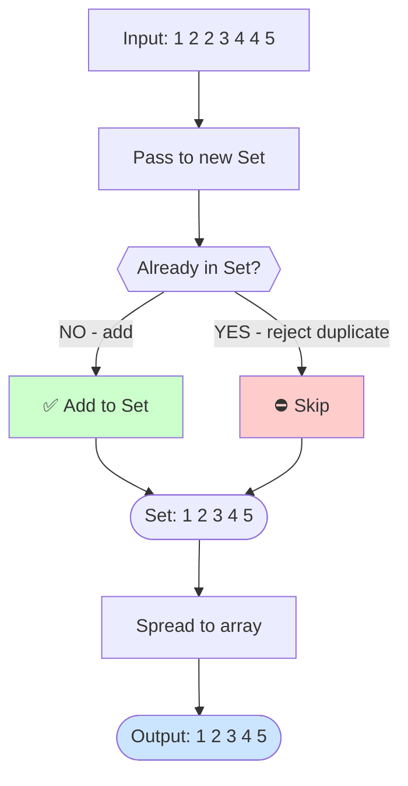

**Hash Map step-by-step:**

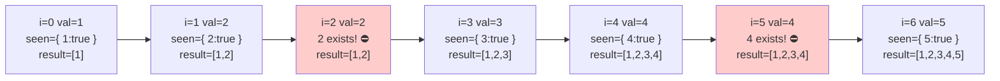

**Approach 1 — Built-in `Set` (idiomatic):**

**🔍 Step-by-step:**

```
Step trace: [1, 2, 2, 3, 4, 4, 5]
  → Set { 1, 2, 3, 4, 5 }         ← duplicates rejected
  → [...Set] = [1, 2, 3, 4, 5]   ✓
```

```js
function removeDuplicates(arr) {
    return [...new Set(arr)];
}
}

console.log(removeDuplicates([1, 2, 2, 3, 4, 4, 5])); // [1, 2, 3, 4, 5]
```

**Approach 2 — Manual loop with `indexOf`:**

**🔍 Step-by-step:**

```
Step trace: [1, 2, 2, 3, 4, 4, 5]
  i=0 val=1 → indexOf=-1 → push   result=[1]
  i=1 val=2 → indexOf=-1 → push   result=[1,2]
  i=2 val=2 → indexOf=1  → SKIP
  i=3 val=3 → indexOf=-1 → push   result=[1,2,3]
  i=4 val=4 → indexOf=-1 → push   result=[1,2,3,4]
  i=5 val=4 → indexOf=3  → SKIP
  i=6 val=5 → indexOf=-1 → push   result=[1,2,3,4,5]  ✓
```

```js
function removeDuplicates(arr) {
    const result = [];
    for (let i = 0; i < arr.length; i++) {
        if (result.indexOf(arr[i]) === -1) {
            result.push(arr[i]);
        }
    }
    return result;
}

console.log(removeDuplicates([1, 2, 2, 3, 4, 4, 5])); // [1, 2, 3, 4, 5]
```

**Approach 3 — Object as hash map (O(n)):**

**🔍 Step-by-step:**

```
Step trace: [1, 2, 2, 3, 4, 4, 5]
  i=0 val=1 → seen[1] falsy → add  seen={1:true} result=[1]
  i=1 val=2 → seen[2] falsy → add  result=[1,2]
  i=2 val=2 → seen[2]=true  → SKIP
  i=3 val=3 → add            result=[1,2,3]
  i=4 val=4 → add            result=[1,2,3,4]
  i=5 val=4 → seen[4]=true  → SKIP
  i=6 val=5 → add            result=[1,2,3,4,5]  ✓
```

```js
function removeDuplicates(arr) {
    const seen = {};
    const result = [];
    for (let i = 0; i < arr.length; i++) {
        if (!seen[arr[i]]) {
            seen[arr[i]] = true;
            result.push(arr[i]);
        }
    }
    return result;
}

console.log(removeDuplicates([1, 2, 2, 3, 4, 4, 5])); // [1, 2, 3, 4, 5]
```

---

## 2. Find the Maximum and Minimum in an Array

**🧠 Explanation:**

- We need to scan the entire array to find the smallest and largest values.
- `Math.min(...arr)` uses the spread operator to pass all array items as individual arguments — works great for small arrays, but can crash on very large ones (stack overflow).
- **Manual loop (best approach):** Start with `min = max = arr[0]`. Loop from index 1, update `min` or `max` if current element is smaller/larger.
- `reduce` does the same in a functional style — accumulates both min and max in a single pass.

**📊 Visual Diagram:**

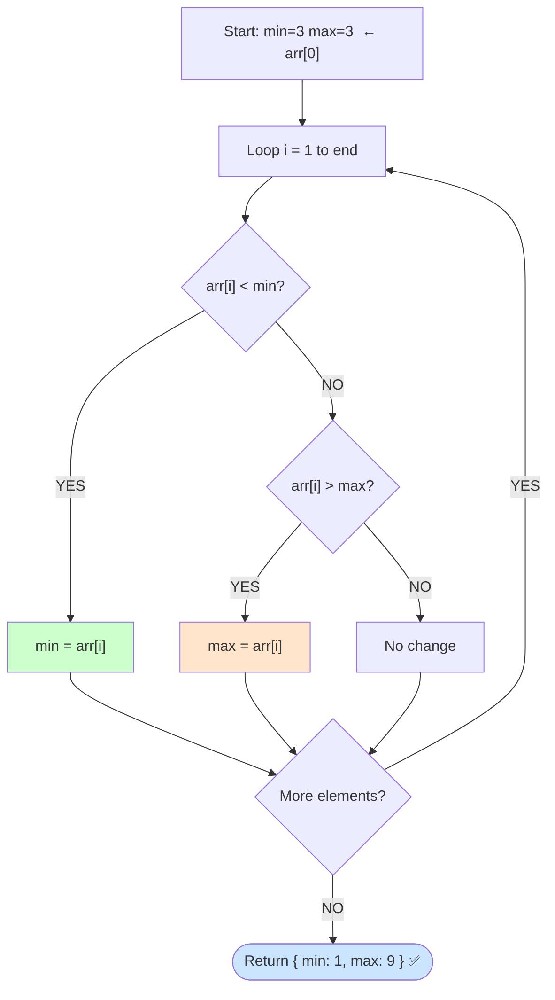

**Pass-by-pass trace:**

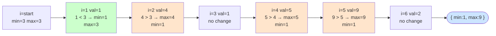

**Approach 1 — `Math.min` / `Math.max` with spread:**

**🔍 Step-by-step:**

```
Step trace: [3, 1, 4, 1, 5, 9, 2]
  Math.min(3,1,4,1,5,9,2) → 1
  Math.max(3,1,4,1,5,9,2) → 9
  Output: { min:1, max:9 }  ✓
```

```js
function findMinMax(arr) {
    return {
        min: Math.min(...arr),
        max: Math.max(...arr),
    };
}

console.log(findMinMax([3, 1, 4, 1, 5, 9, 2])); // { min: 1, max: 9 }
```

**Approach 2 — Manual `for` loop (no built-ins):**

**🔍 Step-by-step:**

```
Step trace: [3, 1, 4, 1, 5, 9, 2]  (min=3, max=3)
  i=1 val=1 → 1<3 → min=1
  i=2 val=4 → 4>3 → max=4
  i=3 val=1 → 1=min, no change
  i=4 val=5 → 5>4 → max=5
  i=5 val=9 → 9>5 → max=9
  i=6 val=2 → no change
  Output: { min:1, max:9 }  ✓
```

```js
function findMinMax(arr) {
    let min = arr[0];
    let max = arr[0];
    for (let i = 1; i < arr.length; i++) {
        if (arr[i] < min) min = arr[i];
        if (arr[i] > max) max = arr[i];
    }
    return { min, max };
}

console.log(findMinMax([3, 1, 4, 1, 5, 9, 2])); // { min: 1, max: 9 }
```

**Approach 3 — `reduce`:**

**🔍 Step-by-step:**

```
Step trace: [3,1,4,1,5,9,2]  start: {min:3, max:3}
  val=1 → min=1          {min:1, max:3}
  val=4 → max=4          {min:1, max:4}
  val=1 → no change
  val=5 → max=5          {min:1, max:5}
  val=9 → max=9          {min:1, max:9}
  val=2 → no change
  Output: { min:1, max:9 }  ✓
```

```js
function findMinMax(arr) {
    return arr.reduce(
        (acc, val) => ({
            min: val < acc.min ? val : acc.min,
            max: val > acc.max ? val : acc.max,
        }),
        { min: arr[0], max: arr[0] },
    );
}

console.log(findMinMax([3, 1, 4, 1, 5, 9, 2])); // { min: 1, max: 9 }
```

---

## 3. Flatten a Nested Array

> Given: `[1, [2, [3, [4]], 5]]` → Expected: `[1, 2, 3, 4, 5]`

**🧠 Explanation:**

- Nested arrays are arrays inside arrays. Flattening means pulling everything out to a single level.
- `flat(Infinity)` tells JavaScript to flatten no matter how deep the nesting goes.
- **Recursive approach:** For each element — if it's an array, recurse into it; if not, add it to the result. This keeps going until everything is a plain value.
- **Iterative stack approach:** Treat the array as a to-do list. Pop an item — if it's an array, push its contents back onto the stack; if it's a value, collect it. Repeat until the stack is empty.

**📊 Visual Diagram — Tree Structure:**

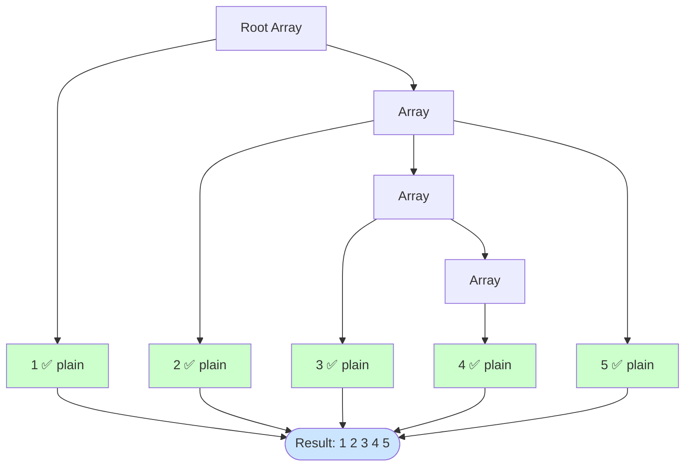

**Iterative Stack logic:**

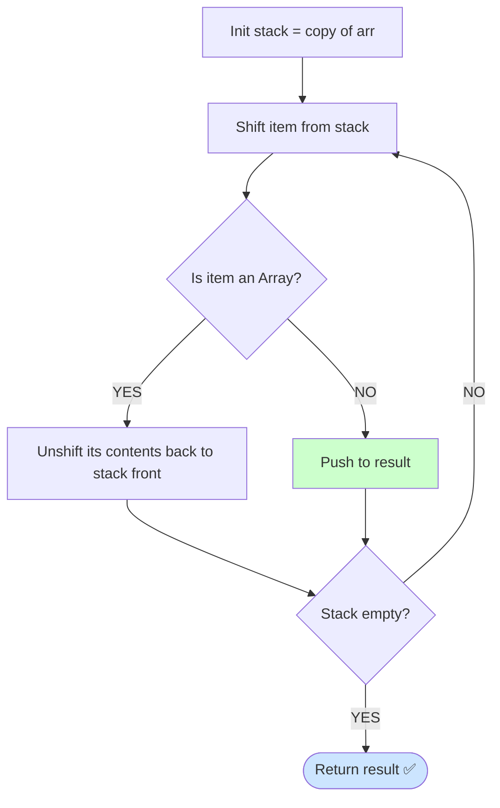

**Approach 1 — Built-in `flat(Infinity)`:**

**🔍 Step-by-step:**

```
Step trace: [1, [2, [3, [4]], 5]]
  flat level 1 → [1, 2, [3, [4]], 5]
  flat level 2 → [1, 2, 3, [4], 5]
  flat level 3 → [1, 2, 3, 4, 5]    ← no more arrays
  Output: [1, 2, 3, 4, 5]  ✓
```

```js
function flatten(arr) {
    return arr.flat(Infinity);
}

console.log(flatten([1, [2, [3, [4]], 5]])); // [1, 2, 3, 4, 5]
```

**Approach 2 — Recursive with `reduce`:**

**🔍 Step-by-step:**

```
Step trace: [1, [2, [3, [4]], 5]]
  val=1           → not array → [1]
  val=[2,[3,[4]],5] → array → recurse:
    val=2           → [2]
    val=[3,[4]]     → recurse:
      val=3 → [3]
      val=[4] → recurse → [4]
      → [3, 4]
    val=5           → [2, 3, 4, 5]
  → [1, 2, 3, 4, 5]  ✓
```

```js
function flattenManual(arr) {
    return arr.reduce(
        (acc, val) =>
            Array.isArray(val)
                ? acc.concat(flattenManual(val))
                : acc.concat(val),
        [],
    );
}

console.log(flattenManual([1, [2, [3, [4]], 5]])); // [1, 2, 3, 4, 5]
```

**Approach 3 — Iterative with a stack (no recursion):**

**🔍 Step-by-step:**

```
Step trace: [1, [2, [3, [4]], 5]]
  shift 1            → result=[1]
  shift [2,[3,[4]],5]→ unshift 2,[3,[4]],5   stack=[2,[3,[4]],5]
  shift 2            → result=[1,2]
  shift [3,[4]]      → unshift 3,[4]          stack=[3,[4],5]
  shift 3            → result=[1,2,3]
  shift [4]          → unshift 4              stack=[4,5]
  shift 4            → result=[1,2,3,4]
  shift 5            → result=[1,2,3,4,5]  ✓
```

```js
function flattenIterative(arr) {
    const stack = [...arr];
    const result = [];
    while (stack.length) {
        const item = stack.shift();
        if (Array.isArray(item)) {
            stack.unshift(...item);
        } else {
            result.push(item);
        }
    }
    return result;
}

console.log(flattenIterative([1, [2, [3, [4]], 5]])); // [1, 2, 3, 4, 5]
```

---

## 4. Rotate an Array by K Positions

> Given: `[1,2,3,4,5]`, k = 2 → Expected: `[4, 5, 1, 2, 3]`

**🧠 Explanation:**

- Rotating right by k means the **last k elements** move to the **front**.
- First, use `k % n` to handle cases where k is larger than the array length.
- **Slice approach:** `arr.slice(n - k)` grabs the last k elements. `arr.slice(0, n - k)` grabs the rest. Combine them.
- **Triple reverse trick (in-place, O(1) space):**
    1. Reverse the entire array → `[5, 4, 3, 2, 1]`
    2. Reverse just the first k elements → `[4, 5, 3, 2, 1]`
    3. Reverse the rest → `[4, 5, 1, 2, 3]` ✓
- **Index formula:** Element at position `i` in the result comes from position `(i + n - k) % n` in the original.

**📊 Visual Diagram — Slice Approach:**

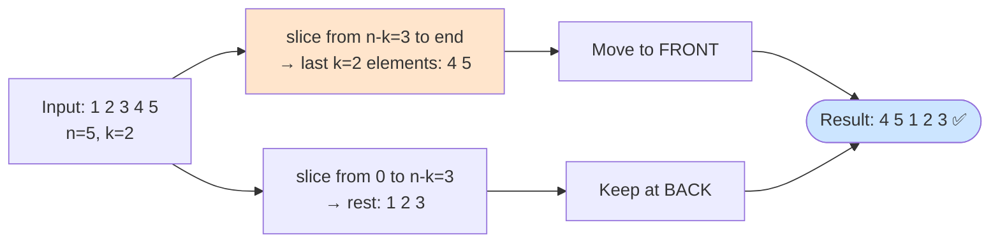

**Triple Reverse Trick:**

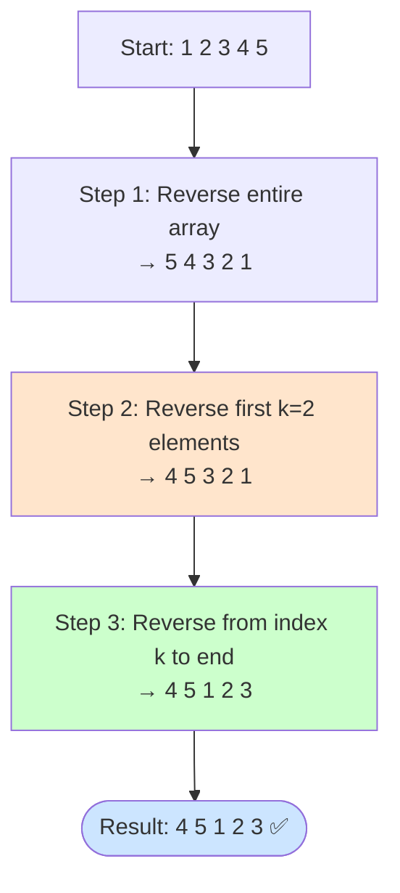

**Approach 1 — `slice` + spread (one-liner):**

**🔍 Step-by-step:**

```
Step trace: [1,2,3,4,5]  k=2,  n=5
  k = 2 % 5 = 2
  tail = slice(3) = [4,5]
  head = slice(0,3) = [1,2,3]
  return [4,5,1,2,3]  ✓
```

```js
function rotateArray(arr, k) {
    const n = arr.length;
    k = k % n;
    return [...arr.slice(n - k), ...arr.slice(0, n - k)];
}

console.log(rotateArray([1, 2, 3, 4, 5], 2)); // [4, 5, 1, 2, 3]
```

**Approach 2 — In-place triple reverse (O(1) extra space):**

**🔍 Step-by-step:**

```
Step trace: [1,2,3,4,5]  k=2
  Step 1: reverse all    → [5,4,3,2,1]
  Step 2: reverse [0..1] → [4,5,3,2,1]
  Step 3: reverse [2..4] → [4,5,1,2,3]  ✓
```

```js
function reverseSegment(arr, start, end) {
    while (start < end) {
        const temp = arr[start];
        arr[start] = arr[end];
        arr[end] = temp;
        start++;
        end--;
    }
}

function rotateArray(arr, k) {
    const a = [...arr];
    const n = a.length;
    k = k % n;
    reverseSegment(a, 0, n - 1);
    reverseSegment(a, 0, k - 1);
    reverseSegment(a, k, n - 1);
    return a;
}

console.log(rotateArray([1, 2, 3, 4, 5], 2)); // [4, 5, 1, 2, 3]
```

**Approach 3 — Manual index mapping (extra array):**

**🔍 Step-by-step:**

```
Step trace: [1,2,3,4,5]  k=2,  n=5
  i=0: result[0] = arr[(0+3)%5] = arr[3] = 4
  i=1: result[1] = arr[(1+3)%5] = arr[4] = 5
  i=2: result[2] = arr[(2+3)%5] = arr[0] = 1
  i=3: result[3] = arr[(3+3)%5] = arr[1] = 2
  i=4: result[4] = arr[(4+3)%5] = arr[2] = 3
  Output: [4,5,1,2,3]  ✓
```

```js
function rotateArray(arr, k) {
    const n = arr.length;
    k = k % n;
    const result = new Array(n);
    for (let i = 0; i < n; i++) {
        result[i] = arr[(i + (n - k)) % n];
    }
    return result;
}

console.log(rotateArray([1, 2, 3, 4, 5], 2)); // [4, 5, 1, 2, 3]
```

---

## 5. Find the Second Largest Element

**🧠 Explanation:**

- The second largest is the **biggest value that is not the maximum**. Duplicates of the max should be ignored.
- **Set + sort:** Remove duplicates using `Set`, sort descending, pick index `[1]`.
- **Single pass O(n) — most efficient:** Track two variables: `first` (max so far) and `second` (second-largest so far).
    - If current > first → `second = first`, then `first = current`.
    - Else if current > second AND current ≠ first → update `second`.
- **Bubble sort approach:** Repeatedly swap adjacent elements until the array is sorted descending, then skip duplicates of the first element to find the second unique largest.

**📊 Visual Diagram — Decision logic:**

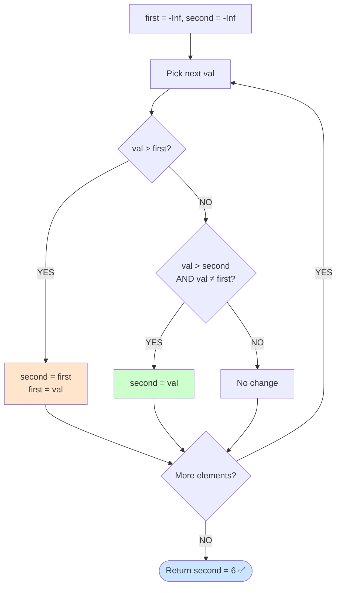

**Step-by-step trace on [3,1,4,1,5,9,2,6]:**

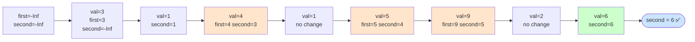

**Approach 1 — `Set` + `sort`:**

**🔍 Step-by-step:**

```
Step trace: [3,1,4,1,5,9,2,6]
  Set removes duplicate 1: {3,1,4,5,9,2,6}
  sort desc: [9,6,5,4,3,2,1]
  unique[1] = 6  ✓
```

```js
function secondLargest(arr) {
    const unique = [...new Set(arr)].sort((a, b) => b - a);
    return unique[1];
}

console.log(secondLargest([3, 1, 4, 1, 5, 9, 2, 6])); // 6
```

**Approach 2 — Single pass O(n) with two variables:**

**🔍 Step-by-step:**

```
Step trace: [3,1,4,1,5,9,2,6]
  val=3 → first=3  second=-Inf
  val=1 → 1<3 but 1>-Inf → second=1
  val=4 → 4>3  → second=3, first=4
  val=1 → no change
  val=5 → 5>4  → second=4, first=5
  val=9 → 9>5  → second=5, first=9
  val=2 → no change
  val=6 → 6<9 but 6>5 → second=6
  Output: 6  ✓
```

```js
function secondLargest(arr) {
    let first = -Infinity;
    let second = -Infinity;
    for (let i = 0; i < arr.length; i++) {
        if (arr[i] > first) {
            second = first;
            first = arr[i];
        } else if (arr[i] > second && arr[i] !== first) {
            second = arr[i];
        }
    }
    return second === -Infinity ? null : second;
}

console.log(secondLargest([3, 1, 4, 1, 5, 9, 2, 6])); // 6
```

**Approach 3 — Bubble sort, then pick second unique:**

**🔍 Step-by-step:**

```
Step trace: [3,1,4,1,5,9,2,6]
  After bubble sort (desc): [9,6,5,4,3,2,1,1]
  a[0]=9 (the max)
  i=1: a[1]=6 ≠ 9 → return 6
  Output: 6  ✓
```

```js
function secondLargest(arr) {
    const a = [...arr];
    for (let i = 0; i < a.length - 1; i++) {
        for (let j = 0; j < a.length - 1 - i; j++) {
            if (a[j] < a[j + 1]) {
                const temp = a[j];
                a[j] = a[j + 1];
                a[j + 1] = temp;
            }
        }
    }
    // skip duplicates of the largest
    for (let i = 1; i < a.length; i++) {
        if (a[i] !== a[0]) return a[i];
    }
    return null;
}

console.log(secondLargest([3, 1, 4, 1, 5, 9, 2, 6])); // 6
```

---

## 6. Two Sum — Find Indices of Two Numbers That Add to Target

> Given: `[2, 7, 11, 15]`, target = 9 → Expected: `[0, 1]`

**🧠 Explanation:**

- For each number, its **partner** that satisfies the sum = `target - currentNumber`.
- **Hash Map O(n):** As you loop, store each number and its index in a Map. Before storing, check if the partner of the current number already exists in the Map. If yes → found the pair!
- Think of it like: _"Have I already seen the number I need?"_
- **Brute force O(n²):** Use two nested loops — try every possible pair `(i, j)` and check if they add up to target. Simple but slow.
- **Plain object:** Exact same logic as the Map approach but uses a regular JS object `{}` as lookup storage.

**📊 Visual Diagram:**

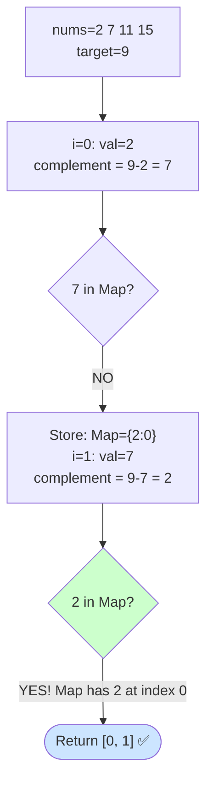

**Brute Force vs Hash Map complexity:**

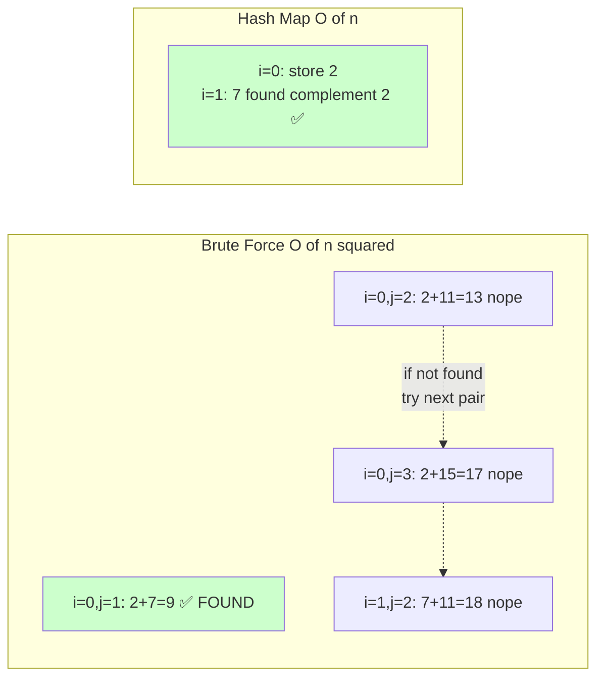

**Approach 1 — Hash `Map` O(n):**

**🔍 Step-by-step:**

```
Step trace: [2, 7, 11, 15]  target=9
  i=0: complement=9-2=7   7 in map? NO → map={2:0}
  i=1: complement=9-7=2   2 in map? YES → return [map.get(2)=0, 1]
  Output: [0, 1]  ✓
```

```js
function twoSum(nums, target) {
    const map = new Map();
    for (let i = 0; i < nums.length; i++) {
        const complement = target - nums[i];
        if (map.has(complement)) return [map.get(complement), i];
        map.set(nums[i], i);
    }
    return [];
}

console.log(twoSum([2, 7, 11, 15], 9)); // [0, 1]
```

**Approach 2 — Brute force O(n²) (no built-ins):**

**🔍 Step-by-step:**

```
Step trace: [2, 7, 11, 15]  target=9
  i=0, j=1: 2+7=9 ✓ → return [0, 1]
  Output: [0, 1]  ✓  (found on first pair here)
```

```js
function twoSum(nums, target) {
    for (let i = 0; i < nums.length; i++) {
        for (let j = i + 1; j < nums.length; j++) {
            if (nums[i] + nums[j] === target) {
                return [i, j];
            }
        }
    }
    return [];
}

console.log(twoSum([2, 7, 11, 15], 9)); // [0, 1]
```

**Approach 3 — Plain object instead of `Map`:**

**🔍 Step-by-step:**

```
Step trace: [2, 7, 11, 15]  target=9
  i=0: complement=7  seen[7]=undefined → seen={2:0}
  i=1: complement=2  seen[2]=0 ✓       → return [0, 1]
  Output: [0, 1]  ✓
```

```js
function twoSum(nums, target) {
    const seen = {}; // { value: index }
    for (let i = 0; i < nums.length; i++) {
        const complement = target - nums[i];
        if (seen[complement] !== undefined) {
            return [seen[complement], i];
        }
        seen[nums[i]] = i;
    }
    return [];
}

console.log(twoSum([2, 7, 11, 15], 9)); // [0, 1]
```

---

## 7. Group Array Elements by a Property (Array of Objects)

**🧠 Explanation:**

- We want to **bucket** items together based on a shared property (e.g., group all users by their `role`).
- The output is an object where each key is a group name and each value is an array of matching items.
- **`reduce` approach:** Start with an empty object `{}`. For each item, find its group value (`obj[key]`). If that group bucket doesn't exist yet, create it as `[]`. Then push the item into it.
- **Manual `for` loop:** Same idea, written step-by-step. More readable for beginners.
- **`Map` approach:** Useful when group keys might not be strings (e.g., numbers, objects). It avoids the auto-string-coercion that plain objects do.

**📊 Visual Diagram:**

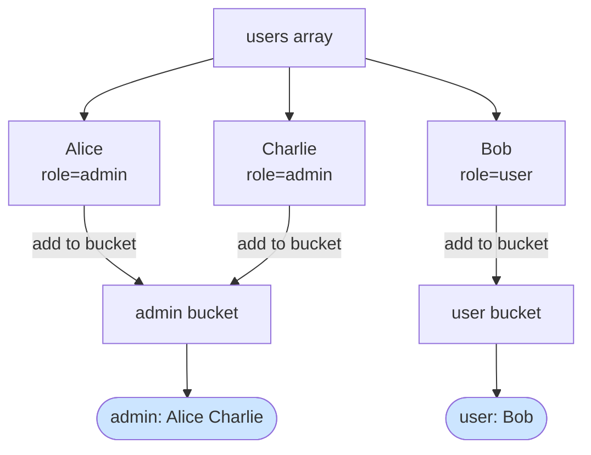

**reduce step-by-step:**

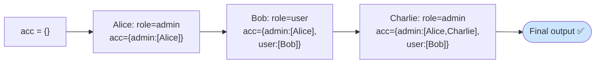

**Approach 1 — `reduce`:**

**🔍 Step-by-step:**

```
Step trace: [Alice(admin), Bob(user), Charlie(admin)]  key='role'
  Alice:   group='admin' → acc={admin:[Alice]}
  Bob:     group='user'  → acc={admin:[Alice], user:[Bob]}
  Charlie: group='admin' → acc={admin:[Alice,Charlie], user:[Bob]}  ✓
```

```js
const users = [
    { name: "Alice", role: "admin" },
    { name: "Bob", role: "user" },
    { name: "Charlie", role: "admin" },
];

function groupBy(arr, key) {
    return arr.reduce((acc, obj) => {
        const group = obj[key];
        acc[group] = acc[group] || [];
        acc[group].push(obj);
        return acc;
    }, {});
}

console.log(groupBy(users, "role"));
// { admin: [{...Alice}, {...Charlie}], user: [{...Bob}] }
```

**Approach 2 — Manual `for` loop:**

**🔍 Step-by-step:**

```
Step trace: same as above
  result={} → {admin:[Alice]} → {admin:[Alice], user:[Bob]}
  → {admin:[Alice,Charlie], user:[Bob]}  ✓
```

```js
function groupBy(arr, key) {
    const result = {};
    for (let i = 0; i < arr.length; i++) {
        const group = arr[i][key];
        if (!result[group]) result[group] = [];
        result[group].push(arr[i]);
    }
    return result;
}

console.log(groupBy(users, "role"));
// { admin: [{...Alice}, {...Charlie}], user: [{...Bob}] }
```

**Approach 3 — `Map` (preserves key type, no string coercion):**

**🔍 Step-by-step:**

```
Step trace: (same grouping logic, but Map preserves insertion order
            and non-string keys stay as their original type)
  map: { 'admin' → [Alice, Charlie], 'user' → [Bob] }  ✓
```

```js
function groupByMap(arr, key) {
    const map = new Map();
    for (const obj of arr) {
        const group = obj[key];
        if (!map.has(group)) map.set(group, []);
        map.get(group).push(obj);
    }
    return Object.fromEntries(map);
}

console.log(groupByMap(users, "role"));
// { admin: [{...Alice}, {...Charlie}], user: [{...Bob}] }
```

---

## 8. Deep Clone an Object

**🧠 Explanation:**

- A **shallow copy** (e.g., `const b = { ...a }`) only copies the top level. Nested objects are still shared — changing `b.nested` also changes `a.nested`.
- A **deep clone** creates a fully independent copy at every level.
- **`JSON.parse(JSON.stringify(obj))`:** Serialises the object to a JSON string and parses it back. Quick and easy, but **loses** functions, `undefined` values, `Date`, `Map`, `Set`, and circular references.
- **`structuredClone(obj)`:** The modern built-in (Node.js v17+). Handles most types correctly including Date, Map, Set, ArrayBuffer. Best choice today.
- **Manual recursive:** If the value is a primitive, return it directly. If it's an array, clone each element. If it's an object, clone each key-value pair by calling the function recursively.

**📊 Visual Diagram:**

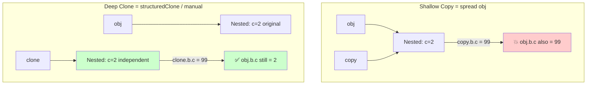

**Manual recursive logic:**

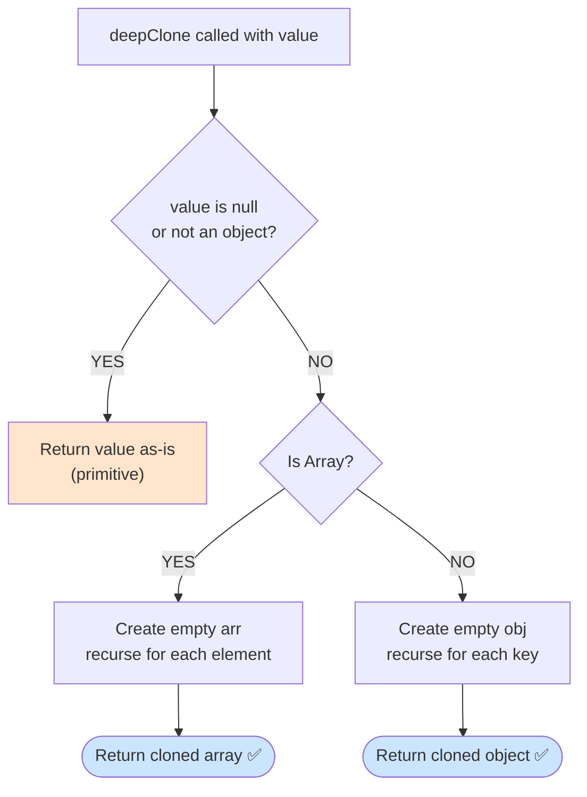

**Approach 1 — `JSON.parse` / `JSON.stringify` (loses functions, `undefined`, circular refs):**

**🔍 Step-by-step:**

```
Step trace:
  obj = { a:1, b:{ c:2 } }
  stringify → '{"a":1,"b":{"c":2}}'
  parse     → { a:1, b:{ c:2 } }  (new independent object)
  clone.b.c = 99 → obj.b.c still = 2  ✓
```

```js
const obj = { a: 1, b: { c: 2 } };

const deepClone = JSON.parse(JSON.stringify(obj));
deepClone.b.c = 99;
console.log(obj.b.c); // 2  — original untouched
console.log(deepClone.b.c); // 99
```

**Approach 2 — `structuredClone` (Node.js v17+, handles most types including Date, Map, Set):**

**🔍 Step-by-step:**

```
Step trace:
  obj = { a:1, b:{ c:2 } }
  structuredClone(obj) → brand new independent deep copy
  clone.b.c = 99 → obj.b.c still = 2  ✓
```

```js
const obj = { a: 1, b: { c: 2 } };

const deepClone = structuredClone(obj);
deepClone.b.c = 99;
console.log(obj.b.c); // 2
console.log(deepClone.b.c); // 99
```

**Approach 3 — Manual recursive clone (no built-ins):**

**🔍 Step-by-step:**

```
Step trace: { a:1, b:{ c:2, d:[3,4] } }
  key 'a': val=1  → primitive → copy.a=1
  key 'b': val={c:2,d:[3,4]} → object → recurse:
    key 'c': val=2    → copy.c=2
    key 'd': val=[3,4] → array → recurse each:
      elem 3 → 3,  elem 4 → 4  → [3,4] (new array)
    → {c:2, d:[3,4]}  (new object)
  → {a:1, b:{c:2, d:[3,4]}}  fully independent  ✓
```

```js
function deepCloneManual(value) {
    if (value === null || typeof value !== "object") return value;
    if (Array.isArray(value)) {
        const arr = [];
        for (let i = 0; i < value.length; i++) {
            arr[i] = deepCloneManual(value[i]);
        }
        return arr;
    }
    const copy = {};
    for (const key in value) {
        if (Object.prototype.hasOwnProperty.call(value, key)) {
            copy[key] = deepCloneManual(value[key]);
        }
    }
    return copy;
}

const obj = { a: 1, b: { c: 2, d: [3, 4] } };
const clone = deepCloneManual(obj);
clone.b.c = 99;
console.log(obj.b.c); // 2
console.log(clone.b.c); // 99
```

---

## 9. Merge Two Objects (Deep Merge)

**🧠 Explanation:**

- `Object.assign` or spread `{...a, ...b}` only does a **shallow** merge — if both objects have a nested object at the same key, the source completely **overwrites** the target. We lose data!
- Deep merge means: if **both** target and source have an object at the same key, merge those nested objects too — recursively.
- **Step by step:**
    1. Loop over each key in `source`.
    2. If the value is an object (not an array) AND the same key exists as an object in `target` → recurse.
    3. Otherwise just assign `target[key] = source[key]`.
- **Shallow merge shown for contrast:** `{...a, ...b}` only copies top-level properties. Nested objects at duplicate keys are fully replaced (not merged).

**📊 Visual Diagram — Shallow vs Deep Merge:**

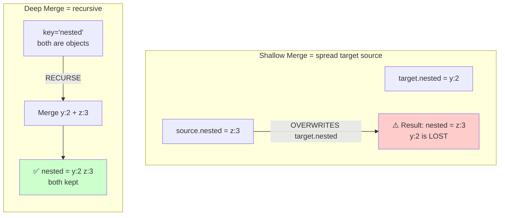

**Recursive decision flow:**

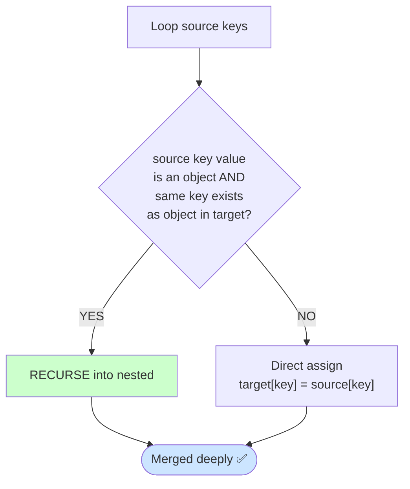

**Approach 1 — Recursive with `Object.keys`:**

**🔍 Step-by-step:**

```
Step trace: target={x:1, nested:{y:2}}  source={nested:{z:3}, w:4}
  key='nested': both are objects → RECURSE:
    deepMerge({y:2}, {z:3})
      key='z': assign → target.z=3
    → nested = { y:2, z:3 }  ← both kept!
  key='w': assign → target.w=4
  Output: { x:1, nested:{y:2,z:3}, w:4 }  ✓
```

```js
function deepMerge(target, source) {
    for (const key of Object.keys(source)) {
        if (
            source[key] instanceof Object &&
            !Array.isArray(source[key]) &&
            key in target
        ) {
            deepMerge(target[key], source[key]);
        } else {
            target[key] = source[key];
        }
    }
    return target;
}

const a = { x: 1, nested: { y: 2 } };
const b = { nested: { z: 3 }, w: 4 };
console.log(deepMerge(a, b)); // { x: 1, nested: { y: 2, z: 3 }, w: 4 }
```

**Approach 2 — Recursive with `for...in` (no `Object.keys`):**

```js
function deepMerge(target, source) {
    for (const key in source) {
        if (!Object.prototype.hasOwnProperty.call(source, key)) continue;
        if (
            source[key] !== null &&
            typeof source[key] === "object" &&
            !Array.isArray(source[key]) &&
            typeof target[key] === "object" &&
            target[key] !== null
        ) {
            deepMerge(target[key], source[key]);
        } else {
            target[key] = source[key];
        }
    }
    return target;
}

const a = { x: 1, nested: { y: 2 } };
const b = { nested: { z: 3 }, w: 4 };
console.log(deepMerge(a, b)); // { x: 1, nested: { y: 2, z: 3 }, w: 4 }
```

**Approach 3 — Shallow merge with spread (top-level only, for reference):**

**🔍 Step-by-step:**

```
Step trace: target={x:1, y:2}  source={y:99, z:3}
  { ...target, ...source }
  = { x:1, y:2, y:99, z:3 }
  = { x:1, y:99, z:3 }         ← y:2 is overwritten by y:99
  Output: { x:1, y:99, z:3 }  ✓  (not a deep merge!)
```

```js
// Note: only merges one level deep — nested objects are overwritten, not merged
const shallowMerge = (target, source) => ({ ...target, ...source });

const a = { x: 1, y: 2 };
const b = { y: 99, z: 3 };
console.log(shallowMerge(a, b)); // { x: 1, y: 99, z: 3 }
```

---

## 10. Check if Two Objects Are Deeply Equal

**🧠 Explanation:**

- `===` compares objects by **reference**, not by value. Two separate objects with identical content will return `false` with `===`.
- For deep equality, we need to compare each key and value recursively.
- **Step by step (recursive):**
    1. If both are the same reference → `true`.
    2. If either is not an object (or is `null`) → `false`.
    3. Compare the number of keys — if different → `false`.
    4. For each key in A, recursively check if `deepEqual(a[key], b[key])`.
- **`JSON.stringify` shortcut:** Converts both objects to strings and compares. Fast, but **order-sensitive** — `{ a:1, b:2 }` and `{ b:2, a:1 }` would be considered NOT equal even though they are.
- **`for...in` version:** Same recursive logic but uses `for...in` manually instead of `Object.keys`.

**📊 Visual Diagram — Decision flow:**

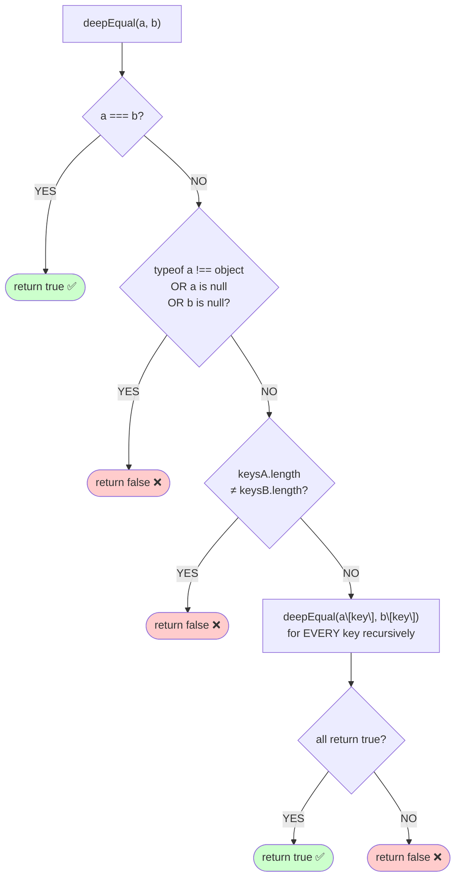

**Approach 1 — Recursive key comparison:**

```js
function deepEqual(a, b) {
    if (a === b) return true;
    if (typeof a !== "object" || typeof b !== "object") return false;
    if (a === null || b === null) return false;

    const keysA = Object.keys(a);
    const keysB = Object.keys(b);
    if (keysA.length !== keysB.length) return false;

    return keysA.every((key) => deepEqual(a[key], b[key]));
}

console.log(deepEqual({ a: 1, b: { c: 2 } }, { a: 1, b: { c: 2 } })); // true
console.log(deepEqual({ a: 1 }, { a: 2 })); // false
```

**🔍 Step-by-step trace** — `deepEqual({ a:1, b:{c:2} }, { a:1, b:{c:2} })`:

```
Call 1: deepEqual({ a:1, b:{c:2} }, { a:1, b:{c:2} })
  a === b?          → NO  (different object references)
  typeof both ok, neither null → proceed
  keysA = ['a','b'], keysB = ['a','b'] → length 2 = 2 ✓
  Check key 'a': deepEqual(1, 1)
    → 1 === 1 → return true ✓
  Check key 'b': deepEqual({ c:2 }, { c:2 })
    → a === b? NO
    → typeof ok, not null ✓
    → keysA=['c'], keysB=['c'] → 1 = 1 ✓
    → Check key 'c': deepEqual(2, 2)
        → 2 === 2 → return true ✓
    → return true ✓
  All keys passed → return true
Output: true ✓

Call 2: deepEqual({ a:1 }, { a:2 })
  keysA=['a'], keysB=['a'] → length ok
  Check key 'a': deepEqual(1, 2)
    → 1 === 2? NO
    → typeof 'number' ≠ 'object' → return false
  → return false
Output: false ✓
```

**Approach 2 — `JSON.stringify` (quick but order-sensitive):**

```js
function deepEqual(a, b) {
    return JSON.stringify(a) === JSON.stringify(b);
}

console.log(deepEqual({ a: 1, b: { c: 2 } }, { a: 1, b: { c: 2 } })); // true
console.log(deepEqual({ a: 1 }, { a: 2 })); // false
// ⚠️  Caveat: { a:1, b:2 } !== { b:2, a:1 } with this approach
```

**🔍 Step-by-step trace** — `deepEqual({ a:1, b:{c:2} }, { a:1, b:{c:2} })`:

```
JSON.stringify({ a:1, b:{c:2} }) → '{"a":1,"b":{"c":2}}'
JSON.stringify({ a:1, b:{c:2} }) → '{"a":1,"b":{"c":2}}'
'{"a":1,"b":{"c":2}}' === '{"a":1,"b":{"c":2}}' → true
Output: true ✓

⚠️ Edge case — key order matters:
deeepEqual({ b:2, a:1 }, { a:1, b:2 })
JSON.stringify({ b:2, a:1 }) → '{"b":2,"a":1}'
JSON.stringify({ a:1, b:2 }) → '{"a":1,"b":2}'
'{"b":2,"a":1}' === '{"a":1,"b":2}' → FALSE ❌ (incorrect result!)
```

**Approach 3 — Recursive with `for...in` (no `Object.keys`):**

```js
function deepEqual(a, b) {
    if (a === b) return true;
    if (typeof a !== "object" || typeof b !== "object") return false;
    if (a === null || b === null) return false;

    let countA = 0;
    let countB = 0;
    for (const k in a) if (Object.prototype.hasOwnProperty.call(a, k)) countA++;
    for (const k in b) if (Object.prototype.hasOwnProperty.call(b, k)) countB++;
    if (countA !== countB) return false;

    for (const key in a) {
        if (!Object.prototype.hasOwnProperty.call(a, key)) continue;
        if (!Object.prototype.hasOwnProperty.call(b, key)) return false;
        if (!deepEqual(a[key], b[key])) return false;
    }
    return true;
}

console.log(deepEqual({ a: 1, b: { c: 2 } }, { a: 1, b: { c: 2 } })); // true
console.log(deepEqual({ a: 1 }, { a: 2 })); // false
```

**🔍 Step-by-step trace** — `deepEqual({ a:1, b:{c:2} }, { a:1, b:{c:2} })`:

```
a = { a:1, b:{c:2} },  b = { a:1, b:{c:2} }
Count own keys of a → countA = 2  ('a','b')
Count own keys of b → countB = 2  ('a','b')
countA === countB ✓

Loop key 'a':
  'a' in b? YES
  deepEqual(1, 1) → 1===1 → true ✓
Loop key 'b':
  'b' in b? YES
  deepEqual({c:2},{c:2})
    countA=1, countB=1 ✓
    key 'c': deepEqual(2,2) → true ✓
  → true ✓
return true
Output: true ✓
```

---

## 11. Find All Duplicates in an Array

**🧠 Explanation:**

- A duplicate is any value that appears **more than once** in the array.
- **Two Sets approach:** `seen` tracks every value encountered. `duplicates` captures values we encounter a **second** time. At the end, convert `duplicates` to an array.
- **Frequency object:** Count how many times each value appears. Then filter out any with a count > 1.
- **Sort + adjacent comparison:** After sorting, duplicate values will be **next to each other**. Scan linearly — if `arr[i] === arr[i-1]` and we haven't added it already, it's a duplicate.

**📊 Visual Diagram — Two-Set tracking:**

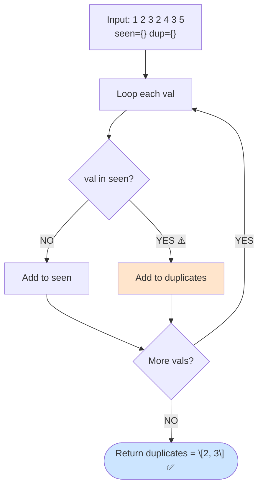

**Step-by-step trace:**

```mermaid
flowchart LR
    V1["val=1<br/>seen={1}"] -->
    V2["val=2<br/>seen={1,2}"] -->
    V3["val=3<br/>seen={1,2,3}"] -->
    V4["val=2 ⚠️<br/>ALREADY SEEN<br/>dup={2}"] -->
    V5["val=4<br/>seen={1,2,3,4}"] -->
    V6["val=3 ⚠️<br/>ALREADY SEEN<br/>dup={2,3}"] -->
    V7["val=5<br/>seen={1,2,3,4,5}"]
    V7 --> R(["Output: \[2, 3\] ✅"])
    style V4 fill:#ffcccc
    style V6 fill:#ffcccc
    style R fill:#cce5ff
```

**Approach 1 — Two `Set`s:**

```js
function findDuplicates(arr) {
    const seen = new Set();
    const duplicates = new Set();
    for (const val of arr) {
        if (seen.has(val)) duplicates.add(val);
        else seen.add(val);
    }
    return [...duplicates];
}

console.log(findDuplicates([1, 2, 3, 2, 4, 3, 5])); // [2, 3]
```

**🔍 Step-by-step trace** — `findDuplicates([1, 2, 3, 2, 4, 3, 5])`:

```
Start: seen={}, duplicates={}

val=1 → 1 in seen? NO  → seen={1}
val=2 → 2 in seen? NO  → seen={1,2}
val=3 → 3 in seen? NO  → seen={1,2,3}
val=2 → 2 in seen? YES → duplicates={2}
val=4 → 4 in seen? NO  → seen={1,2,3,4}
val=3 → 3 in seen? YES → duplicates={2,3}
val=5 → 5 in seen? NO  → seen={1,2,3,4,5}

return [...{2,3}]
Output: [2, 3] ✓
```

**Approach 2 — Object frequency map (no `Set`):**

```js
function findDuplicates(arr) {
    const freq = {};
    const result = [];
    for (let i = 0; i < arr.length; i++) {
        freq[arr[i]] = (freq[arr[i]] || 0) + 1;
    }
    for (const key in freq) {
        if (freq[key] > 1) result.push(Number(key));
    }
    return result;
}

console.log(findDuplicates([1, 2, 3, 2, 4, 3, 5])); // [2, 3]
```

**🔍 Step-by-step trace** — `findDuplicates([1, 2, 3, 2, 4, 3, 5])`:

```
Building freq map:
  val=1 → freq={1:1}
  val=2 → freq={1:1, 2:1}
  val=3 → freq={1:1, 2:1, 3:1}
  val=2 → freq={1:1, 2:2, 3:1}   ← 2 seen again!
  val=4 → freq={1:1, 2:2, 3:1, 4:1}
  val=3 → freq={1:1, 2:2, 3:2, 4:1}   ← 3 seen again!
  val=5 → freq={1:1, 2:2, 3:2, 4:1, 5:1}

Filter freq > 1:
  key=1 → 1 > 1? NO
  key=2 → 2 > 1? YES → result=[2]
  key=3 → 2 > 1? YES → result=[2,3]
  key=4 → 1 > 1? NO
  key=5 → 1 > 1? NO

Output: [2, 3] ✓
```

**Approach 3 — Sort + adjacent comparison:**

```js
function findDuplicates(arr) {
    const sorted = [...arr].sort((a, b) => a - b);
    const result = [];
    for (let i = 1; i < sorted.length; i++) {
        if (
            sorted[i] === sorted[i - 1] &&
            sorted[i] !== result[result.length - 1]
        ) {
            result.push(sorted[i]);
        }
    }
    return result;
}

console.log(findDuplicates([1, 2, 3, 2, 4, 3, 5])); // [2, 3]
```

**🔍 Step-by-step trace** — `findDuplicates([1, 2, 3, 2, 4, 3, 5])`:

```
Original: [1, 2, 3, 2, 4, 3, 5]
Sorted:   [1, 2, 2, 3, 3, 4, 5]   ← duplicates are now adjacent

i=1: sorted[1]=2, sorted[0]=1  → 2≠1,  skip
i=2: sorted[2]=2, sorted[1]=2  → 2===2 ✓, result last=undefined → push 2 → result=[2]
i=3: sorted[3]=3, sorted[2]=2  → 3≠2,  skip
i=4: sorted[4]=3, sorted[3]=3  → 3===3 ✓, result last=2 → push 3 → result=[2,3]
i=5: sorted[5]=4, sorted[4]=3  → 4≠3,  skip
i=6: sorted[6]=5, sorted[5]=4  → 5≠4,  skip

Output: [2, 3] ✓
```

---

## 12. Count the Frequency of Each Element

**🧠 Explanation:**

- We want to know: _"How many times does each value appear?"_
- The result is an object (hash map) like `{ a: 3, b: 2, c: 1 }`.
- **`reduce` approach:** Start with an empty object. For each element, increment its count: `acc[val] = (acc[val] || 0) + 1`. The `|| 0` handles the first time we see a value (when it's `undefined`).
- **Manual `for` loop:** Same logic, written out explicitly with `if/else`. Easy to read and understand.
- **`Map`:** Same idea but uses `Map.get` and `Map.set`. Maps preserve insertion order and keys stay their original type (numbers don't get converted to strings).

**📊 Visual Diagram — Counting passes:**

```mermaid
flowchart TD
    A["Input: a b a c b a<br/>acc = {}"] --> B["val='a'<br/>acc={a:1}"]
    B --> C["val='b'<br/>acc={a:1, b:1}"]
    C --> D["val='a' again ⟳<br/>acc={a:2, b:1}"]
    D --> E["val='c'<br/>acc={a:2, b:1, c:1}"]
    E --> F["val='b' again ⟳<br/>acc={a:2, b:2, c:1}"]
    F --> G["val='a' again ⟳<br/>acc={a:3, b:2, c:1}"]
    G --> R(["Output: { a:3, b:2, c:1 } ✅"])
    style D fill:#ffe5cc
    style F fill:#ffe5cc
    style G fill:#ffe5cc
    style R fill:#cce5ff
```

**Approach 1 — `reduce`:**

```js
function frequency(arr) {
    return arr.reduce((acc, val) => {
        acc[val] = (acc[val] || 0) + 1;
        return acc;
    }, {});
}

console.log(frequency(["a", "b", "a", "c", "b", "a"]));
// { a: 3, b: 2, c: 1 }
```

**🔍 Step-by-step trace** — `frequency(['a','b','a','c','b','a'])`:

```
Start: acc = {}

val='a' → acc['a'] = (undefined||0)+1 = 1  → acc={a:1}
val='b' → acc['b'] = (undefined||0)+1 = 1  → acc={a:1, b:1}
val='a' → acc['a'] = (1||0)+1       = 2  → acc={a:2, b:1}
val='c' → acc['c'] = (undefined||0)+1 = 1  → acc={a:2, b:1, c:1}
val='b' → acc['b'] = (1||0)+1       = 2  → acc={a:2, b:2, c:1}
val='a' → acc['a'] = (2||0)+1       = 3  → acc={a:3, b:2, c:1}

Output: { a: 3, b: 2, c: 1 } ✓
```

**Approach 2 — Manual `for` loop:**

```js
function frequency(arr) {
    const result = {};
    for (let i = 0; i < arr.length; i++) {
        if (result[arr[i]] === undefined) {
            result[arr[i]] = 1;
        } else {
            result[arr[i]]++;
        }
    }
    return result;
}

console.log(frequency(["a", "b", "a", "c", "b", "a"]));
// { a: 3, b: 2, c: 1 }
```

**🔍 Step-by-step trace** — `frequency(['a','b','a','c','b','a'])`:

```
result = {}

i=0 arr[0]='a' → undefined? YES → result={a:1}
i=1 arr[1]='b' → undefined? YES → result={a:1, b:1}
i=2 arr[2]='a' → undefined? NO  → result['a']++ → result={a:2, b:1}
i=3 arr[3]='c' → undefined? YES → result={a:2, b:1, c:1}
i=4 arr[4]='b' → undefined? NO  → result['b']++ → result={a:2, b:2, c:1}
i=5 arr[5]='a' → undefined? NO  → result['a']++ → result={a:3, b:2, c:1}

Output: { a: 3, b: 2, c: 1 } ✓
```

**Approach 3 — Using `Map` (preserves insertion order):**

```js
function frequency(arr) {
    const map = new Map();
    for (const val of arr) {
        map.set(val, (map.get(val) || 0) + 1);
    }
    return Object.fromEntries(map);
}

console.log(frequency(["a", "b", "a", "c", "b", "a"]));
// { a: 3, b: 2, c: 1 }
```

**🔍 Step-by-step trace** — `frequency(['a','b','a','c','b','a'])`:

```
Start: map = Map {}

val='a' → map.get('a')=undefined → set 'a'→1  → Map{ a→1 }
val='b' → map.get('b')=undefined → set 'b'→1  → Map{ a→1, b→1 }
val='a' → map.get('a')=1         → set 'a'→2  → Map{ a→2, b→1 }
val='c' → map.get('c')=undefined → set 'c'→1  → Map{ a→2, b→1, c→1 }
val='b' → map.get('b')=1         → set 'b'→2  → Map{ a→2, b→2, c→1 }
val='a' → map.get('a')=2         → set 'a'→3  → Map{ a→3, b→2, c→1 }

Object.fromEntries(map) → { a: 3, b: 2, c: 1 }
Output: { a: 3, b: 2, c: 1 } ✓
```

---

## 13. Chunk an Array into Groups of Size N

**🧠 Explanation:**

- We want to split a long array into **smaller sub-arrays** of a fixed size.
- Example: `[1,2,3,4,5,6,7]` with size 3 → `[[1,2,3], [4,5,6], [7]]`.
- **`slice` loop:** Start at index 0, step by `size` each iteration. `arr.slice(i, i + size)` extracts the next chunk. If the last chunk is smaller than `size`, `slice` handles that automatically.
- **`reduce` approach:** Check if the current index is a multiple of `size` — if yes, start a new chunk. Uses the index argument of `reduce`.
- **Manual nested loop:** An outer `while` loop advances through the array; an inner `for` loop fills each group one item at a time. No use of `slice` at all.

**📊 Visual Diagram:**

```mermaid
flowchart LR
    A["Input: 1 2 3 4 5 6 7<br/>size = 3"] --> B["i=0: slice 0 to 3<br/>1 2 3"]
    A --> C["i=3: slice 3 to 6<br/>4 5 6"]
    A --> D["i=6: slice 6 to 9<br/>7  (partial ok)"]
    B & C & D --> E(["Result:<br/>[ [1,2,3], [4,5,6], [7] ] ✅"])
    style E fill:#cce5ff
    style B fill:#ffe5cc
    style C fill:#ccffcc
    style D fill:#e5ccff
```

**Approach 1 — `slice` loop (clean, idiomatic):**

**🔍 Step-by-step:**

```
Step trace: [1,2,3,4,5,6,7]  size=3
  i=0: slice(0,3) = [1,2,3]  → result=[[1,2,3]]
  i=3: slice(3,6) = [4,5,6]  → result=[[1,2,3],[4,5,6]]
  i=6: slice(6,9) = [7]       → result=[[1,2,3],[4,5,6],[7]]  ✓
```

```js
function chunk(arr, size) {
    const result = [];
    for (let i = 0; i < arr.length; i += size) {
        result.push(arr.slice(i, i + size));
    }
    return result;
}

console.log(chunk([1, 2, 3, 4, 5, 6, 7], 3));
// [[1, 2, 3], [4, 5, 6], [7]]
```

**Approach 2 — `reduce`:**

**🔍 Step-by-step:**

```
Step trace: [1,2,3,4,5,6,7]  size=3
  index=0: 0%3=0 → push slice(0,3)=[1,2,3]
  index=1: 1%3=1 → skip
  index=2: 2%3=2 → skip
  index=3: 3%3=0 → push slice(3,6)=[4,5,6]
  index=4,5: skip
  index=6: 6%3=0 → push slice(6,9)=[7]
  Output: [[1,2,3],[4,5,6],[7]]  ✓
```

```js
function chunk(arr, size) {
    return arr.reduce((acc, _, i) => {
        if (i % size === 0) acc.push(arr.slice(i, i + size));
        return acc;
    }, []);
}

console.log(chunk([1, 2, 3, 4, 5, 6, 7], 3));
// [[1, 2, 3], [4, 5, 6], [7]]
```

**Approach 3 — Manual nested loop (no `slice`):**

**🔍 Step-by-step:**

```
Step trace: [1,2,3,4,5,6,7]  size=3,  i=0
  Pass 1: group=[1,2,3]  i=3  → result=[[1,2,3]]
  Pass 2: group=[4,5,6]  i=6  → result=[[1,2,3],[4,5,6]]
  Pass 3: group=[7]       i=7  → result=[[1,2,3],[4,5,6],[7]]  ✓
```

```js
function chunk(arr, size) {
    const result = [];
    let i = 0;
    while (i < arr.length) {
        const group = [];
        for (let j = 0; j < size && i < arr.length; j++, i++) {
            group.push(arr[i]);
        }
        result.push(group);
    }
    return result;
}

console.log(chunk([1, 2, 3, 4, 5, 6, 7], 3));
// [[1, 2, 3], [4, 5, 6], [7]]
```

---

## 14. Intersection and Difference of Two Arrays

**🧠 Explanation:**

- **Intersection:** Elements that appear in **both** arrays (like a Venn diagram overlap).
- **Difference:** Elements in the **first** array that do NOT appear in the second.
- **`filter` + `includes` (O(n²)):** Loop through `arr1`. For each item, check if it exists in `arr2` using `includes`. Simple but slow for large arrays because `includes` itself is O(n).
- **`Set`-based (O(n)):** Convert `arr2` into a `Set` first. Now each lookup is O(1). Then loop through `arr1` checking against the Set. Much faster.
- **Nested loops (brute force):** Double loop — for each element of A, scan all of B. No built-ins needed, but O(n²).

**📊 Visual Diagram:**

```mermaid
flowchart TD
    A1["arr1: 1 2 3 4"] --> F{"Is val in arr2?<br/>Set lookup: O of 1"}
    A2["arr2: 3 4 5 6"] --> SB["Convert arr2<br/>to Set: 3 4 5 6"]
    SB --> F
    F -->|"YES = in both"| I(["Intersection: 3 4"])
    F -->|"NO = only in arr1"| D(["Difference: 1 2"])
    style I fill:#cce5ff
    style D fill:#ffe5cc
    style SB fill:#ccffcc
```

**Decision per element of arr1:**

```mermaid
flowchart LR
    L1["val=1<br/>1 in Set? NO"] --> DIF["Difference"]
    L2["val=2<br/>2 in Set? NO"] --> DIF
    L3["val=3<br/>3 in Set? YES"] --> INT["Intersection"]
    L4["val=4<br/>4 in Set? YES"] --> INT
    DIF --> R1(["[1, 2]"])
    INT --> R2(["[3, 4]"])
    style R1 fill:#ffe5cc
    style R2 fill:#cce5ff
    style L3 fill:#ccffcc
    style L4 fill:#ccffcc
```

**Approach 1 — `filter` + `includes` (simple, O(n²)):**

**🔍 Step-by-step:**

```
Step trace: arr1=[1,2,3,4]  arr2=[3,4,5,6]
  intersection:
    x=1: [3,4,5,6].includes(1)? NO  → exclude
    x=2: NO  → exclude
    x=3: YES → include
    x=4: YES → include
    → [3,4]
  difference:
    x=1: NO  → include in diff
    x=2: NO  → include in diff
    x=3: YES → exclude
    x=4: YES → exclude
    → [1,2]  ✓
```

```js
const arr1 = [1, 2, 3, 4];
const arr2 = [3, 4, 5, 6];

const intersection = arr1.filter((x) => arr2.includes(x)); // [3, 4]
const difference = arr1.filter((x) => !arr2.includes(x)); // [1, 2]

console.log(intersection, difference);
```

**Approach 2 — `Set`-based O(n) (faster for large arrays):**

**🔍 Step-by-step:**

```
Step trace: a=[1,2,3,4]  b=[3,4,5,6]  setB={3,4,5,6}
  intersection: 1→NO  2→NO  3→YES  4→YES  → [3,4]
  difference:   1→YES 2→YES 3→NO  4→NO   → [1,2]  ✓
```

```js
function intersection(a, b) {
    const set = new Set(b);
    const result = [];
    for (const val of a) {
        if (set.has(val)) result.push(val);
    }
    return result;
}

function difference(a, b) {
    const set = new Set(b);
    const result = [];
    for (const val of a) {
        if (!set.has(val)) result.push(val);
    }
    return result;
}

console.log(intersection([1, 2, 3, 4], [3, 4, 5, 6])); // [3, 4]
console.log(difference([1, 2, 3, 4], [3, 4, 5, 6])); // [1, 2]
```

**Approach 3 — Brute-force nested loops (no built-ins):**

**🔍 Step-by-step:**

```
Step trace: a=[1,2,3,4]  b=[3,4,5,6]
  intersection:
    val=1: scan b → no match
    val=3: scan b → b[0]=3 match! push 3
    val=4: scan b → b[1]=4 match! push 4
    → [3,4]  ✓
```

```js
function intersection(a, b) {
    const result = [];
    for (let i = 0; i < a.length; i++) {
        for (let j = 0; j < b.length; j++) {
            if (a[i] === b[j]) {
                result.push(a[i]);
                break;
            }
        }
    }
    return result;
}

function difference(a, b) {
    const result = [];
    for (let i = 0; i < a.length; i++) {
        let found = false;
        for (let j = 0; j < b.length; j++) {
            if (a[i] === b[j]) {
                found = true;
                break;
            }
        }
        if (!found) result.push(a[i]);
    }
    return result;
}

console.log(intersection([1, 2, 3, 4], [3, 4, 5, 6])); // [3, 4]
console.log(difference([1, 2, 3, 4], [3, 4, 5, 6])); // [1, 2]
```

---

## 15. Sort an Array of Objects by a Key

**🧠 Explanation:**

- JavaScript's `sort()` takes a **comparator function** `(a, b) => a.key - b.key`.
    - If result is **negative** → `a` comes before `b`.
    - If result is **positive** → `b` comes before `a`.
    - If result is **0** → order stays the same.
- So `a.price - b.price` sorts ascending (lowest first). Use `b.price - a.price` for descending.
- **Bubble sort (manual):** Compare adjacent objects, swap if left key > right key. Repeat passes until no swaps occur. O(n²) but very easy to understand.
- **Selection sort (manual):** In each pass, find the object with the smallest key in the remaining unsorted section, then swap it into position. O(n²).

**📊 Visual Diagram — Sort comparator logic:**

```mermaid
flowchart TD
    A["Array of objects<br/>Banana 1.5  Apple 3.0  Cherry 2.0"] --> B["sort comparator:<br/>(a, b) => a.price - b.price"]
    B --> C{"a.price - b.price"}
    C -->|"negative → a comes first"| D["✅ a before b"]
    C -->|"positive → b comes first"| E["✅ b before a"]
    C -->|"zero"| F["keep relative order"]
    D & E & F --> G(["Sorted: Banana 1.5  Cherry 2.0  Apple 3.0 ✅"])
    style G fill:#cce5ff
    style D fill:#ccffcc
    style E fill:#ffe5cc
```

**Bubble sort pass trace:**

```mermaid
flowchart LR
    S["Start:<br/>Banana 1.5<br/>Apple  3.0<br/>Cherry 2.0"] -->
    P1["Pass 1 compare Apple vs Cherry<br/>3.0 > 2.0 → SWAP"] -->
    P2["After pass 1:<br/>Banana 1.5<br/>Cherry 2.0<br/>Apple 3.0"] -->
    P3["Pass 2: no swaps needed"]
    P3 --> R(["Banana 1.5  Cherry 2.0  Apple 3.0 ✅"])
    style R fill:#cce5ff
    style P1 fill:#ffe5cc
```

**Approach 1 — Built-in `sort` comparator:**

**🔍 Step-by-step:**

```
Step trace: [{Banana,1.5},{Apple,3.0},{Cherry,2.0}]  key='price'
  Compare Banana vs Apple:  1.5-3.0=-1.5 < 0 → Banana first
  Compare Apple vs Cherry:  3.0-2.0= 1.0 > 0 → Cherry before Apple
  Output: [Banana 1.5, Cherry 2.0, Apple 3.0]  ✓
```

```js
const products = [
    { name: "Banana", price: 1.5 },
    { name: "Apple", price: 3.0 },
    { name: "Cherry", price: 2.0 },
];

const sorted = [...products].sort((a, b) => a.price - b.price);
console.log(sorted);
// [Banana 1.5, Cherry 2.0, Apple 3.0]
```

**Approach 2 — Bubble sort (no built-in sort):**

**🔍 Step-by-step:**

```
Step trace: [{Banana,1.5},{Apple,3.0},{Cherry,2.0}]  key='price'
  i=0, j=0: Banana(1.5) vs Apple(3.0)  → 1.5 < 3.0 → no swap
  i=0, j=1: Apple(3.0)  vs Cherry(2.0) → 3.0 > 2.0 → SWAP
  → [Banana 1.5, Cherry 2.0, Apple 3.0]
  i=1, j=0: Banana(1.5) vs Cherry(2.0) → no swap
  Output: [Banana 1.5, Cherry 2.0, Apple 3.0]  ✓
```

```js
function bubbleSortByKey(arr, key) {
    const a = [...arr];
    for (let i = 0; i < a.length - 1; i++) {
        for (let j = 0; j < a.length - 1 - i; j++) {
            if (a[j][key] > a[j + 1][key]) {
                const temp = a[j];
                a[j] = a[j + 1];
                a[j + 1] = temp;
            }
        }
    }
    return a;
}

console.log(bubbleSortByKey(products, "price"));
// [Banana 1.5, Cherry 2.0, Apple 3.0]
```

**Approach 3 — Selection sort (no built-in sort):**

**🔍 Step-by-step:**

```
Step trace: [{Banana,1.5},{Apple,3.0},{Cherry,2.0}]
  i=0: minIdx=0(Banana 1.5)  j=1: 3.0<1.5? NO  j=2: 2.0<1.5? NO
       minIdx=0=i → no swap
  i=1: minIdx=1(Apple 3.0)   j=2: 2.0<3.0? YES → minIdx=2
       SWAP a[1] and a[2]
  Output: [Banana 1.5, Cherry 2.0, Apple 3.0]  ✓
```

```js
function selectionSortByKey(arr, key) {
    const a = [...arr];
    for (let i = 0; i < a.length - 1; i++) {
        let minIdx = i;
        for (let j = i + 1; j < a.length; j++) {
            if (a[j][key] < a[minIdx][key]) minIdx = j;
        }
        if (minIdx !== i) {
            const temp = a[i];
            a[i] = a[minIdx];
            a[minIdx] = temp;
        }
    }
    return a;
}

console.log(selectionSortByKey(products, "price"));
// [Banana 1.5, Cherry 2.0, Apple 3.0]
```

---

## 16. Invert an Object's Keys and Values

**🧠 Explanation:**

- Swapping keys and values means: `{ a: 1, b: 2 }` becomes `{ 1: 'a', 2: 'b' }`.
- Note: all keys in a JS object are strings, so the number `1` becomes the string `'1'`.
- **`Object.entries` approach:** `Object.entries(obj)` gives `[[key, val], ...]`. Use `.map` to swap `[key, val]` → `[val, key]`. Then rebuild with `Object.fromEntries`.
- **`for...in` loop:** Directly loop over all own keys and assign `result[obj[key]] = key`. Explicit and easy to follow.
- **`Object.keys` + `reduce`:** Loop over keys with `reduce`, building the inverted object incrementally.

**📊 Visual Diagram — Key/value swap:**

```mermaid
flowchart LR
    A["{a:1, b:2, c:3}"] --> B["Object.entries<br/>→ pairs"]
    B --> C["'a'→1  'b'→2  'c'→3"]
    C --> D["Swap each pair<br/>1→'a'  2→'b'  3→'c'"]
    D --> E["Object.fromEntries"]
    E --> F(["{'1':'a', '2':'b', '3':'c'} ✅<br/>Note: all keys in JS are strings!"])
    style F fill:#cce5ff
    style D fill:#ffe5cc
```

**Approach 1 — `Object.fromEntries` + `Object.entries` (idiomatic):**

**🔍 Step-by-step:**

```
Step trace: { a:1, b:2, c:3 }
  entries: [['a',1], ['b',2], ['c',3]]
  swap:    [[1,'a'], [2,'b'], [3,'c']]
  fromEntries: { '1':'a', '2':'b', '3':'c' }
  (keys are always strings in JS objects)
  Output: { '1':'a', '2':'b', '3':'c' }  ✓
```

```js
const original = { a: 1, b: 2, c: 3 };

function invertObject(obj) {
    return Object.fromEntries(
        Object.entries(obj).map(([key, val]) => [val, key]),
    );
}

console.log(invertObject(original)); // { '1': 'a', '2': 'b', '3': 'c' }
```

**Approach 2 — `for...in` loop (no built-ins):**

**🔍 Step-by-step:**

```
Step trace: { a:1, b:2, c:3 }
  key='a': result['1']='a'  → {'1':'a'}
  key='b': result['2']='b'  → {'1':'a','2':'b'}
  key='c': result['3']='c'  → {'1':'a','2':'b','3':'c'}
  Output: { '1':'a', '2':'b', '3':'c' }  ✓
```

```js
function invertObject(obj) {
    const result = {};
    for (const key in obj) {
        if (Object.prototype.hasOwnProperty.call(obj, key)) {
            result[obj[key]] = key;
        }
    }
    return result;
}

console.log(invertObject({ a: 1, b: 2, c: 3 })); // { '1': 'a', '2': 'b', '3': 'c' }
```

**Approach 3 — `Object.keys` + `reduce`:**

**🔍 Step-by-step:**

```
Step trace: { a:1, b:2, c:3 }
  key='a': acc['1']='a'  acc={'1':'a'}
  key='b': acc['2']='b'  acc={'1':'a','2':'b'}
  key='c': acc['3']='c'  acc={'1':'a','2':'b','3':'c'}
  Output: { '1':'a', '2':'b', '3':'c' }  ✓
```

```js
function invertObject(obj) {
    return Object.keys(obj).reduce((acc, key) => {
        acc[obj[key]] = key;
        return acc;
    }, {});
}

console.log(invertObject({ a: 1, b: 2, c: 3 })); // { '1': 'a', '2': 'b', '3': 'c' }
```

---

## 17. Flatten an Object (Nested Keys → Dot-Notation Keys)

> Given: `{ a: { b: { c: 1 } }, d: 2 }` → Expected: `{ 'a.b.c': 1, d: 2 }`

**🧠 Explanation:**

- We want to convert deeply nested properties into a flat object where the full path is expressed as a dot-separated key.
- **Recursive approach (most common):**
    1. Loop over every key in the object.
    2. Build the full key path: `prefix + '.' + key` (or just `key` if no prefix yet).
    3. If the value is a nested object → recurse into it with the updated prefix.
    4. If the value is a primitive → add it directly to the result.
- **`for...in` variant:** Same logic but uses `for...in` instead of `Object.entries`.
- **Iterative stack:** Push `{ current: obj, prefix: '' }` onto a stack. Pop items, process each key. If the value is an object, push it back onto the stack with the updated prefix. Collects results without recursion.

**📊 Visual Diagram — Key path building:**

```mermaid
flowchart TD
    R["{a:{b:{c:1}}, d:2}"] --> KA["key='a'<br/>prefix=''"]
    R --> KD["key='d'<br/>prefix=''"]
    KA -->|"value is object<br/>recurse with prefix='a'"| KB["key='b'<br/>prefix='a'"]
    KB -->|"value is object<br/>recurse with prefix='a.b'"| KC["key='c'<br/>prefix='a.b'"]
    KC -->|"value=1 primitive"| OUT1(["'a.b.c' = 1 ✅"])
    KD -->|"value=2 primitive"| OUT2(["'d' = 2 ✅"])
    OUT1 & OUT2 --> RESULT(["Output: a.b.c=1  d=2"])
    style OUT1 fill:#ccffcc
    style OUT2 fill:#ccffcc
    style RESULT fill:#cce5ff
```

**Recursive vs Iterative Stack:**

```mermaid
flowchart LR
    subgraph Rec["Recursive approach"]
        R1["call flattenObject<br/>with prefix"] --> R2{"value is<br/>object?"}
        R2 -->|"YES"| R3["recurse with<br/>new prefix"]
        R2 -->|"NO"| R4["assign to result"]
    end
    subgraph Iter["Iterative Stack"]
        I1["push current+prefix<br/>onto stack"] --> I2["pop from stack"]
        I2 --> I3{"value is<br/>object?"}
        I3 -->|"YES"| I4["push back with<br/>updated prefix"]
        I3 -->|"NO"| I5["assign to result"]
        I4 --> I2
    end
    style R4 fill:#ccffcc
    style I5 fill:#ccffcc
```

**Approach 1 — Recursive `reduce` with `Object.entries`:**

**🔍 Step-by-step:**

```
Step trace: { a:{ b:{ c:1 } }, d:2 }  prefix=''
  key='a', val={b:{c:1}} → object → recurse('a'):
    key='b', val={c:1} → object → recurse('a.b'):
      key='c', val=1 → primitive → acc['a.b.c']=1  ✓
  key='d', val=2 → primitive → acc['d']=2  ✓
  Output: { 'a.b.c':1, 'd':2 }  ✓
```

```js
function flattenObject(obj, prefix = "") {
    return Object.entries(obj).reduce((acc, [key, val]) => {
        const fullKey = prefix ? `${prefix}.${key}` : key;
        if (typeof val === "object" && val !== null && !Array.isArray(val)) {
            Object.assign(acc, flattenObject(val, fullKey));
        } else {
            acc[fullKey] = val;
        }
        return acc;
    }, {});
}

console.log(flattenObject({ a: { b: { c: 1 } }, d: 2 }));
// { 'a.b.c': 1, d: 2 }
```

**Approach 2 — Recursive with `for...in` (no `Object.entries`):**

```js
function flattenObject(obj, prefix = "", result = {}) {
    for (const key in obj) {
        if (!Object.prototype.hasOwnProperty.call(obj, key)) continue;
        const fullKey = prefix ? prefix + "." + key : key;
        if (
            typeof obj[key] === "object" &&
            obj[key] !== null &&
            !Array.isArray(obj[key])
        ) {
            flattenObject(obj[key], fullKey, result);
        } else {
            result[fullKey] = obj[key];
        }
    }
    return result;
}

console.log(flattenObject({ a: { b: { c: 1 } }, d: 2 }));
// { 'a.b.c': 1, d: 2 }
```

**Approach 3 — Iterative with a stack (no recursion):**

```js
function flattenObject(obj) {
    const result = {};
    const stack = [{ current: obj, prefix: "" }];
    while (stack.length) {
        const { current, prefix } = stack.pop();
        for (const key in current) {
            if (!Object.prototype.hasOwnProperty.call(current, key)) continue;
            const fullKey = prefix ? prefix + "." + key : key;
            if (
                typeof current[key] === "object" &&
                current[key] !== null &&
                !Array.isArray(current[key])
            ) {
                stack.push({ current: current[key], prefix: fullKey });
            } else {
                result[fullKey] = current[key];
            }
        }
    }
    return result;
}

console.log(flattenObject({ a: { b: { c: 1 } }, d: 2 }));
// { 'a.b.c': 1, d: 2 }
```

---

## 18. Move All Zeros to the End of an Array

> Given: `[0, 1, 0, 3, 12]` → Expected: `[1, 3, 12, 0, 0]`

**🧠 Explanation:**

- Keep all non-zero elements in their **original relative order**, then append all the zeros at the end.
- **`filter` + spread:** Run two filters — first collect all non-zeros, then all zeros. Combine with spread. Clean and readable, but makes two passes and creates extra arrays.
- **Two-pointer (most efficient, O(1) extra space):**
    1. Use a `pointer` variable starting at 0.
    2. Loop through the array. Whenever you find a non-zero, place it at `arr[pointer]` and advance `pointer`.
    3. After the loop, fill all positions from `pointer` to end with `0`.
- **Count & rebuild:** Count how many zeros appear during a single loop. While collecting non-zeros, also count zeros. At the end, push the counted zeros.

**📊 Visual Diagram — Two-Pointer approach:**

```mermaid
flowchart TD
    A["Array: 0 1 0 3 12<br/>pointer = 0"] --> B{"i=0 val=0<br/>zero?"}
    B -->|"YES skip"| C{"i=1 val=1<br/>zero?"}
    C -->|"NO<br/>arr[ptr=0]=1, ptr=1<br/>Array: 1 1 0 3 12"| D{"i=2 val=0<br/>zero?"}
    D -->|"YES skip"| E{"i=3 val=3<br/>zero?"}
    E -->|"NO<br/>arr[ptr=1]=3, ptr=2<br/>Array: 1 3 0 3 12"| F{"i=4 val=12<br/>zero?"}
    F -->|"NO<br/>arr[ptr=2]=12, ptr=3<br/>Array: 1 3 12 3 12"| G["Fill from ptr=3 to end with 0"]
    G --> H(["Result: 1 3 12 0 0 ✅"])
    style H fill:#cce5ff
    style B fill:#ffcccc
    style D fill:#ffcccc
```

**Approach 1 — `filter` + spread (two-pass):**

**🔍 Step-by-step:**

```
Step trace: [0, 1, 0, 3, 12]
  nonZeros = [1, 3, 12]         (filter out zeros)
  zeros    = [0, 0]             (filter only zeros)
  spread   = [1, 3, 12, 0, 0]  ✓
```

```js
function moveZeros(arr) {
    return [...arr.filter((x) => x !== 0), ...arr.filter((x) => x === 0)];
}

console.log(moveZeros([0, 1, 0, 3, 12])); // [1, 3, 12, 0, 0]
```

**Approach 2 — Two-pointer in-place (O(1) extra space):**

**🔍 Step-by-step:**

```
Step trace: [0, 1, 0, 3, 12]  pointer=0
  i=0: val=0  → skip
  i=1: val=1  → arr[0]=1, pointer=1  [1,1,0,3,12]
  i=2: val=0  → skip
  i=3: val=3  → arr[1]=3, pointer=2  [1,3,0,3,12]
  i=4: val=12 → arr[2]=12, pointer=3 [1,3,12,3,12]
  fill 3..4 with 0        → [1,3,12,0,0]  ✓
```

```js
function moveZeros(arr) {
    const a = [...arr];
    let pointer = 0;
    for (let i = 0; i < a.length; i++) {
        if (a[i] !== 0) {
            a[pointer] = a[i];
            pointer++;
        }
    }
    while (pointer < a.length) {
        a[pointer++] = 0;
    }
    return a;
}

console.log(moveZeros([0, 1, 0, 3, 12])); // [1, 3, 12, 0, 0]
```

**Approach 3 — Manual count + rebuild (no filter):**

**🔍 Step-by-step:**

```
Step trace: [0, 1, 0, 3, 12]
  val=0  → zeroCount=1
  val=1  → push 1   result=[1]
  val=0  → zeroCount=2
  val=3  → push 3   result=[1,3]
  val=12 → push 12  result=[1,3,12]
  Append 2 zeros → result=[1,3,12,0,0]  ✓
```

```js
function moveZeros(arr) {
    const result = [];
    let zeroCount = 0;
    for (let i = 0; i < arr.length; i++) {
        if (arr[i] === 0) {
            zeroCount++;
        } else {
            result.push(arr[i]);
        }
    }
    for (let i = 0; i < zeroCount; i++) {
        result.push(0);
    }
    return result;
}

console.log(moveZeros([0, 1, 0, 3, 12])); // [1, 3, 12, 0, 0]
```

---

## 19. Find the Longest Consecutive Sequence in an Array

> Given: `[100, 4, 200, 1, 3, 2]` → Expected: `4` (sequence: 1, 2, 3, 4)

**🧠 Explanation:**

- We want the **length** of the longest run of consecutive integers (numbers that go 1, 2, 3... without gaps), regardless of order in the input.
- **`Set` approach (O(n) — optimal):**
    1. Put all numbers into a `Set` for O(1) lookups.
    2. For each number, check if `num - 1` is in the Set. If NOT, it means `num` is the **start** of a sequence.
    3. From that start, count upward (`num+1`, `num+2`...) as long as the next number exists in the Set.
    4. Track the longest streak found.
- **Sort + scan (O(n log n)):** Sort the array. Then scan linearly — consecutive elements that differ by 1 extend the current streak. Duplicates are skipped.
- **Plain object map:** Same as the `Set` approach, but uses `{}` as the lookup table instead of a `Set`.

**📊 Visual Diagram — Set approach:**

```mermaid
flowchart TD
    A["Input: 100 4 200 1 3 2<br/>Set: 100 4 200 1 3 2"] --> B["For each num in Set"]
    B --> C{"num - 1 in Set?<br/>i.e. is this a START?"}
    C -->|"YES = not a start<br/>skip to next num"| B
    C -->|"NO = is a start!"| D["Count up: num+1 num+2..."]
    D --> E{"next num+1<br/>in Set?"}
    E -->|"YES"| F["streak++"]
    F --> E
    E -->|"NO = sequence ends"| G{"streak > longest?"}
    G -->|"YES"| H["longest = streak"]
    G -->|"NO"| B
    H --> B
    B -->|"All nums done"| I(["Return longest = 4<br/>sequence: 1 2 3 4 ✅"])
    style I fill:#cce5ff
    style F fill:#ccffcc
    style H fill:#ffe5cc
```

**Why we skip non-starts:**

```mermaid
flowchart LR
    N1["num=1<br/>0 NOT in Set<br/>= START ✅<br/>count 1 2 3 4<br/>streak=4"] --> N4
    N2["num=2<br/>1 IS in Set<br/>= skip ⛔"] --> N4
    N3["num=3<br/>2 IS in Set<br/>= skip ⛔"] --> N4
    N4["prevents counting<br/>same sequence<br/>multiple times"] --> N5(["longest = 4 ✅"])
    style N1 fill:#ccffcc
    style N2 fill:#ffcccc
    style N3 fill:#ffcccc
    style N5 fill:#cce5ff
```

**Approach 1 — `Set` + while loop O(n):**

**🔍 Step-by-step:**

```
Step trace: [100, 4, 200, 1, 3, 2]  set={100,4,200,1,3,2}
  num=100: 99 in set? NO → start! 101 in set? NO → streak=1
  num=4:   3  in set? YES → skip (not a start)
  num=200: 199 in set? NO → start! 201? NO → streak=1
  num=1:   0  in set? NO → start!
    2 in set? YES → streak=2
    3 in set? YES → streak=3
    4 in set? YES → streak=4
    5 in set? NO  → stop  → longest=4
  num=3: 2 in set? YES → skip
  num=2: 1 in set? YES → skip
  Output: 4  (sequence: 1,2,3,4)  ✓
```

```js
function longestConsecutive(nums) {
    const set = new Set(nums);
    let longest = 0;

    for (const num of set) {
        if (!set.has(num - 1)) {
            // only start counting from sequence start
            let current = num;
            let streak = 1;
            while (set.has(current + 1)) {
                current++;
                streak++;
            }
            if (streak > longest) longest = streak;
        }
    }
    return longest;
}

console.log(longestConsecutive([100, 4, 200, 1, 3, 2])); // 4
```

**Approach 2 — Sort + linear scan O(n log n):**

**🔍 Step-by-step:**

```
Step trace: [100,4,200,1,3,2] → sorted: [1,2,3,4,100,200]
  i=1: 2=1+1 → streak=2, longest=2
  i=2: 3=2+1 → streak=3, longest=3
  i=3: 4=3+1 → streak=4, longest=4
  i=4: 100≡4+1 → streak=1
  i=5: 200≡101? NO → streak=1
  Output: 4  ✓
```

```js
function longestConsecutive(nums) {
    if (!nums.length) return 0;
    const sorted = [...nums].sort((a, b) => a - b);
    let longest = 1;
    let streak = 1;
    for (let i = 1; i < sorted.length; i++) {
        if (sorted[i] === sorted[i - 1]) continue; // skip duplicates
        if (sorted[i] === sorted[i - 1] + 1) {
            streak++;
        } else {
            streak = 1;
        }
        if (streak > longest) longest = streak;
    }
    return longest;
}

console.log(longestConsecutive([100, 4, 200, 1, 3, 2])); // 4
```

**Approach 3 — Object map (no `Set`):**

```js
function longestConsecutive(nums) {
    const map = {};
    for (let i = 0; i < nums.length; i++) map[nums[i]] = true;
    let longest = 0;
    for (let i = 0; i < nums.length; i++) {
        if (!map[nums[i] - 1]) {
            // start of a sequence
            let current = nums[i];
            let streak = 1;
            while (map[current + 1]) {
                current++;
                streak++;
            }
            if (streak > longest) longest = streak;
        }
    }
    return longest;
}

console.log(longestConsecutive([100, 4, 200, 1, 3, 2])); // 4
```

---

## 20. Pick / Omit Specific Keys from an Object

**🧠 Explanation:**

- **`pick`:** Create a new object that contains **only** the keys you specify. Useful for whitelisting safe fields (e.g., hiding password before sending to client).
- **`omit`:** Create a new object that contains everything **except** the keys you specify. Useful for blacklisting sensitive fields.
- **`Object.fromEntries` approach:**
    - `pick`: Filter the desired keys, map each to a `[key, value]` pair, rebuild the object.
    - `omit`: Get all `Object.entries`, filter out the unwanted keys, rebuild.
- **Manual `for` loop:** Iterate over the keys list (for `pick`) or all keys (for `omit`) and conditionally copy them into the result object. Very explicit.
- **`reduce`:** Accumulate only allowed (or non-forbidden) key-value pairs into a new object.

**📊 Visual Diagram:**

```mermaid
flowchart LR
    U["user =<br/>id name password role"]
    U --> P["pick: id name"]
    U --> O["omit: password role"]
    P -->|"WHITELIST<br/>keep ONLY these"| PR(["{ id:1, name:'Alice' }"])
    O -->|"BLACKLIST<br/>remove THESE"| OR(["{ id:1, name:'Alice' }"])
    style PR fill:#cce5ff
    style OR fill:#cce5ff
    style P fill:#ccffcc
    style O fill:#ffe5cc
```

**pick vs omit mental model:**

```mermaid
flowchart TD
    A["All object keys:<br/>id name password role"] --> B{"Operation?"}
    B -->|"pick id name"| C["Loop over WANTED keys<br/>Copy if exists in obj"]
    B -->|"omit password role"| D["Loop over ALL keys<br/>Skip if in block list"]
    C --> E(["{ id, name } ✅"])
    D --> E
    style E fill:#cce5ff
    style C fill:#ccffcc
    style D fill:#ffe5cc
```

**Approach 1 — `Object.fromEntries` (idiomatic):**

**🔍 Step-by-step:**

```
Step trace: user={id:1, name:'Alice', password:'secret', role:'admin'}
  pick(['id','name']):
    filter: 'id' in obj ✓,  'name' in obj ✓
    map: [['id',1],['name','Alice']]
    → { id:1, name:'Alice' }  ✓
  omit(['password','role']):
    filter: 'id' not in list ✓, 'name' ✓, 'password' omit ❌, 'role' omit ❌
    → { id:1, name:'Alice' }  ✓
```

```js
const user = { id: 1, name: "Alice", password: "secret", role: "admin" };

function pick(obj, keys) {
    return Object.fromEntries(
        keys.filter((k) => k in obj).map((k) => [k, obj[k]]),
    );
}

function omit(obj, keys) {
    return Object.fromEntries(
        Object.entries(obj).filter(([k]) => !keys.includes(k)),
    );
}

console.log(pick(user, ["id", "name"])); // { id: 1, name: 'Alice' }
console.log(omit(user, ["password", "role"])); // { id: 1, name: 'Alice' }
```

**Approach 2 — Manual `for` loop (no built-ins):**

**🔍 Step-by-step:**

```
Step trace: user={id,name,password,role}  pick(['id','name'])
  key='id':   obj.id exists? YES → result={id:1}
  key='name': obj.name exists? YES → result={id:1,name:'Alice'}
  Output: { id:1, name:'Alice' }  ✓
```

```js
function pick(obj, keys) {
    const result = {};
    for (let i = 0; i < keys.length; i++) {
        if (Object.prototype.hasOwnProperty.call(obj, keys[i])) {
            result[keys[i]] = obj[keys[i]];
        }
    }
    return result;
}

function omit(obj, keys) {
    const result = {};
    for (const key in obj) {
        if (!Object.prototype.hasOwnProperty.call(obj, key)) continue;
        let shouldOmit = false;
        for (let i = 0; i < keys.length; i++) {
            if (keys[i] === key) {
                shouldOmit = true;
                break;
            }
        }
        if (!shouldOmit) result[key] = obj[key];
    }
    return result;
}

console.log(pick(user, ["id", "name"])); // { id: 1, name: 'Alice' }
console.log(omit(user, ["password", "role"])); // { id: 1, name: 'Alice' }
```

**Approach 3 — `reduce`:**

**🔍 Step-by-step:**

```
Step trace: user={id,name,password,role}  pick(['id','name'])
  key='id':   'id' in obj? YES → acc={id:1}
  key='name': YES → acc={id:1,name:'Alice'}
  Output: { id:1, name:'Alice' }  ✓
  omit(['password','role']):
  key='id':       in list? NO  → acc={id:1}
  key='name':     in list? NO  → acc={id:1,name:'Alice'}
  key='password': in list? YES → skip
  key='role':     in list? YES → skip
  Output: { id:1, name:'Alice' }  ✓
```

```js
function pick(obj, keys) {
    return keys.reduce((acc, key) => {
        if (key in obj) acc[key] = obj[key];
        return acc;
    }, {});
}

function omit(obj, keys) {
    return Object.keys(obj).reduce((acc, key) => {
        if (!keys.includes(key)) acc[key] = obj[key];
        return acc;
    }, {});
}

console.log(pick(user, ["id", "name"])); // { id: 1, name: 'Alice' }
console.log(omit(user, ["password", "role"])); // { id: 1, name: 'Alice' }
```

---

## Quick Reference Cheat-Sheet

| #   | Problem             | Key Technique            |
| --- | ------------------- | ------------------------ |
| 1   | Remove duplicates   | `Set`                    |
| 2   | Min / Max           | `Math.min/max` spread    |
| 3   | Flatten array       | `Array.flat` / recursion |
| 4   | Rotate array        | `slice` + spread         |
| 5   | Second largest      | `Set` + sort             |
| 6   | Two Sum             | `Map` (hash map)         |
| 7   | Group by property   | `reduce`                 |
| 8   | Deep clone          | `structuredClone`        |
| 9   | Deep merge          | Recursive `Object.keys`  |
| 10  | Deep equality       | Recursive comparison     |
| 11  | Find duplicates     | Two `Set`s               |
| 12  | Frequency count     | `reduce` to object       |
| 13  | Chunk array         | `slice` loop             |
| 14  | Intersection / Diff | `filter` + `includes`    |
| 15  | Sort objects by key | `sort` comparator        |
| 16  | Invert object       | `Object.fromEntries`     |
| 17  | Flatten object      | Recursive `reduce`       |
| 18  | Move zeros          | `filter` + spread        |
| 19  | Longest consecutive | `Set` + while loop       |
| 20  | Pick / Omit keys    | `Object.fromEntries`     |
